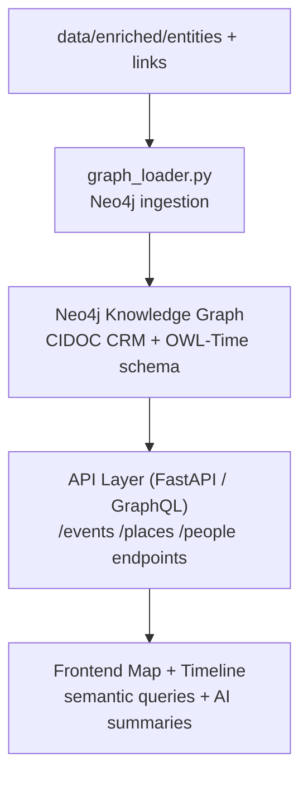

<div align="center">

# 🕸️ **Kansas Frontier Matrix — Knowledge Graph & Semantic Layer**  
`src/graph/README.md`

**Neo4j · CIDOC CRM · OWL-Time · Provenance Reasoning**

[](../../.github/workflows/site.yml)
[](../../.github/workflows/stac-validate.yml)
[](../../.github/workflows/codeql.yml)
[](../../.github/workflows/trivy.yml)
[](../../docs/)
[](../../LICENSE)

</div>

---

```yaml
---
title: "Kansas Frontier Matrix — Knowledge Graph & Semantic Layer"
version: "v1.6.0"
last_updated: "2025-10-17"
owners: ["@kfm-data", "@kfm-architecture"]
tags: ["graph","neo4j","ontology","cidoc-crm","owl-time","provenance","linked-data","semantic-web","mcp","ci"]
status: "Stable"
license: "MIT"
semver_policy: "MAJOR.MINOR.PATCH"
ci_required_checks:
  - pre-commit
  - unit-tests
  - codeql
  - trivy
  - docs-validate
semantic_alignment:
  - CIDOC CRM
  - OWL-Time
  - DCAT 2.0
  - STAC 1.0
  - RDF
  - JSON-LD
---
```

---

## 🎯 Purpose

The **`src/graph/`** directory implements the **Knowledge Graph engine** of the **Kansas Frontier Matrix (KFM)** — a semantic network interlinking *people, places, events, documents,* and *organizations* across time and geography.  

It unifies enriched datasets into a **linked open data ecosystem**, leveraging **Neo4j**, **CIDOC CRM**, and **OWL-Time** ontologies to create a queryable, interoperable semantic layer for Kansas’s historical landscape.

---

## 🏗️ Role in the System


<!-- END OF MERMAID -->

This layer serves as the **semantic backbone** of KFM, enabling advanced reasoning, provenance tracking, and cross-domain exploration of Kansas’s historical data.

---

## 📂 Directory Layout

```
src/graph/
├── __init__.py
├── graph_schema.py      # CIDOC CRM + OWL-Time schema definitions
├── neo4j_connection.py  # Neo4j connection utilities
├── graph_loader.py      # Ingest entities + relationships
├── graph_queries.py     # Standard Cypher query library
├── reasoner.py          # Inference + rule engine
├── graph_export.py      # Export to JSON-LD, RDF, TTL
└── README.md            # (this file)
```

---

## 🧱 Core Entities & Relationships

### 🔹 Node Types

| Label | Description | Example |
| :---- | :----------- | :------- |
| **Person** | Historical individuals, settlers, tribal leaders | `"John Smith" (born 1832)` |
| **Place** | Forts, rivers, towns, counties | `"Fort Larned" (lat=-99.13, lon=38.19)` |
| **Event** | Battles, treaties, disasters, migrations | `"Battle of Solomon Fork" (1857-07-29)` |
| **Document** | Maps, diaries, newspapers, letters | `"Kansas Tribune, July 1856"` |
| **Organization** | Governments, railroads, tribal nations | `"Union Pacific Railroad"` |

### 🔸 Relationships

| Relation | Meaning | Example |
| :-------- | :------ | :------ |
| `OCCURRED_AT` | Event happened at a place | `(Event)-[:OCCURRED_AT]->(Place)` |
| `PARTICIPATED_IN` | Actor involved in event | `(Person)-[:PARTICIPATED_IN]->(Event)` |
| `MENTIONS` | Document references entity | `(Document)-[:MENTIONS]->(Event)` |
| `LOCATED_IN` | Place belongs to region | `(Place)-[:LOCATED_IN]->(County)` |
| `HAS_SOURCE` | Entity originates from dataset | `(Entity)-[:HAS_SOURCE]->(Dataset)` |
| `SIMILAR_TO` | Semantic similarity between nodes | `(Event)-[:SIMILAR_TO]->(Event)` |

---

## 🧮 Schema Definition

Defined in **`graph_schema.py`**, blending **Neo4j constraints** and **CIDOC CRM / OWL-Time mappings**.

```python
SCHEMA = {
    "labels": ["Person","Place","Event","Document","Organization"],
    "relationships": ["OCCURRED_AT","PARTICIPATED_IN","MENTIONS","LOCATED_IN","HAS_SOURCE","SIMILAR_TO"],
    "indexes": [("Person","id"),("Place","name"),("Event","id"),("Document","id")]
}
```

**CIDOC / OWL-Time mapping:**
```python
CIDOC_MAP = {
  "E21_Person":"Person","E53_Place":"Place","E5_Event":"Event",
  "E31_Document":"Document","E39_Actor":"Organization"
}
OWL_TIME_MAP = {
  "hasBeginning":"start_date","hasEnd":"end_date","intervalDuring":"temporal_overlap"
}
```

---

## 🔌 Connecting to Neo4j

```python
from neo4j import GraphDatabase
driver = GraphDatabase.driver("bolt://localhost:7687", auth=("neo4j","password"))
```

**Sample query:**
```python
with driver.session() as s:
    q = """MATCH (e:Event)-[:OCCURRED_AT]->(p:Place)
           RETURN e.title AS event, p.name AS place
           ORDER BY e.start_date LIMIT 10"""
    for rec in s.run(q): print(rec["event"], "→", rec["place"])
```

---

## 🧠 Rule-Based Reasoning

`reasoner.py` applies lightweight inferencing to derive new connections (e.g., inferred counties from places).

```python
def infer_county_events(tx):
    tx.run("""
        MATCH (e:Event)-[:OCCURRED_AT]->(p:Place)-[:LOCATED_IN]->(c:County)
        MERGE (e)-[:OCCURRED_IN]->(c)
    """)
```

This supports temporal overlap detection and geographic inference for **timeline visualizations** and **regional analytics**.

---

## 📤 Export & Interoperability

`graph_export.py` exports Neo4j data to open standards:

| Format | Description | Use Case |
| :------ | :----------- | :-------- |
| **JSON-LD** | Schema.org / CIDOC CRM compatible JSON | Web APIs & linked data |
| **RDF/XML** | Semantic triples for SPARQL/RDF stores | External repository ingestion |
| **TTL (Turtle)** | Compact human-readable RDF | Debugging / interoperability |

```bash
python src/graph/graph_export.py --format jsonld --output data/export/graph.jsonld
```

---

## 🧩 Integration Flow

| Stage | Description |
| :----- | :----------- |
| **Upstream** | Consumes enriched data (`entities.json`, `links.json`) |
| **Downstream** | Feeds **FastAPI/GraphQL** API and **MapLibre** frontend |
| **Automation** | Triggered via `make load` or `make graph` |

---

## 🧰 Example Workflow

```bash
# Initialize schema
python src/graph/graph_schema.py --init

# Load entities and relationships
python src/graph/graph_loader.py --input data/processed/enriched/entities.json

# Run inferencing
python src/graph/reasoner.py

# Export to RDF/JSON-LD
python src/graph/graph_export.py --format ttl
```

**Example log (`logs/pipelines/graph.log`):**
```
[2025-10-05 15:42:09] graph_loader | 12,345 nodes | 47,201 relationships | OK
[2025-10-05 15:44:21] reasoner | 682 inferred relationships | OK
[2025-10-05 15:46:11] export | graph.ttl (4.2MB) written successfully
```

---

## 🧷 Acceptance Checklist (CI)

- [ ] Graph schema matches CIDOC CRM & OWL-Time mappings  
- [ ] All nodes/relationships validated with Neo4j constraints  
- [ ] Inference rules applied successfully (no duplicates)  
- [ ] Export passes JSON-LD / RDF syntax validation  
- [ ] Provenance sidecars generated (`.meta.json`, `.sha256`)  

---

## 🛡️ Security & Compliance

- Neo4j creds stored in `.env` or CI secrets.  
- Encrypted credentials in CI/CD; least-privilege database roles.  
- Trivy & CodeQL validate dependencies.  
- Exports sanitized of PII and internal IDs.

---

## 🧾 Version History

| Version | Date | Type | Notes |
| :------ | :--- | :-- | :-- |
| v1.6.0 | 2025-10-17 | Added | Acceptance checklist, provenance validation, enhanced export options. |
| v1.5.0 | 2025-10-16 | Improved | Added OWL-Time inference, JSON-LD export schema, CIDOC extensions. |
| v1.4.0 | 2025-10-15 | Added | Initial Knowledge Graph architecture README. |

---

## 📚 References

- AI System Developer Docs — `../../docs/ai-system.md`  
- File & Data Architecture — `../../docs/architecture.md`  
- CIDOC CRM — https://www.cidoc-crm.org/  
- W3C OWL-Time — https://www.w3.org/TR/owl-time/  
- STAC Metadata Spec — https://stacspec.org/

---

<div align="center">

**Kansas Frontier Matrix © 2025**  
*Linked Knowledge · Semantic History · Open Reproducibility*

</div>
```