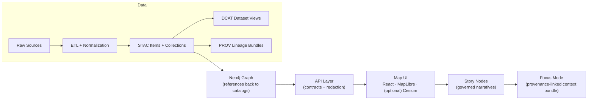

# 🕸️ `src/graph` — Knowledge Graph Subsystem

<p align="center">
  
  
  
  
</p>

> ✅ **Canonical home** for graph initialization + sync code: **ontology application**, **Cypher migrations**, and **CSV generation** for import/export workflows.  
> 📦 If you need static graph import artifacts (e.g., node/edge CSVs), they belong in **`data/graph/`** (not here).

---

## 🧭 Where this fits in the KFM pipeline

KFM’s ordering is **non-negotiable**: graph work happens **after** datasets are processed + cataloged, and **before** APIs and UI consume anything.



---

## 🎯 Responsibilities

This subsystem exists to keep the Knowledge Graph **governed, reproducible, and queryable**.

### ✅ This module **does**
- 🧬 **Apply ontology bindings** (labels, relationship types, required properties, modeling rules).
- 🧱 **Manage schema evolution** via **migrations** (Cypher) — *no breaking changes without a deliberate migration*.
- 🔒 **Enforce integrity constraints** (so data in the graph matches the ontology).
- 🧾 **Generate import/export artifacts** (commonly CSVs for bulk import; optional post-import Cypher).
- 🔁 **Sync graph content** from **catalog-referenced** evidence (STAC/DCAT/PROV) and processed datasets.
- 🧪 **Validate invariants** (e.g., detect “orphan” node types, constraint failures, missing references).

### 🚫 This module **does not**
- ❌ Store raw/processed payloads in the graph as “the source of truth”.  
  The graph should primarily store **relationships** and **references** back to catalog entries.
- ❌ Allow the UI to access the graph directly.  
  The UI must go through the governed **API boundary** (`src/server/`).
- ❌ “Ad-hoc” graph definitions scattered across the repo.  
  Graph definitions belong **only** in `src/graph/` (code) and `data/graph/` (static import artifacts).

---

## 🗂️ Folder layout (canonical)

> This README documents the **intended** canonical structure. Some folders may appear later as the subsystem matures.

```text
📁 src/graph/
  ├── 📄 README.md                 # you are here 🙂
  ├── 📁 ontology/                 # ontology definitions/bindings (if present)
  ├── 📁 migrations/               # Cypher migrations (if present)
  ├── 📁 constraints/              # integrity constraints (if present)
  ├── 📁 sync/                     # sync/ingest orchestration (if present)
  ├── 📁 export/                   # CSV generation / export helpers (if present)
  └── 📁 tests/                    # graph-specific tests (if present)

📁 data/graph/
  ├── 📁 csv/                      # graph import CSV exports (optional, canonical home)
  └── 📁 cypher/                   # optional post-import scripts (optional, canonical home)
```

---

## 🚀 Quickstart (dev workflow)

> [!IMPORTANT]
> The exact command names vary by repo iteration. If you don’t see CLI entrypoints yet, treat the steps below as the **sequence to implement**.

### 1) Bring up the stack 🐳
Typical dev setup runs:
- `db` → spatial database (PostGIS)
- `graph` → graph database (Neo4j)
- `api` → backend (FastAPI)
- `web` → frontend (React dev server)

```bash
docker-compose up --build
```

**Common ports** (defaults):
- PostGIS: `5432`
- Neo4j: `7474` (web UI), `7687` (bolt)
- API: `8000`
- Web: `3000`

### 2) Produce catalogs first 🧾
Before graph ingestion, ensure your pipeline has produced:
- STAC items/collections
- DCAT entries
- PROV lineage bundles

> If catalogs/provenance are missing, the graph stage is considered **invalid**.

### 3) Build or sync the graph 🔁
A typical “graph build” includes:
- ✅ apply constraints
- ✅ run migrations
- ✅ load or upsert nodes/edges from catalog-referenced evidence
- ✅ verify integrity gates

If you’re adding CLI tooling, a good shape is:

```text
graph init        # apply constraints + baseline schema
graph migrate     # run pending Cypher migrations
graph export      # generate data/graph/csv from processed/cataloged sources
graph load        # bulk load CSVs (or streaming upserts)
graph verify      # integrity checks + orphan detection
graph sync        # end-to-end: export + migrate + load + verify
```

---

## 🧱 Contracts & invariants (do-not-break rules)

> [!WARNING]
> Breaking these rules should trigger a governance review and/or a version bump.

- 🧬 **Graph schema stability:** labels + relationship types must remain stable; changes require migrations.
- 🧾 **Ontology + migration coupling:** ontology changes (e.g., renames) must be accompanied by migration scripts and version history.
- 🔒 **Integrity constraints always-on:** graph data must meet ontology constraints (e.g., no orphan node types).
- 🛡️ **API boundary rule:** the frontend must never query the graph directly; all access goes through `src/server/`.
- 🧪 **Determinism expectation:** graph builds/syncs should be replayable and idempotent for the same inputs.
- 🧷 **Reference-first storage:** graph nodes should store *references* (IDs/links) back to STAC/DCAT/PROV rather than duplicating bulky assets.

---

## 🧬 Modeling conventions (recommended)

Keep the graph useful, stable, and governed:

- 🆔 **Stable IDs:** every node should have a stable identifier (domain-specific, catalog-derived, or deterministic hash).
- 🔗 **Reference to catalogs:** prefer properties like:
  - `stac_item_id`
  - `dcat_dataset_id`
  - `prov_bundle_id`
  - `source_uri` / `license` / `attribution` (as references, not payload dumps)
- 🧭 **Typed relationships:** use explicit relationship types; avoid “catch-all” edges.
- 🕰️ **Time-aware design (when needed):** represent uncertainty and temporal validity explicitly (event intervals, confidence, provenance).

---

## 🧪 Integrity checks (starter kit)

If you need a quick “is the graph sane?” pass, run queries like these in your graph console:

```cypher
// Label counts
MATCH (n) RETURN labels(n) AS labels, count(*) AS n
ORDER BY n DESC;

// Relationship counts
MATCH ()-[r]->() RETURN type(r) AS rel, count(*) AS n
ORDER BY n DESC;

// Potential orphans (nodes without any relationship)
MATCH (n)
WHERE NOT (n)--()
RETURN labels(n) AS labels, count(*) AS n
ORDER BY n DESC;
```

> [!TIP]
> Treat integrity checks as **CI gates** for graph changes (migrations, ontology edits, ingest logic).

---

## 🧩 Adding new node/relationship types (contributor checklist)

When you extend the graph model:

1. 🧬 Update the **ontology** (new label/relationship type + required properties).
2. 🧱 Add a **migration** (create constraints, backfill properties, rename labels/types safely).
3. 🔁 Update **sync/ingest mappings** so data is catalog-referenced and reproducible.
4. 🧪 Add/extend **tests**:
   - migration idempotency
   - constraint enforcement
   - orphan prevention
5. 🧾 Ensure **STAC/DCAT/PROV references** exist for anything introduced.
6. 🧠 Coordinate with the **API contract** if new queries/fields are needed.

---

## 🧯 Troubleshooting

### Ports already in use
If you have local services on `5432`, `7474`, `8000`, or `3000`, either stop them or adjust `docker-compose` port mappings.

### Containers start order / retry
If a service fails because dependencies aren’t ready, rerun:

```bash
docker-compose up
```

### Slow loads / OOM
Large datasets require more Docker memory. Increase Docker resource limits (especially on macOS/Windows).

---

## 📚 Related docs (inside the repo)
- 📘 `docs/MASTER_GUIDE_v13.md` — canonical pipeline order, contracts, and invariants
- 🧱 `schemas/` — machine-validated contracts (STAC/DCAT/PROV, etc.)
- 🧰 `tools/` — validators and utilities (if present)
- 🧩 `src/server/` — governed API boundary (no UI → graph direct access)
- 🗺️ `web/` — UI layer (React/Map)