# 🕸️ KFM Graph Subsystem (`src/graph/`)


> **Purpose:** build and maintain KFM’s **semantically structured Neo4j graph** as a *derived* (reproducible) index that powers context-linking and evidence retrieval for APIs/UI. :contentReference[oaicite:0]{index=0}

---

## 🧭 Where `src/graph/` fits in the KFM pipeline

KFM is **contract-first**: every stage consumes outputs from the previous stage (no leapfrogging). :contentReference[oaicite:1]{index=1}

```mermaid
flowchart LR
  subgraph Data
    A["Raw Sources"] --> B["ETL + Normalization"]
    B --> C["STAC Items + Collections"]
    C --> D["DCAT Dataset Views"]
    C --> E["PROV Lineage Bundles"]
  end

  C --> G["Neo4j Graph (references back to catalogs)"]
  G --> H["API Layer (contracts + redaction)"]
  H --> I["Map UI — React · MapLibre · (optional) Cesium"]
  I --> J["Story Nodes (governed narratives)"]
  J --> K["Focus Mode (provenance-linked context bundle)"]
```



The **Neo4j graph must reference back to catalogs** so users (and downstream services) can trace every claim to governed metadata and lineage. :contentReference[oaicite:2]{index=2}

---

## ✅ Scope (what belongs here)

`src/graph/` is the **canonical home** for graph build code: **ontology bindings, ingest scripts, constraints**, and graph initialization/sync utilities. :contentReference[oaicite:3]{index=3}

More concretely, `src/graph/` should contain:
- 🧠 **Ontology application** (labels/types, controlled vocab, mapping rules)
- 🧱 **Cypher migrations** (schema evolution, constraints, indexes)
- 📦 **CSV generation / export** for import workflows
- 🔁 **Sync/update** routines (incremental rebuilds, idempotent upserts)
  
> “Graph build” lives here; **static import files** (like generated CSVs) belong under `data/graph/` for consistency. :contentReference[oaicite:4]{index=4}

---

## 🚫 Anti-scope (what does *not* belong here)

To protect provenance + governance contracts, avoid:
- ❌ UI data fetch logic (that belongs in `src/server/` + `web/`):contentReference[oaicite:5]{index=5}
- ❌ “Mystery” graph definitions elsewhere (single canonical home):contentReference[oaicite:6]{index=6}
- ❌ Manual edits in Neo4j as “source of truth” (graph is a **derived index**, not evidence storage)

---

## 🧩 Inputs & Outputs (contracts)

### Inputs (must exist before graph build)
Graph build consumes **published boundary artifacts**:
- `data/stac/` ✅ STAC Items/Collections
- `data/catalog/dcat/` ✅ DCAT dataset entries
- `data/prov/` ✅ PROV lineage bundles

These “boundary artifacts” are required before data is considered published and are the interface to downstream stages (including graph). :contentReference[oaicite:7]{index=7}

### Outputs (graph build artifacts)
Graph import/sync outputs should land in:
- `data/graph/csv/` 📄 (import-ready node/edge tables)
- `data/graph/cypher/` 🧾 (optional post-import scripts / migrations)

This layout is part of the expected repository structure. :contentReference[oaicite:8]{index=8}

---

## 🗂️ Suggested folder layout (inside `src/graph/`)

> This is a **recommended** structure that matches the v13 intent (ontology + migrations + CSV generation). :contentReference[oaicite:9]{index=9}

```text
📁 src/graph/
├── 📄 README.md
├── 🧠 ontology/                 # types, vocab, mapping rules (contract-first)
├── 🧱 migrations/               # Cypher migrations (constraints/indexes/schema changes)
├── 🔌 loaders/                  # loaders that read STAC/DCAT/PROV + processed data
├── 📦 exporters/                # CSV generation to data/graph/csv/
├── ✅ validation/               # “fail-closed” checks (schemas present, ids stable, etc.)
├── 🧰 utils/                    # shared helpers (ids, hashing, normalization)
└── 🚪 cli.py                    # optional: CLI entrypoint (build/sync/validate)
```

---

## 🧬 Provenance & traceability rules

KFM treats lineage as first-class: provenance records describe **entities, activities, agents**, and how outputs were derived. :contentReference[oaicite:10]{index=10}

### Graph-level expectations
At minimum, each “knowledge” node/edge created here should be able to answer:
- 🔎 **What evidence (dataset/artifact) supports this?**
- 🧾 **Which PROV activity produced it?**
- 🧭 **Which STAC/DCAT records describe it?**

### AI/analysis evidence artifacts
If an AI/analysis pipeline generates new entities/relationships, they must be loaded **with explicit provenance** pointing back to the artifact and sources—e.g., an OCR pipeline producing text nodes linked to the scanned document via a PROV activity node. :contentReference[oaicite:11]{index=11}

---

## 🧱 Neo4j model notes (practical conventions)

Neo4j uses the **property graph model** (nodes/edges/properties) and is queried via **Cypher**. :contentReference[oaicite:12]{index=12}

Recommended conventions for KFM graph builds:
- 🆔 **Stable IDs:** every node/relationship should have a deterministic `id` (or composite key) so rebuilds are idempotent.
- 🏷️ **Labels reflect ontology:** prefer fewer, consistent labels (e.g., `Place`, `Event`, `Dataset`, `Person`, `Org`, `EvidenceArtifact`, `ProvActivity`).
- 🔗 **Relationships are typed verbs:** keep them readable and consistent (e.g., `:LOCATED_IN`, `:MENTIONS`, `:DERIVED_FROM`, `:SUPPORTED_BY`, `:HAS_PROV_ACTIVITY`).
- 🧾 **Always link back to evidence:** do not create “floating” narrative facts without dataset/PROV anchors.

### Optional: modeling time (for historical / “time travel”)
For long-range Kansas history, consider adding **time intervals** as properties on nodes and relationships (valid-time and/or transaction-time patterns), enabling temporal queries over evolving graph states. :contentReference[oaicite:13]{index=13}

---

## 🔁 Build & Sync Workflow (recommended)

> The graph is downstream of catalogs, so the **first step is always**: ETL → STAC/DCAT/PROV publication. :contentReference[oaicite:14]{index=14}

### 1) Validate inputs (fail-closed)
- Confirm all required catalog + PROV records exist for the target domain(s). :contentReference[oaicite:15]{index=15}
- Confirm IDs are stable and mappings are declared (no ad-hoc fields).

### 2) Generate import artifacts (deterministic)
- Export nodes/edges to `data/graph/csv/` and any post-load scripts to `data/graph/cypher/`. :contentReference[oaicite:16]{index=16}

### 3) Apply migrations / constraints
- Run Cypher migrations to enforce constraints and indexes (schema evolution lives here). :contentReference[oaicite:17]{index=17}

### 4) Load / sync Neo4j
- Bulk import for fresh loads, then incremental sync for updates (implementation-defined).

---

## 🔌 How the API should talk to the graph

The server layer should access Neo4j through a dedicated adapter (e.g., `Neo4jAdapter`) and run Cypher queries like “get related events for a place.” :contentReference[oaicite:18]{index=18}

> 🔐 Important: governance checks should happen at the API boundary (contracts + redaction), not in the UI. :contentReference[oaicite:19]{index=19}

---

## 🧪 Local development quick check

If you run the full stack locally, Neo4j is commonly exposed at `http://localhost:7474` via Docker Compose (Neo4j Browser UI). :contentReference[oaicite:20]{index=20}

### Common dev pitfalls
- 🔌 **Port conflicts**: `7474` (Neo4j), `5432` (PostGIS), `8000/3000` (API/UI) may already be in use. :contentReference[oaicite:21]{index=21}
- 🧠 **Memory limits**: large imports can OOM containers—allocate more Docker memory when needed. :contentReference[oaicite:22]{index=22}

---

## 🧩 Contribution checklist (graph changes)

When adding or changing graph behavior, aim for small, reviewable diffs:
- [ ] 🧠 Update ontology bindings / mapping rules (and keep them documented)
- [ ] 🧱 Add a Cypher migration (don’t “hot edit” DB state)
- [ ] 📦 Ensure CSV exports remain deterministic (stable IDs)
- [ ] 🧾 Ensure new entities/relations link to STAC/DCAT + PROV
- [ ] ✅ Add validations + tests for regressions (missing provenance should fail)
- [ ] 🧷 Update docs where the new entity types are introduced (domain README)

---

## 📚 Sources used for this module README

- `MARKDOWN_GUIDE_v13.md.gdoc` (pipeline + canonical homes + graph build scope) :contentReference[oaicite:23]{index=23}:contentReference[oaicite:24]{index=24} :contentReference[oaicite:25]{index=25}  
- `Kansas Frontier Matrix (KFM) – Comprehensive Technical Blueprint.pdf` (PROV expectations, API↔Neo4j adapter patterns, local dev notes) :contentReference[oaicite:26]{index=26}:contentReference[oaicite:27]{index=27}:contentReference[oaicite:28]{index=28} :contentReference[oaicite:29]{index=29}  
- `Data Spaces.pdf` (Neo4j property graph + Cypher context) :contentReference[oaicite:30]{index=30} :contentReference[oaicite:31]{index=31}  
- `Scalable Data Management for Future Hardware.pdf` (optional temporal graph modeling reference) :contentReference[oaicite:32]{index=32} :contentReference[oaicite:33]{index=33}  
