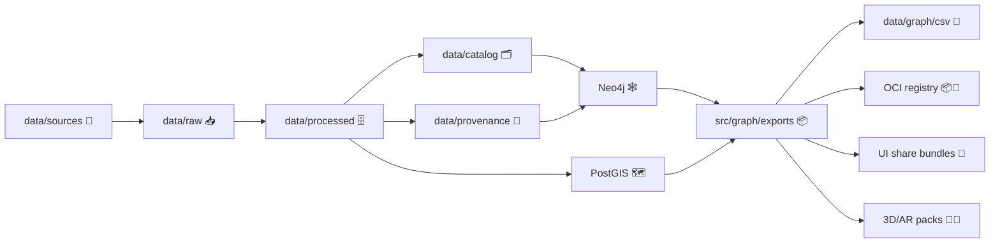

# Graph Exports 🕸️📦


> **According to project documentation compiled in January 2026**, KFM treats every dataset + insight as an auditable artifact: **STAC/DCAT metadata + PROV lineage are mandatory**, and the **Neo4j knowledge graph** is a core runtime dependency for the UI and the AI assistant. This folder exists to export graph-shaped truth **without losing provenance, governance, or determinism**.  [oai_citation:0‡Kansas Frontier Matrix (KFM) – Comprehensive Architecture, Features, and Design.pdf](file-service://file-4Umt1yHoGKicdmLWzFJ9sC) [oai_citation:1‡📚 Kansas Frontier Matrix (KFM) Data Intake – Technical & Design Guide.pdf](file-service://file-EbUCdsJMbu5KwpoKMrLrgj)

---

## 📌 What lives in `src/graph/exports/`

This package/module should contain **export adapters** that take one or more of these inputs:

- 🧾 **Catalog + lineage**: `data/catalog/` (STAC/DCAT) + `data/provenance/` (PROV JSON-LD)  [oai_citation:2‡Kansas Frontier Matrix (KFM) – Comprehensive Technical Documentation.pdf](file-service://file-AkqwUuYPp5zePf7pv5SMxi) [oai_citation:3‡Kansas Frontier Matrix (KFM) – Comprehensive Architecture, Features, and Design.pdf](file-service://file-4Umt1yHoGKicdmLWzFJ9sC)
- 🕸️ **Graph context**: Neo4j nodes/edges representing entities (people, places, events, datasets, docs, etc.)  [oai_citation:4‡Kansas Frontier Matrix (KFM) – Comprehensive Technical Documentation.pdf](file-service://file-AkqwUuYPp5zePf7pv5SMxi)
- 🗺️ **Spatial keys + geometry**: PostGIS tables keyed to graph entities for heavy spatial work  [oai_citation:5‡📚 Kansas Frontier Matrix (KFM) Data Intake – Technical & Design Guide.pdf](file-service://file-EbUCdsJMbu5KwpoKMrLrgj)

…and emit **export artifacts** that are:

- ✅ **Deterministic + re-runnable**
- 🔐 **Policy-gated (OPA/Conftest) + access-controlled**
- 🧠 **AI-ready (citations preserved)**
- 🗺️ **UI-ready (credits preserved)**

---

## 🧭 Table of contents
- [How exports fit the KFM pipeline](#how-exports-fit-the-kfm-pipeline)
- [Export targets](#export-targets)
- [Non‑negotiable rules](#nonnegotiable-rules)
- [Exporter contract](#exporter-contract)
- [Output conventions](#output-conventions)
- [Validation, QA, and health checks](#validation-qa-and-health-checks)
- [Adding a new exporter](#adding-a-new-exporter)
- [Project docs used](#project-docs-used)
- [Glossary](#glossary)

---

## How exports fit the KFM pipeline

KFM policies enforce a strict ordering: **you don’t update graph outputs unless prior stages (processed + catalogs + PROV) exist and are updated too**.  [oai_citation:6‡📚 Kansas Frontier Matrix (KFM) Data Intake – Technical & Design Guide.pdf](file-service://file-EbUCdsJMbu5KwpoKMrLrgj)


```mermaid
flowchart LR
  A[data/sources 📜] --> B[data/raw 📥]
  B --> C[data/processed 🗄️]
  C --> D[data/catalog 🗂️]
  C --> E[data/provenance 🧾]
  D --> F[Neo4j 🕸️]
  E --> F
  C --> G[PostGIS 🗺️]
  F --> H[src/graph/exports 📦]
  G --> H
  H --> I[data/graph/csv 📄]
  H --> J[OCI registry 📦🔐]
  H --> K[UI share bundles 🔗]
  H --> L[3D/AR packs 🧊📱]
```

**Why this matters:** the UI and AI are explicitly designed to surface provenance and citations; even exported views are intended to carry proper credits.  [oai_citation:7‡Kansas Frontier Matrix – Comprehensive UI System Overview.pdf](file-service://file-KcBQruYcoFVDEixzzRHTwt) [oai_citation:8‡Kansas Frontier Matrix (KFM) – AI System Overview 🧭🤖.pdf](file-service://file-Pv8eev6RWvCKrGCXyzY7zg)

---

## Export targets

> These are the “known-good” targets implied by the docs + proposals. Keep the list here aligned with real code as it lands.

| Target 🍱 | Primary use | Typical output | Must include |
|---|---|---|---|
| **Neo4j CSV snapshot** 📄 | Bulk import / GitOps graph state | `data/graph/csv/` | Stable IDs + provenance links |
| **Linked-data bundle** 🧾 | Interop / provenance portability | JSON-LD (PROV-O) (+ optional RDF/Turtle) | PROV + dataset IDs |
| **UI share bundle** 🔗 | Share/export UI views | “export package” with credits | Credits + citations |
| **Pulse Thread / micro-story export** ⚡ | Federated “living atlas” narratives | JSON/MD snippets w/ refs | Evidence manifest + citations |
| **OCI artifact bundle** 📦🔐 | Content-addressable geodata packaging | PMTiles / GeoParquet / COG + signatures | Digest + signature + `distribution.oci` |
| **3D / AR / digital twin pack** 🧊📱 | Immersive visualization + field mode | glTF / 3D Tiles / scene bundle | Attribution + sensitivity rules |

### 1) Neo4j CSV snapshot (`data/graph/csv/`) 📄
The ingestion pattern described in the Data Intake guide is:

- Generate CSVs for **nodes** + **relationships**
- Place them under `data/graph/csv/`
- Use stable identifiers like `kfm.ks.landcover.2000_2020.v1` in the exported node rows  [oai_citation:9‡📚 Kansas Frontier Matrix (KFM) Data Intake – Technical & Design Guide.pdf](file-service://file-EbUCdsJMbu5KwpoKMrLrgj)

Rollback is described as feasible by re-importing prior CSV snapshots (stable IDs make restore/overwrite possible).  [oai_citation:10‡📚 Kansas Frontier Matrix (KFM) Data Intake – Technical & Design Guide.pdf](file-service://file-EbUCdsJMbu5KwpoKMrLrgj)

### 2) Linked-data bundle (PROV JSON-LD) 🧾
KFM treats PROV as mandatory for publishing and governance, and the graph can ingest PROV to form lineage links.  [oai_citation:11‡📚 Kansas Frontier Matrix (KFM) Data Intake – Technical & Design Guide.pdf](file-service://file-EbUCdsJMbu5KwpoKMrLrgj)

**Exporter guidance:**
- Emit a PROV JSON-LD bundle alongside any “graph-shaped” export
- Ensure exported entities link back to canonical KFM IDs (datasets, places, events)

### 3) UI share bundle 🔗
The UI doc explicitly calls out that:
- Front-end is decoupled via REST + GraphQL APIs  [oai_citation:12‡Kansas Frontier Matrix – Comprehensive UI System Overview.pdf](file-service://file-KcBQruYcoFVDEixzzRHTwt)
- Provenance + citations are surfaced continuously, and **shared/exported views are intended to carry proper credits**  [oai_citation:13‡Kansas Frontier Matrix – Comprehensive UI System Overview.pdf](file-service://file-KcBQruYcoFVDEixzzRHTwt)

**Exporter guidance:**
- Include `credits.json` (or equivalent) and preserve citation pointers
- Treat “export view” as a first-class artifact (not a screenshot)

### 4) Pulse Thread / micro-story export ⚡
Pulse Threads are proposed as a graph-native, geotagged narrative object:
- Stored as nodes in the graph, versioned like story content
- Backed by evidence manifests (dataset IDs, query params, timestamps)
- **Interoperable**: can be serialized as JSON with references and shared across instances  [oai_citation:14‡Additional Project Ideas.pdf](file-service://file-Pc2GNivcrHBeKjBQksLC3T) [oai_citation:15‡Additional Project Ideas.pdf](file-service://file-Pc2GNivcrHBeKjBQksLC3T)
- Micro-stories are described as **exportable snippets with citations**  [oai_citation:16‡Additional Project Ideas.pdf](file-service://file-Pc2GNivcrHBeKjBQksLC3T)

**Exporter guidance:**
- Export format should be federation-friendly:
  - `pulse_thread.json` (content + references)
  - `evidence_manifest.json` (citations + query lineage)
  - `credits.json`

### 5) OCI artifact bundle (ORAS + Cosign) 📦🔐
A proposed pattern is to package artifacts like PMTiles, GeoParquet, or COGs into an OCI registry using ORAS and sign with Cosign for integrity and reproducibility.  [oai_citation:17‡Additional Project Ideas.pdf](file-service://file-Pc2GNivcrHBeKjBQksLC3T)

Integration into the catalog is described via a `distribution.oci` entry in STAC/DCAT with registry/repo/tag/digest and listed files/media types.  [oai_citation:18‡Additional Project Ideas.pdf](file-service://file-Pc2GNivcrHBeKjBQksLC3T)

**Exporter guidance:**
- Generate content-addressed digests for each file
- Emit a `distribution.oci.(yml|json)` companion record that can be embedded into STAC/DCAT

### 6) 3D / AR / digital twin pack 🧊📱
A forward concept is a **4D digital twin** (time-evolving GIS + simulations) and AR field mode that overlays historical/environmental context on-site. 

**Exporter guidance:**
- Treat 3D/AR exports as **sensitivity-aware** (redaction / aggregation when needed)
- Keep provenance and credits attached to 3D objects/layers (not as a separate PDF someone forgets)

---

## Non‑negotiable rules ✅

### 1) Provenance-first (no black boxes) 🧾
Data intake is explicitly “provenance-first”: every output is traceable, with citations and lineage metadata.  [oai_citation:19‡📚 Kansas Frontier Matrix (KFM) Data Intake – Technical & Design Guide.pdf](file-service://file-EbUCdsJMbu5KwpoKMrLrgj)

Also: governance guidance notes that exports may need to attach provenance summaries or require PROV alongside exports, so information never loses context.  [oai_citation:20‡Kansas Frontier Matrix (KFM) – Comprehensive Architecture, Features, and Design.pdf](file-service://file-4Umt1yHoGKicdmLWzFJ9sC)

### 2) Respect pipeline ordering ⛓️
Policies deny merges where graph artifacts appear without catalog/provenance prerequisites.  [oai_citation:21‡📚 Kansas Frontier Matrix (KFM) Data Intake – Technical & Design Guide.pdf](file-service://file-EbUCdsJMbu5KwpoKMrLrgj)

### 3) Policy-as-code gates everything 🧰
OPA + Conftest policy packs encode governance rules (licenses required, citations required, sensitive area flags, etc.).  [oai_citation:22‡Kansas Frontier Matrix (KFM) – Comprehensive Architecture, Features, and Design.pdf](file-service://file-4Umt1yHoGKicdmLWzFJ9sC)

### 4) Access control + sensitivity 🔐
Future plans include roles (Public Viewer / Contributor / Admin), API-enforced permissions, and explicit FAIR/CARE governance checks for sensitive data.  [oai_citation:23‡🌟 Kansas Frontier Matrix – Latest Ideas & Future Proposals.docx.pdf](file-service://file-SQ3f7ve8SGiusT6ThZEuCe)

### 5) AI + UI need citations/credits 🧠🗺️
AI flow explicitly includes a governance check and returns answers with citations.  [oai_citation:24‡Kansas Frontier Matrix (KFM) – AI System Overview 🧭🤖.pdf](file-service://file-Pv8eev6RWvCKrGCXyzY7zg)  
UI intends exported views to carry credits.  [oai_citation:25‡Kansas Frontier Matrix – Comprehensive UI System Overview.pdf](file-service://file-KcBQruYcoFVDEixzzRHTwt)

### 6) Ethics is a feature, not a footer 🧭
Bias, privacy, and sensitive data risks are explicitly flagged in the innovation concepts. 

---

## Exporter contract

> Keep this **language-agnostic**; implement in Python/TS/etc as the codebase dictates.

### Minimal interface (pseudo)
```text
Exporter
  id: string                    # "neo4j-csv", "jsonld-prov", "oci-bundle", ...
  inputs(ctx) -> InputSet       # catalog/prov/graph/db handles
  export(ctx, InputSet) -> Outputs
  validate(ctx, Outputs) -> pass/fail
  manifest(ctx, Outputs) -> run_manifest.json
```

### Why we’re strict about determinism 🎯
- CI/policy flows assume **re-runnable** outputs.
- The project explicitly discusses deterministic ingestion/publishing patterns and stable identifiers.  [oai_citation:26‡Additional Project Ideas.pdf](file-service://file-Pc2GNivcrHBeKjBQksLC3T)

---

## Output conventions

### Recommended directory layout 🗂️
```text
repo-root/
├─ 🗂️ data/                               # 🗂️ Data plane: governed artifacts, catalogs, and export outputs
│  └─ 🕸️ graph/                           # 🕸️ Graph data products (snapshots + publish/export targets)
│     ├─ 🧱 csv/                           # 🧱 Neo4j bulk-import snapshots (target: neo4j-admin import CSV layout)
│     └─ 📦 exports/                       # 📦 Published/exported graph products (optional targets)
│        ├─ 🧬 jsonld/                     # 🧬 Graph exports as JSON-LD (PROV-aware, linkable, web-friendly)
│        ├─ 📦 oci/                        # 📦 OCI/ORAS exports (content-addressed bundles + digests/signing)
│        ├─ 🔗 ui-share/                   # 🔗 UI-ready share bundles (small slices for demos, embeds, offline sharing)
│        └─ 🧊 ar-3d/                      # 🧊 AR/3D-ready exports (scene/tileset/model pointers; demo-scale)
│
└─ 🧠 src/                                # 🧠 Code plane: pipelines, exporters, validators
   └─ 🕸️ graph/                           # 🕸️ Graph tooling (ingest, mapping, exports, QA)
      └─ 📦 exports/                      # 👈 you are here 📌 Exporter implementations + shared export utilities
         ├─ 📄 README.md                   # 📘 How exporters work: inputs, output targets, CLI/API entrypoints, contracts
         └─ 🛠️ …                           # Exporter modules live here (e.g., jsonld/, oci/, ui_share/, ar_3d/, common/)
```

### `run_manifest.json` (recommended fields)
```json
{
  "run_id": "sha256:…",
  "created_at": "2026-01-23T00:00:00Z",
  "git": { "sha": "…" },
  "inputs": {
    "catalog": ["…"],
    "provenance": ["…"]
  },
  "outputs": [
    { "path": "data/graph/csv/nodes.csv", "sha256": "…" }
  ],
  "policies": { "opa_bundle_sha": "…" }
}
```

> ⚠️ If you implement OCI bundles, ensure catalogs can reference the artifacts via `distribution.oci` (registry/repo/tag/digest + file list + media types).  [oai_citation:27‡Additional Project Ideas.pdf](file-service://file-Pc2GNivcrHBeKjBQksLC3T)

---

## Validation, QA, and health checks ✅🔍

### CI/policy expectations
- **Pipeline ordering** enforcement (graph output implies catalog/prov exists)  [oai_citation:28‡📚 Kansas Frontier Matrix (KFM) Data Intake – Technical & Design Guide.pdf](file-service://file-EbUCdsJMbu5KwpoKMrLrgj)
- **Provenance-first publishing** (processed/graph changes require PROV updates)  [oai_citation:29‡📚 Kansas Frontier Matrix (KFM) Data Intake – Technical & Design Guide.pdf](file-service://file-EbUCdsJMbu5KwpoKMrLrgj)
- **API boundary** (UI should not query Neo4j directly; access through vetted API paths for redaction)  [oai_citation:30‡📚 Kansas Frontier Matrix (KFM) Data Intake – Technical & Design Guide.pdf](file-service://file-EbUCdsJMbu5KwpoKMrLrgj)

### Graph integrity health checks 🩺🕸️
A proposed operational pattern is to run periodic graph integrity health checks (e.g., scheduled CI) and keep the results version-controlled as “metadata about metadata.”  [oai_citation:31‡Additional Project Ideas.pdf](file-service://file-Pc2GNivcrHBeKjBQksLC3T)

### Rollback story 🔁
Graph rollback is described as possible by re-importing previous CSV snapshots (or reverting GitOps state and redeploying).  [oai_citation:32‡📚 Kansas Frontier Matrix (KFM) Data Intake – Technical & Design Guide.pdf](file-service://file-EbUCdsJMbu5KwpoKMrLrgj)

---

## Adding a new exporter

### ✅ Checklist (copy/paste)
- [ ] Pick a target name: `kebab-case` (e.g., `neo4j-csv`, `oci-bundle`, `pulse-thread-json`)
- [ ] Define inputs: catalog/prov only? DB access required? (prefer catalog/prov to keep runs reproducible)
- [ ] Define schema mapping (what node/edge types + required IDs)
- [ ] Emit a `run_manifest.json` with digests
- [ ] Add validations:
  - [ ] required fields present
  - [ ] stable ID determinism
  - [ ] provenance links not broken
  - [ ] sensitivity/redaction applied if needed
- [ ] Wire into CI/policy pack expectations (OPA/Conftest)
- [ ] Document the target here ✍️

### 🧠 If your exporter touches AI-facing artifacts…
Remember: Focus Mode relies on graph queries and ontologies (CIDOC-CRM, OWL-Time), plus governance checks to ensure answers ship with citations. Your exported graph slices should preserve enough structure to support multi-hop reasoning + traceability.  [oai_citation:33‡Kansas Frontier Matrix (KFM) – AI System Overview 🧭🤖.pdf](file-service://file-Pv8eev6RWvCKrGCXyzY7zg) [oai_citation:34‡Kansas Frontier Matrix (KFM) – AI System Overview 🧭🤖.pdf](file-service://file-Pv8eev6RWvCKrGCXyzY7zg)

### 🗺️ If your exporter touches UI-facing artifacts…
The UI is decoupled via REST/GraphQL and is designed to surface provenance; exported views should preserve credits.  [oai_citation:35‡Kansas Frontier Matrix – Comprehensive UI System Overview.pdf](file-service://file-KcBQruYcoFVDEixzzRHTwt) [oai_citation:36‡Kansas Frontier Matrix – Comprehensive UI System Overview.pdf](file-service://file-KcBQruYcoFVDEixzzRHTwt)

---

## Project docs used

> ✅ Requirement tracker: the README is grounded in *all* project files provided.

### Core KFM design docs 🧭
- **KFM – Comprehensive Technical Documentation**  [oai_citation:37‡Kansas Frontier Matrix (KFM) – Comprehensive Technical Documentation.pdf](file-service://file-AkqwUuYPp5zePf7pv5SMxi)  [oai_citation:38‡Kansas Frontier Matrix (KFM) – Comprehensive Technical Documentation.pdf](file-service://file-AkqwUuYPp5zePf7pv5SMxi)
- **KFM – Comprehensive Architecture, Features, and Design**  [oai_citation:39‡Kansas Frontier Matrix (KFM) – Comprehensive Architecture, Features, and Design.pdf](file-service://file-4Umt1yHoGKicdmLWzFJ9sC)  [oai_citation:40‡Kansas Frontier Matrix (KFM) – Comprehensive Architecture, Features, and Design.pdf](file-service://file-4Umt1yHoGKicdmLWzFJ9sC)
- **KFM – AI System Overview 🧭🤖**  [oai_citation:41‡Kansas Frontier Matrix (KFM) – AI System Overview 🧭🤖.pdf](file-service://file-Pv8eev6RWvCKrGCXyzY7zg)  [oai_citation:42‡Kansas Frontier Matrix (KFM) – AI System Overview 🧭🤖.pdf](file-service://file-Pv8eev6RWvCKrGCXyzY7zg)
- **KFM – Comprehensive UI System Overview**  [oai_citation:43‡Kansas Frontier Matrix – Comprehensive UI System Overview.pdf](file-service://file-KcBQruYcoFVDEixzzRHTwt)  [oai_citation:44‡Kansas Frontier Matrix – Comprehensive UI System Overview.pdf](file-service://file-KcBQruYcoFVDEixzzRHTwt)
- **KFM Data Intake – Technical & Design Guide**  [oai_citation:45‡📚 Kansas Frontier Matrix (KFM) Data Intake – Technical & Design Guide.pdf](file-service://file-EbUCdsJMbu5KwpoKMrLrgj)  [oai_citation:46‡📚 Kansas Frontier Matrix (KFM) Data Intake – Technical & Design Guide.pdf](file-service://file-EbUCdsJMbu5KwpoKMrLrgj)

### Future-facing proposals 💡
- **Additional Project Ideas**  [oai_citation:47‡Additional Project Ideas.pdf](file-service://file-Pc2GNivcrHBeKjBQksLC3T) (Pulse Threads, OCI bundles, integrity checks)  [oai_citation:48‡Additional Project Ideas.pdf](file-service://file-Pc2GNivcrHBeKjBQksLC3T) [oai_citation:49‡Additional Project Ideas.pdf](file-service://file-Pc2GNivcrHBeKjBQksLC3T)
- **🌟 Latest Ideas & Future Proposals**  [oai_citation:50‡🌟 Kansas Frontier Matrix – Latest Ideas & Future Proposals.docx.pdf](file-service://file-SQ3f7ve8SGiusT6ThZEuCe) (RBAC, FAIR/CARE enforcement, supply chain provenance)  [oai_citation:51‡🌟 Kansas Frontier Matrix – Latest Ideas & Future Proposals.docx.pdf](file-service://file-SQ3f7ve8SGiusT6ThZEuCe)
- **Innovative Concepts to Evolve KFM**  [oai_citation:52‡Kansas Frontier Matrix (KFM) – Comprehensive Technical Documentation.pdf](file-service://file-AkqwUuYPp5zePf7pv5SMxi) (digital twin, AR, ethics) 

### Reference libraries (PDF portfolios) 📚
> These appear to be **PDF portfolios** (best opened in Acrobat/Reader to access embedded resources). 

- **AI Concepts & more**  [oai_citation:53‡Innovative Concepts to Evolve the Kansas Frontier Matrix (KFM).pdf](file-service://file-G71zNoWKxsoSW44iwZaaCC) 
- **Data Management / Architectures / Bayesian**  [oai_citation:54‡📚 Kansas Frontier Matrix (KFM) Data Intake – Technical & Design Guide.pdf](file-service://file-EbUCdsJMbu5KwpoKMrLrgj) 
- **Maps / GoogleMaps / Virtual Worlds / Geospatial WebGL**  [oai_citation:55‡Kansas Frontier Matrix (KFM) – AI System Overview 🧭🤖.pdf](file-service://file-Pv8eev6RWvCKrGCXyzY7zg) 
- **Various programming languages & resources**  [oai_citation:56‡📚 Kansas Frontier Matrix (KFM) Data Intake – Technical & Design Guide.pdf](file-service://file-EbUCdsJMbu5KwpoKMrLrgj) 

> Tip: A geospatial Python cookbook appears among the indexed resources and may be useful for export utilities that generate GeoJSON/HTML map artifacts. 

---

## Glossary 🧠🗺️
- **STAC**: SpatioTemporal Asset Catalog (geospatial catalog metadata)  [oai_citation:57‡Kansas Frontier Matrix (KFM) – Comprehensive Architecture, Features, and Design.pdf](file-service://file-4Umt1yHoGKicdmLWzFJ9sC)
- **DCAT**: Data Catalog Vocabulary (dataset catalog aggregation)  [oai_citation:58‡Kansas Frontier Matrix (KFM) – Comprehensive Architecture, Features, and Design.pdf](file-service://file-4Umt1yHoGKicdmLWzFJ9sC)
- **PROV / PROV-O**: W3C provenance model/ontology; used for lineage + auditability  [oai_citation:59‡Kansas Frontier Matrix (KFM) – Comprehensive Architecture, Features, and Design.pdf](file-service://file-4Umt1yHoGKicdmLWzFJ9sC)
- **Neo4j**: graph DB (semantic relationships)  [oai_citation:60‡Kansas Frontier Matrix (KFM) – Comprehensive Technical Documentation.pdf](file-service://file-AkqwUuYPp5zePf7pv5SMxi)
- **PostGIS**: spatial DB for heavy geodata operations  [oai_citation:61‡📚 Kansas Frontier Matrix (KFM) Data Intake – Technical & Design Guide.pdf](file-service://file-EbUCdsJMbu5KwpoKMrLrgj)
- **OPA / Conftest**: policy-as-code gating (governance rules)  [oai_citation:62‡Kansas Frontier Matrix (KFM) – Comprehensive Architecture, Features, and Design.pdf](file-service://file-4Umt1yHoGKicdmLWzFJ9sC)
- **FAIR/CARE**: data governance frameworks (incl. sensitivity/ethics)  [oai_citation:63‡🌟 Kansas Frontier Matrix – Latest Ideas & Future Proposals.docx.pdf](file-service://file-SQ3f7ve8SGiusT6ThZEuCe)
- **OCI / ORAS / Cosign**: artifact packaging + signing for reproducibility  [oai_citation:64‡Additional Project Ideas.pdf](file-service://file-Pc2GNivcrHBeKjBQksLC3T)

---

🧩 **If you’re implementing a new exporter:** start with **neo4j-csv parity**, then add provenance bundling, then policy gates, then optional OCI + UI share formats. Keep the graph’s provenance chain unbroken — everything else builds on that.  [oai_citation:65‡Additional Project Ideas.pdf](file-service://file-Pc2GNivcrHBeKjBQksLC3T)
