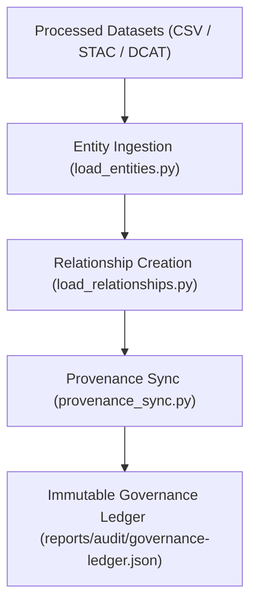

<div align="center">

# 📥 Kansas Frontier Matrix — **Graph Ingestion & Provenance Synchronization**
`src/graph/ingest/README.md`

**Purpose:** Documents the ingestion and synchronization scripts responsible for populating the Neo4j Knowledge Graph within the Kansas Frontier Matrix.  
Implements FAIR+CARE-compliant data loading, checksum verification, provenance registration, and immutable ledger updates for transparency and reproducibility.

[](../../../../.github/workflows/graph-ingest.yml)  
[](../../../../docs/standards/faircare-validation.md)  
[](../../../../docs/architecture/repo-focus.md)

</div>

---

## 📚 Overview

The **Graph Ingestion Module** is responsible for transforming processed datasets into Neo4j graph nodes and relationships.  
Each ingestion process includes checksum validation, provenance generation, FAIR+CARE ethics evaluation, and synchronization with the Immutable Governance Ledger.

**Core Objectives:**
- 🧩 Automate ingestion of entities, relationships, and metadata into Neo4j  
- ⚖️ Validate all ingested data against FAIR+CARE principles  
- 🔍 Register provenance and checksum logs for reproducibility  
- 🧾 Maintain graph schema integrity and governance traceability  
- 🌐 Synchronize graph state with external datasets and STAC/DCAT catalogs  

---

## 🗂️ Directory Layout

```plaintext
src/graph/ingest/
├── README.md                     # This file — ingestion and governance documentation
│
├── load_entities.py              # Ingests entities (places, people, events) into Neo4j
├── load_relationships.py         # Creates and validates relationships between graph nodes
├── load_datasets.py              # Integrates STAC/DCAT datasets as graph nodes
└── provenance_sync.py            # Registers provenance and ledger entries after ingestion
```

**File Descriptions:**

- **`load_entities.py`** — Imports core entities with validation for schema and ontology compliance.  
- **`load_relationships.py`** — Establishes CIDOC CRM and FAIR+CARE-compliant relationships between entities.  
- **`load_datasets.py`** — Loads external datasets as linked graph nodes referencing STAC/DCAT metadata.  
- **`provenance_sync.py`** — Exports JSON-LD provenance data and updates the Immutable Governance Ledger.

---

## ⚙️ Example Workflows

### 🧠 Ingest Entities
```bash
python src/graph/ingest/load_entities.py \
  --input data/processed/entities.csv \
  --graph neo4j://localhost:7687 \
  --user neo4j --password "secure_pass"
```

### 🔗 Ingest Relationships
```bash
python src/graph/ingest/load_relationships.py \
  --input data/processed/relationships.csv \
  --graph neo4j://localhost:7687
```

### 🌍 Load STAC/DCAT Datasets
```bash
python src/graph/ingest/load_datasets.py \
  --input data/stac/catalog.json \
  --graph neo4j://localhost:7687
```

### 🧾 Synchronize Provenance
```bash
python src/graph/ingest/provenance_sync.py \
  --graph neo4j://localhost:7687 \
  --ledger reports/audit/governance-ledger.json
```

---

## 🧩 FAIR+CARE Integration

| Process | FAIR Principle | CARE Principle | Output |
|----------|----------------|----------------|---------|
| **Entity Ingestion** | Findable / Accessible | Responsibility | `reports/graph/entity-ingest.json` |
| **Relationship Creation** | Interoperable / Reusable | Collective Benefit | `reports/graph/relationship-ingest.json` |
| **Dataset Loading** | Transparency / Accountability | Ethics | `reports/graph/dataset-ingest.json` |
| **Provenance Sync** | Traceable / Reproducible | Authority to Control | `reports/audit/governance-ledger.json` |

Each ingestion event is logged via telemetry and appended to the Immutable Governance Ledger.

---

## 🧾 Example Ingestion Report (`reports/graph/entity-ingest.json`)

```json
{
  "process": "entity_ingestion",
  "entities_loaded": 4521,
  "checksum_validated": true,
  "errors": [],
  "ontology": "CIDOC CRM E21",
  "faircare_alignment": ["Findable", "Accessible", "Ethics", "Responsibility"],
  "timestamp": "2025-11-02T00:00:00Z",
  "governance_ref": "reports/audit/governance-ledger.json"
}
```

---

## 🔗 Provenance & Governance Workflow



**Workflow Summary:**
1. Ingest entities and relationships under validated ontological schema.  
2. Generate provenance metadata using JSON-LD and CIDOC CRM mappings.  
3. Record ingestion events and checksums in audit logs.  
4. Append lineage updates to the Immutable Governance Ledger.  

---

## 🧠 Governance Integration

- **Checksum Logging:** Every ingested entity and relationship recorded with SHA-256 signature.  
- **Provenance Tracking:** CIDOC CRM mappings ensure semantic traceability.  
- **FAIR+CARE Validation:** Scripts include ethical data validation before insertion.  
- **Immutable Ledger Sync:** All ingestion processes register outputs to governance telemetry.  

Telemetry Schema:  
`schemas/telemetry/graph-telemetry-v1.json`

Telemetry Outputs:
```
reports/graph/ingest-events.json
reports/audit/governance-ledger.json
releases/v9.4.0/focus-telemetry.json
```

---

## 🧩 Standards & Compliance Mapping

| Standard | Domain | Implementation |
|-----------|----------|----------------|
| **MCP-DL v6.4.3** | Documentation-first data ingestion | This README + ingestion scripts |
| **FAIR+CARE** | Ethical ingestion and traceability | Validation embedded in all loaders |
| **CIDOC CRM** | Cultural heritage provenance modeling | Ontology-driven relationship creation |
| **DCAT 3.0 / STAC 1.0.0** | Dataset metadata ingestion | `load_datasets.py` |
| **ISO 19115** | Metadata and spatial reference compliance | Schema validation during ingestion |
| **JSON-LD** | Provenance export interoperability | `provenance_sync.py` |

---

## 🛡️ Security, Provenance & Observability

- **Integrity:** All graph operations are checksum-verified and logged.  
- **Transparency:** Each ingestion event publishes FAIR+CARE audit metadata.  
- **Reproducibility:** Script parameters and versioning ensure deterministic re-ingestion.  
- **Governance:** Immutable Ledger maintains complete lineage traceability.  

Governance Reports:
```
reports/graph/entity-ingest.json
reports/graph/relationship-ingest.json
reports/audit/governance-ledger.json
```

---

## 🧾 Version History

| Version | Date | Author | Summary |
|----------|------|---------|----------|
| v9.4.0 | 2025-11-02 | @kfm-data | Added full ingestion governance documentation with provenance and FAIR+CARE compliance. |
| v9.3.3 | 2025-11-01 | @kfm-architecture | Improved dataset ingestion with DCAT 3.0 alignment. |
| v9.3.2 | 2025-10-29 | @bartytime4life | Integrated CIDOC CRM relationship ingestion and checksum validation. |
| v9.3.1 | 2025-10-27 | @kfm-governance | Added governance telemetry and immutable ledger synchronization. |
| v9.3.0 | 2025-10-25 | @kfm-neo4j | Established ingestion workflow and schema alignment under MCP-DL v6.4.3. |

---

<div align="center">

**Kansas Frontier Matrix — Transparent Graph Ingestion Framework**  
*“Every node validated. Every relationship traceable. Every import governed.”* 🔗  
📍 `src/graph/ingest/README.md` — FAIR+CARE-certified documentation for graph ingestion and provenance synchronization in the Kansas Frontier Matrix.

</div>
