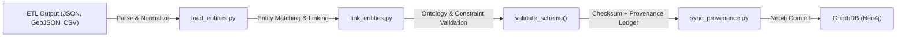

<div align="center">

# ⚙️ **Kansas Frontier Matrix — Graph Ingestion & Provenance Sync**
`src/graph/ingest/README.md`

**Purpose:**  
Document the **ingestion and synchronization layer** that loads entities, relationships, and provenance metadata into the Neo4j knowledge graph.  
Implements deterministic, FAIR+CARE-aligned data ingestion, entity linking, and blockchain/IPFS provenance registration under MCP-DL v6.3.

[](../../../docs/standards/)
[](../../../docs/standards/faircare-validation.md)
[](../../../LICENSE)
[]()
[]()

</div>

---

## 📘 Overview

The **Graph Ingestion subsystem** bridges the ETL pipelines (`src/pipelines/etl/`) and the **Neo4j graph database**.  
It ensures that all entities, relationships, and provenance metadata are:
- Parsed from FAIR+CARE-compliant intermediate JSONs,  
- Linked or merged into Neo4j using idempotent Cypher upserts,  
- Checked against ontology and schema constraints, and  
- Registered to the Governance Ledger (IPFS + blockchain manifest).  

Each ingest step logs a verifiable checksum and follows MCP’s scientific reproducibility principle: **no silent transformations** — every action is traceable and reversible.

---

## 🧩 Workflow Overview



### Step Summary
1. **load_entities.py** – Reads normalized data from the ETL output directory and inserts nodes/edges using Neo4j transactions.  
2. **link_entities.py** – Performs entity resolution, fuzzy matching, and cross-graph linking for duplicates or aliases.  
3. **validate_schema.py** – Confirms compliance with ontology rules from `src/graph/schema/`.  
4. **sync_provenance.py** – Registers each graph update’s hash, timestamp, and metadata to the Governance Ledger (IPFS + Ethereum).  

---

## ⚙️ Key Components

| File | Function | Description |
|------|-----------|-------------|
| **load_entities.py** | ETL → Graph Loader | Creates or merges nodes/edges into Neo4j; enforces uniqueness constraints and IDs. |
| **link_entities.py** | Entity Resolution | Detects duplicate entities using string similarity and context (Levenshtein, cosine, embeddings). |
| **sync_provenance.py** | Provenance Sync | Pushes update hashes to IPFS and Ethereum; maintains local manifest consistency. |
| **checksum_utils.py** | Integrity Utilities | Generates SHA-256 checksums and writes to `metadata.json`. |

---

## 🧠 Entity Linking Logic

### Algorithmic Steps
1. **Exact Match** – Compare incoming entity ID or name against existing Neo4j nodes.  
2. **Alias Resolution** – Use alias dictionaries and alternate spellings (e.g., “Fort Larned” ≈ “Fort Larnard”).  
3. **Fuzzy Matching** – Apply string similarity (Levenshtein distance) and embedding-based context scoring.  
4. **Context Validation** – Confirm candidates based on time and geography overlap.  
5. **Merge / Create** – If match ≥ confidence threshold (0.90), merge; otherwise, create a new node flagged `provisional:true`.

### Example (Cypher Pseudocode)
```cypher
MERGE (e:Event {id:$event_id})
ON CREATE SET e.title=$title, e.start=$start, e.end=$end, e.source=$source
WITH e
MATCH (p:Place {name:$place})
MERGE (e)-[:LOCATED_AT]->(p)
RETURN e, p;
```

---

## 🔗 Provenance Synchronization

Each ingestion session writes a full provenance record to:
- `data/reports/audit/data_provenance_ledger.json`
- `releases/<version>/manifest.zip`
- IPFS (content-addressed hash)
- Governance blockchain (Ethereum testnet / Polygon)

### Recorded Metadata
| Field | Example | Description |
|-------|----------|-------------|
| `id` | `event_1867_treaty` | Unique graph object identifier |
| `sha256` | `a89fcd...` | Checksum of record payload |
| `timestamp` | `2025-11-10T18:30Z` | Ingestion timestamp |
| `source` | `data/sources/fema.json` | Data origin path |
| `ledger_tx` | `0x4e8f...` | Blockchain transaction reference |

All records are validated by the FAIR+CARE Council during governance audits.

---

## 🧩 Directory Layout

```plaintext
src/graph/ingest/
├── README.md              # Documentation for ingestion and provenance sync
├── load_entities.py       # Creates/merges nodes and relationships
├── link_entities.py       # Entity resolution and alias mapping
├── sync_provenance.py     # IPFS + blockchain provenance registration
├── checksum_utils.py      # SHA256 hashing and integrity validation
└── logs/
    ├── ingest_2025-11-10.log   # Timestamped operational logs
    └── provenance_audit.json   # Summaries of IPFS + ledger syncs
```

---

## 🧪 Validation & Telemetry

| Metric | Description | Verified By |
|--------|--------------|-------------|
| **Entity Insert Rate** | Avg. nodes/edges created per second | @kfm-ops |
| **Duplicate Detection Accuracy** | Fuzzy link confidence ≥ 0.9 | @kfm-ai |
| **Checksum Integrity** | 100% match with `metadata.json` | @kfm-validation |
| **Provenance Ledger Sync** | Blockchain + IPFS success rate | @kfm-governance |
| **FAIR+CARE Compliance** | Ethics + transparency review | @faircare-council |

Telemetry logged to `../../../reports/audit/graph_ingest_telemetry.json`.

---

## 🧾 Internal Citation

```text
Kansas Frontier Matrix (2025). Graph Ingestion & Provenance Sync (v10.1.0).
Defines the ingestion, entity linking, and provenance synchronization processes for Neo4j-based knowledge graph in Kansas Frontier Matrix.
```

---

## 🕰️ Version History

| Version | Date | Summary |
|----------|------|----------|
| **v10.1.0** | 2025-11-10 | Added IPFS+Blockchain provenance sync; improved fuzzy linking with embeddings; telemetry integration. |
| **v10.0.0** | 2025-11-08 | Refactored ETL → Graph bridge; introduced ontology validation hook. |
| **v9.7.0** | 2025-11-05 | Initial FAIR+CARE-compliant ingestion framework with checksum validation. |

---

<div align="center">

**© 2025 Kansas Frontier Matrix — MIT License**  
*Deterministic Ingestion × FAIR+CARE Provenance × Ethical Data Automation*  
[Back to Graph README](../README.md) · [Docs Portal](../../../docs/) · [Governance Ledger](../../../docs/standards/governance/DATA-GOVERNANCE.md)

</div>

