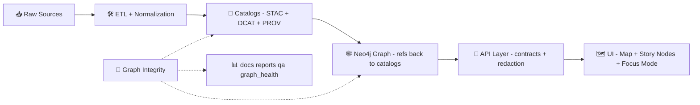

<div align="center">

# 🧬 Graph Integrity

**Kansas Frontier Matrix (KFM)** · `src/graph/integrity/`  
_Continuous validation & trust enforcement for the Neo4j knowledge graph_


</div>

> 🧠 **Mental model:** treat the knowledge graph like code — it needs **unit tests**, **trend tracking**, and **break-glass recovery drills**.  
> KFM’s pipeline is contract-first & evidence-first, and the graph is only as trustworthy as its invariants. ✅

---

## 🧭 What this module is

`src/graph/integrity` is the **graph “unit test suite”** for KFM’s Neo4j knowledge graph.

It runs a repeatable set of **Cypher-driven integrity checks** that catch:

- 🧱 **Structural breakage** (constraints/indexes offline, uniqueness violations)
- 🧬 **Broken lineage** (orphaned nodes, missing provenance links)
- 📈 **Unexpected deltas** (node/edge count jumps beyond thresholds)
- 🕒 **Freshness issues** (ingestion lag / “minutes since last_seen”)
- 🕸️ **Runaway hubs** (super-node explosions / degree outliers)
- 🧾 **Schema drift** (property type mismatches beyond tolerance)
- 🧯 **Recovery risk** (backup dump + test restore)
- 📦 **Artifact reference integrity** (catalogs/graph point to immutable digests, signatures)

These checks exist to keep KFM’s provenance stack unbroken and to protect UI + AI features that depend on **traceability** and **evidence** (e.g., Focus Mode).[^healthchecks][^pipeline][^focus]

---

## 🧩 Where Graph Integrity fits in the KFM pipeline

KFM’s pipeline ordering is **non‑negotiable** (no leapfrogging contracts). Graph integrity runs **after** catalogs exist and **before** downstream layers rely on the graph.[^pipeline][^catalogs]



---

## 🎯 Goals

### ✅ Primary goals
- **Detect** graph corruption early (before it shows up in UI/AI)
- **Enforce** “no mystery nodes” / provenance-first rules
- **Measure** graph health trends over time (counts, orphans, drift)
- **Trigger** clear escalation workflows (issues/alerts) when health degrades
- **Provide** auditable, versioned reports in-repo

### 🚫 Non-goals (by design)
- “Truth adjudication” (semantic correctness) — integrity ≠ historical interpretation
- Auto-merging “fixes” — changes flow through PR + review (governance-first)

---

## 🔒 Key invariants this module protects

### 1) Evidence-first publishing (STAC/DCAT/PROV)
- Every dataset/evidence artifact should have **STAC + DCAT + PROV** records before graph ingestion.[^catalogs]
- The graph should reference catalog IDs (avoid duplicating bulky data).[^graph_refs_catalogs]

### 2) Stable graph schema + ontology constraints
- Graph structure (labels, relationships) should be stable; breaking changes require explicit migrations.
- Data in Neo4j should meet ontology constraints (e.g., avoid orphan node types).[^graph_contracts]

### 3) Governed narratives and AI outputs
- Story/Focus must only contain provenance-linked content; no unsourced claims.
- Policy gates enforce rules like “AI outputs must include at least one citation.”[^policy_pack][^focus]

### 4) Sovereignty & classification propagation
- No output artifact can be less restricted than its inputs; restrictions propagate end-to-end.[^sovereignty]

---

## 🧪 Health checks included

> These are designed as “graph unit tests + ops drills” and are intended to run **weekly** (and optionally per PR / per release).[^healthchecks]

| ✅ Check | What it detects | Default severity | Artifacts (example) |
|---|---|---:|---|
| 📊 Node & Relationship Count Delta | Sudden jumps/drops in volume (e.g., >5% WoW) | ⚠️ Warn / ❌ Fail (thresholded) | `counts.csv`, `diffs.json` |
| 🧱 Constraint & Index Integrity | Offline indexes / invalid constraints / uniqueness violations | ❌ Fail | `constraints.csv`, `indexes.csv` |
| 🧬 Orphaned Metadata/Lineage Nodes | Broken lineage links (missing required relationships) | ❌ Fail | `orphans.csv` |
| 🕒 Ingestion Lag / Currency | Sources not updated within expected SLA (“minutes since last_seen”) | ⚠️ Warn | `lag.csv` |
| 🕸️ Hub Detection (Top-degree nodes) | Runaway “super-hub” nodes; degree explosions vs p95 baseline | ⚠️ Warn | `hubs.csv` |
| 🧾 Property Schema Drift | Type/presence violations beyond tolerance (e.g., >0.5%) | ❌ Fail | `schema_drift.json`, `samples.csv` |
| 🧯 Backup Verification | Backup corruption; restore failure in temp container | ❌ Fail (high severity) | `backup.log`, `restore.log` |
| 📦 Artifact Reference Integrity (optional) | Missing digests/signatures; catalog refs broken | ⚠️ Warn / ❌ Fail | `artifact_refs.csv` |

**Operational details from project specs:**
- Schema drift can be driven by a small JSON “schema contract” listing expected property types and required fields (extensible across node classes).[^healthchecks]
- Reports are stored under `docs/reports/qa/graph_health/` with a `summary.md` per run and an `index.csv` tracking key metrics over time.[^healthchecks]

---

## 🚨 Escalation workflow

- If **two or more checks fail** in a single run, automatically open a tracker issue (e.g., GitHub issue) with labels like `ci_failure` and `data_layer_request`.[^healthchecks]
- Certain failures are **high severity** (notably backups and constraints).[^healthchecks]

> 🧯 Philosophy: Treat data integrity failures like failing tests — **block promotion** until fixed.

---

## 📦 Output layout

All check outputs are written to a **timestamped report directory**, designed to be committed (or uploaded as CI artifacts) for auditing and trend analysis.[^healthchecks]

Example:
```text
docs/reports/qa/graph_health/
└─ 📅 2026-01-23T02-15-00Z/            # One timestamped QA run (UTC) for graph health reporting
   ├─ 📄 summary.md                    # Human summary: overall status, key findings, deltas, and next actions
   ├─ 📊 index.csv                     # Report index: pointers to artifacts + quick status flags per check
   └─ 📦 artifacts/                    # Detailed outputs backing the summary (machine-readable, reviewable)
      ├─ 🔢📊 counts.csv                # Node/edge counts by label/type (baseline for drift detection)
      ├─ 🔒📊 constraints.csv           # Constraint status (present/missing/violations) + affected labels/properties
      ├─ 📇📊 indexes.csv               # Index status + usage hints (coverage and “missing index” flags)
      ├─ 🧍‍♂️📊 orphans.csv              # Orphaned nodes/edges (unlinked entities, dangling relationships)
      ├─ ⏱️📊 lag.csv                   # Ingest/refresh lag metrics (staleness by pipeline/domain)
      ├─ 🧠📊 hubs.csv                  # High-degree nodes (potential data issues or true hubs; used for QA review)
      ├─ 🧬🧾 schema_drift.json          # Detected schema drift vs ontology/expected shapes (adds/removes/changed props)
      └─ 🪵📄 backup.log                # Backup/maintenance log excerpt for the run (sanitized; for troubleshooting)
```

A `summary.md` should include: status for each check (✅ / ⚠️ / ❌), brief rationale, and links to artifacts.[^healthchecks]

---

## ▶️ How to run (local + CI)

### Local (developer run)
> These are **example** commands; wire them to your project’s actual CLI/runner.

```bash
# 1) Point at a Neo4j instance (local, docker, or staging)
export NEO4J_URI="bolt://localhost:7687"
export NEO4J_USER="neo4j"
export NEO4J_PASSWORD="password"

# 2) Run integrity suite
python -m kfm.graph.integrity run \
  --report-dir docs/reports/qa/graph_health/$(date -u +%Y-%m-%dT%H-%M-%SZ) \
  --profile local
```

### CI (scheduled)
A common pattern proposed in project docs is a GitHub Action that runs each Sunday morning and commits or uploads results as artifacts.[^healthchecks]

Recommended CI behaviors:
- Run full suite on schedule (weekly)
- Run “smoke subset” on PRs (constraints, basic counts, orphan detection)
- Attach OpenTelemetry spans to the run (see telemetry QA guidance)[^telemetry]

---

## 🧩 Integration points

### 🧷 Policy Pack (OPA + Conftest)
KFM uses OPA/Conftest policies to encode governance rules (license required, citations required, etc.). Graph Integrity can:
- contribute additional policy inputs (e.g., `schema_drift.json` as a policy artifact)
- block merges when integrity baselines regress[^policy_pack]

### 🤖 Watcher → Planner → Executor automation
KFM’s agent framework is designed so automation can **observe**, propose fixes, and open PRs — but never auto-merge.[^wpe]

Graph Integrity is a natural **Watcher**:
- Watcher: runs checks, emits immutable facts (failures + artifacts)
- Planner: deterministically proposes a repair plan (e.g., add missing constraint, fix type coercion, patch ETL)
- Executor: opens PR with changes + provenance links (kill-switch supported)[^wpe]

### 🧾 Provenance in DevOps (optional but powerful)
KFM can map GitHub PR activity into PROV so maintainers can query which PR produced which dataset — and who reviewed it.[^devops_prov]

---

## 🛡️ Redaction, sovereignty & sensitive handling

Graph Integrity outputs must respect:
- **Classification propagation** (no output less restricted than inputs).[^sovereignty]
- **Culturally sensitive protocols** and sovereignty rules (e.g., `care_label` + restrictions on exact geo locations).[^care_label]

Practical guidance:
- ✅ redact sensitive IDs/coordinates in artifacts by default
- ✅ output counts + hashed identifiers where possible
- ✅ separate “public summary” vs “maintainer detail” artifacts when needed

---

## 🧱 Extending the suite

Add checks like you’d add tests:

1) Create a new check module (e.g., `checks/schema_drift.py`)
2) Declare:
   - `check_id`
   - description + severity defaults
   - required inputs (Neo4j, catalogs, report dir)
   - artifacts produced
3) Add to registry + runner
4) Add a deterministic test harness (fixtures / snapshots)
5) Update `summary.md` template section

> ✅ Keep checks **idempotent**, deterministic, and audit-friendly — this aligns with KFM’s contract-first approach.[^pipeline]

---

## 🧰 Troubleshooting

<details>
<summary>🧱 Constraints failing (duplicates / uniqueness)</summary>

- Inspect `constraints.csv` + failed constraint name  
- Find duplicates by stable ID  
- Fix upstream ETL → regenerate catalogs → reload graph  
- Prefer repair via PR (governance), not ad-hoc DB mutations

</details>

<details>
<summary>🧾 Schema drift detected (>0.5% mismatch)</summary>

- Inspect `schema_drift.json` + `samples.csv`  
- Look for upstream API changes (string → int, null creep, etc.)  
- Patch ETL normalization OR update schema contract + migration (if intentional)[^healthchecks]

</details>

<details>
<summary>🧯 Backup restore failed</summary>

- Treat as **high severity**  
- Validate backup dump job + storage  
- Re-run restore test in clean container  
- Ensure backup workflow is producing consistent artifacts[^healthchecks]

</details>

---

## 📚 Source docs used for this README (project-wide)

<details>
<summary>📦 Click to expand</summary>

### Core KFM architecture & governance
- **Master Guide (v13)** — canonical pipeline ordering, subsystem homes, invariants & contracts  
  `MARKDOWN_GUIDE_v13.md.gdoc` [oai_citation:0‡MARKDOWN_GUIDE_v13.md.gdoc](file-service://file-UYVruFXfueR8veHMUKeugU) [oai_citation:1‡MARKDOWN_GUIDE_v13.md.gdoc](file-service://file-UYVruFXfueR8veHMUKeugU) [oai_citation:2‡MARKDOWN_GUIDE_v13.md.gdoc](file-service://file-UYVruFXfueR8veHMUKeugU)

- **Data Intake — Technical & Design Guide** — catalogs, ETL staging, provenance patterns (evidence triplet)  
  `📚 Kansas Frontier Matrix (KFM) Data Intake – Technical & Design Guide.pdf` [oai_citation:3‡Kansas Frontier Matrix (KFM) – Comprehensive Technical Documentation.pdf](file-service://file-AkqwUuYPp5zePf7pv5SMxi)

- **AI System Overview** — Policy Pack, CI governance, provenance in DevOps, graph query integration  
  `Kansas Frontier Matrix (KFM) – AI System Overview 🧭🤖.pdf` [oai_citation:4‡Kansas Frontier Matrix (KFM) – AI System Overview 🧭🤖.pdf](file-service://file-Pv8eev6RWvCKrGCXyzY7zg) [oai_citation:5‡Kansas Frontier Matrix (KFM) – AI System Overview 🧭🤖.pdf](file-service://file-Pv8eev6RWvCKrGCXyzY7zg)

- **Comprehensive Technical Documentation** — ontologies, file storage integrity, graph QA concepts  
  `Kansas Frontier Matrix (KFM) – Comprehensive Technical Documentation.pdf` [oai_citation:6‡Kansas Frontier Matrix (KFM) – Comprehensive Technical Documentation.pdf](file-service://file-AkqwUuYPp5zePf7pv5SMxi) [oai_citation:7‡Kansas Frontier Matrix (KFM) – Comprehensive Technical Documentation.pdf](file-service://file-AkqwUuYPp5zePf7pv5SMxi)

- **Comprehensive UI System Overview** — “map behind the map” + provenance surfacing in UI  
  `Kansas Frontier Matrix – Comprehensive UI System Overview.pdf` [oai_citation:8‡Kansas Frontier Matrix – Comprehensive UI System Overview.pdf](file-service://file-KcBQruYcoFVDEixzzRHTwt)

### Integrity & quality patterns
- **Additional Project Ideas** — Weekly Graph Health Checks spec (deltas, drift, hubs, backups, escalation) + artifact integrity patterns  
  `Additional Project Ideas.pdf` [oai_citation:9‡Additional Project Ideas.pdf](file-service://file-Pc2GNivcrHBeKjBQksLC3T) [oai_citation:10‡Additional Project Ideas.pdf](file-service://file-Pc2GNivcrHBeKjBQksLC3T)

- **Latest Ideas & Future Proposals** — telemetry QA patterns + WPE agent architecture emphasis  
  `🌟 Kansas Frontier Matrix – Latest Ideas & Future Proposals.docx.pdf` [oai_citation:11‡🌟 Kansas Frontier Matrix – Latest Ideas & Future Proposals.docx.pdf](file-service://file-SQ3f7ve8SGiusT6ThZEuCe) [oai_citation:12‡🌟 Kansas Frontier Matrix – Latest Ideas & Future Proposals.docx.pdf](file-service://file-SQ3f7ve8SGiusT6ThZEuCe)

- **Innovative Concepts** — culturally sensitive governance (CARE labeling, sovereignty rules)  
  `Innovative Concepts to Evolve the Kansas Frontier Matrix (KFM).pdf` [oai_citation:13‡Innovative Concepts to Evolve the Kansas Frontier Matrix (KFM).pdf](file-service://file-G71zNoWKxsoSW44iwZaaCC)

- **Open-source Hub Design** — moderation/validation principle (“no new geo-fact without source reference”)  
  `Kansas-Frontier-Matrix_ Open-Source Geospatial Historical Mapping Hub Design.pdf` [oai_citation:14‡Kansas-Frontier-Matrix_ Open-Source Geospatial Historical Mapping Hub Design.pdf](file-service://file-BJN3xmP44EHc9NRCccCn4H)

### Reference libraries (PDF portfolios / multi-doc collections)
> These are included as project research libraries (AI, geospatial/WebGL, data management, language resources). They inform future extensions and implementation choices.

- `AI Concepts & more.pdf` (portfolio)
- `Maps-GoogleMaps-VirtualWorlds-Archaeological-Computer Graphics-Geospatial-webgl.pdf` (portfolio)
- `Data Managment-Theories-Architures-Data Science-Baysian Methods-Some Programming Ideas.pdf` (portfolio)
- `Various programming langurages & resources 1.pdf` (portfolio)

</details>

---

## 📝 Footnotes

[^pipeline]: Canonical pipeline ordering and subsystem placement are defined as inviolable; `src/graph/` is the home for graph build code and migrations. [oai_citation:15‡MARKDOWN_GUIDE_v13.md.gdoc](file-service://file-UYVruFXfueR8veHMUKeugU) [oai_citation:16‡MARKDOWN_GUIDE_v13.md.gdoc](file-service://file-UYVruFXfueR8veHMUKeugU)

[^catalogs]: STAC/DCAT/PROV alignment policy and “boundary artifacts” requirement for published data/evidence artifacts. [oai_citation:17‡MARKDOWN_GUIDE_v13.md.gdoc](file-service://file-UYVruFXfueR8veHMUKeugU) [oai_citation:18‡MARKDOWN_GUIDE_v13.md.gdoc](file-service://file-UYVruFXfueR8veHMUKeugU)

[^graph_refs_catalogs]: Graph should reference catalog entries rather than duplicating bulky data; catalogs remain the source of truth for asset metadata. [oai_citation:19‡MARKDOWN_GUIDE_v13.md.gdoc](file-service://file-UYVruFXfueR8veHMUKeugU)

[^graph_contracts]: Graph contract artifacts include ontology definitions, migrations, and integrity constraint definitions; schema should remain stable and meet ontology constraints. [oai_citation:20‡MARKDOWN_GUIDE_v13.md.gdoc](file-service://file-UYVruFXfueR8veHMUKeugU)

[^healthchecks]: Weekly Graph Health Check routine, check list (deltas, hubs, drift thresholds, backups), report artifacts (`summary.md`, `index.csv`), and escalation labels/severity guidance. [oai_citation:21‡Additional Project Ideas.pdf](file-service://file-Pc2GNivcrHBeKjBQksLC3T) [oai_citation:22‡Additional Project Ideas.pdf](file-service://file-Pc2GNivcrHBeKjBQksLC3T)

[^policy_pack]: OPA + Conftest policy pack enforces governance rules (license required, citations required, etc.) during CI with clear failures. [oai_citation:23‡Kansas Frontier Matrix (KFM) – AI System Overview 🧭🤖.pdf](file-service://file-Pv8eev6RWvCKrGCXyzY7zg)

[^wpe]: Watcher–Planner–Executor agent architecture (no auto-merges; PR-based governance; kill-switch). [oai_citation:24‡🌟 Kansas Frontier Matrix – Latest Ideas & Future Proposals.docx.pdf](file-service://file-SQ3f7ve8SGiusT6ThZEuCe)

[^devops_prov]: GitHub PR activities can be mapped into PROV and ingested into Neo4j for queryable DevOps provenance. [oai_citation:25‡Kansas Frontier Matrix (KFM) – AI System Overview 🧭🤖.pdf](file-service://file-Pv8eev6RWvCKrGCXyzY7zg)

[^ui]: “Map behind the map” UI framing (provenance + hidden layers surfaced) motivates strong integrity guarantees for linked data and citations. [oai_citation:26‡Kansas Frontier Matrix – Comprehensive UI System Overview.pdf](file-service://file-KcBQruYcoFVDEixzzRHTwt)

[^focus]: Evidence-first narrative + Focus Mode constraints (no unsourced material; citations required) and AI graph query integration principles. [oai_citation:27‡MARKDOWN_GUIDE_v13.md.gdoc](file-service://file-UYVruFXfueR8veHMUKeugU) [oai_citation:28‡Kansas Frontier Matrix (KFM) – AI System Overview 🧭🤖.pdf](file-service://file-Pv8eev6RWvCKrGCXyzY7zg)

[^sovereignty]: Sovereignty/classification propagation rule: outputs cannot be less restricted than inputs; system enforces end-to-end restrictions/redaction expectations. [oai_citation:29‡MARKDOWN_GUIDE_v13.md.gdoc](file-service://file-UYVruFXfueR8veHMUKeugU)

[^care_label]: Culturally sensitive governance patterns (CARE label + sovereignty rules) for domain-specific restrictions and attribution protocols. [oai_citation:30‡Innovative Concepts to Evolve the Kansas Frontier Matrix (KFM).pdf](file-service://file-G71zNoWKxsoSW44iwZaaCC) [oai_citation:31‡Innovative Concepts to Evolve the Kansas Frontier Matrix (KFM).pdf](file-service://file-G71zNoWKxsoSW44iwZaaCC)

[^telemetry]: Telemetry QA idea: scheduled health checks ensure traces/energy reporting are present; integrity tooling should emit observability signals where possible. [oai_citation:32‡🌟 Kansas Frontier Matrix – Latest Ideas & Future Proposals.docx.pdf](file-service://file-SQ3f7ve8SGiusT6ThZEuCe)
