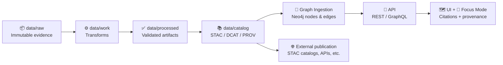

# 🧬 Graph Loaders

     

**Location:** `src/graph/loaders/` 📁  
**Mission:** turn **cataloged evidence** into a **queryable knowledge graph** (Neo4j) — without mystery nodes, without black boxes, and with provenance always attached. 🧾🧭

> [!IMPORTANT]
> Graph loaders are part of KFM’s “evidence-first” spine: they **load only what has been cataloged** (STAC/DCAT/PROV + processed artifacts), and they must be **deterministic + rerunnable**. ♻️✅

---

<details>
  <summary><strong>📌 Table of Contents</strong></summary>

- [🧩 What is a “Graph Loader”?](#-what-is-a-graph-loader)
- [🧭 Where Loaders Sit in the KFM Pipeline](#-where-loaders-sit-in-the-kfm-pipeline)
- [🧱 Loader Design Principles](#-loader-design-principles)
- [🧾 Loader Contract](#-loader-contract)
- [🗃️ Data Model Conventions](#-data-model-conventions)
- [♻️ Idempotency & Upserts](#-idempotency--upserts)
- [🛡️ Policy Gates](#-policy-gates)
- [🌍 Geo + Time Conventions](#-geo--time-conventions)
- [🔐 Sensitive Data & Cultural Protocols](#-sensitive-data--cultural-protocols)
- [📈 Observability & Health Checks](#-observability--health-checks)
- [🧪 Testing Strategy](#-testing-strategy)
- [➕ Adding a New Loader](#-adding-a-new-loader)
- [📚 References](#-references)

</details>

---

## 🧩 What is a “Graph Loader”?

A **loader** is an ingestion adapter that:

- 📥 **Reads**: *catalog + provenance* artifacts (typically **STAC**, **DCAT**, **PROV**) produced earlier in the pipeline  
- 🧠 **Maps**: those artifacts into KFM’s **canonical graph schema** (nodes + relationships)  
- 🧷 **Upserts**: into Neo4j using stable IDs and deterministic merges  
- 🧾 **Emits a receipt**: what changed, what was validated, what policy gates were applied

Think of loaders as the place where we convert:

> **Evidence (files + metadata)** → **Meaning (graph nodes + edges)**

---

## 🧭 Where Loaders Sit in the KFM Pipeline



> [!NOTE]
> The loader layer is intentionally **downstream** of transforms + cataloging. If something isn’t representable as cataloged evidence, it shouldn’t become graph truth.

---

## 🧱 Loader Design Principles

### ✅ Evidence-first
Every node/edge must be traceable back to:
- the **source artifact**
- the **transform step**
- and the **provenance record** that explains “how it happened”.

### ✅ Deterministic
Given the same catalog inputs, the loader should produce the same graph state (no random IDs, no hidden merges). 🎯

### ✅ Config-driven
Loaders should avoid “manual edits” and instead honor config + schema contracts (treat graph as a compiled artifact, not a hand-edited document). 🧩

### ✅ Fail closed
If required metadata or provenance is missing, the loader must refuse to publish graph changes. 🚫

---

## 🧾 Loader Contract

This repo may implement loaders in TypeScript, Python, or both — but **the contract is language-agnostic**.

### Inputs 📥
A loader run should receive:
- **catalogRoot**: path/URI to catalog artifacts (STAC/DCAT/PROV)
- **runContext**:
  - `runId` (stable ID for this run)
  - `pipelineVersion` (code version / commit digest)
  - `policyPackVersion` (OPA/Conftest policies)
  - `sourceRefs` (digests/URIs of artifacts used)
  - `dryRun` (optional)

### Outputs 📤
- Neo4j upserts (nodes + relationships)
- Optional CSV materialization for bulk import:
  - `data/graph/csv/nodes/*.csv` 🧱
  - `data/graph/csv/edges/*.csv` 🔗
- A **receipt** (JSON) containing:
  - counts created/updated
  - validation results
  - policy gate decisions
  - warnings/errors
  - timestamps + durations

### Suggested interface (TypeScript-ish) 🧪
```ts
export interface GraphLoader {
  id: string;                 // e.g. "stac", "prov-jsonld", "story-nodes"
  version: string;            // semantic or commit-derived
  supports(input: LoaderInput): boolean;

  validate(input: LoaderInput): Promise<ValidationReport>;
  plan(input: LoaderInput): Promise<LoadPlan>;        // optional (diff/preview)
  execute(input: LoaderInput): Promise<LoadReceipt>;  // must be idempotent
}
```

> [!TIP]
> If you can implement `plan()` you get “diff previews” for PR review and safer deployments. 🧾✅

---

## 🗃️ Data Model Conventions

### 🏷️ Node labels (suggested)
Use stable, human-readable labels that map to catalog + domain:

- **Catalog + provenance**
  - `Dataset` (DCAT)
  - `Distribution` (DCAT)
  - `STACCollection`, `STACItem`, `STACAsset`
  - `ProvEntity`, `ProvActivity`, `ProvAgent`

- **Domain**
  - `Place`, `Region`, `Feature`
  - `Event`
  - `Person`, `Organization`
  - `StoryNode` (UI narratives)
  - `ModelRun` / `SimulationRun` (analytics + scenarios)

### 🔑 IDs (rules of thumb)
- IDs should be **stable** across reruns
- Prefer **source-provided IDs** + dataset namespace
- If you must generate: use a **content address** (hash of canonical JSON) or a deterministic composite key:
  - `kfm:<type>:<source_id>:<version>`  
  - `kfm:stac:item:<collection_id>/<item_id>`

### 🔗 Relationships (suggested patterns)
- Catalog linking:
  - `(STACCollection)-[:HAS_ITEM]->(STACItem)`
  - `(Dataset)-[:HAS_DISTRIBUTION]->(Distribution)`
- Provenance:
  - `(ProvActivity)-[:USED]->(ProvEntity)`
  - `(ProvEntity)-[:WAS_GENERATED_BY]->(ProvActivity)`
  - `(ProvActivity)-[:WAS_ASSOCIATED_WITH]->(ProvAgent)`
- Narrative:
  - `(StoryNode)-[:ABOUT]->(Place|Event|Dataset)`
- Geo/time:
  - `(Thing)-[:LOCATED_AT]->(Place)`
  - `(Thing)-[:DURING]->(TimeSpan)`

> [!NOTE]
> Keep relationships **typed and explicit**. Avoid “catch-all” edges like `:RELATED_TO` unless it’s a deliberate abstraction with rules.

---

## ♻️ Idempotency & Upserts

Loaders must be safe to run repeatedly without duplication:

### ✅ Required patterns
- **Unique constraints** on primary identifiers
- `MERGE` (Neo4j) / upsert semantics with clear `ON CREATE` vs `ON MATCH`
- **Batch atomicity**:
  - write in transactions
  - checkpoint receipts
  - support retry without side effects

### ✅ Incremental sources
For API-like sources, prefer:
- **ETag / Last-Modified** polling (avoid re-fetch)
- stable external feature IDs (ArcGIS FeatureServer IDs, transit vehicle IDs, etc.)

---

## 🛡️ Policy Gates

Loaders are enforcement points. Minimum “gates” should include:

- ✅ Schema validation (STAC/DCAT/PROV structure)
- ✅ Required metadata completeness (license, citations, provenance fields)
- ✅ Sensitivity classification is present (and enforced)
- ✅ Provenance completeness (inputs + transforms declared)
- ✅ “Fail closed” behavior if anything is missing

> [!WARNING]
> If a loader can’t prove something is compliant, it must refuse to load it.  
> This keeps “the map behind the map” trustworthy. 🗺️🔍

---

## 🌍 Geo + Time Conventions

### 📍 Geometry
- Preserve the **original** geometry reference (don’t overwrite raw)
- Normalize geometry for query efficiency (e.g., bbox fields for fast filtering)
- Track CRS/projection explicitly when relevant

### 🕰️ Time
- Store time in a consistent format (ISO-8601)
- Prefer explicit ranges (`start`, `end`) over ambiguous timestamps
- For live feeds: store both **observation time** and **retrieval time**

---

## 🔐 Sensitive Data & Cultural Protocols

Some data must be **restricted, blurred, or role-gated**.

### 🧷 Required metadata
- `sensitivity`: `public | sensitive | restricted | embargoed`
- `accessPolicy`: policy reference (rule pack / role mapping)
- `geoObfuscation`: method + parameters (if applied)

### 🪶 Cultural protocols (community-first)
Support tags/labels that encode cultural rules (e.g., community-only access, “do not reproduce”, etc.), and carry them all the way into:
- graph nodes
- API responses
- UI attribution panels

### 🗺️ Geo-obfuscation
If a dataset is sensitive, loaders should produce:
- a **public-safe geometry** (rounded/generalized)
- and retain the **restricted geometry** behind access controls

---

## 📈 Observability & Health Checks

Every loader run should produce:
- **structured logs**
- **metrics** (counts, durations, failures)
- **receipts** (audit trail)

### 🧪 Graph health checks (examples)
- Orphan detection:
  - STAC items without collections
  - PROV activities with no `USED` / `WAS_GENERATED_BY`
- Currency (“lag”) checks:
  - minutes since last ingest per source
- Hub detection:
  - unusually high-degree nodes (may indicate bad joins)

---

## 🧪 Testing Strategy

### ✅ Unit tests
- mapping functions (STAC/DCAT/PROV → canonical node/edge records)
- ID generation (deterministic)
- policy validation helpers

### ✅ Integration tests
- ephemeral Neo4j container
- load a small fixture catalog
- assert constraints + relationship structure

### ✅ Golden fixtures 🏆
Store:
- fixture STAC/DCAT/PROV artifacts
- expected node + edge CSV outputs
- expected receipts

---

## ➕ Adding a New Loader

### Checklist ✅
- [ ] Define **source type** and its “trust boundary”
- [ ] Define **ID strategy** (stable + deterministic)
- [ ] Map to **canonical labels + relationships**
- [ ] Add **policy gate validations**
- [ ] Implement **idempotent upserts**
- [ ] Emit **receipt + metrics**
- [ ] Add **fixtures + golden outputs**
- [ ] Add **health checks** (orphan rules, lag rules, etc.)
- [ ] Document the loader in this README

### Suggested folder layout 🗂️
```text
src/graph/loaders/
  README.md
  🧠 registry/                # loader discovery + versioning
  🧱 base/                    # shared interfaces + helpers
  📚 stac/                    # STAC -> graph
  🗃️ dcat/                    # DCAT -> graph
  🧾 prov/                    # PROV(-O) JSON-LD -> graph
  📖 story/                   # Story Nodes -> graph
  📡 realtime/                # live feeds (GTFS-RT, sensors, etc.)
  🧰 utils/                   # normalization + hashing + mappers
  🧪 __tests__/               # fixtures + golden assertions
```

> [!TIP]
> If you’re unsure where something belongs:  
> - **Transforms** belong upstream (pipelines).  
> - **Catalogs** describe the evidence.  
> - **Loaders** compile catalogs into the graph. 🧠🧬

---

## 📚 References

These documents define the expectations for loaders (provenance-first ingestion, policy gates, Story Nodes, Focus Mode citations, real-time watchers, and future 4D/AR + ethics considerations):

- 📘 Kansas Frontier Matrix (KFM) – Comprehensive Technical Documentation
- 🏗️ Kansas Frontier Matrix (KFM) – Comprehensive Architecture, Features, and Design
- 🧭🤖 Kansas Frontier Matrix (KFM) – AI System Overview
- 🗺️ Kansas Frontier Matrix – Comprehensive UI System Overview
- 📥📚 Kansas Frontier Matrix (KFM) Data Intake – Technical & Design Guide
- 💡 Innovative Concepts to Evolve the Kansas Frontier Matrix (KFM)
- 🌟 Kansas Frontier Matrix – Latest Ideas & Future Proposals
- 🧪 Additional Project Ideas (Pulse Threads, OCI artifacts, graph health checks)
- 📦 AI Concepts & more (reference library)
- 🌐 Maps / Google Maps / Virtual Worlds / WebGL (reference library)
- 🧰 Various programming languages & resources (reference library)
- 🗄️ Data management / data science / Bayesian methods (reference library)

---

### 🙌 Guiding motto
> “If it’s on the map, it has receipts.” 🧾🗺️✅