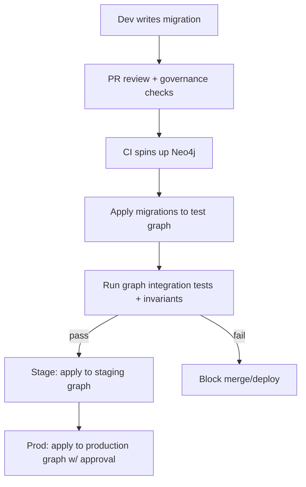

# Graph migrations (Neo4j) — `src/graph/migrations`

> ⚠️ **Governed / production-impacting.**  
> Changes in this folder evolve the KFM Knowledge Graph and can affect **provenance**, **evidence resolution**, and **Focus Mode grounding**. Treat every migration as a reviewed, auditable change.

---

## Table of contents

- [Purpose](#purpose)
- [Hard invariants](#hard-invariants)
- [What counts as a graph migration](#what-counts-as-a-graph-migration)
- [Folder layout](#folder-layout)
- [How migrations are ordered](#how-migrations-are-ordered)
- [Migration lifecycle](#migration-lifecycle)
- [Running migrations](#running-migrations)
  - [Environment variables](#environment-variables)
  - [CLI contract](#cli-contract)
  - [Local dev](#local-dev)
  - [CI / staging](#ci--staging)
  - [Production](#production)
- [Authoring migrations](#authoring-migrations)
  - [Idempotency rules](#idempotency-rules)
  - [Stable identifiers](#stable-identifiers)
  - [Schema changes](#schema-changes)
  - [Data migrations / backfills](#data-migrations--backfills)
  - [Expand/contract pattern](#expandcontract-pattern)
- [Migration ledger and receipts](#migration-ledger-and-receipts)
- [Testing](#testing)
- [Rollback, backup, and recovery](#rollback-backup-and-recovery)
- [Security and governance](#security-and-governance)
- [Troubleshooting](#troubleshooting)
- [Appendix A — KFM graph schema anchors](#appendix-a--kfm-graph-schema-anchors)
- [Appendix B — Example Cypher snippets](#appendix-b--example-cypher-snippets)
- [References](#references)

---

## Purpose

This directory is the **single source of truth** for evolving the KFM Neo4j graph in a way that is:

- **Reproducible** (local → CI → staging → production)
- **Auditable** (append-only application history + receipts)
- **Safe** (idempotent where possible; operationally reversible when feasible)
- **Governed** (review gates; policy-aligned; no bypass of trust membrane)

If you change the graph model without a migration, you create “split-brain” environments where:
- API code and graph schema drift
- evidence resolvers can’t find `graph://…` references
- Focus Mode retrieval chains break silently

---

## Hard invariants

These are KFM system-level guarantees. Graph migrations **must not** violate them.

1. **No UI / external client direct DB access**  
   The graph is only reachable through the governed API boundary (trust membrane).  
2. **Policy is deny-by-default (fail-closed)**  
   If uncertain, the system must not “guess” access.  
3. **Evidence-first outputs**  
   Any functionality using graph-backed citations must remain traceable and resolvable (including `graph://` evidence refs).  
4. **No “promotion” semantics without provenance artifacts**  
   The graph should link to (and never replace) canonical STAC/DCAT/PROV artifacts.

> **Design stance:** Graph migrations are *infrastructure changes that preserve KFM credibility guarantees*.

---

## What counts as a graph migration

### ✅ In scope

| Category | Examples |
|---|---|
| **Schema objects** | constraints, indexes (range/text, full-text), vector indexes |
| **Model evolution** | label/relationship additions, refactors, relationship reification (intermediary nodes), property renames (with expand/contract) |
| **Data backfills** | populate missing `canonical_id`, denormalize derived fields, fix duplicate nodes created by earlier ingestion |
| **Governed seeds** | deterministic “reference” nodes needed for invariants (e.g., controlled vocab, policy tags) |
| **Operational safety metadata** | migration ledger nodes, checksums, migration receipts emitted to audit |

### ❌ Out of scope (do elsewhere)

- dataset ingestion/transformation (raw → processed pipelines)
- STAC/DCAT/PROV generation (pipeline/catalog layer)
- one-off manual edits in Neo4j Browser
- ad-hoc “fixups” without a migration file and receipt

---

## Folder layout

> (If the repo’s current structure differs, treat this as the **required contract** and update either the structure or this README.)

Recommended layout:

```text
src/graph/migrations/
├── README.md
├── versioned/                 # ordered, one-time migrations
│   ├── 20260214T120000Z__init_prov_graph.cypher
│   ├── 20260216T091500Z__add_vector_index_chunks.cypher
│   └── 20260218T203000Z__backfill_entity_canonical_ids.cypher
├── repeatable/                # re-runnable migrations (idempotent), e.g. views/derived structures
│   ├── R__refresh_materialized_edges.cypher
│   └── R__rebuild_search_projection.cypher
├── fixtures/                  # tiny deterministic graph fixtures for CI tests
│   ├── fixture_min_prov.cypher
│   └── fixture_storynode_smoke.cypher
├── contracts/                 # schema & receipt contracts (JSON Schema, docs) used by CI
│   ├── migration_receipt.schema.json
│   └── graph_schema_expectations.md
└── runner/                    # migration runner / CLI (TS/JS), if migrations are executed programmatically
    ├── cli.ts
    ├── run.ts
    └── checksum.ts
```

---

## How migrations are ordered

**Versioned migrations must have a deterministic total ordering.** Use one of:

- Timestamp prefix: `YYYYMMDDTHHMMSSZ__slug.cypher`
- Monotonic integer prefix: `000123__slug.cypher`

Rules:
- Sorting is **lexicographic** on filename.
- Never reorder previously shipped migrations.
- Do not edit an already-applied migration (create a new one).

---

## Migration lifecycle



**Definition of Done (migration PR)**

- [ ] Migration file added (not edited-in-place)
- [ ] Idempotent (or clearly documented as not idempotent)
- [ ] Includes verification query / smoke test
- [ ] Adds/updates fixture(s) if behavior changes
- [ ] Updates any dependent query code (repositories/adapters)
- [ ] Updates graph schema expectations docs (if needed)
- [ ] Includes rollback plan and backup note
- [ ] CI passes: migration + tests + policy/governed-doc validation

---

## Running migrations

### Environment variables

Minimum runtime configuration (names are recommended; align with your actual runner):

- `NEO4J_URI` (e.g., `bolt://localhost:7687` or `neo4j+s://…`)
- `NEO4J_USERNAME`
- `NEO4J_PASSWORD`
- `NEO4J_DATABASE` (optional; set if multi-db)
- `KFM_ENV` (`local|ci|staging|prod`)
- `KFM_GIT_SHA` (optional but strongly recommended for receipts)
- `MIGRATIONS_DIR` (optional; defaults to this folder)

> 🔒 **Principle:** prod migrations should run using a dedicated **migrator identity** with the minimum privileges required for schema/index and controlled writes.

### CLI contract

Your migration runner should support at least:

```text
migrate status
migrate up                 # apply pending versioned migrations + (optional) repeatables
migrate up --to <id>       # apply up to a target id
migrate down --to <id>     # (optional) rollback if supported
migrate verify             # run post-migration invariant checks
migrate checksum           # print checksums of migration files
```

Exit codes:
- `0` success
- `1` migration failed
- `2` verification failed
- `3` configuration error (missing env vars, cannot connect)

> (Not confirmed in repo): If no CLI exists yet, implement it under `src/graph/migrations/runner/` and expose it via `package.json` scripts. Keep it deterministic and CI-friendly.

### Local dev

1. Start Neo4j (Docker or local install).
2. Apply migrations:

```bash
# Example ONLY — use the command that actually exists in this repo
pnpm graph:migrate up
pnpm graph:migrate verify
pnpm graph:migrate status
```

3. If you need deterministic test data:

```bash
pnpm graph:migrate load-fixture fixtures/fixture_min_prov.cypher
```

### CI / staging

CI should:
1. Spin up a fresh Neo4j instance.
2. Apply migrations.
3. Load fixtures.
4. Run invariant checks + integration tests.
5. (Optional) Apply to a staging environment after merge.

### Production

**Production migration runbook (minimum):**

- [ ] Confirm approved change window (if schema/index builds are heavy)
- [ ] Confirm backups are healthy (or export strategy is ready)
- [ ] Confirm migrator credentials and TLS settings
- [ ] Apply migrations
- [ ] Run verify checks
- [ ] Emit migration receipt to audit
- [ ] Monitor error rate / latency for graph-backed endpoints

---

## Authoring migrations

### Idempotency rules

Prefer idempotent Cypher whenever possible:

- Use `IF NOT EXISTS` variants for constraints/indexes if supported by your Neo4j version.
- For data updates, guard with predicates so re-running is safe:
  - only set missing properties
  - only create relationships if absent
  - handle duplicates deterministically (never “pick any”)

**Never** rely on internal node ids (`id(n)`), because they are not stable across rebuilds/restores.

### Stable identifiers

KFM’s graph patterns rely on **stable canonical identifiers** and provenance linkage.

Rules of thumb:
- Every “real world” node type should have a stable ID property (e.g., `dataset_id`, `ingestion_id`, `canonical_id`, `run_id`).
- Prefer deterministic IDs derived from a spec/receipt (`spec_hash`) where appropriate.
- Add uniqueness constraints for stable IDs early to prevent ingestion duplicates.

### Schema changes

Schema migrations should:
- create constraints/indexes
- introduce new labels/rel types
- add new properties (additive)
- avoid destructive drops unless:
  - the expand/contract cycle is complete, and
  - rollback plan exists

### Data migrations / backfills

Data migrations should:
- be batched for large graphs
- be restartable
- log counts (matched/updated/created)

If APOC is available, batching can be done with `apoc.periodic.iterate`; otherwise use driver-based batching in the migration runner.

> ⚠️ APOC/import/export features may require explicit server configuration and can have filesystem security implications. Don’t enable broad filesystem access in production without review.

### Expand/contract pattern

For breaking changes, use **expand/contract**:

1. **Expand:** add new property/label/rel while keeping old shape
2. **Backfill:** populate new shape
3. **Dual-read:** application can read both shapes
4. **Switch:** application writes only new shape
5. **Contract:** remove old shape (separate migration; only after metrics confirm)

---

## Migration ledger and receipts

### Ledger (in-graph)

Record applied migrations inside Neo4j so `status` can be computed deterministically.

Recommended node model:

- `(:KfmMigration { id, checksum, applied_at, applied_by, git_sha, kind, runner_version })`

Recommended constraints:
- uniqueness on `KfmMigration.id`
- optional uniqueness on `(id, checksum)` depending on policy

### Receipt (external audit)

Emit a **machine-readable receipt** per migration run and write it to your audit ledger / object storage.

Recommended fields (minimum):

```json
{
  "receipt_type": "kfm.graph_migration_receipt.v1",
  "run_id": "run_...",
  "env": "staging|prod",
  "git_sha": "...",
  "neo4j": { "version": "...", "edition": "..." },
  "migrations": [
    { "id": "20260214T120000Z__init_prov_graph", "checksum": "sha256:...", "status": "applied", "duration_ms": 1234 }
  ],
  "started_at": "2026-02-14T18:00:00Z",
  "ended_at": "2026-02-14T18:00:08Z",
  "status": "success|failure",
  "error": null
}
```

---

## Testing

### What to test (minimum)

- **Schema expectations**
  - required constraints exist
  - required indexes exist (including vector/full-text where used)
- **Invariants**
  - graph-backed evidence refs resolve
  - core graph queries return expected shapes
  - no duplicate stable IDs for constrained types
- **Fixtures**
  - keep fixtures tiny and deterministic (CI speed + stability)

### Test layers (recommended)

| Layer | What it catches | Runs where |
|---|---|---|
| Cypher unit tests (if you have a harness) | syntax, small transforms | local + CI |
| Integration tests w/ Neo4j container | schema drift, query regressions | CI |
| End-to-end pipeline smoke (optional) | ingestion → graph load consistency | staging nightly |

---

## Rollback, backup, and recovery

**Plan rollbacks before you merge.**

Rollback options:
1. **Down migrations** (only for reversible changes)
2. **Forward fix** (new migration that corrects the mistake)
3. **Restore from backup** (if data corruption occurred)
4. **Rebuild from canonical catalogs** (if graph is fully derivable)

Minimum policy:
- destructive migrations must explicitly document recovery steps
- production runs must confirm backup posture before apply

---

## Security and governance

### Privilege separation

- The **API service account** should not have schema/DDL privileges.
- The **migrator account** should be tightly controlled and used only in CI/staging/prod release workflows.

### Trust membrane compliance

- Do not add “convenience” direct-graph access from frontend code.
- Do not instruct operators to run migrations through Neo4j Browser in production.

### Sensitive data

If migrations touch location precision or culturally restricted knowledge:
- ensure “public/generalized” vs “restricted/precise” splits remain intact
- never copy restricted geometry into public node/property sets without explicit policy approval

---

## Troubleshooting

**Common failures and what to do**

- **Constraint/index already exists**
  - Ensure idempotent DDL (`IF NOT EXISTS`) or pre-checks.
- **Deadlocks / timeouts**
  - Reduce batch size; run during low-traffic; avoid large write transactions.
- **Duplicates prevent adding uniqueness**
  - Write a pre-migration that deterministically merges/marks duplicates, then add the constraint.
- **Vector index build is slow**
  - Schedule off-peak; verify memory sizing; consider staged rollout.

---

## Appendix A — KFM graph schema anchors

KFM uses the knowledge graph for:
- provenance chains (Dataset / Ingestion / Activity / Agent)
- evidence resolution and audit drilldowns
- retrieval augmentation (graph + search/vector)

When adding new node types, ensure:
- stable IDs
- constraints for uniqueness
- indexes aligned to query requirements
- resolvable evidence refs (`graph://…`) remain stable

---

## Appendix B — Example Cypher snippets

> These are examples. Adapt labels/properties to the canonical schema in this repo.

### 1) Create a migration ledger constraint

```cypher
CREATE CONSTRAINT kfm_migration_id_unique IF NOT EXISTS
FOR (m:KfmMigration)
REQUIRE m.id IS UNIQUE;
```

### 2) Minimum viable provenance constraints (illustrative)

```cypher
CREATE CONSTRAINT dataset_id_unique IF NOT EXISTS
FOR (d:Dataset)
REQUIRE d.dataset_id IS UNIQUE;

CREATE CONSTRAINT ingestion_id_unique IF NOT EXISTS
FOR (i:Ingestion)
REQUIRE i.ingestion_id IS UNIQUE;

CREATE CONSTRAINT run_id_unique IF NOT EXISTS
FOR (r:RunReceipt)
REQUIRE r.run_id IS UNIQUE;
```

### 3) Full-text index (illustrative)

```cypher
CREATE FULLTEXT INDEX kfm_chunk_text_ft IF NOT EXISTS
FOR (c:Chunk)
ON EACH [c.text];
```

### 4) Vector index (illustrative)

```cypher
// Syntax varies by Neo4j version — confirm against the pinned Neo4j/Cypher docs for this repo.
CREATE VECTOR INDEX kfm_chunk_embedding_vec IF NOT EXISTS
FOR (c:Chunk)
ON (c.embedding)
OPTIONS { indexConfig: { `vector.dimensions`: 1536, `vector.similarity_function`: 'cosine' } };
```

---

## References

Internal (governed) references to align with:
- KFM Next-Gen Blueprint (invariants: trust membrane, cite-or-abstain, fail-closed)
- KFM Integration Report (“PROV in graph” + deterministic IDs + constraints/indexes)
- Deployment/GitOps guidance for applying Neo4j migrations in CI before prod

External (authoritative) references to consult for syntax/availability:
- Neo4j Cypher Manual (constraints/indexes/full-text/vector)
- Neo4j Operations Manual (security, backup/restore, memory tuning)
- APOC docs (if used; pay attention to filesystem security and privilege model)

