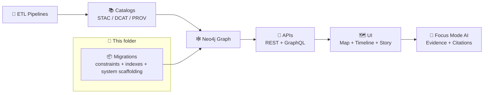

# 🧬 Graph Migrations (Neo4j) — Kansas Frontier Matrix (KFM)


> [!NOTE]
> 📍 **Path:** `src/graph/migrations/`  
> This directory contains **versioned, reviewable, idempotent Cypher migrations** used to evolve the **Neo4j knowledge graph schema** (constraints/indexes + minimal graph “system scaffolding”) in lockstep with KFM’s provenance-first pipeline.  
> The graph is a downstream product of catalogs + ETL—not a free-form database.  [oai_citation:0‡MARKDOWN_GUIDE_v13.md.gdoc](file-service://file-UYVruFXfueR8veHMUKeugU) [oai_citation:1‡📚 Kansas Frontier Matrix (KFM) Data Intake – Technical & Design Guide.pdf](file-service://file-EbUCdsJMbu5KwpoKMrLrgj)

---

## 📚 Table of Contents

- [🧭 Where migrations fit](#-where-migrations-fit)
- [✅ What belongs in migrations](#-what-belongs-in-migrations)
- [🚫 What does NOT belong in migrations](#-what-does-not-belong-in-migrations)
- [📦 Folder layout](#-folder-layout)
- [🏷️ Naming & ordering](#️-naming--ordering)
- [✍️ Writing migrations](#️-writing-migrations)
- [▶️ Applying migrations](#️-applying-migrations)
- [🔍 Post-migration verification](#-post-migration-verification)
- [⏪ Rollback & recovery](#-rollback--recovery)
- [🔐 Governance, privacy, and policy gates](#-governance-privacy-and-policy-gates)
- [🔁 Versioning & compatibility](#-versioning--compatibility)
- [✅ PR checklist](#-pr-checklist)
- [📎 Source library](#-source-library)

---

## 🧭 Where migrations fit

KFM’s canonical flow is:

**ETL → STAC/DCAT/PROV catalogs → Neo4j graph → APIs → UI → Story Nodes → Focus Mode** (and **no stage may bypass** another).  [oai_citation:2‡MARKDOWN_GUIDE_v13.md.gdoc](file-service://file-UYVruFXfueR8veHMUKeugU)

That “no bypass” principle is enforced as a **policy constraint** (OPA/Conftest “Policy Pack”), along with “UI never queries Neo4j directly” so redaction/safety stays centralized in the API layer.  [oai_citation:3‡📚 Kansas Frontier Matrix (KFM) Data Intake – Technical & Design Guide.pdf](file-service://file-EbUCdsJMbu5KwpoKMrLrgj) [oai_citation:4‡📚 Kansas Frontier Matrix (KFM) Data Intake – Technical & Design Guide.pdf](file-service://file-EbUCdsJMbu5KwpoKMrLrgj)

`src/graph/` is explicitly called out as where we keep **graph build code** (ontology bindings, ingest scripts, constraints).  [oai_citation:5‡MARKDOWN_GUIDE_v13.md.gdoc](file-service://file-UYVruFXfueR8veHMUKeugU)



---

## ✅ What belongs in migrations

Migrations are for **schema + operability**, not for bulk domain data.

Typical ✅ use-cases:

- 🧷 **Constraints** (uniqueness, existence where supported, type/shape conventions)
- ⚡ **Indexes** (search + traversal performance for UI/API/AI)
- 🧭 Minimal **system scaffolding** required for governance/lineage (e.g., required labels or metadata “anchors” used by the platform)
- 🧩 **Ontology-aligned structure** changes (when we introduce new label families / relationship types that represent ontology evolution)  
  KFM explicitly calls out that **graph + ontology changes require migration scripts** and stable schemas for clients.  [oai_citation:6‡📚 Kansas Frontier Matrix (KFM) Data Intake – Technical & Design Guide.pdf](file-service://file-EbUCdsJMbu5KwpoKMrLrgj)

---

## 🚫 What does NOT belong in migrations

**No bulk graph population** here.

KFM’s contract is that graph content is built from catalogs/metadata and generated as import-ready CSVs:

- `data/graph/csv/` is where node/edge CSVs live
- CSVs must remain **traceable to STAC/DCAT/PROV**
- No “hand-edited CSV” shortcuts
- Referential integrity must be preserved (no dangling edges)  [oai_citation:7‡📚 Kansas Frontier Matrix (KFM) Data Intake – Technical & Design Guide.pdf](file-service://file-EbUCdsJMbu5KwpoKMrLrgj)

Also: do **not** use migrations to “hotfix” user-visible narrative behavior. Story Nodes reference graph entities by stable identifiers; breaking IDs breaks narratives.  [oai_citation:8‡MARKDOWN_GUIDE_v13.md.gdoc](file-service://file-UYVruFXfueR8veHMUKeugU)

---

## 📦 Folder layout

Recommended structure (keep it boring, predictable, GitOps-friendly):

```text
📁 src/
  📁 graph/
    📁 migrations/
      📄 README.md                👈 you are here
      📁 up/                      ⬆️ forward migrations only (preferred)
        📄 V20260123_1200__init_constraints.cypher
        📄 V20260201_0900__add_dataset_indexes.cypher
      📁 down/                    ⬇️ optional (use sparingly)
        📄 U20260201_0900__add_dataset_indexes.cypher
      📁 _templates/
        📄 migration_template.cypher
      📁 _docs/
        📄 ADR_graph_schema_changes.md
```

> [!IMPORTANT]
> **Prefer “up-only” migrations** unless you have a truly reversible operation. In KFM, rollback is often done by **re-importing prior graph CSVs** (GitOps + stable IDs).  [oai_citation:9‡📚 Kansas Frontier Matrix (KFM) Data Intake – Technical & Design Guide.pdf](file-service://file-EbUCdsJMbu5KwpoKMrLrgj)

---

## 🏷️ Naming & ordering

Use deterministic, sortable names:

- **Up:** `VYYYYMMDD_HHMM__short_slug.cypher`
- **Down (optional):** `UYYYYMMDD_HHMM__short_slug.cypher`

Rules:

1. ✅ Filenames must be **unique** and **time-sortable**.
2. ✅ Migrations must be **idempotent** (safe to re-run).
3. ✅ A migration must include a **short header** describing intent + expected effects.

---

## ✍️ Writing migrations

### ✅ Golden rules

> [!IMPORTANT]
> **Migrations must not violate KFM’s pipeline contract.**  
> If a migration introduces a new label/relationship/property convention, you must update the **ontology bindings + ingest scripts** that generate `data/graph/csv/` outputs, and ensure policy gates remain satisfied.  [oai_citation:10‡MARKDOWN_GUIDE_v13.md.gdoc](file-service://file-UYVruFXfueR8veHMUKeugU) [oai_citation:11‡📚 Kansas Frontier Matrix (KFM) Data Intake – Technical & Design Guide.pdf](file-service://file-EbUCdsJMbu5KwpoKMrLrgj)

Also follow these engineering constraints:

- **Idempotent DDL:** Use `IF NOT EXISTS` where possible.
- **Additive first:** Prefer adding new constraints/indexes over dropping.
- **No mystery side effects:** KFM is explicitly “no mystery layers / contract-first.”  [oai_citation:12‡📚 Kansas Frontier Matrix (KFM) Data Intake – Technical & Design Guide.pdf](file-service://file-EbUCdsJMbu5KwpoKMrLrgj)
- **Governance-aware:** Don’t remove fields/labels that power sensitivity tagging, licensing checks, or provenance completeness gates. 

### 🧾 Migration template

```cypher
// -----------------------------------------------------------------------------
// MIGRATION: V20260123_1200__init_constraints
// PURPOSE:  Establish baseline uniqueness + lookup indexes for core entity IDs.
// AUTHOR:   <you>
// NOTES:    - Idempotent: safe to re-run
//           - Keep aligned with ontology bindings + CSV generators
// -----------------------------------------------------------------------------

// Example: unique IDs (adjust label/property names to match the current ontology bindings)
CREATE CONSTRAINT kfm_dataset_id_unique IF NOT EXISTS
FOR (n:Dataset)
REQUIRE n.id IS UNIQUE;

CREATE INDEX kfm_dataset_title_idx IF NOT EXISTS
FOR (n:Dataset)
ON (n.title);
```

> [!TIP]
> KFM uses globally meaningful dataset identifiers in metadata/graph (e.g., reverse-DNS style like `kfm.ks.landcover.2000_2020.v1`).  [oai_citation:13‡📚 Kansas Frontier Matrix (KFM) Data Intake – Technical & Design Guide.pdf](file-service://file-EbUCdsJMbu5KwpoKMrLrgj) [oai_citation:14‡📚 Kansas Frontier Matrix (KFM) Data Intake – Technical & Design Guide.pdf](file-service://file-EbUCdsJMbu5KwpoKMrLrgj)

---

## ▶️ Applying migrations

KFM’s runner flow treats Neo4j graph loading as a formal stage in the pipeline (after catalogs).  [oai_citation:15‡📚 Kansas Frontier Matrix (KFM) Data Intake – Technical & Design Guide.pdf](file-service://file-EbUCdsJMbu5KwpoKMrLrgj)

**Expected operational contract:**

1. 🚦 **Policy gates pass** (schema, STAC/DCAT/PROV completeness, license presence, sensitivity classification, provenance completeness; fail-closed). 
2. 🔧 Apply **pending migrations** (this folder).
3. 📥 Load `data/graph/csv/` (nodes then edges; no dangling references).
4. 🔍 Run **graph health checks** and persist reports.

> [!NOTE]
> The UI is decoupled through APIs (REST/GraphQL). Don’t “help the UI” by making it query Neo4j directly—keep the API boundary intact.  [oai_citation:16‡📚 Kansas Frontier Matrix (KFM) Data Intake – Technical & Design Guide.pdf](file-service://file-EbUCdsJMbu5KwpoKMrLrgj) [oai_citation:17‡Kansas Frontier Matrix – Comprehensive UI System Overview.pdf](file-service://file-KcBQruYcoFVDEixzzRHTwt)

### 🧪 Suggested local workflow (implementation-agnostic)

Even if the exact CLI differs, the workflow should look like:

- `up`: apply pending migrations in order
- `status`: list applied vs pending
- `verify`: run post-migration health checks

> If you’re building the runner: store applied migrations in Neo4j (e.g., `(:KfmMigration {version, checksum, applied_at, git_sha})`) or an adjacent state file.

---

## 🔍 Post-migration verification

KFM explicitly proposes **Graph Integrity Health Checks** on a cadence (e.g., weekly), including counts deltas, constraint/index integrity, orphaned metadata nodes, and property schema drift reporting.  [oai_citation:18‡Additional Project Ideas.pdf](file-service://file-Pc2GNivcrHBeKjBQksLC3T) [oai_citation:19‡Additional Project Ideas.pdf](file-service://file-Pc2GNivcrHBeKjBQksLC3T)

### ✅ Quick Cypher checks (copy/paste)

```cypher
// 1) Confirm constraints + indexes are online
SHOW CONSTRAINTS;
SHOW INDEXES;

// 2) Sanity counts (track deltas between runs)
MATCH (n) RETURN count(n) AS nodes;
MATCH ()-[r]->() RETURN count(r) AS rels;

// 3) Orphan detection (example patterns — adapt to your PROV/STAC graph)
// Find nodes without any relationships (often a smell)
MATCH (n)
WHERE NOT (n)--()
RETURN labels(n) AS labels, count(*) AS cnt
ORDER BY cnt DESC;
```

### 🧾 Persisting QA outputs

Health checks should emit timestamped reports and a summary (“violations found or not”).  [oai_citation:20‡Additional Project Ideas.pdf](file-service://file-Pc2GNivcrHBeKjBQksLC3T)

Recommended output shape:

```text
📁 docs/
  📁 reports/
    📁 qa/
      📁 graph_health/
        📁 2026-01-23T12-00-00Z/
          📄 summary.md
          📄 constraints.json
          📄 indexes.json
          📄 counts.json
          📄 orphan_report.csv
```

---

## ⏪ Rollback & recovery

KFM’s intended rollback strategy for graph content:

- Keep **stable IDs** in graph CSVs so “older ones can overwrite and restore prior state.”
- To rollback: **re-import previous CSVs from Git history** (GitOps).  [oai_citation:21‡📚 Kansas Frontier Matrix (KFM) Data Intake – Technical & Design Guide.pdf](file-service://file-EbUCdsJMbu5KwpoKMrLrgj)

### When you *do* need down migrations

Only include `down/` scripts when:

- The migration is fully reversible
- There’s a tested “down” procedure
- You’re not risking evidence/provenance integrity

---

## 🔐 Governance, privacy, and policy gates

KFM treats governance as an engineering constraint (FAIR + CARE, provenance, licensing, sensitivity handling).  [oai_citation:22‡📚 Kansas Frontier Matrix (KFM) Data Intake – Technical & Design Guide.pdf](file-service://file-EbUCdsJMbu5KwpoKMrLrgj)

### ✅ Policy gates apply to graph changes too

Automated gates cover schema validation, metadata completeness, license presence, sensitivity classification, provenance completeness, etc.—and the philosophy is **fail closed**. 

### 🪶 Cultural protocols & differential access

KFM’s innovation track includes encoding cultural protocols (e.g., TK labels, tiered access) and sensitivity-aware handling. When migrations touch labels/properties involved in sensitivity tagging, treat it as high-risk. 

### 🕵️ Query auditing (why indexes/constraints matter)

Privacy literature highlights **query auditing / inference control**: if a query enables disclosure of confidential data, it should be denied; auditing can be online/offline. This supports KFM’s “API boundary + policy enforcement” approach.  [oai_citation:23‡Data Mining Concepts & applictions.pdf](file-service://file-2uwEbQAFVKpXaTtWgUirAH)

### 🎯 Focus Mode safety contract

Story Nodes reference graph entities by stable identifiers, and Focus Mode is designed to only allow provenance-linked content (hard gate). Breaking schemas/IDs undermines this.  [oai_citation:24‡MARKDOWN_GUIDE_v13.md.gdoc](file-service://file-UYVruFXfueR8veHMUKeugU) [oai_citation:25‡MARKDOWN_GUIDE_v13.md.gdoc](file-service://file-UYVruFXfueR8veHMUKeugU)

---

## 🔁 Versioning & compatibility

KFM explicitly calls out:

- Keep **stable graph schemas**
- Graph/ontology changes require **migration scripts + schema docs**
- Clients depend on stability; breaking changes require coordination  [oai_citation:26‡📚 Kansas Frontier Matrix (KFM) Data Intake – Technical & Design Guide.pdf](file-service://file-EbUCdsJMbu5KwpoKMrLrgj)

Also note: AI features integrate with the graph using ontologies (CIDOC-CRM, OWL-Time) and the KG is used for query translation and retrieval. Index and constraint choices directly impact AI latency and reliability.  [oai_citation:27‡Kansas Frontier Matrix (KFM) – AI System Overview 🧭🤖.pdf](file-service://file-Pv8eev6RWvCKrGCXyzY7zg) [oai_citation:28‡Kansas Frontier Matrix (KFM) – Comprehensive Technical Documentation.pdf](file-service://file-AkqwUuYPp5zePf7pv5SMxi)

---

## ✅ PR checklist

Use this as a “definition of done” for any graph schema PR:

- [ ] 🧾 Migration(s) added in `src/graph/migrations/up/` with deterministic name
- [ ] 🧷 Constraints/indexes are **idempotent** and include `IF NOT EXISTS` when supported
- [ ] 🧠 Ontology bindings + ingest scripts updated (if labels/rels/properties changed)  [oai_citation:29‡MARKDOWN_GUIDE_v13.md.gdoc](file-service://file-UYVruFXfueR8veHMUKeugU)
- [ ] 📦 `data/graph/csv/` regenerated by pipeline (no hand edits; referential integrity preserved)  [oai_citation:30‡📚 Kansas Frontier Matrix (KFM) Data Intake – Technical & Design Guide.pdf](file-service://file-EbUCdsJMbu5KwpoKMrLrgj)
- [ ] 🔐 Policy gates pass (schema, metadata completeness, license, sensitivity, provenance) 
- [ ] 🔍 Health checks run; reports saved under timestamped folder  [oai_citation:31‡Additional Project Ideas.pdf](file-service://file-Pc2GNivcrHBeKjBQksLC3T)
- [ ] ⏪ Rollback plan documented (usually re-import prior CSVs)  [oai_citation:32‡📚 Kansas Frontier Matrix (KFM) Data Intake – Technical & Design Guide.pdf](file-service://file-EbUCdsJMbu5KwpoKMrLrgj)

---

## 📎 Source library

These are the project documents this README is grounded in (and which you should keep handy while authoring migrations):

### Core KFM architecture + contracts
-  [oai_citation:33‡Kansas Frontier Matrix (KFM) – Comprehensive Technical Documentation.pdf](file-service://file-AkqwUuYPp5zePf7pv5SMxi) — **Comprehensive Technical Documentation**
-  [oai_citation:34‡Kansas Frontier Matrix (KFM) – Comprehensive Architecture, Features, and Design.pdf](file-service://file-4Umt1yHoGKicdmLWzFJ9sC) — **Comprehensive Architecture, Features, and Design**
-  [oai_citation:35‡📚 Kansas Frontier Matrix (KFM) Data Intake – Technical & Design Guide.pdf](file-service://file-EbUCdsJMbu5KwpoKMrLrgj) — **Data Intake – Technical & Design Guide**
-  [oai_citation:36‡Kansas Frontier Matrix (KFM) – AI System Overview 🧭🤖.pdf](file-service://file-Pv8eev6RWvCKrGCXyzY7zg) — **AI System Overview 🧭🤖**
-  [oai_citation:37‡Kansas Frontier Matrix – Comprehensive UI System Overview.pdf](file-service://file-KcBQruYcoFVDEixzzRHTwt) — **Comprehensive UI System Overview**

### Ideas, governance & future direction
-  [oai_citation:38‡🌟 Kansas Frontier Matrix – Latest Ideas & Future Proposals.docx.pdf](file-service://file-SQ3f7ve8SGiusT6ThZEuCe) — **Latest Ideas & Future Proposals**
-  [oai_citation:39‡Innovative Concepts to Evolve the Kansas Frontier Matrix (KFM).pdf](file-service://file-G71zNoWKxsoSW44iwZaaCC) — **Innovative Concepts to Evolve KFM**
-  [oai_citation:40‡Additional Project Ideas.pdf](file-service://file-Pc2GNivcrHBeKjBQksLC3T) — **Additional Project Ideas**

### Reference library (often PDF portfolios)
> [!NOTE]
> Some reference bundles are PDF portfolios (best opened in Acrobat/Reader). They’re still part of the project’s research base.
-  [oai_citation:41‡AI Concepts & more.pdf](file-service://file-K6BctJjeUwvyCahLf9qdwr) — **AI Concepts & more** (portfolio)
-  [oai_citation:42‡Maps-GoogleMaps-VirtualWorlds-Archaeological-Computer Graphics-Geospatial-webgl.pdf](file-service://file-RshcX5sNY2wpiNjRfoP6z6) — **Maps / GoogleMaps / VirtualWorlds / WebGL** (portfolio)
-  [oai_citation:43‡Various programming langurages & resources 1.pdf](file-service://file-4wp3wSSZs7gk5qHWaJVudi) — **Various programming languages & resources** (portfolio)
-  [oai_citation:44‡Data Managment-Theories-Architures-Data Science-Baysian Methods-Some Programming Ideas.pdf](file-service://file-RrXMFY7cP925exsQYermf2) — **Data Management / Architectures / Bayesian / Ideas** (portfolio)
-  [oai_citation:45‡Data Mining Concepts & applictions.pdf](file-service://file-2uwEbQAFVKpXaTtWgUirAH) — **Data Mining Concepts & Applications** (privacy + auditing references)
-  [oai_citation:46‡Kansas-Frontier-Matrix_ Open-Source Geospatial Historical Mapping Hub Design.pdf](file-service://file-64djFYQUCmxN1h6L6X7KUw) — **Open-Source Geospatial Historical Mapping Hub Design** (system architecture primer)

---

🧠 **If you’re unsure whether a change needs a migration:**  
If it affects **labels, relationship types, key properties, constraints, indexes, or system governance hooks**, it probably needs one. If it affects **bulk content**, regenerate `data/graph/csv/` via the pipeline instead.  [oai_citation:47‡📚 Kansas Frontier Matrix (KFM) Data Intake – Technical & Design Guide.pdf](file-service://file-EbUCdsJMbu5KwpoKMrLrgj)