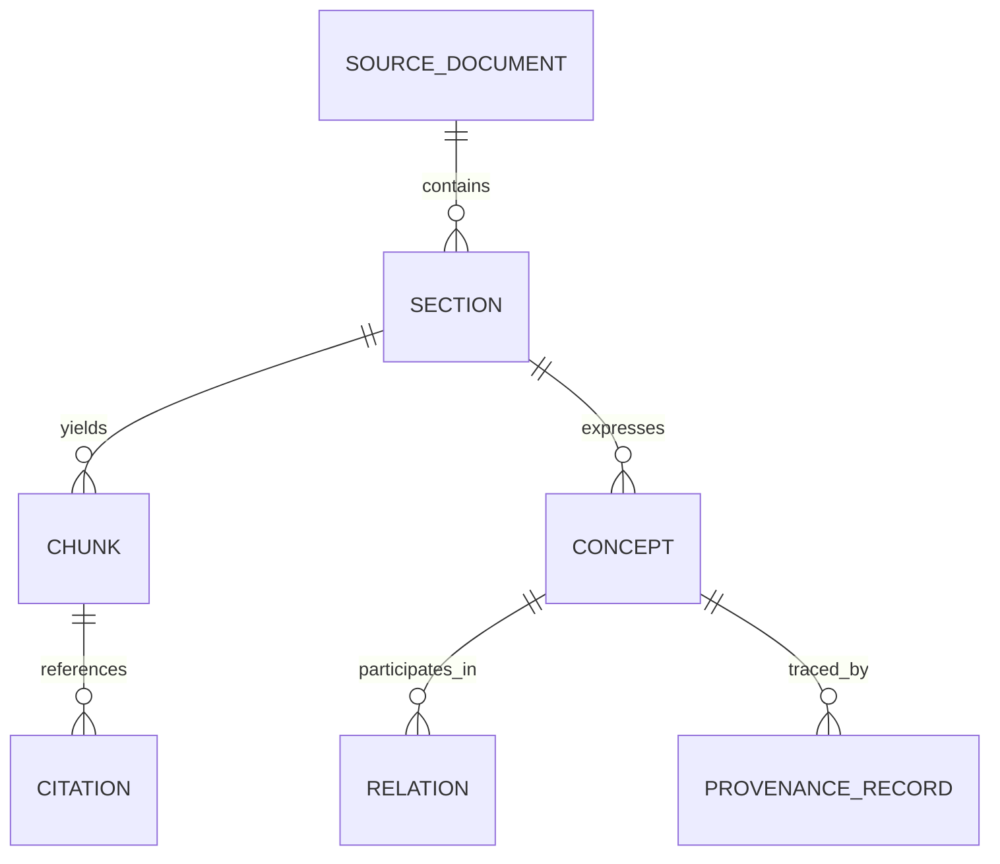
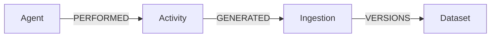

<!--
File: src/graph/ontology/README.md
KFM Governed Artifact: Yes (graph contract + evidence/provenance semantics)
-->

# KFM Graph Ontology (Governed Contract) 🧭🕸️


This directory defines **KFM’s graph ontology contract**: the **stable node labels, relationship types, and required properties** that make the KFM knowledge graph queryable, governed, and safe.

KFM treats the graph schema like a **first-class contract artifact**: changes require **migrations**, validation, and (when breaking) explicit coordination with API/UI consumers.:contentReference[oaicite:3]{index=3}

> [!IMPORTANT]
> **Do-not-break rule:** Graph schema (labels + relationships) must remain stable; **breaking changes require a migration** and versioning notes. Neo4j data must meet ontology constraints (e.g., no orphan node types).:contentReference[oaicite:4]{index=4}

> [!IMPORTANT]
> **Trust membrane rule:** The UI never queries databases directly; all graph access flows through the governed API boundary (`src/server/`).:contentReference[oaicite:5]{index=5}

---

## Table of contents

- [Why this exists](#why-this-exists)
- [What “ontology” means in KFM](#what-ontology-means-in-kfm)
- [Non-negotiables](#non-negotiables)
- [Where this fits in the repo](#where-this-fits-in-the-repo)
- [Ontology scope](#ontology-scope)
- [Core graph types](#core-graph-types)
  - [Concept + relation extraction graph](#concept--relation-extraction-graph)
  - [Minimum viable provenance graph](#minimum-viable-provenance-graph)
  - [Catalog linkouts (STAC/DCAT/PROV)](#catalog-linkouts-stacdcatprov)
  - [Policy + sensitivity (SensitiveRecord)](#policy--sensitivity-sensitiverecord)
- [Identifiers and required fields](#identifiers-and-required-fields)
- [Validation & CI gates](#validation--ci-gates)
- [Migrations & versioning](#migrations--versioning)
- [How to propose a change](#how-to-propose-a-change)
- [Query patterns](#query-patterns)
- [Glossary](#glossary)

---

## Why this exists

KFM’s graph is not “just another database”—it is the **knowledge layer** that connects:

- documents → sections/chunks → concepts/relations (extraction graph)
- datasets → ingestion runs → lineage/provenance (PROV-aligned)
- story nodes + UI layers → evidence resolvers and citations
- policy (OPA) → access control + redaction

This layer is central to KFM’s **evidence-first** behavior: Story/Focus outputs must be provenance-linked and **must not introduce unsourced material**.:contentReference[oaicite:6]{index=6}

---

## What “ontology” means in KFM

In KFM, “ontology” means:

1) **A stable graph schema contract** (labels/relationships/properties + constraints), with migrations for change.:contentReference[oaicite:7]{index=7}

2) **A mapping layer** that aligns cross-domain records and metadata into graph form—especially:
   - **STAC / DCAT / PROV** linkouts for datasets and evidence objects:contentReference[oaicite:8]{index=8}
   - **PROV-aligned lineage** for ingestion runs (Agent → Activity → Ingestion → Dataset):contentReference[oaicite:9]{index=9}

3) **Governed semantics for relationships** so the system can attach provenance to edges (who/what/where evidence came from). In the Next-Gen blueprint, “relationships/ontology” output is explicitly tracked with **source_doc_id**, **justification span**, and **confidence**.:contentReference[oaicite:10]{index=10}

> [!NOTE]
> The canonical standards/profiles live under `docs/standards/` (including STAC/DCAT/PROV profiles and “ontology protocols”). This directory is the **implementation** of the graph contract and bindings.:contentReference[oaicite:11]{index=11}

---

## Non-negotiables

### Evidence-first, cite-or-abstain (fail-closed)
KFM is designed to fail closed: outputs must carry citations and pass policy checks. The recommended policy posture is **default deny** unless citations exist and sensitivity checks pass.:contentReference[oaicite:12]{index=12}

### Provenance completeness is required
Every promoted artifact must have a **PROV chain** and a **deterministic checksum** as part of minimum validation gates.:contentReference[oaicite:13]{index=13}

### Deterministic and replayable pipelines
ETL runs must be deterministic/replayable, and ontology/graph builds must be reproducible from inputs + manifests + migrations.:contentReference[oaicite:14]{index=14}

### Stable schema with migrations
Graph schema changes require migrations, and client dependencies (API/UI) must be considered in lockstep.:contentReference[oaicite:15]{index=15}

---

## Where this fits in the repo

Per the v13 repo map:

- `schemas/` holds JSON Schemas for STAC/DCAT/PROV/storynodes/UI/telemetry.
- `src/graph/` is the canonical home for graph build and sync code (ontology application, Cypher migrations, CSV generation, constraints).:contentReference[oaicite:16]{index=16}:contentReference[oaicite:17]{index=17}

> [!TIP]
> If you can’t find a graph-related definition in `src/graph/`, that’s likely “repo drift.” Fix by moving/centralizing graph artifacts here, not by duplicating elsewhere.:contentReference[oaicite:18]{index=18}

### Expected contents (recommended layout)
This README documents the “shape” of what should live here. Adjust filenames to match the repo, but keep the roles consistent.

```text
src/graph/
└── ontology/
    ├── README.md                  # (this file) contract + workflow + invariants
    ├── model/                     # label/relationship/type definitions (code-level)
    ├── constraints/               # graph integrity constraints (Cypher/DDL equivalents)
    ├── migrations/                # forward-only migrations for schema changes
    ├── mappings/                  # mapping from record templates → graph nodes/edges
    ├── exports/                   # CSV exports or interchange artifacts (optional)
    ├── fixtures/                  # small canonical graph fixtures for tests
    └── tests/                     # unit/integration tests for ontology + constraints
```

---

## Ontology scope

KFM’s graph ontology supports four main “bands”:

1) **Concept catalog + extraction graph**  
   Documents/sections/chunks/concepts/relations, with provenance on relationships.:contentReference[oaicite:19]{index=19}

2) **Dataset lineage/provenance graph**  
   Minimum viable provenance schema aligned to PROV patterns: Agent → Activity → Ingestion → Dataset.:contentReference[oaicite:20]{index=20}

3) **Catalog linkouts / evidence resolvers**  
   STAC/DCAT/PROV IDs must link out cleanly so the UI can resolve a citation reference quickly (<=2 API calls is a stated acceptance criterion).:contentReference[oaicite:21]{index=21}:contentReference[oaicite:22]{index=22}

4) **Policy and sensitivity**  
   SensitiveRecord controls (access level, precision, permission requirements) and redaction strategies (generalized geometry public vs precise geometry restricted, authorize on read).:contentReference[oaicite:23]{index=23}

---

## Core graph types

> [!NOTE]
> The exact label/type names below are **contract targets**. If you already have established labels in the codebase, keep them stable and map these concepts onto them via migrations rather than renaming “just because.”

### Concept + relation extraction graph

The Next-Gen blueprint defines an extraction graph tying docs/sections/chunks/concepts/relations to provenance.:contentReference[oaicite:24]{index=24}



**Minimum provenance fields for ontology relations (required):**
- `source_doc_id`
- `justification_span` (or equivalent locator: page range + char offsets)
- `confidence` (explicit numeric or categorical):contentReference[oaicite:25]{index=25}

### Minimum viable provenance graph

Integration guidance proposes a minimum viable provenance graph schema with PROV-aligned relationships and a standardized ingestion upsert endpoint.:contentReference[oaicite:26]{index=26}



Recommended node concepts:
- **Agent**: person/org/software agent (who/what did work)
- **Activity**: transformation/ETL step (what happened)
- **Ingestion**: run receipt / pipeline execution instance (when/where + what inputs/outputs)
- **Dataset**: durable dataset identity; versioned over time via ingestions

### Catalog linkouts (STAC/DCAT/PROV)

KFM expects crosswalks so that:
- records carry STAC/DCAT/PROV blocks
- STAC items are enriched with `kfm:` properties (`kfm:canonical_id`, `kfm:run_receipt`, etc.)
- there is an explicit link from STAC items to PROV bundles and DCAT datasets:contentReference[oaicite:27]{index=27}

**Why it matters:** evidence resolvers can fetch `dcat/{id}`, `stac/{id}`, `prov/{id}`, and `graph/{id}` so citations are displayable in the UI quickly and reliably.:contentReference[oaicite:28]{index=28}

### Policy + sensitivity (SensitiveRecord)

Sensitive data must be protected at the ontology level, not “by convention.”

The integration report calls out a `SensitiveRecord` policy posture with:
- `access_level`
- `permission_required`
- `precision_m`
- record-to-policy relationship (`Record → governed_by → Policy`)
- asset splitting strategy:
  - generalized geometry in public store
  - precise geometry in restricted store
  - authorize with OPA on read:contentReference[oaicite:29]{index=29}

> [!WARNING]
> Do **not** encode “precise location” fields into public graph nodes. Store sensitive geometry separately and link by a governed reference. Enforce access via policy checks before resolution.:contentReference[oaicite:30]{index=30}

---

## Identifiers and required fields

KFM’s graph relies on stable IDs and a minimum set of required fields to support governance and evidence resolution.

### Required identity/provenance for entities (contract)
The integration guidance emphasizes:
- `canonical_id`
- `class`
- `identifiers` (external IDs)
- `provenance` block (source + method):contentReference[oaicite:31]{index=31}

### Common IDs/fields you will see referenced
| Field | Meaning | Why it exists |
|---|---|---|
| `canonical_id` | Stable KFM ID for an entity/person/dataset | Enables de-duplication + stable references |
| `spec_hash` | Deterministic hash of the spec/record | Ensures idempotent upserts + reproducibility:contentReference[oaicite:32]{index=32} |
| `run_receipt` / `run_id` | Pipeline execution identity | Provenance: “how produced” + audit drilldown:contentReference[oaicite:33]{index=33} |
| `record_sha256` | Digest of record content | Content-addressed integrity and tamper evidence:contentReference[oaicite:34]{index=34} |
| `lineage[]` | Pointers to upstream dependencies | Enables derivation tracing and UI lineage views:contentReference[oaicite:35]{index=35} |

> [!NOTE]
> Exact ID formatting conventions (prefixes, slug rules) should be governed in `docs/standards/` and enforced in validators. This README focuses on **what must exist**, not the specific string shape.

---

## Validation & CI gates

### Contract: “no graph artifact is accepted without validation”
The v13 contracts require machine validation and stable schema discipline across subsystems—including Graph/ontology constraints and migration scripts.:contentReference[oaicite:36]{index=36}

### Minimum validation gates that affect ontology
The data-source blueprint lists gates that must be enforced in CI/pipeline, including:
- schema validation
- geometry validity + bounds
- temporal sanity
- license + attribution captured
- provenance completeness + deterministic checksum
- contract tests verifying API response includes provenance bundle and respects policy redaction:contentReference[oaicite:37]{index=37}

### Provenance validation tooling (recommended)
KFM’s support materials recommend:
- validating PROV constraints (ProvValidator / ProvToolbox)
- SHACL shapes to encode and validate required structure and custom business rules
- integrating SHACL validation into pipelines before storage:contentReference[oaicite:38]{index=38}

> [!TIP]
> Treat SHACL (or equivalent) as the “lint” of provenance + ontology: it’s how we **fail closed** before bad graph data reaches Neo4j or becomes queryable.:contentReference[oaicite:39]{index=39}

### Policy-as-code (OPA) gates
Cite-or-abstain enforcement is expected with default deny semantics unless citations exist and sensitivity is OK.:contentReference[oaicite:40]{index=40}

---

## Migrations & versioning

### Rule: schema changes must be explicit and replayable
Graph/ontology changes must be handled via migration scripts and recorded in version history; breaking changes require coordination.:contentReference[oaicite:41]{index=41}

### Migration expectations (contract-level)
A migration should:
- be **forward-only**
- be **idempotent** (safe to re-run)
- include pre/post checks (constraints satisfied, no orphan types)
- update constraints/indexes
- update mapping code (if record → graph mapping changes)
- update any evidence resolver assumptions (if IDs/fields change)

> [!IMPORTANT]
> Clients (API, UI) rely on stable graph schema. Do not rename a label or relationship without a migration + coordinated release note.:contentReference[oaicite:42]{index=42}

---

## How to propose a change

> [!IMPORTANT]
> Treat ontology changes as **production changes**. They can affect evidence resolution, redaction, and narrative outputs.

### Change workflow (thin-slice, reversible)
1. **Propose**: open a PR that includes:
   - ontology contract update (labels/relationships/properties)
   - migration script(s)
   - updated constraints (if needed)
   - updated validation (SHACL/fixtures/tests)
   - doc update in `docs/standards/` if semantics change
2. **Validate** locally:
   - run ontology/constraint validation
   - run fixture load + query smoke tests
3. **CI gates**:
   - schema validation (STAC/DCAT/PROV)
   - OPA policy tests
   - graph integrity checks
4. **Review**:
   - peer review for correctness
   - governance review when sensitivity/rights/sovereignty affected:contentReference[oaicite:43]{index=43}

### Definition of Done (ontology PR)
- [ ] Migration script added and replayable
- [ ] Constraints updated (no orphan node types; required properties enforced):contentReference[oaicite:44]{index=44}
- [ ] Record→graph mapping updated (if applicable)
- [ ] SHACL/PROV validation updated (if applicable):contentReference[oaicite:45]{index=45}
- [ ] Policy impact assessed (SensitiveRecord, redaction, access controls):contentReference[oaicite:46]{index=46}
- [ ] Evidence resolution still works (citations resolvable quickly; IDs stable):contentReference[oaicite:47]{index=47}
- [ ] Tests added/updated:
  - unit tests for mapping/shape logic
  - integration tests for constraint satisfaction
  - contract tests for API redaction behavior:contentReference[oaicite:48]{index=48}

---

## Query patterns

> [!NOTE]
> Provide “pattern templates” rather than prose. When you add a new label/relationship, add at least one canonical query pattern and expected output shape.

### Example (Cypher) — provenance lineage traversal
```cypher
// Find the ingestion lineage for a dataset ID (shape: Agent -> Activity -> Ingestion -> Dataset)
MATCH (d:Dataset {dataset_id: $datasetId})
OPTIONAL MATCH (i:Ingestion)-[:VERSIONS]->(d)
OPTIONAL MATCH (a:Activity)-[:GENERATED]->(i)
OPTIONAL MATCH (ag:Agent)-[:PERFORMED]->(a)
RETURN d, i, a, ag
ORDER BY i.at DESC;
```

### Example (SPARQL) — version history via PROV revision chain (conceptual)
The support guide includes provenance query patterns such as traversing revisions and finding responsible agents via PROV relations.:contentReference[oaicite:49]{index=49}

---

## Glossary

- **Ontology (KFM):** the governed contract for graph schema + semantics + constraints, with migrations required for change.
- **Evidence-first:** KFM outputs must be traceable; Story Nodes and Focus Mode must not introduce unsourced material.:contentReference[oaicite:50]{index=50}
- **Cite-or-abstain:** policy posture that denies outputs lacking citations or failing sensitivity checks (fail closed).:contentReference[oaicite:51]{index=51}
- **PROV:** W3C provenance model pattern (Entity/Activity/Agent) used for lineage.
- **SHACL:** shapes language used to validate RDF/PROV structures and enforce KFM-specific requirements.:contentReference[oaicite:52]{index=52}
- **SensitiveRecord:** policy-governed record requiring redaction/precision controls and authorization on read.:contentReference[oaicite:53]{index=53}

---

