# 🧠 KFM Graph Ontology (KFM-ONTO)

       

> **What this folder is:** the canonical **vocabulary** (node labels, relationship types, required properties, and mappings) for the Kansas Frontier Matrix (KFM) knowledge graph.  
> **What it enables:** consistent ingestion ✅, provenance-first Q&A ✅, narrative/story linking ✅, and cross-domain federation ✅.  
> <!-- KFM graph layer + entities like Place/Event/Dataset/Observation/StoryNode:  [oai_citation:0‡📚 Kansas Frontier Matrix (KFM) Data Intake – Technical & Design Guide.pdf](file-service://file-EbUCdsJMbu5KwpoKMrLrgj) -->

---

## 🧭 Table of Contents

- [What lives here](#-what-lives-here)
- [Core ideas](#-core-ideas)
- [The mental model](#-the-mental-model)
- [Ontology layers](#-ontology-layers)
- [Core node labels](#-core-node-labels)
- [Core relationship types](#-core-relationship-types)
- [Standards alignment map](#-standards-alignment-map)
- [IDs, naming, and required properties](#-ids-naming-and-required-properties)
- [Governance, safety, and sensitivity](#-governance-safety-and-sensitivity)
- [Schema evolution](#-schema-evolution)
- [Validation + health checks](#-validation--health-checks)
- [Examples](#-examples)
- [Reference docs](#-reference-docs)

---

## 📁 What lives here

This directory is the **contract** for everything that touches the graph:

- 🧱 **Ingestion** uses it to validate that any generated graph CSV has only allowed labels/edges (no “mystery nodes”) and that sensitive flags exist when required.  
  <!-- CSV → Neo4j import + no mystery nodes:  [oai_citation:1‡📚 Kansas Frontier Matrix (KFM) Data Intake – Technical & Design Guide.pdf](file-service://file-EbUCdsJMbu5KwpoKMrLrgj) -->
- 🗺️ **UI** uses it to drive consistent entity cards, story node linkouts, and provenance panels (“map behind the map”).  
  <!-- UI: provenance/citations + map behind map:  -->
- 🤖 **Focus Mode / AI** uses it to reliably traverse multi-hop relationships and to attach citations + provenance to every answer.  
  <!-- Focus Mode cites sources + KG driven:  [oai_citation:2‡🌟 Kansas Frontier Matrix – Latest Ideas & Future Proposals.docx.pdf](file-service://file-SQ3f7ve8SGiusT6ThZEuCe) -->
- 🧾 **Governance** uses it as policy-backed “truth”: any ontological decision is versioned, reviewed, and enforced in CI.  
  <!-- contract-first + deterministic pipeline principle:  [oai_citation:3‡MARKDOWN_GUIDE_v13.md.gdoc](file-service://file-UYVruFXfueR8veHMUKeugU) -->

### Suggested folder layout 🧰 (add as the repo matures)

> If some of these files don’t exist yet, that’s fine—this is the “target shape” that keeps KFM-ONTO maintainable.

```text
src/graph/ontology/
├─ 📄 README.md                          # you are here 📌 How ontology is structured, versioned, and enforced in CI
├─ 🧱 core/                              # Stable cross-domain vocabulary (shared concepts used everywhere)
│  ├─ 🧾📄 kfm-onto.core.yaml             # Machine-readable core ontology (labels/edges + required properties)
│  ├─ 🧬📄 kfm-onto.core.ttl              # Optional semantic export (e.g., CIDOC/GeoSPARQL/PROV alignments)
│  └─ 🧠🧬 context.jsonld                 # JSON-LD context for graph exports (prefixes/terms for consistent IRIs)
├─ 🧩 packs/                             # Domain extension “Design Packs” (adds domain-specific nodes/relations)
│  └─ 🏷️ <domain>/
│     ├─ 🧾📄 ontology.yaml|ttl           # Domain ontology additions (YAML and/or Turtle)
│     ├─ 🗺️ mappings/                    # Mappings from STAC/DCAT/PROV → graph entities/edges (ingest rules)
│     └─ 📄 README.md                    # Pack docs: vocabulary, examples, constraints, and coverage notes
└─ ⚙️ generated/                         # Derived runtime outputs (do not hand-edit; generated from core+packs)
   ├─ 🧠🔗 neo4j/constraints.cypher        # Neo4j constraints for labels/keys (uniqueness/required props)
   ├─ 🧠📇 neo4j/indexes.cypher            # Neo4j index definitions for query performance
   └─ 🔌 api/schema.graphql|openapi.json   # API schema exports derived from ontology (GraphQL/OpenAPI)
```

---

## 💡 Core ideas

### 1) Evidence-first, catalog-driven ✅
KFM treats metadata and lineage as first-class: **STAC + DCAT + PROV** are linked together, mirrored into Neo4j, and used as the backbone of the knowledge graph.  
<!-- Integration of STAC/DCAT/PROV + mirrored in Neo4j + evidence-first:  [oai_citation:4‡📚 Kansas Frontier Matrix (KFM) Data Intake – Technical & Design Guide.pdf](file-service://file-EbUCdsJMbu5KwpoKMrLrgj) -->

### 2) Standards-aligned, but pragmatic 🧩
KFM aligns internally to established ontologies (CIDOC-CRM, GeoSPARQL, OWL-Time) to keep meaning consistent, **without forcing users to learn RDF**.  
<!-- CIDOC/GeoSPARQL/OWL-Time + not forcing RDF:  [oai_citation:5‡Kansas Frontier Matrix (KFM) – Comprehensive Technical Documentation.pdf](file-service://file-AkqwUuYPp5zePf7pv5SMxi) -->

### 3) Contract-first + policy-as-code 🚦
Ontology changes are treated as contract changes. CI policy gates are expected to fail closed if:
- a CSV uses an undeclared label/edge,
- required provenance fields are missing,
- sensitivity classification is absent where required.

<!-- KFM-ONTO as policy-backed contract idea:  [oai_citation:6‡Additional Project Ideas.pdf](file-service://file-Pc2GNivcrHBeKjBQksLC3T) -->

### 4) Dual-store architecture: geometry vs meaning 🗺️🧠
KFM separates heavy spatial operations (PostGIS) from semantic traversal and relationships (Neo4j). The API can query both depending on the task.  
<!-- PostGIS vs Neo4j separation:  [oai_citation:7‡📚 Kansas Frontier Matrix (KFM) Data Intake – Technical & Design Guide.pdf](file-service://file-EbUCdsJMbu5KwpoKMrLrgj) -->

---

## 🧠 The mental model

KFM-ONTO is easiest to understand as **two graphs layered together**:

1. **Evidence graph**: dataset lineage + artifacts + runs (STAC/DCAT/PROV)  
2. **Meaning graph**: places, events, people, concepts, story nodes, pulse threads

```mermaid
flowchart LR
  A[📥 Raw Sources] --> B[🧪 ETL Pipelines]
  B --> C[🛰️ STAC Items Collections]
  B --> D[🗂️ DCAT Dataset Distribution]
  B --> E[🧬 PROV Activities Agents]
  C --> F[🕸️ Neo4j evidence nodes]
  D --> F
  E --> F
  F --> G[🏷️ Domain nodes - place event person concept]
  G --> H[📚 Story nodes + pulse threads]
  H --> I[🗺️ UI + 🤖 Focus Mode answers - citations]
```



<!-- Evidence-first publishing / no mystery layers:  [oai_citation:8‡Kansas Frontier Matrix (KFM) – Comprehensive Technical Documentation.pdf](file-service://file-AkqwUuYPp5zePf7pv5SMxi) -->

---

## 🧱 Ontology layers

### 🧊 Core (stable)
Cross-domain primitives that should almost never break:
- `Dataset`, `Distribution`, `Asset`, `Activity`, `Agent`
- `Place`, `Event`, `TimeInterval`, `Geometry`
- `Document`, `Citation`, `Claim`

### 🧩 Domain Packs (extensible)
New domains often need new vocabulary (and curated definitions). KFM explicitly anticipates **new ontologies** per domain and stresses a shared glossary to prevent drift.  
<!-- new domains require new ontologies + glossary:  [oai_citation:9‡Additional Project Ideas.pdf](file-service://file-Pc2GNivcrHBeKjBQksLC3T) -->

### 🧵 Narrative + Interaction (UI layer)
- `StoryNode` (interactive narrative steps)
- `PulseThread` (geo-tagged, time-aware notes + annotation streams)

<!-- story nodes + provenance:  [oai_citation:10‡Additional Project Ideas.pdf](file-service://file-Pc2GNivcrHBeKjBQksLC3T) -->
<!-- pulse threads concept:  [oai_citation:11‡Additional Project Ideas.pdf](file-service://file-Pc2GNivcrHBeKjBQksLC3T) -->

### 🧠 AI reasoning layer
- `Concept` (a.k.a. “Conceptual Attention Nodes”) to cluster, route queries, and keep “concept drift” observable over time.  
<!-- Conceptual Attention Nodes + relationships:  [oai_citation:12‡Additional Project Ideas.pdf](file-service://file-Pc2GNivcrHBeKjBQksLC3T) -->

---

## 🧾 Core node labels

> This is the **minimal** set most pipelines and UI features will touch. Add domain labels via packs.

### Evidence + provenance

| Label | Purpose | “Must have” properties |
|---|---|---|
| `Dataset` | Canonical dataset entity (DCAT-aligned) | `id`, `title`, `license`, `classification`, `version` |
| `Distribution` | A packaged artifact (GeoParquet, PMTiles, etc.) | `id`, `mediaType`, `sha256` |
| `Asset` | STAC item/asset-level deliverable | `id`, `href`/`uri`, `bbox`, `datetime` or `start/end` |
| `Activity` | Pipeline run / transformation step (PROV) | `id`, `startedAt`, `endedAt`, `tool` |
| `Agent` | Human, org, bot, or AI actor (PROV) | `id`, `agentType` |
| `Document` | Source PDF/text/image (ingested) | `id`, `sourceUri`, `hash` |
| `Citation` | A citeable reference pointer | `id`, `target`, `locator` |

<!-- evidence graph mirrored in Neo4j with Dataset/Asset/Activity nodes:  [oai_citation:13‡📚 Kansas Frontier Matrix (KFM) Data Intake – Technical & Design Guide.pdf](file-service://file-EbUCdsJMbu5KwpoKMrLrgj) -->
<!-- packaging + hashes via STAC/DCAT records:  [oai_citation:14‡🌟 Kansas Frontier Matrix – Latest Ideas & Future Proposals.docx.pdf](file-service://file-SQ3f7ve8SGiusT6ThZEuCe) -->

### Domain entities

| Label | Purpose | “Must have” properties |
|---|---|---|
| `Place` | Geographic entity (county, town, site, feature) | `id`, `name`, `geometryRef` or `bbox` |
| `Event` | Historical or environmental event | `id`, `name`, `timeRef` |
| `Observation` | A measurement/reading/stat derived from a dataset | `id`, `value`, `unit`, `timeRef`, `placeRef` |
| `Concept` | Controlled concept/tag node | `id`, `label`, `definition` |

<!-- domain layer entities list:  [oai_citation:15‡📚 Kansas Frontier Matrix (KFM) Data Intake – Technical & Design Guide.pdf](file-service://file-EbUCdsJMbu5KwpoKMrLrgj) -->

### Narrative

| Label | Purpose | “Must have” properties |
|---|---|---|
| `StoryNode` | Narrative step that cites evidence | `id`, `title`, `summary`, `evidenceManifestRef` |
| `PulseThread` | Geo-tagged discussion/annotation thread | `id`, `status`, `createdAt`, `placeRef` |

---

## 🔗 Core relationship types

KFM favors relationship vocabularies that:
- read clearly in Cypher (`(a)-[:CITES]->(b)`)
- map cleanly to PROV/CIDOC/GeoSPARQL for exports

### Evidence graph edges (PROV-ish)

- `(:Dataset)-[:HAS_DISTRIBUTION]->(:Distribution)`
- `(:Asset)-[:PART_OF]->(:Dataset)`
- `(:Entity)-[:WAS_GENERATED_BY]->(:Activity)`
- `(:Activity)-[:USED]->(:Entity)`
- `(:Activity)-[:WAS_ASSOCIATED_WITH]->(:Agent)`

<!-- PROV mirroring pattern: Dataset/Asset/Activity edges:  [oai_citation:16‡📚 Kansas Frontier Matrix (KFM) Data Intake – Technical & Design Guide.pdf](file-service://file-EbUCdsJMbu5KwpoKMrLrgj) -->

### Meaning graph edges

- `(:Event)-[:OCCURRED_AT]->(:Place)`
- `(:Event)-[:OCCURRED_DURING]->(:TimeInterval)`
- `(:Place)-[:LOCATED_IN]->(:Place)` (containment: town ⟶ county ⟶ state)
- `(:Place)-[:HAS_GEOMETRY]->(:Geometry)`

<!-- example relationships list (Place↔Event↔Time etc):  [oai_citation:17‡Kansas Frontier Matrix (KFM) – Comprehensive Technical Documentation.pdf](file-service://file-AkqwUuYPp5zePf7pv5SMxi) -->

### Narrative & AI edges

- `(:StoryNode)-[:CITES]->(:Dataset|:Document|:Asset)`
- `(:StoryNode)-[:ABOUT]->(:Place|:Event|:Concept|:Person)`
- `(:PulseThread)-[:MENTIONS]->(:Place|:Event|:Dataset|:Concept)`
- `(:Any)-[:BELONGS_TO_CONCEPT]->(:Concept)`
- `(:Any)-[:CATEGORIZED_BY]->(:Concept)`

<!-- Concept node relationships:  [oai_citation:18‡Additional Project Ideas.pdf](file-service://file-Pc2GNivcrHBeKjBQksLC3T) -->

---

## 🧬 Standards alignment map

KFM-ONTO uses standards as a “semantic backbone” and interoperability layer:

| KFM Label / Edge | Closest standard mapping | Notes |
|---|---|---|
| `Place` | CIDOC `E53 Place` + GeoSPARQL `Feature` | Place can be cultural, admin, or physical feature |
| `Event` | CIDOC `E5 Event` | Key for historical narratives |
| `Person` | CIDOC `E21 Person` | Often also a PROV `Agent` |
| `Dataset` | DCAT `dcat:Dataset` + PROV `Entity` | Discoverable in catalogs |
| `Distribution` | DCAT `dcat:Distribution` | Artifact packaging + hashes |
| `Activity` | PROV `Activity` | Pipeline run / transformation |
| `Agent` | PROV `Agent` | Human/org/bot/AI |
| `OCCURRED_DURING` | OWL-Time interval relations | Drives timeline filtering |
| `HAS_GEOMETRY` | GeoSPARQL geometry properties | Geometry stays explicit |

<!-- aligned to CIDOC/GeoSPARQL/OWL-Time, internal not user-facing:  [oai_citation:19‡Kansas Frontier Matrix (KFM) – Comprehensive Technical Documentation.pdf](file-service://file-AkqwUuYPp5zePf7pv5SMxi) -->
<!-- KG integration uses established ontologies:  [oai_citation:20‡Kansas Frontier Matrix (KFM) – Comprehensive Technical Documentation.pdf](file-service://file-AkqwUuYPp5zePf7pv5SMxi) -->

---

## 🏷️ IDs, naming, and required properties

### ✅ ID conventions
- Prefer **stable, human-readable IDs** (not random UUIDs) for canonical entities.
- Dataset IDs are expected to follow a pattern like:
  - `kfm.ks.landcover.2000_2020.v1`
  
<!-- dataset_id example:  [oai_citation:21‡📚 Kansas Frontier Matrix (KFM) Data Intake – Technical & Design Guide.pdf](file-service://file-EbUCdsJMbu5KwpoKMrLrgj) -->

### ✅ Required metadata fields (KFM profiles)
KFM extends STAC/DCAT/PROV with additional required fields such as:
- `kfm:dataset_id` (canonical link)
- `kfm:classification` (public/internal/etc.)
- sovereignty/sensitivity extensions in DCAT
- agent role extensions in PROV (including AI-generated content tagging)

<!-- KFM profiles + kfm:dataset_id + kfm:classification + sovereignty/sensitivity + AI agent roles + versioned profiles:  [oai_citation:22‡📚 Kansas Frontier Matrix (KFM) Data Intake – Technical & Design Guide.pdf](file-service://file-EbUCdsJMbu5KwpoKMrLrgj) -->

### ✅ Naming rules (labels + edges)
- Node labels: `PascalCase` (`StoryNode`, `TimeInterval`)
- Relationship types: `SCREAMING_SNAKE_CASE` (`OCCURRED_DURING`)
- Properties: `camelCase` (`startedAt`, `sourceUri`)

### ✅ Canonical nodes & authority records
Maintain canonical nodes (especially Places + Concepts) using authority records, stable IDs, and dedupe workflows.  
<!-- maintaining graph + unique ids + authority records/glossary:  [oai_citation:23‡Kansas Frontier Matrix (KFM) – Comprehensive Technical Documentation.pdf](file-service://file-AkqwUuYPp5zePf7pv5SMxi) -->

---

## 🛡️ Governance, safety, and sensitivity

### 🧯 Sensitivity classification is not optional
KFM includes sensitivity classification in metadata schemas and enforces it via policy gates. Sensitive layers may be hidden, access-controlled, or generalized/aggregated.  
<!-- sensitivity classification + policy gates:  [oai_citation:24‡Kansas Frontier Matrix (KFM) – Comprehensive Architecture, Features, and Design.pdf](file-service://file-4Umt1yHoGKicdmLWzFJ9sC) -->

### 🪶 CARE + culturally sensitive knowledge
KFM aims to follow CARE principles and may require community approvals, restricted access, or redacted precision (e.g., rounded coordinates) for sensitive sites.  
<!-- CARE + sensitivity-aware handling:  -->

### 🧾 Provenance ledger & explainability
KFM proposes/uses an immutable governance/provenance ledger and exposes provenance in user-facing contexts (especially AI answers).  
<!-- governance ledger + provenance:  [oai_citation:25‡Kansas Frontier Matrix (KFM) – AI System Overview 🧭🤖.pdf](file-service://file-Pv8eev6RWvCKrGCXyzY7zg) -->

---

## 🧬 Schema evolution

KFM expects ontologies and metadata profiles to evolve, but **never silently**:
- version the ontology (semver recommended)
- add migrations for breaking label/edge changes
- keep backward compatibility shims when possible
- treat “ontology decisions” as policy-backed contracts (KFM-ONTO)

<!-- KFM-ONTO protocol:  [oai_citation:26‡Additional Project Ideas.pdf](file-service://file-Pc2GNivcrHBeKjBQksLC3T) -->
<!-- profile versions mentioned (e.g., KFM-PROV v11.0.0):  [oai_citation:27‡📚 Kansas Frontier Matrix (KFM) Data Intake – Technical & Design Guide.pdf](file-service://file-EbUCdsJMbu5KwpoKMrLrgj) -->

---

## ✅ Validation + health checks

### CI validation (expected)
CI should validate:
- metadata schemas (STAC/DCAT/PROV)
- internal link integrity (IDs resolve)
- graph contract compliance (labels/edges declared)
- OPA policy pack rules

<!-- CI schema validation + policy checks:  [oai_citation:28‡📚 Kansas Frontier Matrix (KFM) Data Intake – Technical & Design Guide.pdf](file-service://file-EbUCdsJMbu5KwpoKMrLrgj) -->

### Graph health check (recommended weekly) 🩺
A periodic job should detect:
- orphan nodes
- relationship mismatches
- unknown labels/edges
- duplicate “Place” nodes / conflicting geometry
- concept drift hot-spots (Concept nodes losing meaning consistency)

<!-- graph health check idea:  [oai_citation:29‡Additional Project Ideas.pdf](file-service://file-Pc2GNivcrHBeKjBQksLC3T) -->

---

## 🧪 Examples

### 1) Ingestion output → Neo4j import (CSV)
KFM describes generating `nodes.csv` / `relationships.csv` under `data/graph/csv/` for Neo4j bulk import.  
<!-- data/graph/csv output + Neo4j import:  [oai_citation:30‡📚 Kansas Frontier Matrix (KFM) Data Intake – Technical & Design Guide.pdf](file-service://file-EbUCdsJMbu5KwpoKMrLrgj) -->

```csv
# nodes.csv (example)
id:ID,label,:LABEL,name,source,classification
kfm.ks.landcover.2000_2020.v1,Dataset,Landcover 2000–2020,USGS,public
kfm.place.leavenworth,Place,Leavenworth,KFM,public
```

```csv
# relationships.csv (example)
:START_ID,:END_ID,:TYPE
kfm.ks.landcover.2000_2020.v1,kfm.place.leavenworth,COVERS
```

### 2) Story Node evidence manifest → graph edges
Story Nodes are expected to reference evidence manifests and PROV links (so CI can validate citations and the UI can show sources).  
<!-- story node evidence manifest + PROV:  [oai_citation:31‡Additional Project Ideas.pdf](file-service://file-Pc2GNivcrHBeKjBQksLC3T) -->

```yaml
# story.evidence.yaml (example)
storyNodeId: kfm.story.dustbowl.intro.v1
claims:
  - id: claim-1
    text: "Severe drought conditions intensified across western Kansas in the 1930s."
    cites:
      - datasetId: kfm.ks.climate.drought_index.1895_1950.v1
      - documentId: kfm.doc.local.newspaper_1934_05_12
```

```cypher
// Find all evidence linked to a StoryNode
MATCH (s:StoryNode {id:$id})-[:CITES]->(e)
RETURN s.id, labels(e) AS evidenceType, e.id, e.title, e.sourceUri;
```

### 3) Conceptual Attention Nodes (Concept)
Concept nodes act as long-lived “semantic anchors” for clustering and query planning.  
<!-- concept node purpose + relationships:  [oai_citation:32‡Additional Project Ideas.pdf](file-service://file-Pc2GNivcrHBeKjBQksLC3T) -->

```cypher
// What entities are grouped under a Concept?
MATCH (c:Concept {id:$conceptId})<-[:BELONGS_TO_CONCEPT]-(n)
RETURN labels(n) AS type, n.id, n.name
ORDER BY type, n.name;
```

### 4) Timeline filtering (time-aware ontology)
KFM’s UI includes timeline-driven filtering and temporal catalog navigation, so the ontology must treat time as first-class (`TimeInterval`, event intervals, asset datetimes).  
<!-- timeline slider / temporal filter:  [oai_citation:33‡🌟 Kansas Frontier Matrix – Latest Ideas & Future Proposals.docx.pdf](file-service://file-SQ3f7ve8SGiusT6ThZEuCe) -->

---

## 📚 Reference docs

> These are the **project sources** used to shape this README.  
> Some “library” PDFs are **PDF portfolios** (open in Acrobat or extract embedded PDFs via `pdfdetach -list`).  
> <!-- PDF portfolio notice:  [oai_citation:34‡AI Concepts & more.pdf](file-service://file-K6BctJjeUwvyCahLf9qdwr) -->

### Core KFM docs (architecture, AI, UI, data intake)
- 📚 KFM Data Intake – Technical & Design Guide <!--  [oai_citation:35‡📚 Kansas Frontier Matrix (KFM) Data Intake – Technical & Design Guide.pdf](file-service://file-EbUCdsJMbu5KwpoKMrLrgj) -->
- 🧱 KFM Comprehensive Technical Documentation <!--  [oai_citation:36‡Kansas Frontier Matrix (KFM) – Comprehensive Technical Documentation.pdf](file-service://file-AkqwUuYPp5zePf7pv5SMxi) -->
- 🏗️ KFM Comprehensive Architecture, Features, and Design <!--  [oai_citation:37‡Kansas Frontier Matrix (KFM) – Comprehensive Architecture, Features, and Design.pdf](file-service://file-4Umt1yHoGKicdmLWzFJ9sC) -->
- 🤖 KFM AI System Overview 🧭🤖 <!--  [oai_citation:38‡Kansas Frontier Matrix (KFM) – AI System Overview 🧭🤖.pdf](file-service://file-Pv8eev6RWvCKrGCXyzY7zg) -->
- 🖥️ KFM Comprehensive UI System Overview <!--  [oai_citation:39‡Kansas Frontier Matrix – Comprehensive UI System Overview.pdf](file-service://file-KcBQruYcoFVDEixzzRHTwt) -->
- 🌟 Latest Ideas & Future Proposals <!--  [oai_citation:40‡🌟 Kansas Frontier Matrix – Latest Ideas & Future Proposals.docx.pdf](file-service://file-SQ3f7ve8SGiusT6ThZEuCe) -->
- 💡 Innovative Concepts to Evolve KFM <!--  [oai_citation:41‡Innovative Concepts to Evolve the Kansas Frontier Matrix (KFM).pdf](file-service://file-G71zNoWKxsoSW44iwZaaCC) -->
- 🧠 Additional Project Ideas <!--  [oai_citation:42‡Additional Project Ideas.pdf](file-service://file-Pc2GNivcrHBeKjBQksLC3T) -->

### Protocol / governance / doc standards
- 🧾 Document Refinement Request (KFM-ONTO, policy-as-code, health checks) <!--  [oai_citation:43‡Data Mining Concepts & applictions.pdf](file-service://file-2uwEbQAFVKpXaTtWgUirAH) -->
- 🧱 MARKDOWN_GUIDE v13 (contract-first + deterministic pipeline) <!--  [oai_citation:44‡MARKDOWN_GUIDE_v13.md.gdoc](file-service://file-UYVruFXfueR8veHMUKeugU) -->
- 🧪 Scientific Method / Master Coder Protocol (testing + reproducibility) <!--  [oai_citation:45‡Scientific Method _ Research _ Master Coder Protocol Documentation.pdf](file-service://file-HTpax4QbDgguDwxwwyiS32) -->
- ✍️ Comprehensive Markdown Guide (templates + Definition of Done patterns) <!--  [oai_citation:46‡Comprehensive Markdown Guide_ Syntax, Extensions, and Best Practices.docx](file-service://file-J6rFRcp4ExCCeCdTevQjxz) -->

### Project libraries (PDF portfolios 📦)
- 📦 AI Concepts & more (portfolio) <!--  [oai_citation:47‡AI Concepts & more.pdf](file-service://file-K6BctJjeUwvyCahLf9qdwr) -->
- 📦 Data Management / Architectures / Data Science / Bayesian (portfolio) <!--  [oai_citation:48‡Data Managment-Theories-Architures-Data Science-Baysian Methods-Some Programming Ideas.pdf](file-service://file-RrXMFY7cP925exsQYermf2) -->
- 📦 Maps / Google Maps / Virtual Worlds / Geospatial WebGL (portfolio) <!--  [oai_citation:49‡Maps-GoogleMaps-VirtualWorlds-Archaeological-Computer Graphics-Geospatial-webgl.pdf](file-service://file-RshcX5sNY2wpiNjRfoP6z6) -->
- 📦 Various programming languages & resources (portfolio) <!--  [oai_citation:50‡Various programming langurages & resources 1.pdf](file-service://file-4wp3wSSZs7gk5qHWaJVudi) -->

---

## ✅ Definition of Done (for ontology changes)

- [ ] Added/updated label(s) in core or a domain pack
- [ ] Added/updated relationship type(s) + directionality
- [ ] Documented required properties + example instances
- [ ] Updated mappings (STAC/DCAT/PROV ⇄ graph) where relevant
- [ ] Added/updated Neo4j constraints/index recommendations (if applicable)
- [ ] CI passes: schema validation + policy pack + graph contract checks
- [ ] Ran (or queued) graph health check (orphan/duplicate/drift)
- [ ] Sensitivity/CARE review completed if any sensitive entities affected

<!-- extra legacy filecite tokens from earlier session (kept for tool compatibility):  [oai_citation:51‡Kansas Frontier Matrix – Comprehensive UI System Overview.pdf](file-service://file-KcBQruYcoFVDEixzzRHTwt)  [oai_citation:52‡📚 Kansas Frontier Matrix (KFM) Data Intake – Technical & Design Guide.pdf](file-service://file-EbUCdsJMbu5KwpoKMrLrgj)  [oai_citation:53‡Innovative Concepts to Evolve the Kansas Frontier Matrix (KFM).pdf](file-service://file-G71zNoWKxsoSW44iwZaaCC)  [oai_citation:54‡Additional Project Ideas.pdf](file-service://file-Pc2GNivcrHBeKjBQksLC3T) -->
