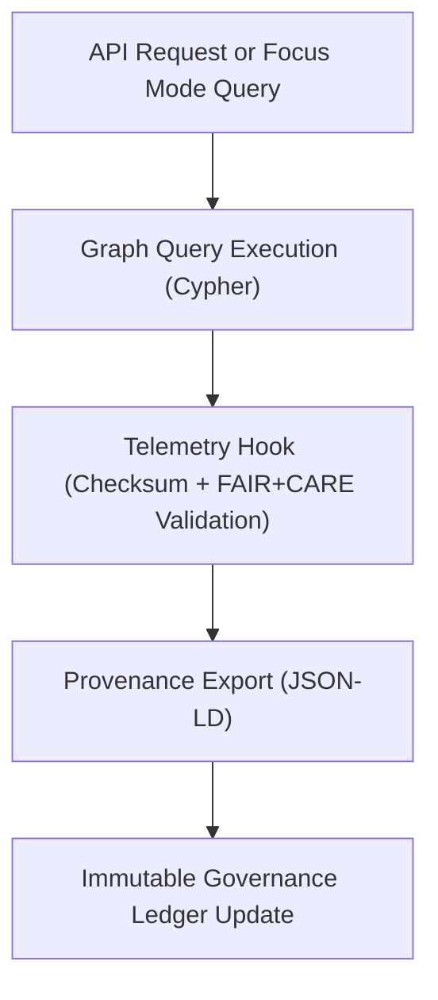

<div align="center">

# 🔎 Kansas Frontier Matrix — **Graph Query Library & Contextual Exploration**
`src/graph/queries/README.md`

**Purpose:** Provides documented Cypher query templates and governance-aware search logic for accessing, analyzing, and contextualizing data within the **Kansas Frontier Matrix Knowledge Graph**.  
Implements FAIR+CARE-compliant provenance handling, ethical reasoning, and explainable Focus Mode contextual analysis via Neo4j.

[](../../../../.github/workflows/graph-validate.yml)  
[](../../../../docs/standards/faircare-validation.md)  
[](../../../../docs/architecture/repo-focus.md)

</div>

---

## 📚 Overview

The **Graph Query Library** enables powerful and transparent access to the Kansas Frontier Matrix Knowledge Graph.  
It includes Cypher templates for entity discovery, relationship tracing, Focus Mode reasoning, and governance-linked provenance queries.

**Core Objectives:**
- 🧩 Standardize reusable Cypher queries for FAIR+CARE-aligned exploration  
- 🧠 Support contextual reasoning for Focus Mode AI integrations  
- ⚖️ Enforce ethics and provenance in all query operations  
- 🧾 Produce transparent, auditable graph outputs for governance validation  
- 🔍 Provide explainable relationships for historical, environmental, and cultural analysis  

---

## 🗂️ Directory Layout

```plaintext
src/graph/queries/
├── README.md                     # This file — query documentation and governance overview
│
├── entity_lookup.cypher          # Query to retrieve entities by ID, name, or ontology type
├── relationships.cypher          # Fetches relationship chains between entities
└── focus_context.cypher          # Provides contextual graph traversal for Focus Mode reasoning
```

---

## ⚙️ Example Queries

### 🧩 Entity Lookup (`entity_lookup.cypher`)
Retrieves detailed information about a specific entity, including provenance and related entities.

```cypher
MATCH (e:Entity {id: $entity_id})
OPTIONAL MATCH (e)-[r]->(related)
RETURN e.id AS id,
       e.name AS name,
       e.type AS type,
       COLLECT(DISTINCT related.name) AS related_entities,
       e.metadata AS metadata,
       e.created_at AS created_at;
```

**Example Output:**
```json
{
  "id": "treaty_1851",
  "name": "Treaty of Fort Laramie (1851)",
  "type": "Historical Treaty",
  "related_entities": ["Sioux Nation", "Cheyenne", "U.S. Government"],
  "metadata": {
    "license": "CC-BY 4.0",
    "provenance_ref": "reports/audit/governance-ledger.json"
  },
  "created_at": "2025-11-02T00:00:00Z"
}
```

---

### 🔗 Relationship Chain Query (`relationships.cypher`)
Fetches a full relationship path between two entities for contextual reasoning.

```cypher
MATCH path = shortestPath((a:Entity {id: $start_id})-[*..6]-(b:Entity {id: $end_id}))
RETURN nodes(path) AS entities, relationships(path) AS relationships, length(path) AS hops;
```

**Example Output:**
```json
{
  "entities": ["Fort Larned", "Santa Fe Trail", "Treaty of Fort Laramie"],
  "relationships": ["LOCATED_NEAR", "INFLUENCED_BY"],
  "hops": 2
}
```

---

### 🧠 Focus Mode Contextual Query (`focus_context.cypher`)
Used by Focus Mode AI to derive contextual and explainable relationships between datasets, places, and events.

```cypher
MATCH (e:Entity {id: $entity_id})-[r:RELATED_TO*1..4]-(context)
WHERE ALL(rel IN r WHERE rel.type <> 'PRIVATE')
WITH e, COLLECT(DISTINCT context) AS contexts
RETURN e.name AS entity, [c IN contexts | c.name] AS related_contexts, COUNT(contexts) AS total_contexts;
```

**Example Output:**
```json
{
  "entity": "Fort Larned",
  "related_contexts": ["Santa Fe Trail", "Kansas River", "Treaty of Fort Laramie"],
  "total_contexts": 3
}
```

---

## 🧩 FAIR+CARE Integration

| Query | FAIR Principle | CARE Principle | Purpose |
|--------|----------------|----------------|----------|
| **Entity Lookup** | Findable / Accessible | Responsibility | Entity metadata retrieval |
| **Relationships** | Interoperable / Reusable | Collective Benefit | Cross-entity relational context |
| **Focus Context** | Transparent / Explainable | Ethics | AI contextual reasoning integration |

All query executions logged under:
```
reports/graph/query-events.json
reports/audit/governance-ledger.json
```

---

## 🔗 Governance & Provenance Workflow



**Workflow Summary:**
1. User or AI initiates graph query through API or Focus Mode.  
2. Query template executes and validates provenance and schema integrity.  
3. Results exported as JSON-LD for semantic traceability.  
4. Query event recorded in Immutable Governance Ledger for auditability.  

---

## 🧠 Provenance & Telemetry Example

```json
{
  "query_id": "focus_context",
  "entity": "fort_larned",
  "query_type": "contextual_reasoning",
  "records_returned": 3,
  "execution_time_ms": 142.6,
  "faircare_alignment": ["Transparency", "Ethics", "Collective Benefit"],
  "checksum_sha256": "a31dfb20c7e34d9e8c1b3a7b5d9f4a2b6d2f24f8a37e7f26d8e98cbbd53b3e8e",
  "timestamp": "2025-11-02T00:00:00Z"
}
```

---

## 🛡️ Security, Integrity & Observability

- **Integrity:** All queries are read-only or require governance approval for writes.  
- **Provenance:** Outputs contain provenance references (`governance_ref`) to audit chains.  
- **Transparency:** FAIR+CARE metadata embedded into results.  
- **Observability:** Telemetry records all graph query events and performance metrics.  

Telemetry Schema:  
`schemas/telemetry/graph-telemetry-v1.json`

Telemetry Outputs:
```
reports/graph/query-events.json
reports/audit/governance-ledger.json
releases/v9.4.0/focus-telemetry.json
```

---

## 🧩 Standards & Compliance Mapping

| Standard | Domain | Implementation |
|-----------|----------|----------------|
| **MCP-DL v6.4.3** | Documentation-driven graph querying | This README + Cypher templates |
| **FAIR+CARE** | Ethical and transparent graph access | Embedded ethics metadata in outputs |
| **CIDOC CRM** | Cultural heritage ontology | Relationship modeling |
| **DCAT 3.0** | Dataset and catalog linkage | Dataset query alignment |
| **ISO 23894** | AI governance and lifecycle transparency | Focus Mode explainability |
| **JSON-LD** | Provenance export and audit traceability | Provenance sync per query |

---

## 🧾 Version History

| Version | Date | Author | Summary |
|----------|------|---------|----------|
| v9.4.0 | 2025-11-02 | @kfm-neo4j | Added query documentation with FAIR+CARE alignment and governance linkage. |
| v9.3.3 | 2025-11-01 | @kfm-data | Enhanced Focus Mode contextual query logic. |
| v9.3.2 | 2025-10-29 | @bartytime4life | Added telemetry schema hooks for query governance. |
| v9.3.1 | 2025-10-27 | @kfm-architecture | Integrated JSON-LD provenance exports for Cypher templates. |
| v9.3.0 | 2025-10-25 | @kfm-neo4j | Established baseline graph query library under MCP-DL v6.4.3. |

---

<div align="center">

**Kansas Frontier Matrix — Ethical Query Framework for Transparent Graph Exploration**  
*“Every query auditable. Every connection explainable. Every insight governed.”* 🔗  
📍 `src/graph/queries/README.md` — FAIR+CARE-certified documentation for graph query templates and contextual reasoning in the Kansas Frontier Matrix.

</div>
