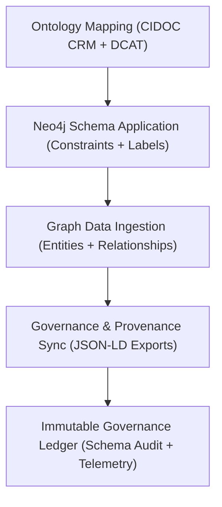

<div align="center">

# 🏗️ Kansas Frontier Matrix — **Knowledge Graph Schema & Ontology Mapping**
`src/graph/schema/README.md`

**Purpose:** Defines the ontological and schema structure of the **Kansas Frontier Matrix Knowledge Graph**, mapping Neo4j labels and relationships to global metadata standards (CIDOC CRM, DCAT 3.0, ISO 19115).  
Ensures FAIR+CARE-aligned governance, interoperability, and semantic traceability across all data entities, relationships, and provenance records.

[](../../../../.github/workflows/graph-validate.yml)  
[](../../../../docs/standards/faircare-validation.md)  
[](../../../../docs/architecture/repo-focus.md)

</div>

---

## 📚 Overview

The **Knowledge Graph Schema** governs how entities, datasets, and AI-generated insights are modeled within the Neo4j graph database.  
Each node, relationship, and property adheres to open ontological standards — allowing Kansas Frontier Matrix data to interoperate with global open-data ecosystems while maintaining FAIR+CARE governance traceability.

**Core Objectives:**
- 🧩 Define ontology mappings between Neo4j schema and global metadata standards  
- ⚖️ Embed FAIR+CARE ethics and provenance rules in graph design  
- 🕸️ Represent cultural, historical, and environmental relationships via CIDOC CRM  
- 🌍 Align all metadata entities with DCAT 3.0 for open data cataloging  
- 🧾 Provide transparent and auditable schema evolution under Immutable Governance Ledger  

---

## 🗂️ Directory Layout

```plaintext
src/graph/schema/
├── README.md                     # This file — ontology and schema governance documentation
│
├── cidoc_crm_mapping.yml         # CIDOC CRM → Neo4j label/property/relationship mapping
├── dcat_alignment.yml            # DCAT 3.0 → Graph metadata mapping for datasets and distributions
└── graph_constraints.cypher      # Neo4j schema constraints (uniqueness, property validation)
```

---

## ⚙️ Ontology Mapping Overview

### 🧠 CIDOC CRM (Cultural Heritage)
Defines event-based relationships between people, places, artifacts, and temporal entities.  
Used for cultural and historical provenance modeling.

**Example:**
```yaml
E21_Person:
  label: Person
  properties:
    name: string
    birth_date: date
    death_date: date
    role: string
  relationships:
    - type: PARTICIPATED_IN
      target: E5_Event
      description: "Participation of a person in a historical event"
```

---

### 🌍 DCAT 3.0 (Data Catalog Vocabulary)
Used for dataset, distribution, and catalog-level metadata representation in FAIR-compliant formats.

**Example:**
```yaml
Dataset:
  label: Dataset
  properties:
    id: string
    title: string
    description: string
    license: string
    temporalCoverage: date_range
  relationships:
    - type: DISTRIBUTED_AS
      target: Distribution
      description: "Link to a DCAT distribution (e.g., STAC asset)"
```

---

### 🧾 Schema Constraints (`graph_constraints.cypher`)
```cypher
CREATE CONSTRAINT entity_id_unique IF NOT EXISTS
FOR (n:Entity) REQUIRE n.id IS UNIQUE;

CREATE CONSTRAINT dataset_id_unique IF NOT EXISTS
FOR (d:Dataset) REQUIRE d.id IS UNIQUE;

CREATE CONSTRAINT node_has_timestamp IF NOT EXISTS
FOR (n:Entity) REQUIRE n.created_at IS NOT NULL;
```

These constraints guarantee graph integrity, prevent duplicate nodes, and ensure all entities carry governance metadata.

---

## 🧩 FAIR+CARE Schema Integration

| Ontology | FAIR Principle | CARE Principle | Purpose |
|-----------|----------------|----------------|----------|
| **CIDOC CRM** | Interoperable / Reusable | Responsibility | Cultural heritage and event linkage |
| **DCAT 3.0** | Findable / Accessible | Collective Benefit | Dataset and catalog-level interoperability |
| **ISO 19115** | Standardized Metadata | Ethics | Geospatial and temporal precision |
| **JSON-LD Provenance** | Transparency / Accountability | Authority | Semantic traceability and ethics validation |

All schema updates recorded in:
```
reports/audit/graph-schema-ledger.json
releases/v9.4.0/focus-telemetry.json
```

---

## 🧩 Schema Governance Workflow



**Workflow Summary:**
1. Ontological mappings defined via YAML configuration files.  
2. Schema applied through Neo4j constraints and Cypher operations.  
3. Data ingested following schema structure and FAIR+CARE metadata rules.  
4. Schema changes logged in governance ledger for full transparency.  

---

## 🧱 Example Node Types

| Label | Description | Ontology Reference |
|--------|--------------|--------------------|
| **Person** | Individual participating in a historical event | CIDOC CRM E21 |
| **Event** | Historical, cultural, or environmental occurrence | CIDOC CRM E5 |
| **Place** | Geospatial or cultural location entity | CIDOC CRM E53 |
| **Dataset** | Digital or archival dataset in open data format | DCAT 3.0 |
| **Distribution** | File or service access metadata | DCAT Distribution |

---

## 🧾 Example Relationship Types

| Type | Source | Target | Description | Ontology |
|------|---------|---------|--------------|-----------|
| `PARTICIPATED_IN` | Person | Event | Participation of a person in an event | CIDOC CRM P14 |
| `OCCURRED_AT` | Event | Place | Association between event and its location | CIDOC CRM P7 |
| `DOCUMENTED_BY` | Event | Dataset | Dataset documenting or describing an event | DCAT 3.0 |
| `RELATED_TO` | Any | Any | Generic cross-entity contextual linkage | FAIR+CARE Semantic Layer |

---

## 🛡️ Security, Provenance & Observability

- **Integrity:** Schema files and mappings signed and checksum-verified via governance ledger.  
- **Provenance:** All schema definitions registered with ontology version and creation timestamp.  
- **Transparency:** FAIR+CARE ethics alignment included in schema metadata.  
- **Observability:** Telemetry logs capture all schema operations for reproducibility.  

Telemetry Schema:  
`schemas/telemetry/graph-telemetry-v1.json`

Telemetry Outputs:
```
reports/graph/schema-events.json
reports/audit/graph-schema-ledger.json
releases/v9.4.0/focus-telemetry.json
```

---

## 🧩 Standards & Compliance Mapping

| Standard | Purpose | Implementation |
|-----------|----------|----------------|
| **MCP-DL v6.4.3** | Documentation-first schema definition | This README + schema files |
| **FAIR+CARE** | Ethical transparency in data modeling | Mapped ethics metadata within schema |
| **CIDOC CRM** | Cultural event and entity ontology | CIDOC to Neo4j mapping |
| **DCAT 3.0** | Dataset catalog interoperability | Dataset relationships |
| **ISO 19115** | Geospatial metadata consistency | Temporal and spatial schema fields |
| **JSON-LD** | Provenance and semantic interoperability | JSON-LD provenance exports |

---

## 🧾 Version History

| Version | Date | Author | Summary |
|----------|------|---------|----------|
| v9.4.0 | 2025-11-02 | @kfm-neo4j | Added schema documentation and ontology mapping with FAIR+CARE integration. |
| v9.3.3 | 2025-11-01 | @kfm-data | Improved CIDOC/DCAT mapping and schema constraint validation. |
| v9.3.2 | 2025-10-29 | @bartytime4life | Added checksum and governance ledger synchronization hooks. |
| v9.3.1 | 2025-10-27 | @kfm-governance | Integrated ethics and provenance metadata tracking. |
| v9.3.0 | 2025-10-25 | @kfm-architecture | Established Knowledge Graph schema base under MCP-DL v6.4.3. |

---

<div align="center">

**Kansas Frontier Matrix — Ethical Ontology Framework for Transparent Knowledge**  
*“Every node traceable. Every link explainable. Every schema accountable.”* 🔗  
📍 `src/graph/schema/README.md` — FAIR+CARE-certified documentation for ontology mappings and schema governance within the Kansas Frontier Matrix Knowledge Graph.

</div>
