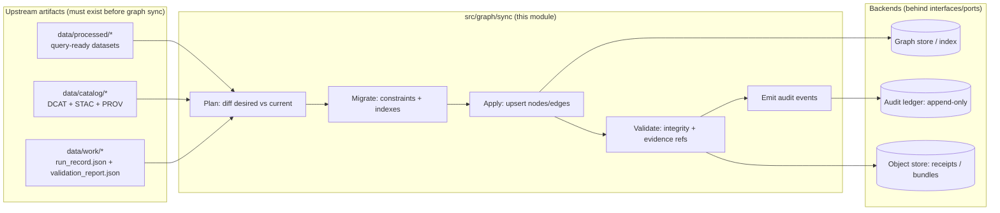

<!--
File: src/graph/sync/README.md

KFM Governed README
- Evidence-first
- Policy-aware (default deny at the trust membrane)
- Provenance-first + audit-logged
-->


<details>
<summary>📛 Optional: enable dynamic GitHub badges (replace <code>&lt;ORG&gt;/&lt;REPO&gt;</code>)</summary>

> These are intentionally **not** enabled by default to avoid broken links in forks/templates.

- CI  
  `https://img.shields.io/github/actions/workflow/status/<ORG>/<REPO>/ci.yml?branch=main`
- Coverage  
  `https://img.shields.io/codecov/c/github/<ORG>/<REPO>`
- Release  
  `https://img.shields.io/github/v/release/<ORG>/<REPO>`
- License  
  `https://img.shields.io/github/license/<ORG>/<REPO>`
- Last commit  
  `https://img.shields.io/github/last-commit/<ORG>/<REPO>`

</details>

# 🔁 Graph Sync

`src/graph/sync/` contains the **governed synchronization engine** that materializes KFM’s **processed + cataloged** artifacts into the **graph index** (e.g., Neo4j/property-graph) in a way that is:

- **Evidence-first** (every claim-bearing node/edge must carry resolvable evidence references)
- **Fail-closed** (promotion/sync aborts if required artifacts are missing/invalid)
- **Idempotent + deterministic** (same inputs ⇒ same graph state)
- **Audited + provenance-linked** (sync emits run receipts + audit records)

> [!IMPORTANT]
> This module is **not** a user-facing API and must **never** be called directly from the frontend.
> All graph reads/writes visible to users go through the governed API boundary (`src/server/`) where
> authentication, policy evaluation, redaction, and audit/provenance logging are enforced.

---

## Table of contents

<details>
<summary>Open</summary>

- [Scope](#scope)
- [Hard requirements (non-negotiable)](#hard-requirements-non-negotiable)
- [Architecture](#architecture)
- [Inputs and outputs](#inputs-and-outputs)
- [Directory layout](#directory-layout)
- [CLI contract](#cli-contract)
- [Configuration](#configuration)
- [Sync modes](#sync-modes)
- [Validation gates](#validation-gates)
- [Audit + provenance outputs](#audit--provenance-outputs)
- [Migrations and schema evolution](#migrations-and-schema-evolution)
- [Testing strategy](#testing-strategy)
- [Observability](#observability)
- [Troubleshooting](#troubleshooting)
- [How to extend](#how-to-extend)
- [Definition of Done](#definition-of-done)
- [References](#references)

</details>

---

## Scope

**In scope (this folder):**

- Planning + applying **graph sync** from governed artifacts
- Running **Cypher migrations** / schema constraints (directly or by delegating to `src/graph/migrations/`)
- Generating **offline import CSVs** (if used) into `data/graph/`
- Writing **run receipts** + **validation reports**
- Emitting **audit events** (append-only ledger) referencing evidence/provenance

**Out of scope (by design):**

- STAC/DCAT/PROV generation (lives under pipelines/tools)
- API boundary + redaction logic (lives under `src/server/`)
- UI/Focus Mode rendering (lives under `web/`)
- Dataset ETL transformations (lives under `src/pipelines/`)

---

## Hard requirements (non-negotiable)

> [!NOTE]
> These are KFM invariants; if you’re changing this module and you must violate one, that change
> requires a governance review and likely a version bump of contracts/schemas.

1. **Canonical pipeline ordering is enforced**  
   ETL → STAC/DCAT/PROV catalogs → Graph → APIs → UI → Story Nodes → Focus Mode.

2. **Fail-closed promotion posture**  
   If required artifacts (catalogs, checksums, receipts, validation reports, policy labels) are missing or invalid,
   **sync must abort** and record an audit event. No partial “best effort” sync is allowed.

3. **Evidence-first graph contract**  
   Any node/edge representing a claim must include resolvable `evidence_refs` such that clients can resolve:
   `prov://`, `stac://`, `dcat://`, `doc://`, `graph://` (through the governed API).

4. **Idempotent upserts**  
   Sync must be safe to re-run. Use deterministic IDs + unique constraints and avoid “create-only” behavior
   that duplicates entities.

5. **No trust-membrane bypass**  
   The graph is an internal index. User access is mediated by the API boundary and policy engine.
   Frontend never reads/writes the graph directly.

---

## Architecture



---

## Inputs and outputs

### Inputs (minimum)

| Input | Where it comes from | Why it matters |
|------|----------------------|----------------|
| Dataset versions + processed artifacts | `data/processed/**` | Provides the **facts** to index |
| Catalogs (DCAT/STAC/PROV) | `data/catalog/**`, `data/stac/**`, `data/prov/**` | Provides **discoverability + lineage** |
| Run record + validation report | `data/work/**` (or pipeline output) | Anchors **reproducibility + promotion gate** |
| Policy labels / sensitivity flags | dataset metadata + policy bundle | Ensures **governance posture** is carried into graph |

### Outputs (minimum)

| Output | Typical location | Notes |
|-------|-------------------|------|
| Graph updates | graph backend | Upserts in transactions / batch jobs |
| Run receipt (graph sync) | `data/work/graph_sync/<run_id>/run_record.json` | Must reference inputs/outputs + hashes |
| Validation report (graph sync) | `data/work/graph_sync/<run_id>/validation_report.json` | Must include pass/fail and details |
| Audit record | audit ledger backend | Append-only event(s) with `audit_ref` + hashes |
| Optional offline import artifacts | `data/graph/csv/**` | If using `neo4j-admin import` or similar |

---

## Directory layout

> [!TIP]
> Keep “graph definitions” and “graph build logic” in canonical locations only:
> - Code: `src/graph/**`
> - Static import artifacts: `data/graph/**`

### This module (recommended structure)

```text
src/graph/
├── README.md                         # graph subsystem overview
└── sync/
    ├── README.md                     # this document
    ├── ports/                        # interfaces: GraphStore, AuditLedger, CatalogReader, PolicyEvaluator
    ├── adapters/                     # infra adapters (Neo4j driver, file IO, Postgres audit client, etc.)
    ├── plan/                         # diffing + deterministic SyncPlan creation
    ├── apply/                        # batched upserts / transactions / rollback strategies
    ├── validate/                     # integrity checks + evidence resolver checks
    ├── cli/                          # CLI entrypoint (optional but recommended)
    └── __tests__/                    # unit + integration tests (ephemeral graph container)
```

### Related canonical paths (cross-subsystem)

```text
data/
└── graph/
    ├── csv/                          # offline import CSV exports (nodes/edges)
    └── cypher/                       # optional post-import scripts / maintenance cypher
```

---

## CLI contract

> [!IMPORTANT]
> This section is a **contract**. Even if the implementation differs (TS/Python/Go),
> keep flags stable so CI/runbooks don’t churn.

### Command shape

```text
kfm graph sync \
  --mode <plan|apply|validate|dry-run|full-rebuild|incremental> \
  --dataset-id <dataset_id|all> \
  --version-id <version_id|latest> \
  --run-id <run_*> \
  --target <graph|csv> \
  --out-dir <path> \
  [--since <ISO-8601>] \
  [--policy-bundle <path|uri>] \
  [--fail-closed true|false]
```

### Exit codes

| Code | Meaning |
|------|---------|
| `0` | Success |
| `2` | Validation failure (expected fail-closed) |
| `3` | Policy denied (fail-closed) |
| `4` | Graph migration failure |
| `5` | Apply failure / transaction failure |
| `6` | Unexpected exception |

### Examples

```bash
# Dry-run: compute plan only (no writes)
kfm graph sync --mode plan --dataset-id all --version-id latest --run-id run_2026-02-14T120000Z --target graph --out-dir data/work/graph_sync/run_2026-02-14T120000Z

# Incremental sync for one dataset
kfm graph sync --mode incremental --dataset-id kansas_historic_counties --version-id latest --run-id run_... --target graph --out-dir data/work/graph_sync/run_...

# Export CSVs (for offline import workflows)
kfm graph sync --mode full-rebuild --dataset-id all --version-id latest --run-id run_... --target csv --out-dir data/graph/csv/run_...
```

---

## Configuration

> [!CAUTION]
> Treat graph credentials and audit-ledger credentials as secrets. Never commit them.

### Environment variables (recommended)

| Variable | Example | Required | Notes |
|---------|---------|----------|------|
| `KFM_GRAPH_URI` | `neo4j+s://localhost:7687` | ✅ | Use TLS in non-dev |
| `KFM_GRAPH_USER` | `neo4j` | ✅ |  |
| `KFM_GRAPH_PASSWORD` | `********` | ✅ |  |
| `KFM_AUDIT_LEDGER_DSN` | `postgres://...` | ⛔/✅ | Required if audit ledger is enabled in this run |
| `KFM_POLICY_BUNDLE` | `policy/bundle.tar.gz` | ⛔/✅ | Required if sync does policy pre-checks |
| `KFM_DATA_ROOT` | `data/` | ⛔ | Defaults to repo `data/` |

---

## Sync modes

| Mode | What it does | When to use |
|------|--------------|-------------|
| `plan` | Builds a `SyncPlan` and writes it to `out-dir` | CI previews, PR reviews |
| `apply` | Applies a previously built plan | Controlled releases |
| `validate` | Runs post-sync integrity checks | Always, and in CI |
| `dry-run` | Full pipeline without writes | Debugging |
| `incremental` | Computes + applies deltas | Routine updates |
| `full-rebuild` | Rebuilds graph from scratch | Schema changes, corruption, new ontology |

> [!TIP]
> Prefer **incremental** for day-to-day updates; require explicit approvals for **full-rebuild**.

---

## Validation gates

Validation is a **product requirement**, not a developer convenience.

### Minimum validation checks

- **Catalog presence:** DCAT/STAC/PROV exist for the dataset version(s)
- **Receipt presence:** run record exists and links to inputs/outputs
- **Checksum integrity:** referenced artifacts exist and hash-match
- **Graph schema integrity:** uniqueness constraints and indexes exist
- **Graph ontology integrity:** no forbidden orphan node types; required relationships exist
- **Evidence resolvability:** all `evidence_refs` resolve via the evidence resolver contract (API layer)

### Suggested integrity queries (examples)

```cypher
// Example: ensure every DatasetVersion has a PROV bundle ref
MATCH (dv:DatasetVersion)
WHERE dv.prov_ref IS NULL
RETURN count(dv) AS missing_prov_refs;

// Example: uniqueness by canonical_id
MATCH (e:Entity)
WITH e.canonical_id AS id, count(*) AS c
WHERE c > 1
RETURN id, c
ORDER BY c DESC;
```

---

## Audit + provenance outputs

### Run record (graph sync)

Write a `run_record.json` for the sync job itself.

```json
{
  "run_id": "run_2026-02-14T120000Z_graph_sync",
  "job_type": "kfm:graph_sync",
  "dataset_id": "all",
  "inputs": [
    {"uri": "data/catalog/dcat/datasets.jsonld", "sha256": "..."},
    {"uri": "data/prov/run_2026-02-14T110000Z.json", "sha256": "..."}
  ],
  "code": {"git_sha": "...", "image": "kfm/graph-sync:..."},
  "outputs": [
    {"uri": "graph://snapshot/run_2026-02-14T120000Z", "sha256": "..."},
    {"uri": "data/work/graph_sync/run_.../validation_report.json", "sha256": "..."}
  ],
  "validation_report": "data/work/graph_sync/run_.../validation_report.json",
  "prov_ref": "prov://bundle/run_2026-02-14T120000Z_graph_sync"
}
```

### Validation report (graph sync)

```json
{
  "run_id": "run_2026-02-14T120000Z_graph_sync",
  "status": "pass|fail",
  "checks": [
    {"id": "catalogs.present", "status": "pass"},
    {"id": "graph.constraints", "status": "pass"},
    {"id": "evidence.resolvable", "status": "fail", "details": {"missing": ["prov://..."]}}
  ],
  "summary": {"errors": 1, "warnings": 0}
}
```

### Audit record (minimum fields)

> [!IMPORTANT]
> Audit records are append-only. Never edit past events; emit a corrective event.

```json
{
  "audit_ref": "audit://graph_sync/run_2026-02-14T120000Z",
  "timestamp": "2026-02-14T12:00:00Z",
  "event_type": "graph.sync.applied",
  "actor": {"service": "graph-sync", "git_sha": "..."},
  "subject": {"dataset_id": "all", "run_id": "run_..."},
  "evidence_refs": ["prov://bundle/run_...", "dcat://dataset/..."],
  "prev_hash": "sha256:...",
  "event_hash": "sha256:..."
}
```

---

## Migrations and schema evolution

Graph schema changes must be explicit, reviewable, and replayable.

### Rules

- Every breaking schema change requires:
  1. A migration script (Cypher) with a monotonic version ID
  2. A rollback or rebuild plan
  3. Updated validation rules + tests
- Never “hot patch” schema in production by hand.

### Suggested migration naming

```text
src/graph/migrations/
  0001_init_constraints.cypher
  0002_datasetversion_unique.cypher
  0003_add_evidence_refs_indexes.cypher
```

---

## Testing strategy

### Unit tests (fast)

- Plan diff correctness (input manifests ⇒ stable `SyncPlan`)
- ID determinism (canonical IDs do not drift)
- Policy pre-check behavior (missing keys ⇒ deny)

### Integration tests (ephemeral graph)

- Spin up a disposable graph store (Docker) and apply:
  - migrations
  - a small fixture dataset
  - validate invariants with Cypher queries

### Contract tests (system-level)

- API queries that depend on graph shape must pass after sync
- Evidence references emitted by sync must be resolvable by the evidence resolver endpoints

> [!TIP]
> Graph sync is only “done” when API contracts still hold.

---

## Observability

Minimum telemetry for each run:

- `run_id`, `dataset_id`, `mode`, `start/end`, `counts` (nodes/edges upserted), `duration_ms`
- `fail_reason` (categorical), `policy_decision_ref` (if applicable)
- Structured logs (JSON), scrub secrets

Recommended metrics:

- `graph_sync_runs_total{status=pass|fail}`
- `graph_sync_apply_duration_seconds`
- `graph_sync_nodes_upserted_total`
- `graph_sync_edges_upserted_total`
- `graph_sync_validation_failures_total{check_id=...}`

---

## Troubleshooting

### “Duplicate nodes / edge explosion”

- Confirm uniqueness constraints exist
- Ensure `MERGE` uses the correct deterministic key(s)
- Re-run `mode=plan` and inspect the plan for repeated creates

### “Policy denied” / fail-closed

- Ensure required policy labels exist on dataset metadata
- Ensure input schema to policy evaluation includes required keys
- Confirm catalogs (DCAT/STAC/PROV) are present and valid

### “Evidence refs not resolvable”

- Confirm the referenced PROV/DCAT/STAC artifacts exist and are addressable
- Confirm the API evidence resolver understands the scheme (`prov://`, etc.)
- Fail the run (do not silently drop evidence refs)

---

## How to extend

### Add a new entity type / relationship

1. Update ontology definition (canonical place for ontology is in `src/graph/` or `docs/standards/` per repo policy)
2. Add a migration (constraints/indexes)
3. Update exporter/upserter mapping (new nodes/edges)
4. Add validation checks (no orphan nodes, required evidence refs)
5. Add/adjust contract tests for API queries
6. Update docs + Story Node / Focus Mode expectations if user-facing

---

## Definition of Done

- [ ] Sync remains **idempotent** (rerun produces no drift)
- [ ] Required artifacts exist (DCAT/STAC/PROV + run record + validation report)
- [ ] Graph schema changes include migrations (+ rollback/rebuild plan)
- [ ] Evidence refs are **resolvable** via API scheme(s)
- [ ] Audit event emitted (append-only) with `event_hash` chain
- [ ] Policy posture preserved (default deny across trust membrane; redaction works)
- [ ] Unit + integration + contract tests updated and passing
- [ ] This README updated if contracts/flags/outputs change

---

## References

- `docs/MASTER_GUIDE_v13.md` (repository structure + subsystem homes)
- `docs/architecture/*` (trust membrane, policy-as-code, provenance requirements)
- `schemas/*` (run record / audit record / catalog schemas)
- `policy/*` (OPA/Rego policy packs and tests)

> [!NOTE]
> If any of the referenced paths differ in your repo, update this section to keep link-checking clean.
