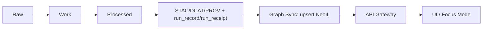
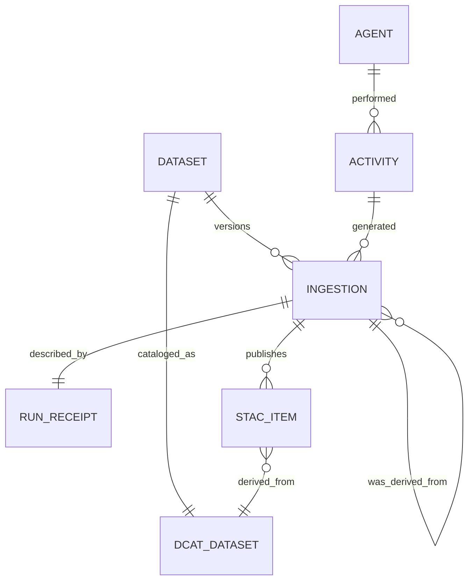
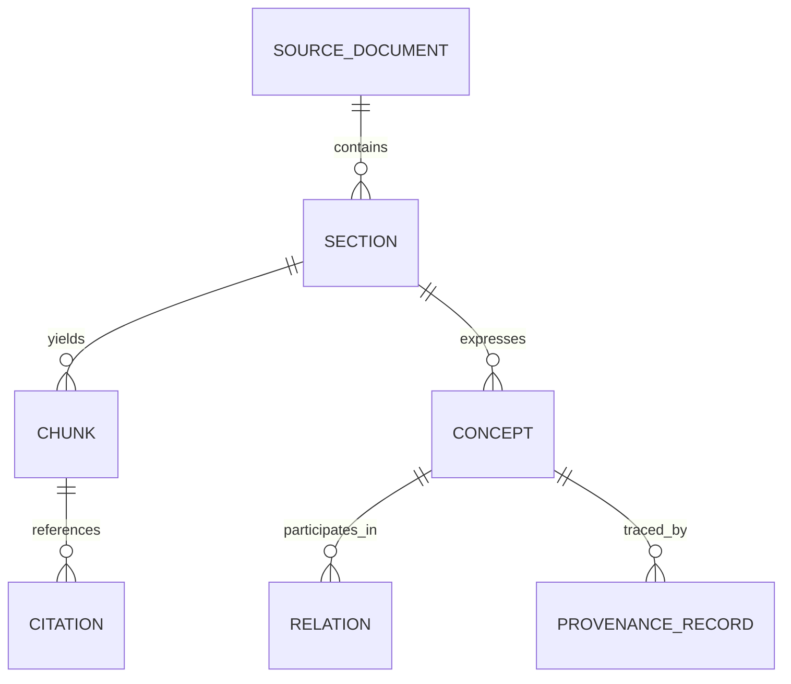

# Graph Sync (`src/graph/sync/`)

> **Purpose:** keep KFM’s Neo4j knowledge graph(s) synchronized with **governed, published** artifacts (processed data + STAC/DCAT/PROV + run receipts + bundles), so the API/UI/Focus Mode can traverse provenance, entities, and concepts **without bypassing governance**.

---

## 📌 Where this fits in KFM (truth path)

KFM’s “truth path” is designed so **raw/work** are never served directly; **processed + catalogs** are what runtime trusts and loads into stores before the API serves anything. Graph Sync lives in the “catalogs → stores” part of that chain. :contentReference[oaicite:0]{index=0}:contentReference[oaicite:1]{index=1}



---

## ✅ Non‑negotiable invariants (governance hard rules)

> [!IMPORTANT]
> These are not “nice-to-haves.” If Graph Sync violates these, KFM’s safety/credibility model breaks.

- **Processed zone is the only publishable source of truth.** Graph Sync must not ingest from raw/work as if it were publishable. :contentReference[oaicite:2]{index=2}
- **Fail‑closed behavior.** Missing required catalogs / invalid schema / missing required provenance must block sync (and, upstream, promotion). :contentReference[oaicite:3]{index=3}:contentReference[oaicite:4]{index=4}
- **Trust membrane is enforced at the API boundary.** Frontend never talks to databases directly; policy is evaluated on requests; backend uses ports and cannot bypass repository interfaces. :contentReference[oaicite:5]{index=5}
- **Sensitivity handling:** if precise locations or culturally restricted knowledge exist, publish a generalized derivative for general audiences and store precise assets under restricted access with separate provenance chains. Graph Sync must preserve that separation and carry classification/policy metadata into the graph. :contentReference[oaicite:6]{index=6}

---

## 🧭 What Graph Sync is responsible for

### Primary responsibilities

1. **Load governed provenance + catalog objects into Neo4j**
   - Minimum viable provenance graph: **Dataset / Ingestion / Activity / Agent** with PROV-aligned relationships and timeline-friendly attributes. :contentReference[oaicite:7]{index=7}
   - Link catalog objects (STAC/DCAT) to the provenance chain (run_id / stac_id / dataset_id). :contentReference[oaicite:8]{index=8}

2. **Maintain idempotent, deterministic upserts**
   - Prevent duplicates by enforcing uniqueness constraints and using stable IDs (details below). :contentReference[oaicite:9]{index=9}

3. **Ensure graph schema + constraints are applied**
   - Constraints/indexes must be applied before loading data; sync should fail fast if schema is not applied.

4. **Write a sync run record (auditability)**
   - Each sync run must be traceable to inputs (catalog refs + artifact digests) and outputs (counts, timestamps), and linked to the originating pipeline run(s).

### Secondary responsibilities (often needed)

- **Support incremental sync** (new/changed datasets only) and **backfills** (rebuild all).
- **Support “dry run” / plan mode** so we can detect what would change before writing.
- **Produce machine-verifiable checks** (expected counts, hash lists) to make CI reliable.

---

## 🚫 What Graph Sync is NOT responsible for

- Running ETL/pipelines that produce processed artifacts (that’s `src/pipelines/…`).
- Serving graph queries to clients (that’s API layer).
- Enforcing request-time authorization (that’s OPA + API gateway).
- Replacing the “evidence resolver” endpoints that make citations resolvable (separate module).

---

## 🗃️ Inputs and outputs

| Category | Input | Required? | Produced by | Used for |
|---|---|---:|---|---|
| Processed artifacts | GeoParquet/COG/media (by reference) | ✅ | pipeline promotion | graph nodes link to evidence bundles/assets |
| Catalogs | STAC Items/Collections | ✅ | promotion job | dataset-layer metadata + evidence links |
| Catalogs | DCAT dataset entry | ✅ | promotion job | dataset catalog metadata |
| Provenance | PROV bundle(s) | ✅ | pipeline + promotion | lineage + “how produced” chain |
| Run metadata | run_record / run_receipt | ✅ | pipeline | deterministic IDs + replay + audit trail |
| Supply chain | SBOM / attestation refs | ⛳ recommended | build/release | trust + reproducibility gates |

> [!NOTE]
> “data/graph/csv” + “data/graph/cypher” export locations are part of the documented repo layout expectations (if implemented in this repo). :contentReference[oaicite:10]{index=10}

---

## 🧩 The graph(s) we sync (two subgraphs)

KFM uses graphs for **runtime provenance/knowledge** and also for **document/concept extraction** supporting Focus Mode retrieval. :contentReference[oaicite:11]{index=11}

### A) Provenance + Catalog Graph (runtime “truth graph”)

Minimum viable ER model (from KFM New Ideas integration report): :contentReference[oaicite:12]{index=12}



**Recommended relationship naming (align with integration report “I‑12”):**  
`(Agent)-[:PERFORMED]->(Activity)-[:GENERATED]->(Ingestion)-[:VERSIONS]->(Dataset)` :contentReference[oaicite:13]{index=13}

### B) Extraction Graph (docs → sections → chunks → concepts → relations)

This supports Focus Mode / concept catalog retrieval and is described as a canonical extraction graph. :contentReference[oaicite:14]{index=14}



> [!WARNING]
> If this repo currently only syncs the provenance graph (and not extraction), keep the schema sections but mark the extraction graph as “planned” rather than deleting it. Deleting it tends to create “missing aspects” later when Focus Mode integration begins.

---

## 🆔 Identity + determinism requirements

### Stable IDs (must not drift)

Graph Sync must treat these as **primary identifiers**:

- `dataset_id` (canonical dataset identifier)
- `ingestion_id` (dataset version/ingestion identifier)
- `run_id` (pipeline run record / receipt identifier)
- `stac_id` (STAC Item/Collection IDs)
- `artifact_digest` / `sha256` digests for content addressing

### `spec_hash` definition (avoid incomparable hashes)

The integration report flags a gap where `spec_hash` semantics vary. Recommendation: define  
`spec_hash = sha256(JCS(spec))` and carry `spec_schema_id` + `spec_recipe_version`. :contentReference[oaicite:15]{index=15}

> [!IMPORTANT]
> Graph Sync must **not** compute ad-hoc hashes. It should only ingest/propagate `spec_hash` generated by the governed pipeline step, and validate that required fields exist.

---

## 🧱 Schema and constraints (Neo4j)

> [!NOTE]
> Exact labels/constraints are **(not confirmed in repo)**. The pattern below is the minimum to prevent duplicates and brittle queries, aligning with the integration report’s normalization concerns. :contentReference[oaicite:16]{index=16}

### Required uniqueness constraints (minimum)

- `(:Dataset {dataset_id})` unique
- `(:Ingestion {ingestion_id})` unique
- `(:RunReceipt {run_id})` unique
- `(:StacItem {stac_id})` unique (or `id` per STAC)
- `(:DcatDataset {dataset_id})` unique (or `dcat_uri`)

### Required indexes (minimum)

- `Ingestion.at` (timeline)
- `Activity.startedAt / endedAt` (timeline)
- `Dataset.classification` / sensitivity tags (policy filters)

---

## 🔁 Sync strategies

Graph Sync typically supports two modes:

1. **Online upsert (transactional)**
   - Uses Neo4j driver / Bolt; merges nodes by stable IDs; writes relationships.
   - Best for: incremental daily syncs, small-medium batches.

2. **Offline bulk load (CSV + import)**
   - Emits `data/graph/csv/` and optional `data/graph/cypher/` scripts for constraints and post-load steps (if the repo implements this pattern). :contentReference[oaicite:17]{index=17}
   - Best for: initial graph builds and large backfills.

> [!IMPORTANT]
> Either mode must remain **idempotent** and **replayable**: re-running with the same inputs should not create duplicates or drift.

---

## 🧪 “Fail‑closed” rules enforced by Graph Sync

Graph Sync must refuse to write if:

- required catalogs are missing (STAC/DCAT/PROV)
- run record/receipt is missing required digests
- classification/sensitivity metadata is missing for publishable datasets
- constraints are not applied (risk of duplicates)
- input schemas do not validate (schema drift)

This matches KFM’s pipeline flow expectations where promotion is blocked on failures and evidence is produced before exposure. :contentReference[oaicite:18]{index=18}:contentReference[oaicite:19]{index=19}

---

## 🛡️ Sensitivity handling in the graph

From the KFM‑NG sensitivity pattern: publish generalized data for public, store precise under restricted access, with separate provenance chains. :contentReference[oaicite:20]{index=20}

**Graph Sync requirements:**

- Store **classification** and **policy tags** on Dataset/Ingestion nodes.
- Do **not** attach precise geometry blobs directly to public graph nodes.
- Prefer linking to **bundle/evidence references** (digest-addressed), and rely on the API+OPA “trust membrane” for access control. :contentReference[oaicite:21]{index=21}

---

## ▶️ Running Graph Sync

> [!WARNING]
> Exact commands/entrypoints are **(not confirmed in repo)**. Keep this section updated to match the implementation once confirmed.

### Local development (expected baseline)

The blueprint describes local dev via Docker Compose with `api/web/postgis/neo4j/opensearch/opa`. :contentReference[oaicite:22]{index=22}

```bash
cp .env.example .env
docker compose up --build
```

### Typical sync invocation patterns

#### Incremental sync (recommended default)
```bash
# Example shape (verify flags/paths in repo):
kfm graph sync \
  --catalog-root data/catalog \
  --processed-root data/**/processed \
  --neo4j-uri bolt://localhost:7687 \
  --neo4j-database neo4j \
  --mode incremental
```

#### Full rebuild / backfill
```bash
kfm graph sync --mode rebuild --from-scratch
```

#### Dry run / plan
```bash
kfm graph sync --dry-run --mode incremental
```

---

## ⚙️ Configuration

> [!NOTE]
> Names/keys are **(not confirmed in repo)**. If implementation differs, update this table instead of deleting it.

| Variable | Example | Why it exists |
|---|---|---|
| `NEO4J_URI` | `bolt://neo4j:7687` | connection |
| `NEO4J_USER` | `neo4j` | auth |
| `NEO4J_PASSWORD` | `…` | auth |
| `NEO4J_DATABASE` | `neo4j` | multi-db support |
| `KFM_CATALOG_ROOT` | `data/catalog` | where STAC/DCAT/PROV live |
| `KFM_PROCESSED_ROOT` | `data/**/processed` | artifact refs |
| `KFM_SYNC_MODE` | `incremental|rebuild|export` | behavior |
| `KFM_SYNC_BATCH_SIZE` | `1000` | performance/backpressure |
| `KFM_SYNC_CONCURRENCY` | `4` | parallelism (must remain safe) |

---

## 📈 Observability (logs, metrics, traces)

Minimum required signals:

- `sync_run_id` (unique ID per sync run)
- counts: nodes/edges upserted, datasets processed, skipped, failed
- latency per dataset/ingestion
- Neo4j retry counts / transient errors
- validation failures (schema IDs + file paths)

> [!TIP]
> Always include `run_id` / `ingestion_id` / `dataset_id` in log context so incidents can be traced back to a specific provenance chain.

---

## 🧯 Troubleshooting + recovery runbook

### Common failures and what to do

<details>
<summary><strong>Missing STAC/DCAT/PROV for a dataset</strong></summary>

**Expected behavior:** Graph Sync fails closed.

**Fix:** run (or re-run) the promotion/catalog generation step to produce valid STAC/DCAT/PROV, then re-run sync. Promotion itself should be blocked until catalogs validate. :contentReference[oaicite:23]{index=23}

</details>

<details>
<summary><strong>Duplicate nodes (uniqueness violations / no constraints)</strong></summary>

**Expected behavior:** sync refuses to run if constraints are missing.

**Fix:** apply schema migration (constraints + indexes), then re-run. See “Schema and constraints” above. :contentReference[oaicite:24]{index=24}

</details>

<details>
<summary><strong>Sensitivity metadata missing</strong></summary>

**Expected behavior:** fail closed (don’t publish/sync ambiguous sensitivity).

**Fix:** update dataset metadata/policy tags in the upstream governed artifacts; regenerate catalogs; re-run.

</details>

### Recovery principles

- **Idempotent:** safe to re-run after fixing the cause.
- **Checkpointed:** long rebuilds should be resumable (dataset-by-dataset commits).
- **No silent partial success:** if a dataset fails, report it clearly and fail the run unless running in a documented “best-effort” mode (not recommended for production).

---

## ✅ Tests + CI gates

Graph Sync changes must come with tests.

### Unit tests (required)
- ID generation / normalization (dataset_id, ingestion_id, stac_id mapping)
- PROV/DCAT/STAC parsing + validation
- mapping functions to graph node/edge DTOs

### Integration tests (required)
- Neo4j upsert behavior with constraints enabled
- Incremental update: re-run same input → no duplicates
- “Delete/tombstone” behavior (if supported)

### Contract tests (recommended)
- “Catalog → graph schema” contract snapshot (labels, required props)
- “Evidence refs resolvable” contract (prov://, stac://, dcat:// expectations) :contentReference[oaicite:25]{index=25}

### CI “Definition of Done” for a PR touching this module

- [ ] Schema migrations reviewed (constraints/indexes)
- [ ] Unit tests added/updated
- [ ] Integration tests pass against ephemeral Neo4j
- [ ] Deterministic IDs validated (no drift)
- [ ] Fail-closed behavior preserved
- [ ] Sensitivity rules preserved (no precise geometry leaks)
- [ ] README updated (this file) if behavior/flags change

---

## 🗂️ Expected directory layout (this folder)

> [!NOTE]
> **(not confirmed in repo)** — fill in with actual filenames once verified, but keep the categories.

| Path | What lives here |
|---|---|
| `src/graph/sync/` | sync orchestration / entrypoints |
| `src/graph/sync/mappers/` | STAC/DCAT/PROV → graph DTO mapping |
| `src/graph/sync/schema/` | constraints/index definitions + migrations |
| `src/graph/sync/ports/` | interfaces (catalog reader, graph writer, run ledger) |
| `src/graph/sync/adapters/` | Neo4j adapter, filesystem/catalog adapters |
| `src/graph/sync/tests/` | unit + integration tests |

---

## 📚 References (governed)

- **KFM Next‑Gen Blueprint & Primary Guide (draft, 2026‑02‑12)** — architecture invariants (trust membrane, processed-only publishable truth), policy fail-closed patterns, knowledge layer (graph + extraction graph). :contentReference[oaicite:26]{index=26}:contentReference[oaicite:27]{index=27}
- **KFM Integration Report for KFM New Ideas (2026‑02‑08)** — end-to-end fail-closed lifecycle with “Load graph: Dataset/Ingestion/Activity/Agent”, plus graph schema recommendations and spec_hash normalization. :contentReference[oaicite:28]{index=28}:contentReference[oaicite:29]{index=29}
- **Repo layout expectations** (docs guide) — `src/graph/` is “graph build code (ontology bindings, ingest scripts, constraints)” and `data/graph/{csv,cypher}` are suggested export locations. :contentReference[oaicite:30]{index=30}

---

