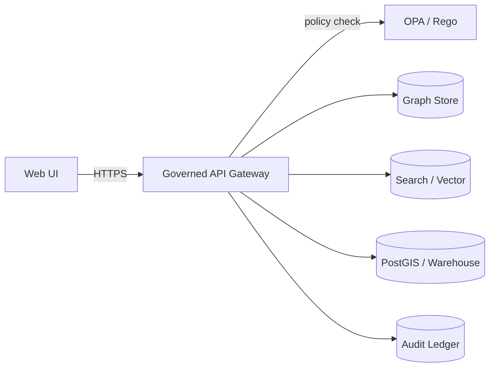

# Graph Tests — `src/graph/tests`


> [!IMPORTANT]
> This folder contains **governed** tests for KFM’s Knowledge Layer (**Graph + provenance/evidence wiring**).
>
> These tests protect KFM’s credibility guarantees:
> - **Evidence-first** behavior (no ungrounded claims)
> - **Citations are resolvable** (evidence views can be reached from citation references)
> - **Policy fails closed** (default deny; only allow when requirements are satisfied)
> - **Sensitivity & redaction** behavior is enforced (no accidental disclosure)
>
> If you change graph semantics, schema constraints, or evidence resolution behavior, you must update (a) tests, (b) any relevant schemas/contracts, and (c) governance notes / ADRs.

---

## Contents

- [What this test suite covers](#what-this-test-suite-covers)
- [What this test suite does not cover](#what-this-test-suite-does-not-cover)
- [Architecture and trust boundaries](#architecture-and-trust-boundaries)
- [Directory layout](#directory-layout)
- [Test taxonomy and when to use which suite](#test-taxonomy-and-when-to-use-which-suite)
- [Running tests locally](#running-tests-locally)
  - [1) Identify the repo test runner](#1-identify-the-repo-test-runner)
  - [2) Bring up dependencies (Neo4j, OPA, etc)](#2-bring-up-dependencies-neo4j-opa-etc)
  - [3) Run the suites](#3-run-the-suites)
- [Fixtures and golden data](#fixtures-and-golden-data)
- [How to add a new test](#how-to-add-a-new-test)
- [Governance and sensitivity rules for tests](#governance-and-sensitivity-rules-for-tests)
- [CI gates and acceptance criteria](#ci-gates-and-acceptance-criteria)
- [Troubleshooting](#troubleshooting)
- [References](#references)

---

## What this test suite covers

This suite is responsible for verifying **graph-level correctness** and **graph-linked governance invariants**, including:

### Graph schema & integrity
- Uniqueness/identity rules (e.g., avoiding duplicate upserts)
- Relationship cardinalities and required edges
- Index/constraint expectations for stable querying
- Compatibility mappings to external identifiers (e.g., STAC/DCAT IDs → graph IDs)

### Evidence & provenance wiring
- Canonical “extraction graph” structure: documents → sections → chunks → concepts → relations → citations → provenance records
- Evidence resolver behavior:
  - A citation reference can be resolved to a human-readable evidence view
  - Provenance references are stable and traceable
- Audit-related references are preserved where applicable (e.g., audit_ref linkability)

### Policy and sensitivity invariants (graph-relevant)
- Data access policies are **default deny**
- “Cite-or-abstain” gate behavior is enforced for any generated answer artifact that depends on graph evidence
- Sensitive data handling is correct:
  - restricted/precise assets are **not returned** unless policy grants access
  - public/generalized substitutes are used where required

> [!NOTE]
> Some of the above are cross-cutting system properties. This folder focuses on the **graph-side** responsibilities:
> schema correctness, provenance edges, evidence resolver data, and policy integration hooks.

---

## What this test suite does not cover

- Full end-to-end UI workflows (Playwright/Cypress/etc) unless explicitly colocated by project convention.
- Pipeline promotion and catalog validators (STAC/DCAT/PROV) unless graph tests need them as fixtures.
- Performance benchmarking at scale (that belongs in dedicated perf harnesses and nightly jobs).

---

## Architecture and trust boundaries

KFM is structured around a governed API boundary (**trust membrane**) and a provenance-first knowledge layer.

### System trust membrane (simplified)



**Testing implications for this folder:**
- Graph reads/writes must be testable **through the governed interfaces** (ports/adapters), not via UI shortcuts.
- Policy checks must be exercised where graph-driven responses are surfaced to clients.
- Evidence references returned by graph functionality must be resolvable (not “orphan refs”).

### Clean-layer expectations (graph module)

KFM uses a layered architecture (Domain → Use Cases → Ports/Adapters → Infrastructure). Tests should mirror this:

```mermaid
flowchart TB
  D[Domain\n(pure models, invariants)] --> U[Use Cases\n(workflows)]
  U --> P[Ports\n(interfaces/contracts)]
  P --> A[Adapters\n(Neo4j, search, etc)]
  A --> I[Infrastructure\n(drivers, config, containers)]
```

---

## Directory layout

> [!TIP]
> If the current repository layout differs, keep this README but map “unit/integration/contract/policy” to the nearest existing convention.

Recommended structure (add folders as needed):

```text
src/graph/tests/
├── README.md
├── unit/                 # Pure logic: schema helpers, ID rules, mappers
├── usecases/             # Use-case tests with mocked ports
├── integration/          # Neo4j-backed tests (constraints, queries, upserts)
├── contract/             # API/DTO/schema contract tests for evidence resolution
├── policy/               # OPA/Rego tests or policy integration harnesses
├── regression/           # “golden set” tests (stable expected outputs)
├── fixtures/             # Small, deterministic fixture graphs + docs/chunks
├── goldens/              # Versioned golden outputs (JSON/MD) used by regression tests
└── helpers/              # Test utilities (db reset, factories, snapshot helpers)
```

---

## Test taxonomy and when to use which suite

| Suite | Purpose | Should touch Neo4j? | Runtime | Typical CI trigger |
|---|---|---:|---:|---|
| **unit** | Pure functions & invariants (IDs, mapping, parsing, validation) | No | fast | every PR |
| **usecases** | Workflow behavior (ports mocked) | No (mock ports) | fast–medium | every PR |
| **integration** | Real graph store behavior (constraints, queries, upserts) | Yes | medium | every PR (or nightly if heavy) |
| **contract** | Governed API contracts, schema stability, evidence resolver DTOs | Not required | fast–medium | every PR |
| **policy** | OPA/Rego unit tests or policy integration checks | Not required | fast | every PR |
| **regression** | Catch behavioral drift (golden set) | optional | medium | every PR + nightly |
| **perf** *(optional)* | Latency/throughput checks | Yes | slow | nightly / manual |

---

## Running tests locally

### 1) Identify the repo test runner

This repository may use one or more of the following (verify in repo root):

- **Python**: `pytest` (common with FastAPI backends)
- **Node/TS**: `jest` / `vitest`
- **Go**: `go test`

Minimal verification steps:

```bash
# From repo root:
ls -1 pyproject.toml pytest.ini requirements*.txt package.json pnpm-lock.yaml yarn.lock go.mod Makefile 2>/dev/null
```

> [!NOTE]
> This README intentionally documents *what to run* and *what must be true*.
> The exact command wrappers (Make targets, scripts/, task runners) are repo-specific.

---

### 2) Bring up dependencies (Neo4j, OPA, etc)

Integration tests typically require a disposable Neo4j instance (and sometimes OPA and Postgres).

Recommended approach: run everything with containers, *never* against a shared/prod database.

```bash
# Example pattern (adjust to the repo's compose file name/services):
docker compose up -d neo4j opa postgres
```

#### Common environment variables (adjust to your repo)

| Variable | Used for | Example |
|---|---|---|
| `NEO4J_URI` | Neo4j Bolt URI | `bolt://localhost:7687` |
| `NEO4J_USER` | Neo4j username | `neo4j` |
| `NEO4J_PASSWORD` | Neo4j password | `test_password` |
| `OPA_URL` | OPA base URL | `http://localhost:8181` |
| `KFM_ENV` | Test environment selector | `test` |

> [!WARNING]
> Never hardcode real credentials or private endpoints into tests. Use `.env.test` / CI secrets.

---

### 3) Run the suites

Below are **common** invocations. Use the one that matches this repo.

#### Python (pytest)

```bash
# run everything in this folder
pytest -q src/graph/tests

# run a subset
pytest -q src/graph/tests/unit
pytest -q src/graph/tests/integration -k neo4j

# run a single test
pytest -svv src/graph/tests/integration/test_schema_constraints.py::test_uniqueness_constraints
```

#### Node/TypeScript (jest/vitest)

```bash
# examples only — use the repo's scripts in package.json
npm test -- src/graph/tests
pnpm test -- src/graph/tests
yarn test src/graph/tests
```

#### Go

```bash
# examples only
go test ./src/graph/... -run TestName
```

---

## Fixtures and golden data

### Fixture principles
- **Small & deterministic**: keep fixtures minimal; no random ordering dependencies.
- **No sensitive data**: fixtures must not contain precise locations, PII, or culturally restricted information.
- **Provenance-complete**: fixture nodes/edges should include the minimal provenance fields required for evidence UX.

### Recommended fixture types
- **Graph fixtures**:
  - Cypher seed files (`.cypher`) OR
  - JSON fixtures representing nodes/edges OR
  - Factory builders that create canonical mini-graphs
- **Document fixtures**:
  - Minimal markdown/plaintext that yields predictable sections/chunks/concepts
- **Golden outputs**:
  - Versioned snapshots (JSON/Markdown) that assert stable behavior

> [!TIP]
> Prefer fixtures that represent the canonical extraction graph:
> `SOURCE_DOCUMENT → SECTION → CHUNK → (CONCEPT/RELATION) → CITATION → PROVENANCE_RECORD`.

---

## How to add a new test

### Step-by-step checklist

- [ ] Pick the **right suite** (`unit/`, `integration/`, `contract/`, `policy/`, `regression/`).
- [ ] Use deterministic fixtures (or add new ones under `fixtures/`).
- [ ] Assert **identity stability** (IDs are stable; no duplicates after upsert).
- [ ] Assert **provenance wiring** (required refs exist; evidence spans/locators are present).
- [ ] Assert **policy behavior** (deny-by-default; only allow under correct inputs).
- [ ] Add/refresh golden outputs if you changed stable behavior (`goldens/`).
- [ ] If you changed a contract/schema, update:
  - schema files (if any),
  - contract tests,
  - and any relevant docs/ADRs.

### Test naming conventions (recommended)
- File name describes behavior: `test_<behavior>.py` / `<behavior>.test.ts`
- Test name describes guarantee: `test_upsert_is_idempotent`, `test_citation_ref_resolves`

### Minimal skeleton (language-agnostic)

```text
Arrange: build a minimal fixture graph + inputs (IDs, refs, policy context)
Act:     call the graph port/use-case function
Assert:  verify (1) outputs, (2) stored graph structure, (3) references & provenance, (4) policy outcome
```

---

## Governance and sensitivity rules for tests

> [!IMPORTANT]
> Tests are part of governance. A passing test suite is a promise about system behavior.

### Rules
- **Default deny**: policy checks must fail closed when required inputs are missing.
- **Cite-or-abstain**: any answer-like output must either include citations or explicitly abstain.
- **No precise geometry without grant**: restricted/precise records must never be returned unless access is granted.
- **No secret leakage**: tests must not log secrets; redact tokens and credentials in failure output.

### Sensitive fixture handling
If you need to model “restricted vs generalized” data:
- Create *two* fixture variants:
  - `public/generalized` (safe for tests and CI logs)
  - `restricted/precise` (synthetic, not real; gated behind policy allow)

---

## CI gates and acceptance criteria

This folder supports CI gates that protect KFM’s core guarantees.

### Acceptance criteria protected here
- Evidence references are resolvable:
  - A citation reference returned to clients must resolve to a human-readable evidence view.
- Graph schema is normalized enough to prevent brittle queries and duplicate upserts:
  - uniqueness constraints + stable identifier mapping.
- Policy behavior is enforceable and testable:
  - default deny; allow only when requirements are satisfied.

### Suggested CI split (pattern)
- **Fast PR gate**: unit + contract + policy tests
- **PR gate**: add integration tests with disposable Neo4j
- **Nightly**: perf + large regression sets (if needed)

Example policy test invocation (OPA):

```bash
opa test policy -v
```

> [!NOTE]
> The repo’s CI may also run separate validators for governed Markdown, Story Nodes, and STAC/DCAT/PROV catalogs.

---

## Troubleshooting

### “Neo4j connection refused”
- Verify the container is up and ports are exposed (`7474` http, `7687` bolt by default).
- Verify `NEO4J_URI` points to Bolt (usually `bolt://...:7687`).
- Check container logs:

```bash
docker compose logs -n 200 neo4j
```

### “Tests are flaky”
- Ensure tests do not share state:
  - wipe graph between tests or run each test in a transaction that rolls back
- Freeze time and random seeds where relevant
- Avoid depending on traversal ordering unless explicitly sorted

### “Constraint already exists / duplicate key errors”
- Make sure integration tests reset the database, then (re)apply schema once per test session.
- Prefer idempotent schema setup steps.

---

## References

These are the governing design references that inform what *must* be tested (names shown without repo paths to avoid broken links):

- **KFM Next-Gen Blueprint and Primary Guide** (Knowledge Layer: Graph + Extraction Graph; Policy-as-Code; CI gates; Testing Strategy)
- **KFM Integration Report (New Ideas 2-8-26)** (graph schema normalization, uniqueness constraints, sensitive-record enforcement test expectations)
- **KFM Comprehensive Guide / Focus Mode docs** (evidence UX and citation resolvability requirements)

---

<details>
<summary>📌 Repo-specific placeholders to confirm (do once per repo)</summary>

- [ ] Confirm the canonical test runner(s): `pytest`, `jest/vitest`, `go test`, etc.
- [ ] Confirm service orchestration: `docker compose`, `podman compose`, testcontainers, etc.
- [ ] Confirm env var names (`NEO4J_URI`, `OPA_URL`, etc.) from `.env.example` / config.
- [ ] Confirm how schema migrations are applied in tests (migrate tool, bootstrap script, etc.).
- [ ] Confirm where OpenAPI/JSON schemas live (for contract tests).
- [ ] Confirm where OPA policies live (e.g., `policy/` at repo root).

</details>

