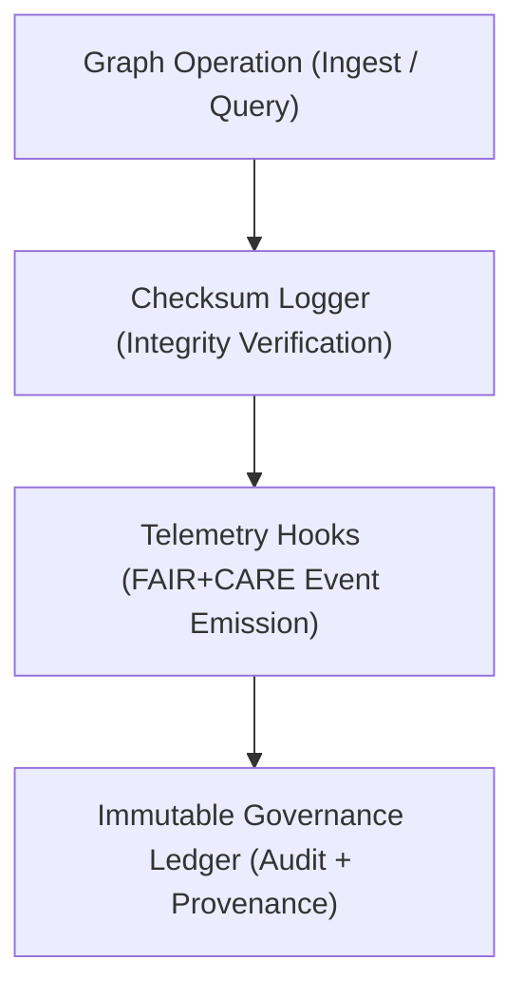

<div align="center">

# 🧰 Kansas Frontier Matrix — **Graph Utilities & Telemetry Hooks**
`src/graph/utils/README.md`

**Purpose:** Provides Neo4j utility tools for graph connection management, checksum verification, and telemetry emission within the **Kansas Frontier Matrix Knowledge Graph**.  
Implements FAIR+CARE-aligned provenance tracking, audit synchronization, and governance logging to ensure all graph operations are transparent, secure, and verifiable.

[](../../../../.github/workflows/graph-utils.yml)  
[](../../../../docs/standards/faircare-validation.md)  
[](../../../../docs/architecture/repo-focus.md)

</div>

---

## 📚 Overview

The **Graph Utilities Module** supports all ingestion, query, and provenance functions within the Neo4j-based Knowledge Graph.  
These utilities ensure ethical, reproducible, and governed graph operations by embedding checksum verification, telemetry broadcasting, and governance ledger synchronization.

**Core Objectives:**
- 🔗 Manage Neo4j graph sessions and secure connection pools  
- 🧮 Verify integrity of graph operations via checksum signatures  
- ⚖️ Emit telemetry events for FAIR+CARE compliance and governance audits  
- 🧾 Log provenance updates to the Immutable Governance Ledger  
- 🌐 Support JSON-LD and CIDOC CRM alignment for metadata interoperability  

---

## 🗂️ Directory Layout

```plaintext
src/graph/utils/
├── README.md                     # This file — documentation for graph utilities and governance integration
│
├── graph_connector.py            # Neo4j connection manager and query session handler
├── checksum_logger.py            # Generates and validates SHA-256 checksums for graph operations
└── telemetry_hooks.py            # Emits telemetry and FAIR+CARE governance events for lineage logging
```

---

## ⚙️ Example Workflows

### 🧩 Connect to Graph
```python
from src.graph.utils.graph_connector import connect_to_graph

session = connect_to_graph(uri="neo4j://localhost:7687", user="neo4j", password="secure_pass")
result = session.run("MATCH (n) RETURN COUNT(n) AS node_count;")
print(result.single()["node_count"])
```

---

### 🧮 Generate Checksum Log
```python
from src.graph.utils.checksum_logger import log_checksum

log_checksum(file_path="data/processed/entities.csv", report="reports/graph/checksum-log.json")
```

**Checksum Output Example:**
```json
{
  "file_path": "data/processed/entities.csv",
  "checksum_sha256": "d54b9e9a51b1e8e872c14a18ff21a17fdb05e21e0fa4c3922a49ac69b47b5d8a",
  "verified": true,
  "timestamp": "2025-11-02T00:00:00Z"
}
```

---

### 📡 Emit Telemetry Event
```python
from src.graph.utils.telemetry_hooks import emit_telemetry

emit_telemetry(
    action="relationship_created",
    entity="treaty_1851",
    ethics_score=0.98,
    governance_hash="a5b9e1f4c7d6b8e2e123f91a7c9f6a22b73d45cc91e112b2b1f87e4d62a43df0"
)
```

**Telemetry Example:**
```json
{
  "action": "relationship_created",
  "entity": "treaty_1851",
  "ethics_score": 0.98,
  "checksum_verified": true,
  "governance_hash": "a5b9e1f4c7d6b8e2e123f91a7c9f6a22b73d45cc91e112b2b1f87e4d62a43df0",
  "timestamp": "2025-11-02T00:00:00Z"
}
```

---

## 🧩 FAIR+CARE Integration

| Utility | FAIR Principle | CARE Principle | Output |
|----------|----------------|----------------|---------|
| **Graph Connector** | Accessible / Reusable | Responsibility | Secure session with metadata traceability |
| **Checksum Logger** | Findable / Accountable | Authority | Integrity verification and provenance log |
| **Telemetry Hooks** | Transparent / Explainable | Ethics | Governance event logging and compliance tracking |

Governance synchronization ensures:
```
reports/audit/governance-ledger.json
releases/v9.4.0/focus-telemetry.json
```

---

## 🔗 Governance & Provenance Workflow



**Workflow Summary:**
1. Graph operation initiated (e.g., entity insertion or query execution).  
2. Checksum validation performed and logged for integrity assurance.  
3. Telemetry event emitted with FAIR+CARE compliance metadata.  
4. Immutable Governance Ledger updated for transparent lineage traceability.  

---

## 🛡️ Security, Integrity & Observability

- **Integrity:** Every graph transaction validated by checksum logs.  
- **Provenance:** Telemetry includes source, timestamp, and governance references.  
- **Reproducibility:** Utilities ensure consistent and auditable operations.  
- **Transparency:** FAIR+CARE-aligned telemetry included in every event report.  

Telemetry Schema:  
`schemas/telemetry/graph-telemetry-v1.json`

Telemetry Outputs:
```
reports/graph/utils-events.json
reports/audit/governance-ledger.json
releases/v9.4.0/focus-telemetry.json
```

---

## 🧩 Standards & Compliance Mapping

| Standard | Domain | Implementation |
|-----------|----------|----------------|
| **MCP-DL v6.4.3** | Documentation-first graph utility governance | This README + utility scripts |
| **FAIR+CARE** | Ethical operation traceability | Telemetry and checksum hooks |
| **ISO 23894** | AI lifecycle and data lineage | Telemetry-driven provenance |
| **DCAT / CIDOC CRM** | Semantic interoperability | Provenance data exchange |
| **JSON-LD** | Metadata and lineage structure | Telemetry payload schema |

---

## 🧾 Version History

| Version | Date | Author | Summary |
|----------|------|---------|----------|
| v9.4.0 | 2025-11-02 | @kfm-neo4j | Added checksum, telemetry, and governance integration documentation. |
| v9.3.3 | 2025-11-01 | @kfm-data | Enhanced telemetry hooks for graph ingestion and query tracking. |
| v9.3.2 | 2025-10-29 | @bartytime4life | Integrated FAIR+CARE metadata emission into all utilities. |
| v9.3.1 | 2025-10-27 | @kfm-governance | Added immutable ledger synchronization hooks. |
| v9.3.0 | 2025-10-25 | @kfm-architecture | Established base graph utility framework under MCP-DL v6.4.3. |

---

<div align="center">

**Kansas Frontier Matrix — Ethical Graph Operations Framework**  
*“Every connection verified. Every transaction transparent. Every action governed.”* 🔗  
📍 `src/graph/utils/README.md` — FAIR+CARE-certified documentation for Neo4j utilities, checksum validation, and telemetry governance in the Kansas Frontier Matrix.

</div>
