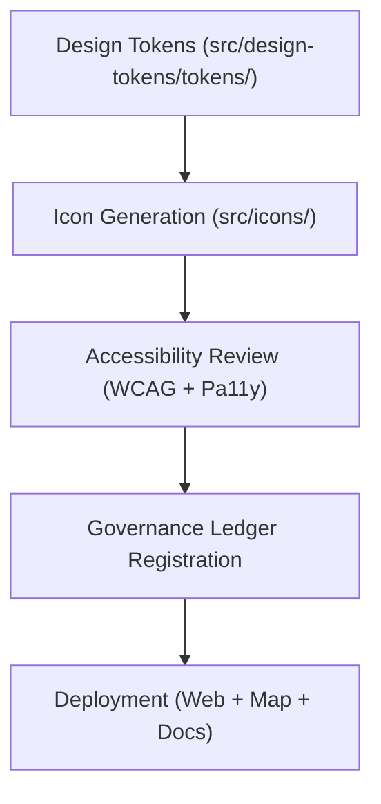

<div align="center">

# 🎨 **Kansas Frontier Matrix — Iconography System & Symbol Design Tokens**
`src/icons/README.md`

**Purpose:**  
Define and document the **visual iconography system**, including governance, FAIR+CARE accessibility, and sustainability alignment for all vector symbols used across the Kansas Frontier Matrix (KFM).  
All icons follow **Platinum UI Tokenization v7.1**, **FAIR+CARE A11y**, and **ISO 9241-171** accessibility principles.

[](../../docs/README.md)
[](../../LICENSE)
[](../../docs/standards/faircare.md)
[]()

</div>

---

## 📘 Overview

The **Iconography System** provides scalable, accessible symbols used across all KFM applications — web UI, dashboards, reports, and interactive maps.  
Icons are optimized for **semantic meaning, accessibility, and FAIR+CARE governance traceability**.

All icons are:
- **Vector-based** (SVG) and **WCAG-compliant**
- Generated from **design tokens** in `src/design-tokens/`
- Versioned, checksum-tracked, and licensed under CC-BY 4.0
- Exported for React, MapLibre, and documentation environments

---

## 🗂️ Directory Layout

```plaintext
src/icons/
├── README.md                        # This file — overview and design governance
│
├── system/                          # Functional system icons (alerts, settings, data)
│   ├── alert.svg
│   ├── check.svg
│   ├── info.svg
│   └── governance.svg
│
├── thematic/                        # Thematic visual symbols for domains (climate, landcover)
│   ├── climate.svg
│   ├── hydrology.svg
│   ├── hazards.svg
│   ├── treaties.svg
│   └── landcover.svg
│
├── accessibility/                   # Inclusive and assistive icons (contrast, narration, keyboard)
│   ├── high-contrast.svg
│   ├── narration.svg
│   ├── keyboard.svg
│   └── vision.svg
│
└── metadata.json                    # Icon registry, telemetry, and governance metadata
```

---

## ⚙️ Icon Governance Framework



Each icon passes FAIR+CARE certification and is recorded in the telemetry ledger (`focus-telemetry.json`).

---

## 🧩 Icon Metadata Schema

| Field | Description | Example |
|--------|-------------|----------|
| `id` | Unique identifier | `"icon_climate_v10"` |
| `category` | Icon set category | `"thematic"` |
| `filename` | SVG file name | `"climate.svg"` |
| `keywords` | Descriptive tags for search and semantics | `["weather","temperature","climate","map"]` |
| `a11y_label` | Screen reader text alternative | `"Climate and temperature icon"` |
| `license` | SPDX identifier | `"CC-BY-4.0"` |
| `checksum` | SHA-256 for integrity tracking | `"sha256-9e2a...a32b"` |
| `fairstatus` | FAIR+CARE certification | `"certified"` |
| `energy_embedded_wh` | Energy cost of generation/rendering | `0.02` |

**Example Metadata Entry:**
```json
{
  "id": "icon_hazards_v10",
  "category": "thematic",
  "filename": "hazards.svg",
  "a11y_label": "Hazard and risk visualization icon",
  "license": "CC-BY-4.0",
  "checksum": "sha256-98f7c2b48f91d20a...",
  "fairstatus": "certified",
  "energy_embedded_wh": 0.03
}
```

---

## 🧠 Design Token Integration

Each icon’s color, stroke, and sizing are sourced from **KFM design tokens** (`src/design-tokens/generated/`).

| Token Type | Description | Example |
|-------------|-------------|----------|
| `color.primary` | Base stroke color for line icons. | `#005EB8` |
| `color.hazard` | Domain-specific thematic tone. | `#E53935` |
| `size.icon.sm` | Small icon size. | `16px` |
| `size.icon.lg` | Large map icon size. | `48px` |
| `stroke.width` | Consistent line width. | `1.5px` |

---

## ♿ Accessibility Standards

All icons conform to **WCAG 2.1 AA** and **ISO 9241-171**:

| Standard | Requirement | Implementation |
|-----------|--------------|----------------|
| WCAG 1.1.1 | Provide text alternatives. | `a11y_label` embedded via `<title>` or `aria-label`. |
| WCAG 1.4.3 | Maintain 4.5:1 color contrast. | Token-controlled fill/stroke colors. |
| WCAG 2.1.1 | Keyboard and focus navigable (interactive icons). | Tabindex and ARIA focusable regions. |
| ISO 9241-171 | Inclusive use for all users. | All icons keyboard and screen reader accessible. |

Accessibility validation occurs in CI (`ui-accessibility.yml`).

---

## ⚖️ FAIR+CARE Governance Matrix

| Principle | Implementation | Oversight |
|------------|----------------|------------|
| **Findable** | Indexed in `metadata.json` and telemetry ledger. | @kfm-data |
| **Accessible** | Descriptive alt text and labels; WCAG-compliant. | @kfm-accessibility |
| **Interoperable** | Tokenized color and structure definitions. | @kfm-architecture |
| **Reusable** | Modular icons with CC-BY 4.0 license. | @kfm-design |
| **CARE** | Inclusive iconography reviewed by FAIR+CARE Council. | @faircare-council |

Governance metrics tracked in:  
`docs/reports/telemetry/governance_scorecard.json`

---

## ♻️ Sustainability Metrics

| Metric | Target | Verified By |
|---------|---------|--------------|
| `energy_embedded_wh` | ≤ 0.05 per SVG | @kfm-sustainability |
| `carbon_gco2e` | ≤ 0.07 per asset | @kfm-security |
| `reuse_rate` | ≥ 95% across projects | @kfm-design-system |
| `a11y_compliance` | 100% | @kfm-accessibility |

Telemetry recorded in:  
`releases/v10.0.0/focus-telemetry.json`

---

## 🧩 Validation Workflows

| Workflow | Description | Output |
|-----------|-------------|---------|
| `icon-registry-validate.yml` | Ensures valid metadata and checksum integrity. | `reports/self-validation/icons/icon_registry.json` |
| `ui-accessibility.yml` | Runs accessibility validation (Pa11y + axe-core). | `reports/self-validation/ui/a11y_summary.json` |
| `telemetry-export.yml` | Updates sustainability and governance metrics. | `releases/v10.0.0/focus-telemetry.json` |

---

## 🕰️ Version History

| Version | Date | Author | Summary |
|----------|------|---------|----------|
| v10.0.0 | 2025-11-10 | `@kfm-design-system` | Introduced unified FAIR+CARE-compliant iconography system with design token integration and A11y validation. |

---

<div align="center">

**© 2025 Kansas Frontier Matrix — CC-BY 4.0**  
Maintained under **Master Coder Protocol v6.3** · FAIR+CARE Certified · Diamond⁹ Ω / Crown∞Ω Ultimate Certified  
[Back to Source Index](../README.md) · [Design Tokens](../design-tokens/README.md) · [Governance Charter](../../docs/standards/governance/ROOT-GOVERNANCE.md)

</div>

