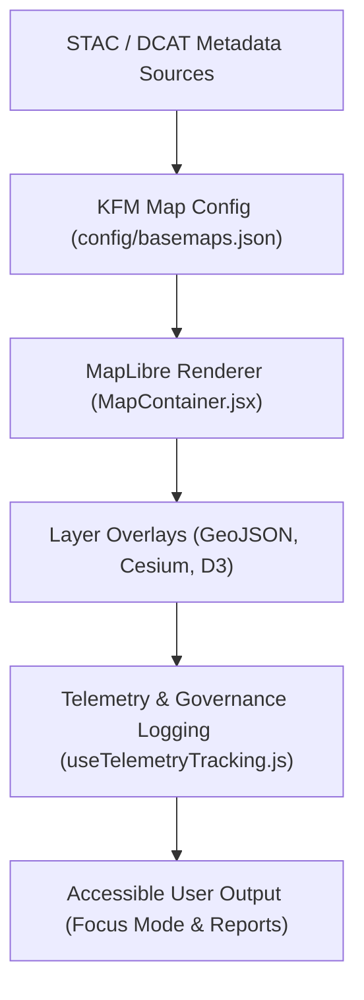

<div align="center">

# 🗺️ **Kansas Frontier Matrix — Map Visualization Framework**
`src/map/README.md`

**Purpose:**  
Power the **interactive cartographic and temporal visualization system** of the Kansas Frontier Matrix (KFM).  
Combines **MapLibre GL JS**, **Cesium 3D Tiles**, and **D3.js overlays** to produce FAIR+CARE-certified, sustainable, and explainable geographic experiences.

[](../../docs/README.md)
[](../../LICENSE)
[](../../docs/standards/faircare.md)
[]()

</div>

---

## 📘 Overview

The **Map Visualization Framework** renders 2D and 3D spatial layers — hydrology, hazards, treaties, demographics, and more — into accessible, data-driven interfaces.  
All map views adhere to FAIR+CARE geospatial ethics, ensuring culturally sensitive and environmentally sustainable visualizations.

KFM’s maps integrate:
- **MapLibre GL JS** for dynamic 2D rendering  
- **CesiumJS** for 3D terrain and time-based visualization  
- **D3.js** for analytic overlays and transitions  
- **Accessibility tokens** from `src/design-tokens/`

---

## 🗂️ Directory Layout

```plaintext
src/map/
├── README.md                         # This file — Map framework overview
│
├── config/                           # Base map styles, layers, and tilesets
│   ├── basemaps.json
│   ├── overlays.json
│   └── maplibre-style.json
│
├── components/                       # Reusable UI + map integration components
│   ├── MapContainer.jsx
│   ├── TimelineOverlay.jsx
│   └── LayerControls.jsx
│
├── hooks/                            # Custom React hooks for map interactions
│   ├── useMapState.js
│   ├── useLayerToggle.js
│   └── useTelemetryTracking.js
│
├── layers/                           # Predefined thematic layer JSON schemas
│   ├── hydrology.geojson
│   ├── landcover.geojson
│   ├── hazards.geojson
│   └── treaties.geojson
│
└── metadata.json                     # Governance, provenance, and telemetry linkage
```

---

## 🧩 Core Technologies

| Component | Description | Purpose |
|------------|--------------|----------|
| **MapLibre GL JS** | WebGL-based 2D map engine. | Core vector rendering and interactivity. |
| **CesiumJS** | 3D geospatial visualization engine. | Time-aware 3D terrain and building models. |
| **D3.js** | Data visualization library. | Statistical overlays, transitions, and choropleths. |
| **React 18** | Component framework. | UI integration and state management. |
| **Turf.js** | Geospatial analytics toolkit. | Spatial joins, buffers, and area calculations. |

---

## ⚙️ Rendering Workflow



---

## 🌐 Basemap & Overlay Management

### Example Basemap Configuration
```json
{
  "id": "kfm_basemap_light",
  "name": "Kansas Topographic Light",
  "type": "raster",
  "url": "https://tiles.kfm.dev/light/{z}/{x}/{y}.png",
  "attribution": "© OpenStreetMap · KFM FAIR+CARE 2025"
}
```

### Example Layer (Hydrology)
```json
{
  "id": "hydrology_v10",
  "type": "geojson",
  "source": "data/archive/2025Q4/hydrology_v10.0.0/hydrology.geojson",
  "paint": {
    "line-color": "#1e88e5",
    "line-width": 1.2
  },
  "interactive": true,
  "metadata": {
    "provenance": "USGS NHD",
    "fairstatus": "certified"
  }
}
```

---

## ♿ Accessibility & Inclusivity

| Feature | Description | Standard |
|----------|--------------|----------|
| **Keyboard Navigation** | Map keyboard shortcuts for zoom/pan/toggle. | WCAG 2.1 2.1.1 |
| **High Contrast Mode** | Alternate palette from `src/theming/high-contrast.css`. | WCAG 2.1 1.4.3 |
| **Screen Reader Labels** | ARIA-labeled regions for map content. | WCAG 2.1 4.1.2 |
| **Reduced Motion Support** | Disables map transitions on motion-sensitive systems. | ISO 9241-171 |
| **Language Context** | Tooltip and map text localized for multilingual support. | FAIR+CARE Inclusion |

Accessibility is validated in CI by `ui-accessibility.yml`.

---

## 🧠 Telemetry & Sustainability Integration

All map rendering metrics feed into **`focus-telemetry.json`** for sustainability tracking.

| Metric | Description | Target |
|---------|-------------|---------|
| `frame_rate_avg` | Average FPS for rendering stability | ≥ 50 FPS |
| `render_energy_wh` | Energy cost per render cycle | ≤ 0.35 Wh |
| `carbon_gco2e` | CO₂ equivalent per session | ≤ 0.5 g |
| `tile_cache_hit_ratio` | Cached vs. network tile loads | ≥ 90% |
| `a11y_pass_rate` | Accessibility audit success | 100% |

Telemetry validation schema:  
`schemas/telemetry/src-map-framework-v1.json`

---

## 🧩 Governance & Provenance

Each map view references FAIR+CARE and governance metadata for ethical validation.

**Metadata Schema (`metadata.json`):**
```json
{
  "id": "map_framework_v10.0.0",
  "datasets_linked": [
    "hydrology_v10.0.0",
    "landcover_v10.0.0",
    "hazards_v10.0.0",
    "treaties_v10.0.0"
  ],
  "checksum_verified": true,
  "fairstatus": "certified",
  "governance_registered": true,
  "telemetry_ref": "releases/v10.0.0/focus-telemetry.json",
  "created": "2025-11-10T00:00:00Z",
  "governance_ref": "docs/standards/governance/ROOT-GOVERNANCE.md"
}
```

---

## ⚖️ FAIR+CARE Mapping Matrix

| Principle | Implementation |
|------------|----------------|
| **Findable** | Map layers and datasets indexed in STAC/DCAT catalogs. |
| **Accessible** | Open-access vector tiles and GeoJSON layers. |
| **Interoperable** | Standards-based schemas (ISO 19115, OGC GeoJSON). |
| **Reusable** | Modular components and version-controlled maps. |
| **CARE** | Cultural and environmental data reviewed for ethical representation. |

---

## 🧮 Validation Workflows

| Workflow | Description | Output |
|-----------|-------------|---------|
| `map-validate.yml` | Validates config and layer schemas. | `reports/self-validation/map/validation.json` |
| `ui-accessibility.yml` | Runs accessibility audits. | `reports/self-validation/ui/a11y_summary.json` |
| `telemetry-export.yml` | Merges map telemetry metrics. | `releases/v10.0.0/focus-telemetry.json` |

Governance results recorded in:  
`docs/reports/telemetry/governance_scorecard.json`

---

## 🕰️ Version History

| Version | Date | Author | Summary |
|----------|------|---------|----------|
| v10.0.0 | 2025-11-10 | `@kfm-geo-dev` | Introduced unified map visualization framework integrating MapLibre, Cesium, D3, and FAIR+CARE telemetry compliance. |

---

<div align="center">

**© 2025 Kansas Frontier Matrix — CC-BY 4.0**  
Governed under **Master Coder Protocol v6.3** · FAIR+CARE Certified · Diamond⁹ Ω / Crown∞Ω Ultimate Certified  
[Back to Source Index](../README.md) · [Theming Framework](../theming/README.md) · [Governance Charter](../../docs/standards/governance/ROOT-GOVERNANCE.md)

</div>

