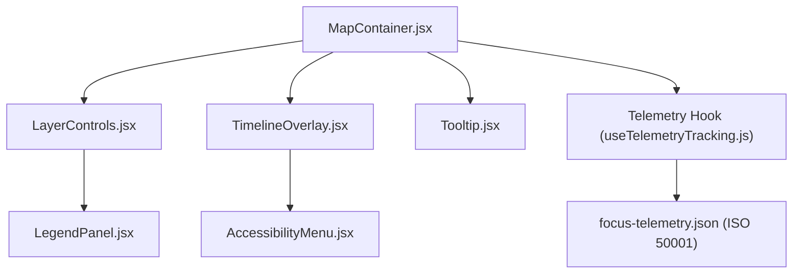

<div align="center">

# 🧩 **Kansas Frontier Matrix — Map Components & UI Integration Framework**
`src/map/components/README.md`

**Purpose:**  
Define and document all **interactive React components** that enable map rendering, layer management, timeline synchronization, and FAIR+CARE-compliant geospatial user experiences in the Kansas Frontier Matrix (KFM).  
Each component adheres to **MCP-DL v6.3**, **WCAG 2.1 AA**, and **FAIR+CARE** accessibility and ethics standards.

[](../../../docs/README.md)
[](../../../LICENSE)
[](../../../docs/standards/faircare.md)
[]()

</div>

---

## 📘 Overview

The **Map Components Framework** connects KFM’s React frontend to its geospatial engines (MapLibre + Cesium) and governance telemetry systems.  
It provides composable, reusable components that manage **map state, thematic layers, accessibility controls,** and **telemetry logging**.

Each component:
- Uses **React 18 functional hooks**  
- Integrates **MapLibre GL JS** for 2D rendering  
- Synchronizes **FAIR+CARE telemetry** via `useTelemetryTracking.js`  
- Validates UI compliance in `ui-accessibility.yml`

---

## 🗂️ Directory Layout

```plaintext
src/map/components/
├── README.md                      # This file — documentation overview
│
├── MapContainer.jsx               # Core container initializing MapLibre + Cesium instances
├── LayerControls.jsx              # UI control panel for toggling visible layers
├── TimelineOverlay.jsx            # Temporal slider overlay synchronized with map layers
├── Tooltip.jsx                    # Contextual data tooltip for features on hover/click
├── LegendPanel.jsx                # Dynamic map legend with FAIR+CARE color coding
├── AccessibilityMenu.jsx          # A11y options for contrast, labels, and narration
└── metadata.json                  # Governance and telemetry linkage metadata
```

---

## ⚙️ Component Architecture



---

## 🧩 Core Components Summary

| Component | Description | Key Dependencies |
|------------|--------------|------------------|
| `MapContainer.jsx` | Initializes map, applies base + overlay layers, and manages interaction events. | `MapLibre`, `Cesium`, `React Context` |
| `LayerControls.jsx` | UI panel for enabling/disabling layers via checkboxes and tokens. | `useLayerToggle`, `map.config/layers.json` |
| `TimelineOverlay.jsx` | Temporal slider for syncing data by time. | `React Range`, `useMapState`, `Cesium clock` |
| `Tooltip.jsx` | Displays contextual info for selected map features. | `D3`, `React Portal` |
| `LegendPanel.jsx` | Dynamically renders legends from FAIR+CARE metadata. | `overlays.json`, `design-tokens` |
| `AccessibilityMenu.jsx` | Provides keyboard shortcuts, narration toggle, and contrast mode switching. | `src/theming/`, `WCAG 2.1` |

---

## 🧮 Example — `MapContainer.jsx`

```jsx
import React, { useEffect } from "react";
import maplibregl from "maplibre-gl";
import { useTelemetryTracking } from "../hooks/useTelemetryTracking";

export const MapContainer = () => {
  const { logTelemetryEvent } = useTelemetryTracking();

  useEffect(() => {
    const map = new maplibregl.Map({
      container: "kfm-map",
      style: "/src/map/config/maplibre-style.json",
      center: [-98.5, 38.5],
      zoom: 6
    });

    map.on("load", () => logTelemetryEvent("map_loaded", { status: "success" }));
  }, []);

  return <div id="kfm-map" aria-label="Kansas Frontier Matrix Map Viewer"></div>;
};
```

---

## 🧠 Accessibility Features (WCAG 2.1 AA)

| Feature | Description | Implementation |
|----------|--------------|----------------|
| **Keyboard Navigation** | Tab + Enter to select layers and tooltips. | `AccessibilityMenu.jsx` |
| **Screen Reader Labels** | ARIA tags for all interactive map regions. | `aria-label` attributes |
| **Contrast Modes** | Dynamically imports from `src/theming/high-contrast.css`. | `useTheme()` hook |
| **Motion Sensitivity** | Respects `prefers-reduced-motion`. | CSS media query |
| **Voice Narration** | Optional voice narration of dataset summaries. | Web Speech API |

All accessibility audits run in CI using `axe-core` and `Pa11y`.

---

## ⚖️ FAIR+CARE Governance Matrix

| Principle | Implementation |
|------------|----------------|
| **Findable** | Components are indexed in telemetry manifest for reuse. |
| **Accessible** | A11y controls ensure inclusive interaction for all users. |
| **Interoperable** | Open React components export to web, docs, and dashboard. |
| **Reusable** | Licensed under CC-BY 4.0 with versioned governance metadata. |
| **CARE** | Map interactions and visual encodings reviewed for ethical representation. |

Governance records:  
`docs/reports/telemetry/governance_scorecard.json`

---

## ♻️ Sustainability Metrics

| Metric | Target | Verified By |
|---------|---------|--------------|
| `render_energy_wh` | ≤ 0.35 Wh per map render | @kfm-sustainability |
| `a11y_pass_rate` | 100% | @kfm-accessibility |
| `carbon_output_gco2e` | ≤ 0.5 g/session | @kfm-security |
| `component_reuse_rate` | ≥ 90% | @kfm-design-system |

Telemetry recorded in:  
`releases/v10.0.0/focus-telemetry.json`

---

## 🧾 Governance Metadata Example

```json
{
  "id": "map_components_registry_v10.0.0",
  "components": [
    "MapContainer.jsx",
    "LayerControls.jsx",
    "TimelineOverlay.jsx"
  ],
  "checksum_verified": true,
  "fairstatus": "certified",
  "a11y_compliant": true,
  "governance_registered": true,
  "telemetry_ref": "releases/v10.0.0/focus-telemetry.json",
  "created": "2025-11-10T00:00:00Z"
}
```

---

## 🧩 Validation Workflows

| Workflow | Description | Output |
|-----------|-------------|---------|
| `map-components-validate.yml` | Runs syntax + accessibility validation for all React components. | `reports/self-validation/map/components_validation.json` |
| `ui-accessibility.yml` | Ensures WCAG 2.1 compliance and high contrast tests. | `reports/self-validation/ui/a11y_summary.json` |
| `telemetry-export.yml` | Updates sustainability metrics. | `releases/v10.0.0/focus-telemetry.json` |

---

## 🕰️ Version History

| Version | Date | Author | Summary |
|----------|------|---------|----------|
| v10.0.0 | 2025-11-10 | `@kfm-frontend-team` | Introduced full React-based map components framework with FAIR+CARE telemetry and accessibility integration. |

---

<div align="center">

**© 2025 Kansas Frontier Matrix — CC-BY 4.0**  
Compliant with **Master Coder Protocol v6.3** · FAIR+CARE Certified · Diamond⁹ Ω / Crown∞Ω Ultimate Certified  
[Back to Map Index](../README.md) · [Map Config](../config/README.md) · [Governance Charter](../../../docs/standards/governance/ROOT-GOVERNANCE.md)

</div>

