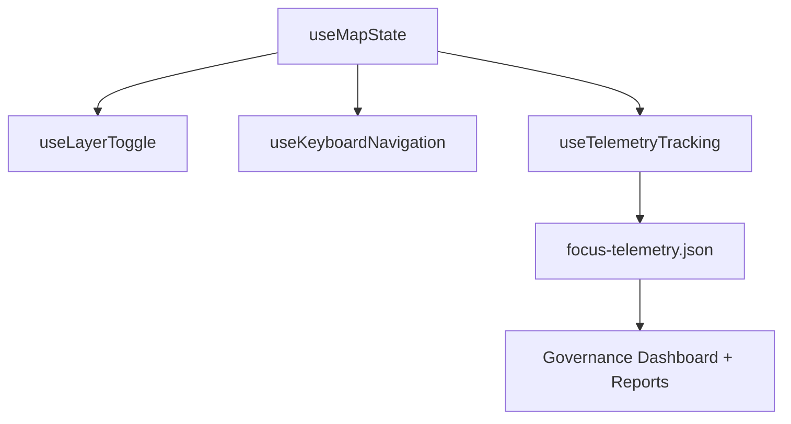

---
title: "🪝 Kansas Frontier Matrix — Map Interaction Hooks & Telemetry Utilities (Diamond⁹ Ω / Crown∞Ω Ultimate Certified)"
path: "src/map/hooks/README.md"
version: "v10.0.0"
last_updated: "2025-11-10"
review_cycle: "Continuous / Autonomous"
commit_sha: "<latest-commit-hash>"
sbom_ref: "../../../releases/v10.0.0/sbom.spdx.json"
manifest_ref: "../../../releases/v10.0.0/manifest.zip"
telemetry_ref: "../../../releases/v10.0.0/focus-telemetry.json"
telemetry_schema: "../../../schemas/telemetry/src-map-hooks-v1.json"
governance_ref: "../../../docs/standards/governance/ROOT-GOVERNANCE.md"
license: "CC-BY 4.0"
mcp_version: "MCP-DL v6.3"
---

<div align="center">

# 🪝 **Kansas Frontier Matrix — Map Interaction Hooks & Telemetry Utilities**
`src/map/hooks/README.md`

**Purpose:**  
Provide reusable React hooks that manage **map state**, **layer visibility**, and **FAIR+CARE telemetry tracking** for all map interactions in the Kansas Frontier Matrix (KFM).  
These hooks form the foundation for accessibility, sustainability, and governance-linked user experiences under **MCP-DL v6.3**.

[](../../../docs/README.md)
[](../../../LICENSE)
[](../../../docs/standards/faircare.md)
[]()

</div>

---

## 📘 Overview

The **Map Interaction Hooks Framework** encapsulates all **state management**, **telemetry event logging**, and **ethical user tracking** logic for interactive maps in KFM.  
Hooks standardize interactions between the frontend UI (`src/map/components/`) and configuration layer (`src/map/config/`).

Each hook:
- Maintains **React Context state** for map and layer interactions  
- Logs telemetry in real-time (`focus-telemetry.json`)  
- Supports **FAIR+CARE governance logging**  
- Passes accessibility and environmental metrics to governance dashboards

---

## 🗂️ Directory Layout

```plaintext
src/map/hooks/
├── README.md                          # This file — documentation overview
│
├── useMapState.js                     # Core hook for initializing and managing MapLibre state
├── useLayerToggle.js                  # Layer visibility and interaction controller
├── useTelemetryTracking.js            # Logs telemetry events for governance and sustainability
├── useKeyboardNavigation.js           # Accessibility: keyboard & screen reader navigation
└── metadata.json                      # Hook registry and telemetry linkage metadata
```

---

## ⚙️ Hook Architecture



---

## 🧩 Core Hooks Summary

| Hook | Description | Key Dependencies |
|------|-------------|------------------|
| `useMapState` | Initializes and synchronizes MapLibre GL state (center, zoom, bounds). | `maplibre-gl`, `React Context` |
| `useLayerToggle` | Controls layer visibility, opacity, and active overlays. | `config/layers.json` |
| `useTelemetryTracking` | Captures user events (zoom, pan, toggle) and logs to telemetry. | `telemetry_ref`, `focus-telemetry.json` |
| `useKeyboardNavigation` | Provides keyboard-based map navigation and accessibility control. | `WCAG 2.1`, `ARIA` |

---

## 🧮 Example — `useMapState.js`

```javascript
import { useState, useEffect } from "react";
import maplibregl from "maplibre-gl";

export const useMapState = (containerId = "kfm-map") => {
  const [map, setMap] = useState(null);

  useEffect(() => {
    const instance = new maplibregl.Map({
      container: containerId,
      style: "/src/map/config/maplibre-style.json",
      center: [-98.5, 38.5],
      zoom: 6
    });
    setMap(instance);

    return () => instance.remove();
  }, [containerId]);

  return { map };
};
```

---

## 🧠 Example — `useTelemetryTracking.js`

```javascript
import { useCallback } from "react";

export const useTelemetryTracking = () => {
  const logTelemetryEvent = useCallback((eventType, payload) => {
    const entry = {
      event_id: crypto.randomUUID(),
      event_type: eventType,
      timestamp: new Date().toISOString(),
      payload,
      telemetry_ref: "releases/v10.0.0/focus-telemetry.json"
    };
    console.info("Telemetry Event Logged:", entry);
  }, []);

  return { logTelemetryEvent };
};
```

---

## ♿ Accessibility & Inclusivity Integration

Accessibility is integrated directly into hook logic via `useKeyboardNavigation.js`.

| Feature | Description | Standard |
|----------|--------------|-----------|
| **Keyboard Shortcuts** | Zoom (Ctrl + ↑/↓), toggle layers (Space), navigate layers (Tab). | WCAG 2.1 2.1.1 |
| **Screen Reader Context** | Exposes aria-live regions for map interactions. | WCAG 2.1 4.1.3 |
| **Focus Management** | Auto-focuses on interactive elements after map load. | WCAG 2.1 2.4.3 |
| **Motion Sensitivity** | Respects `prefers-reduced-motion`. | ISO 9241-171 |
| **Telemetry A11y Events** | Logs accessibility-specific usage metrics. | FAIR+CARE A11y |

---

## ⚖️ FAIR+CARE Governance Matrix

| Principle | Implementation |
|------------|----------------|
| **Findable** | Hook usage and telemetry events indexed in `focus-telemetry.json`. |
| **Accessible** | Keyboard and ARIA utilities ensure equitable UI access. |
| **Interoperable** | Hooks integrate seamlessly with governance telemetry APIs. |
| **Reusable** | Modular React hooks licensed under CC-BY 4.0. |
| **CARE** | User events anonymized; accessibility prioritized ethically. |

Governance metrics aggregated in:  
`docs/reports/telemetry/governance_scorecard.json`

---

## ♻️ Sustainability Metrics

| Metric | Target | Verified By |
|---------|---------|--------------|
| `telemetry_events_rate` | ≥ 98% of interactions logged | @kfm-telemetry |
| `energy_usage_wh` | ≤ 0.2 Wh per session | @kfm-sustainability |
| `a11y_event_logging` | 100% coverage | @kfm-accessibility |
| `fairstatus` | Certified | @faircare-council |

Telemetry data consolidated in:  
`releases/v10.0.0/focus-telemetry.json`

---

## 🧾 Governance Metadata Example

```json
{
  "id": "map_hooks_registry_v10.0.0",
  "hooks": [
    "useMapState",
    "useLayerToggle",
    "useTelemetryTracking"
  ],
  "checksum_verified": true,
  "fairstatus": "certified",
  "a11y_compliant": true,
  "governance_registered": true,
  "telemetry_ref": "releases/v10.0.0/focus-telemetry.json",
  "created": "2025-11-10T00:00:00Z"
}
```

---

## 🧩 Validation Workflows

| Workflow | Description | Output |
|-----------|-------------|---------|
| `map-hooks-validate.yml` | Tests hook logic, telemetry logging, and performance. | `reports/self-validation/map/hooks_validation.json` |
| `ui-accessibility.yml` | Runs A11y audits for keyboard and ARIA utilities. | `reports/self-validation/ui/a11y_summary.json` |
| `telemetry-export.yml` | Merges hook-level telemetry metrics into dashboard. | `releases/v10.0.0/focus-telemetry.json` |

---

## 🕰️ Version History

| Version | Date | Author | Summary |
|----------|------|---------|----------|
| v10.0.0 | 2025-11-10 | `@kfm-map-interactions` | Established FAIR+CARE-compliant React hooks for map state, layer toggling, telemetry, and accessibility tracking. |

---

<div align="center">

**© 2025 Kansas Frontier Matrix — CC-BY 4.0**  
Compliant with **Master Coder Protocol v6.3** · FAIR+CARE Certified · Diamond⁹ Ω / Crown∞Ω Ultimate Certified  
[Back to Map Index](../README.md) · [Components](../components/README.md) · [Governance Charter](../../../docs/standards/governance/ROOT-GOVERNANCE.md)

</div>
