<div align="center">

# 🧬 **Kansas Frontier Matrix — NLP & Text Intelligence**  
`src/nlp/README.md`

**Natural Language Processing · Entity Extraction · Semantic Linking**

[](../../.github/workflows/site.yml)
[](../../.github/workflows/stac-validate.yml)
[](../../.github/workflows/codeql.yml)
[](../../.github/workflows/trivy.yml)
[](../../docs/)
[](../../LICENSE)

</div>

---

```yaml
---
title: "Kansas Frontier Matrix — NLP & Text Intelligence"
version: "v1.6.1"
last_updated: "2025-10-17"
owners: ["@kfm-data", "@kfm-architecture"]
tags: ["nlp","ner","summarization","entity-linking","relation-extraction","qna","mcp","ci","semver"]
status: "Stable"
license: "MIT"
semver_policy: "MAJOR.MINOR.PATCH"
ci_required_checks:
  - pre-commit
  - unit-tests
  - codeql
  - trivy
  - docs-validate
semantic_alignment:
  - CIDOC CRM
  - OWL-Time
  - PeriodO
  - DCAT 2.0
  - ISO 8601
---
```

---

## 🎯 Purpose

The **`src/nlp/`** package powers the **Natural Language Processing (NLP)** core of the **Kansas Frontier Matrix (KFM)** — extracting, summarizing, and semantically linking information from unstructured historical text.  
It converts OCR’d newspapers, diaries, treaties, and reports into structured entities, relationships, and contextual summaries that populate the KFM **Knowledge Graph**.

---

## 🏗️ Role in the System

```mermaid
flowchart TD
    A["Text Sources<br/>OCR · Archives · Newspapers · Diaries"]
      --> B["NLP Pipeline<br/>spaCy · Transformers · Rules"]
      --> C["Entities & Summaries<br/>People · Places · Events · Dates"]
      --> D["Knowledge Graph<br/>Neo4j (CIDOC CRM)"]
      --> E["Frontend UI<br/>AI Summaries · Q&A · Search"]
```


<!-- END OF MERMAID -->

### Pipeline Outputs
- 🧭 **Entity Extraction (NER)** – detect people, places, events, dates  
- 🔗 **Entity Linking** – connect mentions to canonical graph nodes  
- 🧩 **Relation & Event Extraction** – derive subject-verb-object triples  
- 🧠 **Summarization** – create concise, human-readable document summaries  
- ❓ **Question Answering (optional)** – experimental text-to-graph query module  

---

## 📂 Directory Layout

```
src/nlp/
├── __init__.py
├── ner_model.py           # spaCy-based NER model + training wrapper
├── relation_extractor.py  # Extracts relationships & events
├── summarizer.py          # Transformer summarization pipeline (BART/T5)
├── entity_linker.py       # Fuzzy/contextual linking to Knowledge Graph
├── qna_engine.py          # Experimental QA interface over Neo4j
└── README.md              # (this file)
```

---

## 🧠 NLP Pipeline Overview

### 1. Named Entity Recognition (NER)

```python
import spacy
nlp = spacy.load("en_core_web_trf")

text = "In August 1867, a flood swept across the Arkansas River near Fort Larned."
for ent in nlp(text).ents:
    print(ent.text, ent.label_)
```

**Output:**
```
August 1867 DATE
Arkansas River GPE
Fort Larned FACILITY
```

Entities are normalized, geocoded (if `PLACE`), and added to the graph.

---

### 2. Relation & Event Extraction

Identifies structured semantic relationships, e.g.:
```
"John Smith commanded troops during the Battle of the Blue near Independence, Missouri."
```

Produces:
```json
{
  "person": "John Smith",
  "role": "commander",
  "event": "Battle of the Blue",
  "place": "Independence, Missouri",
  "date": "1864-10-22"
}
```

---

### 3. Summarization

```python
from transformers import pipeline
summarizer = pipeline("summarization", model="facebook/bart-large-cnn")
text = open("data/processed/texts/diary_1867.txt").read()
print(summarizer(text, max_length=150, min_length=50, do_sample=False)[0]["summary_text"])
```

**Example Output:**
> “Settlers along the Arkansas River endured a devastating flood in August 1867, destroying homes and crops near Fort Larned.”

---

### 4. Entity Linking

Connects text entities to canonical graph nodes.

```python
from rapidfuzz import process, fuzz
best = process.extractOne("Ft. Larned", ["Fort Larned", "Fort Scott", "Fort Riley"], scorer=fuzz.WRatio)
print(best)
```

**Result:**
```
('Fort Larned', 96)
```

Links are annotated with `score`, `method`, and `provenance`.

---

### 5. Question Answering (Experimental)

The `qna_engine.py` translates user queries into graph queries:
```bash
> Who lived near Fort Hays in 1870?
```
**Pipeline Steps:**
1. Parse question with spaCy dependency model  
2. Build Neo4j Cypher query  
3. Return ranked entity results with geospatial focus  

---

## 🧾 Model Training & Fine-Tuning

**Workflow**
1. Label training data (`data/training/ner/`)  
2. Train:
   ```bash
   python -m spacy train config.cfg \
     --paths.train ./data/training/ner/train.spacy \
     --paths.dev ./data/training/ner/dev.spacy
   ```
3. Export to `models/ner_kansas/`
4. Log parameters in `docs/model_card.md`

**Custom entity types:**  
`FORT`, `TRIBAL_ENTITY`, `RIVER`, `DISASTER`, `LEGISLATION`

---

## 🔍 Logging & Provenance

All runs log to `logs/nlp/`:
```
[2025-10-05 12:44:02] ner_model | 120 texts | 5,442 entities
[2025-10-05 12:48:17] summarizer | 30 summaries | avg length=142
[2025-10-05 12:53:01] linker | 920 links | avg confidence=91%
```

Each entry includes model version, dataset, execution time, and metrics.
Sidecars (`.meta.json`) capture provenance, parameters, and output hashes.

---

## 🧰 Example CLI Workflows

```bash
# Run NER
python src/nlp/ner_model.py --input data/processed/texts/ --output data/processed/nlp/entities.json

# Summarize documents
python src/nlp/summarizer.py --input data/processed/newspapers/ --out data/processed/nlp/summaries/

# Link entities to Knowledge Graph
python src/nlp/entity_linker.py --input data/processed/nlp/entities.json

# Run interactive QA
python src/nlp/qna_engine.py
```

---

## 🧮 Outputs

| Output Type       | Description                                      | Destination                     |
| :---------------- | :----------------------------------------------- | :------------------------------ |
| `*.entities.json` | Extracted entities (`Person`, `Place`, etc.)     | `data/processed/nlp/entities/`  |
| `*.summary.txt`   | AI-generated summaries                           | `data/processed/nlp/summaries/` |
| `*.links.json`    | Entity linking confidence & provenance data      | `data/processed/nlp/links/`     |
| `nlp_metrics.log` | Performance & confidence tracking                | `logs/nlp/`                     |

---

## 🧷 Acceptance Checklist (CI)

- [ ] Entities meet schema standards (type, confidence, context).  
- [ ] Graph linking validated (no orphans, duplicates).  
- [ ] Summaries under token limits; `.meta.json` generated.  
- [ ] Provenance recorded in sidecars and logs.  
- [ ] Model card updated and committed with dataset hash.  

---

## 🛡️ Security & Compliance

- No PII stored; only derived entity abstractions.  
- All external API calls rate-limited & ToS-compliant.  
- CodeQL + Trivy enforce static and dependency checks.  
- License/attribution preserved in metadata.  

---

## 🧾 Version History

| Version | Date       | Type     | Notes |
| :------ | :--------- | :------- | :---- |
| v1.6.1  | 2025-10-17 | Added    | Finalized README layout; standardized badge styling; provenance sidecar rules. |
| v1.6.0  | 2025-10-17 | Added    | Security & compliance; extended NER entities; CLI workflows; QA checklist. |
| v1.5.0  | 2025-10-16 | Added    | Initial NLP documentation; examples; summarization & linking sections. |

---

## 📚 References

- AI System Developer Docs — `../../docs/ai-system.md`  
- File & Data Architecture — `../../docs/architecture.md`  
- Scientific Modeling & Simulation — `../../docs/standards/README.md`  
- CIDOC CRM & OWL-Time — https://www.cidoc-crm.org/

---

<div align="center">

**Kansas Frontier Matrix © 2025**  
*Language · Meaning · Context — Preserving Kansas History Through AI*

</div>
```