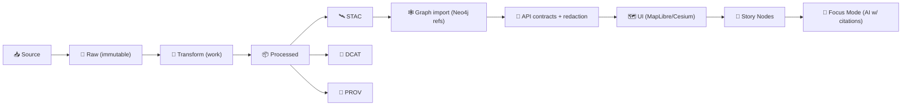

<!-- File: src/pipelines/<domain_or_product>/configs/README.md -->

# ⚙️ Pipeline Configs — `<domain_or_product>` 🧩


> [!IMPORTANT]
> These configs are **part of the evidence chain** ⛓️  
> If you change a config, you change the outputs — and the provenance must reflect it.

---

## 🧭 What lives here

This folder contains the **declarative configuration** for pipelines in the `<domain_or_product>` module.

Configs define:

- 📥 **What** to ingest (sources, manifests, schedules)
- 🧪 **How** to validate (schemas + QA checks)
- 🧼 **How** to transform (ETL steps, CRS, enrichment)
- 📦 **What** to publish (files + DB loads + tiles)
- 🧾 **How** to describe it (STAC + DCAT + PROV)
- 🧠 **How** AI/analysis attaches (evidence artifacts, Focus Mode hooks)
- 🔐 **How** governance is enforced (OPA rules, waivers, classification)
- 📡 **How** it’s observed (telemetry, run manifests, idempotency)

---

## 📚 Quick links

- ✅ **Add a new dataset config** → see **“Checklist: adding a new config”**
- 🧰 **Examples** → see **“Examples”**
- 🧾 **Metadata contract** → see **“Boundary artifacts & publication contract”**
- 🔐 **Governance** → see **“Policy & sensitivity”**

---

## 🗂️ Suggested layout (within this folder)

> Your domain may be smaller — this layout is a **recommended** structure for scale.

```text
📁 configs/
├─ 📁 datasets/                 # dataset-level configs (most common)
│  ├─ kfm.ks.<domain>.<name>.v1.yaml
│  └─ ...
├─ 📁 sources/                  # source manifests / fetch definitions
│  ├─ <source_name>.yaml
│  └─ ...
├─ 📁 transforms/               # reusable transform chains / steps
│  ├─ <transform_id>.yaml
│  └─ ...
├─ 📁 validators/               # reusable validation bundles
│  ├─ <validator_id>.yaml
│  └─ ...
├─ 📁 publish/                  # DB + tile + artifact publishing profiles
│  ├─ postgis.yaml
│  ├─ graph.yaml
│  └─ oci.yaml
├─ 📁 ui/                       # UI-facing config (layers, offline packs)
│  ├─ layers.yaml
│  ├─ offline_packs.yaml
│  └─ story_refs.yaml
├─ 📁 ai/                       # AI hooks (Focus Mode, concept nodes, etc.)
│  ├─ focus_mode.yaml
│  ├─ concept_nodes.yaml
│  └─ pulse_threads.yaml
├─ 📁 governance/               # policy wiring + optional waivers
│  ├─ policy_pack.yaml
│  └─ waivers.yml
├─ 📁 env/                      # non-secret env overlays (dev/prod toggles)
│  ├─ dev.yaml
│  └─ prod.yaml
└─ README.md                    # 👈 you are here
```

---

## 🧱 Non‑negotiable principles (KFM standards)

### 1) Raw is immutable 🧊
- Anything fetched from an external source is stored **as‑received** and never edited in place.
- Transformations happen downstream (work → processed).

### 2) Deterministic, config-driven ETL 🎛️
- Same inputs + same config ⇒ **same outputs**.
- Manual “fixes” in processed outputs are treated as bugs (fix the config or pipeline code).

### 3) Boundary artifacts are required before “published” ✅
A dataset is not considered “published” until it has:

- 🛰️ **STAC** (collection + items)
- 🧾 **DCAT** (discoverability record)
- 🧬 **PROV** (lineage bundle)

### 4) UI reads via API contracts only 🧯
- The UI must not bypass governance or redaction by querying internal stores directly.
- Configs should assume **API is the enforcement boundary**.

### 5) AI outputs are first-class datasets 🤖📦
Any AI/analysis output that becomes user-visible must be:
- Stored as a processed artifact
- Cataloged (STAC/DCAT)
- Provenanced (PROV)
- Governed (policy checks)

---

## 🧬 Boundary artifacts & publication contract

Pipelines should follow the standard lifecycle structure:

```text
📁 data/raw/<domain>/        # immutable evidence
📁 data/work/<domain>/       # intermediate processing & scratch
📁 data/processed/<domain>/  # final artifacts (files and/or DB loads)

📁 data/stac/collections/    # collection-level STAC
📁 data/stac/items/          # item-level STAC
📁 data/catalog/dcat/        # DCAT JSON-LD
📁 data/prov/                # PROV lineage bundles
```

> [!TIP]
> Think of **STAC/DCAT/PROV** as the “API” between ingestion and everything downstream (graph, API, UI, AI).

---

## 🔩 Config composition (recommended)

Use **layered config** so you can:
- keep dataset definitions stable
- vary environment behavior safely
- avoid hidden behavior

Recommended merge order:

1. `datasets/<dataset>.yaml` (base)
2. `publish/*.yaml` (shared publishing profiles)
3. `governance/*.yaml` (policy wiring)
4. `env/<dev|prod>.yaml` (non-secret toggles)
5. runtime overrides (CLI flags)

---

## 🧾 A practical config contract (minimal fields)

> You can model this as YAML (preferred) or JSON. YAML is easier to maintain in PRs.

### Required
- `meta.dataset_id` (stable identifier)
- `meta.title`, `meta.description`
- `source.*` (how to acquire input)
- `staging.*` (raw/work/processed destinations)
- `transform.steps[]` (or a named `transform_ref`)
- `validate.*` (schema + checks)
- `publish.*` (catalog + storage targets)
- `governance.classification` (and sensitivity flags)
- `observability.*` (telemetry + run manifest)

### Strongly recommended
- `meta.license`
- `meta.keywords[]`
- `meta.temporal_extent` + `meta.spatial_extent`
- `publish.catalogs.stac|dcat|prov` templates or refs
- `release.oci` (if distributing artifacts externally)

---

## 🧠 Where configs plug in (end-to-end)



---

## ✅ Validation & CI gates (what should run automatically)

> [!NOTE]
> Your pipeline runner should fail closed: if policy or schema checks fail, **nothing publishes**.

Recommended gates:

- 🧾 **Schema validation** for configs (JSON Schema)
- 🔐 **OPA policy checks** (Conftest)
- 🧬 **PROV completeness** (inputs/activities/agents present)
- 🛰️ **STAC validity** (collections + items, stable IDs, proper asset hrefs)
- 🧾 **DCAT validity** (JSON-LD parses, required fields present)
- 🧪 **QA thresholds** (geometry validity, null checks, range checks, drift)

---

## 🔐 Policy & sensitivity

Configs must declare how governance applies:

- `governance.classification`: `public | internal | restricted`
- `governance.sensitivity_notes`: freeform (why sensitive)
- `governance.redaction_policy_ref`: points to a rule bundle
- `governance.care`: optional CARE-aligned tags/labels
- `governance.waivers`: **only** if justified + reviewed

> [!WARNING]
> Do **not** “solve” sensitivity by skipping provenance.  
> Instead, configure **redaction/generalization** at the API boundary and document it.

---

## 🧱 Secrets & credentials (don’t commit 🔥)

✅ Allowed in configs:
- environment variable references (e.g., `${USGS_API_KEY}`)
- secret **names** / handles (not values)
- auth mode selection (`none|token|oauth|basic`)

🚫 Not allowed:
- API keys, passwords, private URLs with embedded tokens
- signed URLs intended to be private

---

## 📡 Observability & reproducibility

Every run should emit:

- 🧾 `run_manifest.json` (config digest, input hashes, outputs, tool versions)
- 🪵 `telemetry.ndjson` (append-only events)
- 🔒 `checksums.sha256` (for raw and/or packaged artifacts)
- 🧬 PROV referencing the exact inputs + parameters

If you use containers, pin the image digest in the run manifest.

---

## 📦 Distribution (optional but powerful): OCI artifacts + signing

If you ship artifacts (PMTiles, GeoParquet, COGs, etc.) outside the repo:

- push as OCI artifacts (ORAS)
- sign with Cosign
- reference by **digest** in catalogs when possible (tags are human convenience)

This makes artifacts content-addressable and auditable.

---

## 🧪 Examples

<details>
<summary><strong>Example 1 — Batch dataset (county boundaries) 🗺️</strong></summary>

```yaml
meta:
  config_version: 1
  dataset_id: kfm.ks.boundaries.counties.v1
  title: Kansas County Boundaries
  description: Authoritative county boundaries used for filtering and UI context.
  license: Public Domain
  keywords: [boundaries, counties, admin]

source:
  type: file_manifest
  manifest_ref: data/sources/boundaries_counties/source.json

staging:
  domain: boundaries
  raw_dir: data/raw/boundaries/counties/
  work_dir: data/work/boundaries/counties/
  processed_dir: data/processed/boundaries/counties/

transform:
  steps:
    - op: read_vector
    - op: normalize_fields
    - op: reproject
      to_epsg: 4326
    - op: write_geoparquet
      path: "${staging.processed_dir}/counties.geoparquet"

validate:
  checks:
    - name: geometry_valid
    - name: not_null
      field: county_id

publish:
  catalogs:
    stac: {profile: kfm_stac_v1}
    dcat: {profile: kfm_dcat_v1}
    prov: {profile: kfm_prov_v1}
  postgis:
    table: boundaries_county
    mode: replace
  graph:
    node_type: Dataset
    link_places: true

governance:
  classification: public

observability:
  telemetry: true
  run_manifest: true
```

</details>

<details>
<summary><strong>Example 2 — Streaming sensor feed (USGS-like) 📈</strong></summary>

```yaml
meta:
  config_version: 1
  dataset_id: kfm.ks.hydrology.stream_gauges.realtime.v1
  title: Stream Gauge Readings (Realtime)
  description: Near-real-time gauge readings for hydrology monitoring.
  license: Public Domain
  keywords: [hydrology, realtime, sensors]

source:
  type: http_api
  url: "https://example.gov/api/gauges"
  auth:
    mode: none
  polling:
    cadence: 5m
    backfill: 7d

staging:
  domain: hydrology
  raw_dir: data/raw/hydrology/gauges_realtime/
  work_dir: data/work/hydrology/gauges_realtime/
  processed_dir: data/processed/hydrology/gauges_realtime/

transform:
  steps:
    - op: fetch_json
    - op: normalize_fields
    - op: upsert_postgis
      table: hydrology_gauges_readings
      key: [station_id, observed_at]

validate:
  checks:
    - name: schema_sanity
    - name: timestamp_monotonic
      field: observed_at

publish:
  catalogs:
    stac: {profile: kfm_stac_v1, rolling_window: "30d"}
    dcat: {profile: kfm_dcat_v1}
    prov: {profile: kfm_prov_v1, per_fetch: true}
  api:
    endpoint_hint: "/api/hydrology/gauges?since=<ts>"

governance:
  classification: public

observability:
  telemetry: true
  run_manifest: true
```

</details>

<details>
<summary><strong>Example 3 — Dual artifacts (GeoParquet + PMTiles) 🚀</strong></summary>

```yaml
meta:
  config_version: 1
  dataset_id: kfm.ks.geology.surficial_units.v1
  title: Surficial Geology Units
  description: Analysis-ready GeoParquet plus visualization-ready PMTiles.
  license: CC-BY-4.0
  keywords: [geology, pmtiles, geoparquet]

transform:
  steps:
    - op: build_geoparquet
      out: "data/processed/geology/surficial/geology_units.geoparquet"
    - op: build_pmtiles
      out: "data/processed/geology/surficial/geology_units.pmtiles"

publish:
  catalogs:
    stac:
      profile: kfm_stac_v1
      assets:
        - role: "data"
          media_type: "application/vnd.geo+parquet"
        - role: "tiles"
          media_type: "application/vnd.pmtiles"
    dcat:
      profile: kfm_dcat_v1
    prov:
      profile: kfm_prov_v1
  release:
    oci:
      enabled: true
      repo: "ghcr.io/<org>/kfm-artifacts"
      sign_with_cosign: true
```

</details>

<details>
<summary><strong>Example 4 — Story Node wiring (reference, not authoring) 📖</strong></summary>

```yaml
ui:
  story_refs:
    - story_id: prairie_fire_story
      markdown: "docs/reports/story_nodes/prairie_fire_story.md"
      steps_json: "docs/reports/story_nodes/prairie_fire_story.json"
      evidence_manifest: "docs/reports/story_nodes/evidence_manifest.yaml"

publish:
  graph:
    link_story_nodes: true
    link_datasets_from_manifest: true
```

</details>

<details>
<summary><strong>Example 5 — Pulse Thread template (for Narrative Pattern Detection) 💥</strong></summary>

```yaml
ai:
  pulse_threads:
    enabled: true
    templates:
      - template_id: hydrology_low_flow_cluster
        trigger:
          dataset_id: kfm.ks.hydrology.stream_gauges.realtime.v1
          rule: "7d_percentile < 10 for >= 5 stations in same watershed"
        output:
          node_type: PulseThread
          geotag: watershed
          requires_human_review: true
          evidence_manifest: true
```

</details>

---

## ✅ Checklist: adding a new config (Definition of Done)

- [ ] Config file created under `configs/datasets/` (or appropriate folder)
- [ ] `dataset_id` is stable and follows naming conventions
- [ ] Source is declared (and a source manifest exists where required)
- [ ] Raw/work/processed staging paths match the standard layout
- [ ] Transform is deterministic (no hidden manual steps)
- [ ] Validation checks exist (at least geometry/schema sanity + nulls)
- [ ] Publication writes STAC + DCAT + PROV (no exceptions)
- [ ] Governance classification is set + reviewed
- [ ] Pipeline run produces run manifest + telemetry
- [ ] UI wiring (layers / story refs / offline pack) is updated if applicable
- [ ] Policy checks pass (OPA/Conftest) and no secrets are committed
- [ ] If distributing artifacts: OCI push + Cosign verification is enabled

---

## 🧯 Troubleshooting (common “why did CI fail?”)

- ❌ **Policy failure**: missing classification, missing provenance, or a waiver not approved  
- ❌ **Schema failure**: config missing required `meta/source/staging/publish` blocks  
- ❌ **Determinism failure**: outputs change due to timestamps/randomness not pinned  
- ❌ **Catalog failure**: STAC assets not pointing to produced files, or IDs unstable  
- ❌ **Governance failure**: sensitive data not redacted/generalized before publication  

---

## 📚 Project docs that shape these configs

These configs are aligned with the project’s core design docs and standards:

- 📥 Data intake philosophy & gatekeeping (checksums, telemetry, deterministic ETL)
- 🧾 Metadata boundary artifacts (STAC/DCAT/PROV)
- 🧯 API enforcement boundary (redaction + contracts)
- 🗺️ UI configuration patterns (layers, timeline, offline packs, story nodes)
- 🧭 Focus Mode requirements (citations, governance checks, prompt security)
- 📦 Artifact packaging patterns (PMTiles/GeoParquet/COG + optional OCI distribution)
- 🤖 Advanced content types (Pulse Threads, Conceptual Attention Nodes, narrative detection)
- 🧪 Simulation & model outputs as evidence artifacts (sandbox → promotion)

> [!TIP]
> If you’re unsure whether something belongs in config or code:  
> **Config = “what & parameters”, Code = “how & algorithms.”**