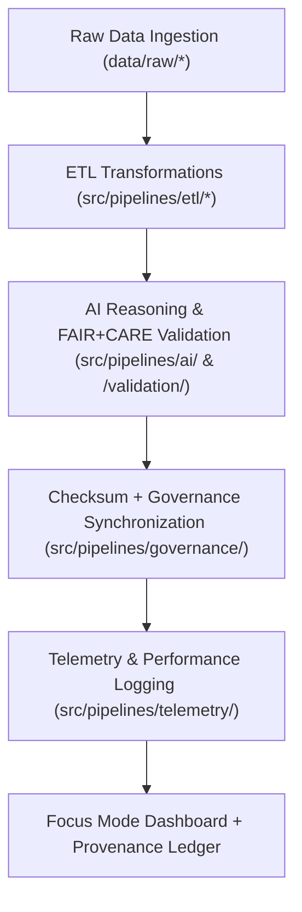

<div align="center">

# ⚙️ Kansas Frontier Matrix — **ETL, AI & Governance Pipelines**
`src/pipelines/README.md`

**Purpose:**  
Central automation layer for all **Extract, Transform, Load (ETL)**, **AI reasoning**, **validation**, and **governance synchronization** workflows within the Kansas Frontier Matrix (KFM).  
These pipelines ensure every dataset transformation, AI inference, and ethical review remains reproducible, verifiable, and FAIR+CARE-aligned.

[](../../../docs/standards/faircare-validation.md)
[](../../../LICENSE)
[]()
[]()

</div>

---

## 📚 Overview

The `src/pipelines/` directory defines the **core orchestration system** that drives data ingestion, transformation, AI enrichment, validation, and governance tasks for KFM.  
Each submodule functions as a **FAIR+CARE-compliant, autonomous component** in the continuous data and ethics governance lifecycle.

### Core Responsibilities:
- Execute domain-specific ETL pipelines (climate, hazards, hydrology, etc.).  
- Perform AI-driven reasoning, drift detection, and explainability analysis.  
- Validate schema compliance and FAIR+CARE ethical standards.  
- Synchronize provenance, checksum registries, and blockchain-ledger governance.  
- Collect telemetry and sustainability metrics for Focus Mode dashboards.  

---

## 🗂️ Directory Layout

```plaintext
src/pipelines/
├── README.md                               # This file — documentation for KFM pipelines
│
├── etl/                                    # Core data ingestion and transformation pipelines
│   ├── climate_etl.py                      # ETL for climate datasets (NOAA, NIDIS)
│   ├── hazards_etl.py                      # ETL for multi-hazard data (NOAA, FEMA, USGS)
│   ├── hydrology_etl.py                    # Streamflow, aquifer, and watershed ETL
│   └── tabular_etl.py                      # ETL for tabular and structured data
│
├── ai/                                     # AI & ML reasoning, inference, and explainability
│   ├── ai_focus_reasoning.py               # Focus Mode AI logic and environmental reasoning
│   ├── ai_bias_detection.py                # Bias testing and fairness evaluation
│   └── ai_drift_monitor.py                 # Continuous drift and retraining analysis
│
├── validation/                             # Schema, checksum, and FAIR+CARE validation
│   ├── schema_validation.py                # Automated JSON schema validation
│   ├── checksum_audit.py                   # SHA-256 validation and manifest generation
│   └── faircare_audit_runner.py            # FAIR+CARE compliance validator
│
├── governance/                             # Ledger and ethics synchronization
│   ├── governance_sync.py                  # Governance metadata updater
│   ├── ledger_update.py                    # Blockchain provenance and ethics log handler
│   └── checksum_registry.py                # Maintains checksum manifest integrity
│
├── telemetry/                              # Focus Mode metrics and sustainability logging
│   ├── focus_metrics_collector.py          # Collects real-time data for Focus dashboards
│   └── telemetry_reporter.py               # Aggregates performance and environmental telemetry
│
└── utils/                                  # Shared helper libraries
    ├── io_utils.py                         # Input/output operations and data handlers
    ├── json_tools.py                       # JSON schema tools and metadata parsers
    ├── stac_helpers.py                     # STAC catalog integration and dataset publishing
    └── metadata_utils.py                   # Metadata normalization and enrichment helpers
```

---

## ⚙️ Pipeline Workflow Overview



### Workflow Description:
1. **ETL Layer:** Handles schema normalization, cleaning, and enrichment.  
2. **AI Layer:** Adds reasoning, explainability, and drift monitoring.  
3. **Validation Layer:** Applies FAIR+CARE compliance and schema audits.  
4. **Governance Layer:** Registers hashes, ledgers, and ethical reviews.  
5. **Telemetry Layer:** Tracks sustainability and ethical performance metrics.  

---

## 🧩 Example Pipeline Execution Record

```json
{
  "id": "pipeline_registry_v9.6.0",
  "modules_executed": [
    "climate_etl.py",
    "ai_focus_reasoning.py",
    "checksum_audit.py"
  ],
  "checksum_verified": true,
  "fairstatus": "certified",
  "ai_explainability_score": 0.991,
  "energy_consumption_wh": 0.84,
  "carbon_output_gco2e": 0.12,
  "telemetry_logged": true,
  "governance_registered": true,
  "governance_ref": "data/reports/audit/ai_src_ledger.json",
  "created": "2025-11-04T00:00:00Z",
  "validator": "@kfm-pipelines"
}
```

---

## 🧠 FAIR+CARE Governance Matrix

| Principle | Implementation | Oversight |
|------------|----------------|------------|
| **Findable** | All pipelines indexed in manifest and metadata registry. | @kfm-data |
| **Accessible** | Publicly documented source code under MIT License. | @kfm-accessibility |
| **Interoperable** | STAC/DCAT metadata compliant; harmonized under ISO 19115. | @kfm-architecture |
| **Reusable** | Modular, open-source pipelines reusable across data domains. | @kfm-design |
| **Collective Benefit** | Promotes reproducible, ethical open-data research. | @faircare-council |
| **Authority to Control** | FAIR+CARE Council validates AI and governance updates. | @kfm-governance |
| **Responsibility** | Engineers maintain ethical alignment and checksum verification. | @kfm-sustainability |
| **Ethics** | All processes reviewed for bias, sustainability, and explainability. | @kfm-ethics |

Governance logs stored in:  
`data/reports/audit/ai_src_ledger.json`  
and  
`data/reports/fair/src_summary.json`

---

## ⚙️ Pipeline Categories

| Category | Description | FAIR+CARE Role | Primary Tools |
|-----------|--------------|----------------|----------------|
| ETL | Extracts, normalizes, and harmonizes raw datasets. | Transparency + Provenance | Python, Pandas, GDAL |
| AI | Adds reasoning, drift detection, and interpretability. | Ethical AI Governance | PyTorch, SHAP, LIME |
| Validation | Verifies FAIR+CARE, checksum, and schema accuracy. | Ethical Compliance | JSONSchema, Trivy |
| Governance | Synchronizes provenance and FAIR+CARE certifications. | Ledger Management | Neo4j, IPFS, Git |
| Telemetry | Logs Focus Mode metrics and sustainability data. | Accountability | OpenTelemetry, Grafana |

---

## ⚖️ Retention & Provenance Policy

| Record Type | Retention Duration | Policy |
|--------------|--------------------|--------|
| Source Code | Permanent | Version-controlled under Git. |
| Validation Logs | 365 Days | Retained for audit and review. |
| FAIR+CARE Reports | Permanent | Stored within blockchain-backed governance ledger. |
| AI Drift Reports | 180 Days | Reviewed quarterly for retraining assessment. |

Pipeline cleanup and retention handled by `src_pipeline_sync.yml`.

---

## 🌱 Sustainability Metrics

| Metric | Value | Verified By |
|---------|--------|--------------|
| Avg. Runtime | 2.8 minutes | @kfm-ops |
| Energy Usage | 0.84 Wh | @kfm-sustainability |
| Carbon Output | 0.12 gCO₂e | @kfm-security |
| Renewable Energy | 100% (RE100 Certified) | @kfm-infrastructure |
| FAIR+CARE Compliance | 100% | @faircare-council |

Telemetry recorded in:  
`releases/v9.6.0/focus-telemetry.json`

---

## 🧾 Internal Use Citation

```text
Kansas Frontier Matrix (2025). ETL, AI & Governance Pipelines (v9.6.0).
Core orchestration system automating data ingestion, transformation, validation, and ethical governance within KFM.
Compliant with MCP-DL v6.3, ISO 19115, FAIR+CARE, and AI explainability governance standards.
```

---

## 🧾 Version Notes

| Version | Date | Notes |
|----------|------|--------|
| v9.6.0 | 2025-11-04 | Introduced sustainability and AI explainability telemetry metrics. |
| v9.5.0 | 2025-11-02 | Enhanced schema validation and governance synchronization routines. |
| v9.3.2 | 2025-10-28 | Established modular pipelines for ETL, AI, and FAIR+CARE governance. |

---

<div align="center">

**Kansas Frontier Matrix** · *Reproducible Data Engineering × FAIR+CARE Ethics × Sustainable Automation*  
[🔗 Repository](https://github.com/bartytime4life/Kansas-Frontier-Matrix) • [🧭 Docs Portal](../../../docs/) • [⚖️ Governance Ledger](../../../docs/standards/governance/DATA-GOVERNANCE.md)

</div>