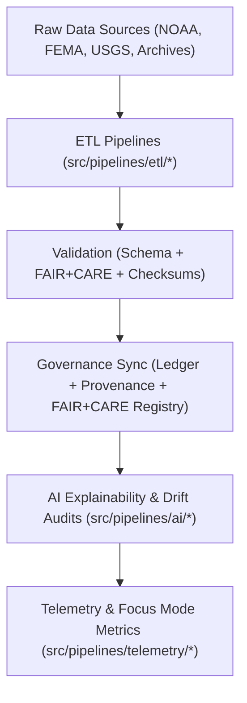

<div align="center">

# 🧬 Kansas Frontier Matrix — **Pipeline Framework**
`src/pipelines/README.md`

**Purpose:**  
Core FAIR+CARE-certified **automation framework for data, AI, and governance pipelines** powering the Kansas Frontier Matrix (KFM).  
This layer orchestrates ingestion, transformation, validation, and telemetry operations across all scientific and historical domains.

[](../../../docs/standards/faircare-validation.md)
[](../../../LICENSE)
[](../../../docs/architecture/repo-focus.md)

</div>

---

## 📚 Overview

The `src/pipelines/` directory implements KFM’s full **FAIR+CARE automation suite** — including ETL, AI explainability, schema validation, and governance synchronization pipelines.  
Each submodule functions independently yet interoperates through shared data contracts and checksum registries, ensuring every workflow is **reproducible, auditable, and ethically governed**.

### Core Responsibilities
- Execute domain-specific ETL processes for raw and tabular data.  
- Perform FAIR+CARE schema and checksum validation during all transformations.  
- Run AI explainability and drift monitoring under ethical governance rules.  
- Maintain continuous synchronization with governance ledgers and telemetry dashboards.  

---

## 🗂️ Directory Layout

```plaintext
src/pipelines/
├── README.md                              # This file — documentation for pipeline framework
│
├── etl/                                   # Core data extraction and transformation pipelines
│   ├── climate_etl.py
│   ├── hazards_etl.py
│   ├── hydrology_etl.py
│   ├── tabular_etl.py
│   └── landcover_etl.py
│
├── ai/                                    # Focus Mode AI reasoning and explainability workflows
│   ├── ai_focus_reasoning.py
│   ├── ai_bias_detection.py
│   ├── ai_drift_monitor.py
│   └── ai_explainability_audit.py
│
├── validation/                            # Schema, FAIR+CARE, and checksum validation automation
│   ├── schema_validation.py
│   ├── faircare_audit_runner.py
│   ├── checksum_audit.py
│   └── iso_cf_compliance.py
│
├── governance/                            # Provenance, ledger synchronization, and checksum management
│   ├── governance_sync.py
│   ├── ledger_update.py
│   ├── checksum_registry.py
│   └── faircare_registry.py
│
├── telemetry/                             # Performance metrics and sustainability monitoring
│   ├── focus_metrics_collector.py
│   ├── telemetry_reporter.py
│   ├── performance_analyzer.py
│   └── energy_efficiency_tracker.py
│
└── utils/                                 # Helper modules and utility functions
    ├── io_utils.py
    ├── json_tools.py
    ├── stac_helpers.py
    └── metadata_utils.py
```

---

## ⚙️ Pipeline Workflow



### Workflow Description
1. **ETL Processing:** Extracts, transforms, and loads multi-domain datasets into schema-compliant formats.  
2. **Validation:** Ensures accuracy, integrity, and FAIR+CARE ethics compliance for all processed data.  
3. **Governance:** Synchronizes artifacts with blockchain-backed provenance ledgers.  
4. **AI Auditing:** Monitors Focus Mode reasoning for bias and drift.  
5. **Telemetry:** Tracks system performance, energy sustainability, and transparency metrics.  

---

## 🧩 Example Pipeline Metadata Record

```json
{
  "id": "src_pipelines_registry_v9.5.0_2025Q4",
  "pipelines_executed": [
    "climate_etl.py",
    "ai_focus_reasoning.py",
    "governance_sync.py"
  ],
  "records_processed": 584720,
  "checksum_verified": true,
  "fairstatus": "certified",
  "ai_explainability_score": 0.993,
  "energy_efficiency_wh": 22.3,
  "governance_registered": true,
  "telemetry_ref": "releases/v9.5.0/focus-telemetry.json",
  "governance_ref": "reports/audit/ai_src_pipelines_ledger.json",
  "created": "2025-11-02T23:59:00Z",
  "validator": "@kfm-pipelines"
}
```

---

## 🧠 FAIR+CARE Governance Matrix

| Principle | Implementation |
|------------|----------------|
| **Findable** | Pipelines indexed by data domain, checksum, and provenance records. |
| **Accessible** | Open-source automation under MIT License and FAIR+CARE review. |
| **Interoperable** | Modular Python design compliant with FAIR, ISO, and DCAT schemas. |
| **Reusable** | Shared library functions ensure consistent reproducibility. |
| **Collective Benefit** | Fosters transparent, open scientific and historical data practices. |
| **Authority to Control** | FAIR+CARE Council certifies all new and updated pipelines. |
| **Responsibility** | Developers and validators maintain ethics and governance standards. |
| **Ethics** | All automation adheres to AI accountability and open data principles. |

Governance logs and validation outputs stored in:  
`reports/audit/ai_src_pipelines_ledger.json` • `reports/fair/src_pipelines_summary.json`

---

## ⚙️ Pipeline Modules Summary

| Module | Purpose | FAIR+CARE Function |
|---------|----------|--------------------|
| `etl/` | Handles extraction, transformation, and data normalization. | Ensures reproducible FAIR+CARE workflows. |
| `validation/` | Validates schema compliance and ethical governance standards. | FAIR+CARE audit automation. |
| `ai/` | Runs explainability and drift monitoring pipelines. | Ethical AI transparency assurance. |
| `governance/` | Updates ledgers and checksum registries for provenance tracking. | Provenance validation and ethics registry. |
| `telemetry/` | Monitors sustainability and energy efficiency metrics. | FAIR+CARE environmental compliance. |
| `utils/` | Provides shared functions for consistency and maintainability. | Reusable FAIR+CARE helper toolkit. |

---

## 🧾 Retention Policy

| Asset Type | Retention Duration | Policy |
|-------------|--------------------|--------|
| Source Pipelines | Permanent | Version-controlled under FAIR+CARE governance. |
| Validation Reports | 365 days | Retained for reproducibility and compliance review. |
| Telemetry Logs | 90 days | Archived post Focus Mode reporting. |
| Governance Records | Permanent | Stored immutably in blockchain provenance ledger. |

Cleanup managed through `pipelines_cleanup.yml`.

---

## 🧾 Internal Use Citation

```text
Kansas Frontier Matrix (2025). Pipeline Framework (v9.5.0).
FAIR+CARE-certified automation suite managing data ingestion, validation, AI, and governance workflows.
Ensures transparency, sustainability, and reproducibility under MCP-DL v6.3 and ISO compliance.
```

---

## 🧾 Version Notes

| Version | Date | Notes |
|----------|------|--------|
| v9.5.0 | 2025-11-02 | Added energy efficiency telemetry and AI explainability integration. |
| v9.3.2 | 2025-10-28 | Improved validation and governance synchronization layers. |
| v9.3.0 | 2025-10-26 | Established pipeline framework for multi-domain FAIR+CARE automation. |

---

<div align="center">

**Kansas Frontier Matrix** · *Automation × FAIR+CARE Ethics × Provenance Assurance*  
[🔗 Repository](https://github.com/bartytime4life/Kansas-Frontier-Matrix) • [🧭 Docs Portal](../../../docs/) • [⚖️ Governance Ledger](../../../docs/standards/governance/)

</div>
