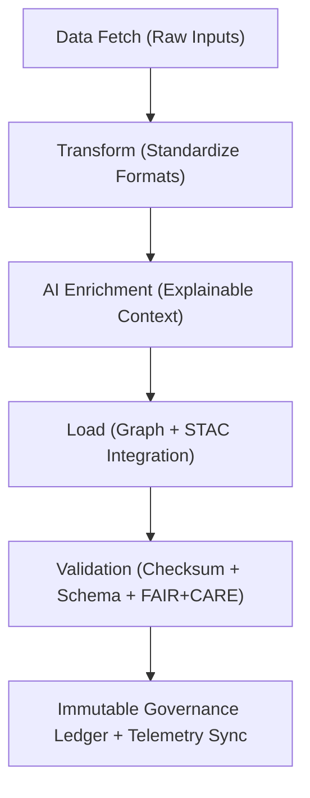

<div align="center">

# 🔄 Kansas Frontier Matrix — **Data Pipelines & Workflow Orchestration**
`src/pipelines/README.md`

**Purpose:** Documents all automated data pipelines responsible for ETL (Extract, Transform, Load), AI integration, and governance synchronization across the Kansas Frontier Matrix system.  
Implements FAIR+CARE-aligned lifecycle governance to ensure transparency, provenance, and reproducibility for all data transformations.

[](../../.github/workflows/pipeline-validate.yml)  
[](../../docs/standards/faircare-validation.md)  
[](../../docs/architecture/repo-focus.md)

</div>

---

## 📚 Overview

The **Pipelines Module** orchestrates data ingestion, transformation, enrichment, AI inference, and governance reporting within the Kansas Frontier Matrix.  
All workflows adhere to FAIR+CARE ethical standards and produce immutable provenance logs for every stage of data processing.

**Core Objectives:**
- ⚙️ Standardize ETL workflows for all data domains (maps, treaties, environment, AI)  
- 🧩 Integrate AI-driven enrichment with ethical explainability  
- ⚖️ Embed FAIR+CARE governance and telemetry at each stage  
- 🧾 Ensure reproducible transformations with full provenance chain logging  
- 🔍 Maintain schema, checksum, and metadata validation across all processes  

---

## 🗂️ Directory Layout

```plaintext
src/pipelines/
├── README.md                     # This file — pipeline documentation and governance reference
│
├── fetch/                        # Data extraction from external APIs and archives
│   ├── fetch_stac.py              # Downloads and validates STAC metadata
│   ├── fetch_treaties.py          # Retrieves historical treaty documents and scans
│   └── fetch_environmental.py     # Collects NOAA/USGS environmental datasets
│
├── transform/                    # Data transformation and normalization scripts
│   ├── normalize_geojson.py       # Normalizes GeoJSON spatial datasets
│   ├── clean_tabular.py           # Standardizes CSV and tabular data formats
│   └── enrich_metadata.py         # Adds FAIR+CARE metadata to all datasets
│
├── enrich/                       # AI-driven enrichment and contextual tagging
│   ├── ai_contextualize.py        # Adds AI-generated summaries and explanations
│   ├── provenance_embedder.py     # Embeds provenance and governance lineage
│   └── faircare_validator.py      # Validates datasets against FAIR+CARE criteria
│
├── load/                         # Loading and integration into KFM data layers
│   ├── load_graph.py              # Uploads entities and relationships into Neo4j
│   ├── load_stac_catalog.py       # Registers datasets into STAC/DCAT catalogs
│   └── load_focus_metadata.py     # Integrates AI summaries into governance index
│
└── validation/                   # Validation and verification routines
    ├── checksum_verify.py         # Validates file integrity and manifest checksums
    ├── schema_validate.py         # Checks data schema alignment with contract v3
    └── governance_sync.py         # Pushes validation results to Immutable Ledger
```

---

## ⚙️ Example Workflows

### 📦 Fetch & Normalize Data
```bash
python src/pipelines/fetch/fetch_stac.py --source "NOAA" --output data/raw/noaa_stac.json
python src/pipelines/transform/normalize_geojson.py --input data/raw/noaa_stac.json --output data/processed/noaa_clean.geojson
```

### 🧠 Enrich with AI Context
```bash
python src/pipelines/enrich/ai_contextualize.py \
  --input data/processed/noaa_clean.geojson \
  --output data/processed/noaa_contextualized.geojson \
  --model src/ai/models/focus_transformer_v1
```

### ⚖️ Validate & Load into Graph
```bash
python src/pipelines/validation/checksum_verify.py --input data/processed/noaa_contextualized.geojson
python src/pipelines/load/load_graph.py --input data/processed/noaa_contextualized.geojson --graph neo4j://localhost:7687
```

---

## 🧩 FAIR+CARE Integration

| Stage | FAIR Principle | CARE Principle | Output |
|--------|----------------|----------------|---------|
| **Fetch** | Findable / Accessible | Responsibility | `data/raw/` datasets |
| **Transform** | Interoperable / Reusable | Ethics | `data/processed/` datasets |
| **Enrich (AI)** | Transparent / Explainable | Collective Benefit | `data/processed/contextualized/` datasets |
| **Load** | Traceable / Accountable | Authority | Graph & STAC registration logs |

Governance outputs are synchronized with:
```
reports/audit/governance-ledger.json
releases/v9.4.0/focus-telemetry.json
```

---

## 🔗 Pipeline Governance Workflow



**Workflow Summary:**
1. External datasets fetched via FAIR+CARE-approved APIs or archives.  
2. Data transformed into normalized open standards (GeoJSON, CSV, STAC).  
3. AI enrichment adds contextual metadata and provenance.  
4. All stages validated and logged in governance ledger for auditability.  

---

## 🧠 Governance & Telemetry Integration

Each pipeline operation emits telemetry and validation events:

```json
{
  "pipeline": "fetch_transform_enrich_load",
  "stage": "enrich",
  "dataset": "noaa_clean.geojson",
  "records_processed": 4125,
  "checksum_verified": true,
  "faircare_compliant": true,
  "governance_hash": "c9d7f81ea34a9724cf6f19efc95b73a01de45a1c8ff921c9d6b012bd5632fa43",
  "timestamp": "2025-11-02T00:00:00Z"
}
```

Telemetry Schema:  
`schemas/telemetry/pipelines-telemetry-v1.json`

Telemetry Outputs:
```
reports/pipelines/execution-events.json
reports/audit/governance-ledger.json
releases/v9.4.0/focus-telemetry.json
```

---

## 🧩 Standards & Compliance Mapping

| Standard | Domain | Implementation |
|-----------|----------|----------------|
| **MCP-DL v6.4.3** | Documentation-first ETL lifecycle governance | This README + pipeline scripts |
| **FAIR+CARE** | Ethical and reproducible data handling | Validation and telemetry stages |
| **ISO 19115** | Metadata lineage and spatial documentation | Data schema and provenance |
| **ISO 23894** | AI lifecycle and enrichment ethics | AI contextual enrichment layer |
| **DCAT / STAC 1.0.0** | Dataset interoperability | STAC/DCAT ingestion scripts |
| **JSON-LD** | Provenance and governance metadata | Provenance embedding in pipeline outputs |

---

## 🛡️ Security, Integrity & Observability

- **Integrity:** Each dataset validated via SHA-256 and checksum manifest.  
- **Transparency:** FAIR+CARE compliance verified during every pipeline stage.  
- **Reproducibility:** All configurations and logs version-controlled under MCP-DL.  
- **Governance:** Immutable ledger synchronization ensures traceable workflows.  

Governance Reports:
```
reports/pipelines/validation-summary.json
reports/audit/governance-ledger.json
releases/v9.4.0/manifest.zip
```

---

## 🧾 Version History

| Version | Date | Author | Summary |
|----------|------|---------|----------|
| v9.4.0 | 2025-11-02 | @kfm-data | Added complete ETL + AI pipeline documentation with governance linkage. |
| v9.3.3 | 2025-11-01 | @kfm-etl | Improved FAIR+CARE validation and checksum workflow automation. |
| v9.3.2 | 2025-10-29 | @bartytime4life | Enhanced AI enrichment and provenance embedding. |
| v9.3.1 | 2025-10-27 | @kfm-architecture | Added validation synchronization and telemetry integration. |
| v9.3.0 | 2025-10-25 | @kfm-governance | Established reproducible pipeline architecture under MCP-DL v6.4.3. |

---

<div align="center">

**Kansas Frontier Matrix — Ethical, Transparent, and Reproducible Data Pipelines**  
*“Every record validated. Every dataset governed. Every process accountable.”* 🔗  
📍 `src/pipelines/README.md` — FAIR+CARE-certified documentation for ETL and AI pipeline orchestration within the Kansas Frontier Matrix.

</div>
