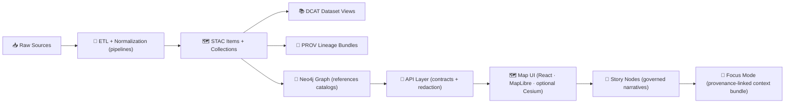

# 🧪 `src/pipelines/` — ETL + Simulations (Provenance-First)


> [!NOTE]
> This folder is the **data refinery** for Kansas Frontier Matrix (KFM): it turns **raw evidence** into **curated datasets** + **metadata catalogs** + **lineage logs**, so downstream layers (DB → API → UI → Story Nodes → Focus Mode) can trust what they’re showing.

---

## 🧭 What lives here?

`src/pipelines/` contains offline / batch-oriented code that:
- 🧲 **Ingests** source material (CSVs, shapefiles, rasters, PDFs, scans, etc.)
- 🧼 **Normalizes & transforms** into stable, reviewable outputs
- 🧾 Emits the **boundary artifacts** that “publish” a dataset into KFM:
  - 🗺️ **STAC** (items + collections)
  - 📚 **DCAT** (dataset-level catalog record)
  - 🧬 **PROV** (lineage bundle)
- 🧱 Optionally **loads/indexes** into databases (PostGIS / Neo4j) *after* the artifacts exist
- 🚫 **Never** relies on manual edits of processed outputs

---

## 🔒 Core invariants (non‑negotiable)

### 1) 🧱 Pipeline ordering is absolute
KFM data moves in this order, always:

```
Raw → Processed → Catalogs/PROV → Database → API → UI → Story Nodes → Focus Mode
```

If you’re tempted to “skip” a stage (e.g., push directly into UI), you’re probably breaking the system contract.

### 2) 🔁 Deterministic + idempotent
A pipeline must:
- produce the **same outputs** given the same inputs + config
- be **safe to re-run** without duplicating/creating new copies of the same dataset

### 3) 🧬 Provenance first
Nothing is “published” into KFM without:
- descriptive metadata (STAC/DCAT)
- lineage (PROV)

### 4) 🚫 No ad‑hoc edits
If something is wrong in `data/processed/…`, the fix is:
✅ update pipeline and re-run  
❌ do *not* hand-edit the output file

---

## 🗺️ System flow (high-level)



---

## 📦 Data staging contract (where pipelines read/write)

> [!TIP]
> The **folder is the API**. Keep stages clean, predictable, and reviewable.

### Required staging layout

| Stage | Folder | Rules |
|------:|--------|-------|
| 📥 Raw (immutable) | `data/raw/<domain>/…` | *Write once, then read-only.* Pipelines **must not** modify raw files. |
| 🧰 Work (scratch) | `data/work/<domain>/…` | Intermediate artifacts okay. Safe to delete/regenerate. |
| ✅ Processed (final) | `data/processed/<domain>/…` | Only pipeline outputs. No manual edits. Reviewable diffs. |

### Required publication artifacts (boundary artifacts)

| Artifact | Folder | Why it exists |
|---------|--------|---------------|
| 🗺️ STAC Collections | `data/stac/collections/…` | Collection-level metadata |
| 🗺️ STAC Items | `data/stac/items/…` | Item-level spatial/temporal metadata + asset links |
| 📚 DCAT | `data/catalog/dcat/…` | Dataset discovery layer |
| 🧬 PROV | `data/prov/…` *(or `data/provenance/…` in some layouts)* | Full lineage + agents + parameters |

> [!IMPORTANT]
> A dataset isn’t “published” until **processed data + STAC + DCAT + PROV** exist.

---

## 🧩 Plugin mindset (how pipelines should scale)

KFM’s pipeline system is designed to grow via **drop-in modules**:
- Create a new pipeline file/module
- Follow conventions
- Register it (manifest/registry)
- Runner discovers + executes it

This keeps contributions isolated and reviewable.

---

## 🗂️ Suggested folder layout (recommended)

> [!NOTE]
> This is a **recommended** structure to keep things consistent as the repo scales. Adjust to match the actual implementation, but keep the ideas.

```text
📁 src/
└─ 📁 pipelines/                                🏗️ ETL + publishing pipelines (raw → processed → STAC/DCAT/PROV)
   ├─ 📄 README.md                               📘 overview, conventions, and how to run pipelines
   ├─ 🧭 runner.py                               🚀 orchestrates one/all pipelines (CLI entry)
   ├─ 🧾 manifest.yaml                           ✅ pipeline registry (plugin discovery + enable/disable)
   │
   ├─ 📁 lib/                                    🧰 shared pipeline library (reusable primitives)
   │  ├─ 🧩 io.py                                 📥📤 common readers/writers (files, cloud, db adapters)
   │  ├─ 🔐 hashing.py                            🧬 checksums + content addressing + manifests
   │  ├─ 🪵 logging.py                            🧾 run logs + structured logging helpers
   │  ├─ 🛰️ stac.py                               🛰️ STAC emit helpers (collections/items/assets)
   │  ├─ 🗂️ dcat.py                               🧾 DCAT emit helpers (JSON-LD dataset/distributions)
   │  ├─ 🧬 prov.py                               🧬 PROV emit helpers (activities/agents/entities)
   │  └─ ✅ validate.py                            🛡️ validation gates (schemas/profiles/policy hooks)
   │
   ├─ 📁 domains/                                🧩 domain pipelines (one responsibility each)
   │  └─ 📁 <domain_name>/                        🧭 e.g., hydrology/, historical/, climate/, transportation/
   │     ├─ 🧩 pipeline.py                        🏗️ pipeline entry (one dataset or dataset family)
   │     ├─ 🧾 config.example.yaml                ⚙️ example config (safe defaults; no secrets)
   │     └─ 📁 tests/                             🧪 domain-specific tests (unit/integration as needed)
   │
   └─ 📁 simulations/                            🧪 deterministic sims (fixed seeds, reproducible runs)
      └─ 🧪 climate_scenario.py                   🌦️ scenario generator (deterministic; versionable outputs)
    ...
```

---

## 🏃 Running pipelines (local/dev)

Because pipelines must be **non-interactive**, the usual execution pattern is:

1) ✅ Ensure raw inputs exist under `data/raw/<domain>/…`  
2) 🧪 Run pipeline(s)  
3) 🧾 Verify boundary artifacts exist (STAC/DCAT/PROV)  
4) 🧱 (Optional) Load/index to DB  
5) 🧱 Validate API/UI can consume it

### Example CLI patterns (adapt to the repo’s runner)

```bash
# Run one pipeline by id/name
python -m src.pipelines.runner --pipeline census_1900 --config configs/dev.yaml

# Run all registered pipelines
python -m src.pipelines.runner --all --config configs/dev.yaml

# Dry-run (compute what would change)
python -m src.pipelines.runner --pipeline landsat --dry-run
```

> [!TIP]
> Pipelines should detect “no changes” (e.g., via checksums/version checks) and exit cleanly without duplicating outputs.

---

## ✍️ Adding a new pipeline (checklist)

### ✅ Minimum steps
- [ ] Create a raw staging folder: `data/raw/<new-domain>/`
- [ ] Implement pipeline module/script under `src/pipelines/domains/<new-domain>/`
- [ ] Ensure it writes:
  - [ ] intermediates to `data/work/<new-domain>/`
  - [ ] finals to `data/processed/<new-domain>/`
- [ ] Emit boundary artifacts:
  - [ ] STAC Collection + Item(s)
  - [ ] DCAT dataset entry
  - [ ] PROV lineage bundle
- [ ] Register the pipeline (manifest/registry)
- [ ] Add a small domain runbook: `docs/data/<new-domain>/README.md`
- [ ] Add tests (even small “smoke tests”)
- [ ] Confirm re-runs are deterministic + idempotent

---

## 🧬 Evidence artifacts (AI / analysis outputs)

If a pipeline produces “derived” outputs (OCR text, model predictions, simulations, inferred layers), treat them as **first-class datasets**:

- ✅ store in `data/processed/…`
- ✅ catalog in STAC/DCAT
- ✅ trace in PROV (include method + parameters + confidence)
- ✅ integrate with graph carefully (explicit provenance pointers)
- ✅ expose only through governed APIs (never hard-code into UI)

---

## 🧾 Metadata rules of thumb

### STAC
- Must link to the actual processed asset(s)
- Must include attribution + license info
- Must be spatial/temporal honest (bbox/date range)

### DCAT
- Must make dataset discoverable (title/desc/keywords/license)
- Should link to STAC or direct distributions

### PROV
- Must capture:
  - input entities (raw files + checksums/URLs)
  - activities (pipeline run + timestamps + params)
  - agents (script version + runner identity)
- Should support auditability (“what produced this?”)

---

## 🧯 Troubleshooting quick hits

- 🧱 **Docker volumes & permissions**: if containers can’t write to `data/`, fix mount permissions or container user mapping.
- 🔌 **Port conflicts**: if Postgres/Neo4j ports are already in use, change compose mappings.
- 🐘 **Big datasets**: prefer LFS / external blobs + checksums where needed, but keep identities tracked in Git.

---

## 🧠 PR review rubric (for pipelines)

> [!IMPORTANT]
> If a PR adds/changes processed data, reviewers should demand:
- [ ] deterministic reruns
- [ ] no raw edits
- [ ] STAC/DCAT/PROV present + consistent
- [ ] versioning/identity strategy (hashes/ids)
- [ ] docs/runbook updated
- [ ] validation gates pass (schemas/profiles)

---

## 🔗 Helpful pointers
- `data/` is the single place to understand **what stage a file is in**
- `docs/standards/` should define profiles (STAC/DCAT/PROV)
- `docs/templates/` should contain templates for new datasets + Story Nodes
- Keep pipelines boring, repeatable, and auditable ✅
