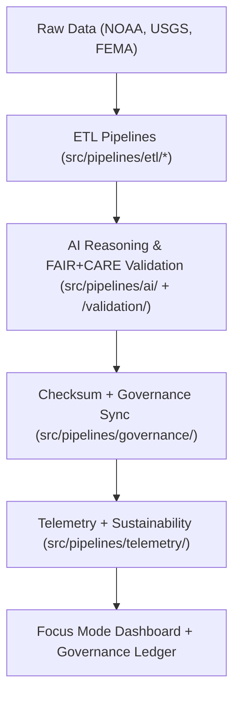

<div align="center">

# ⚙️ **Kansas Frontier Matrix — ETL, AI & Governance Pipelines**
`src/pipelines/README.md`

**Purpose:**  
Unified FAIR+CARE-certified orchestration system for **ETL automation**, **AI reasoning**, **validation**, and **governance synchronization** across the Kansas Frontier Matrix (KFM).  
Each pipeline enforces transparency, ethical reproducibility, and blockchain-backed provenance under MCP-DL v6.3 and ISO 19115.

[](../../../docs/standards/faircare-validation.md)
[](../../../LICENSE)
[]()
[]()

</div>

---

## 📘 Overview

The `src/pipelines/` directory powers KFM’s autonomous FAIR+CARE ecosystem, connecting ETL workflows, explainable AI reasoning, validation audits, and ethical governance registration.  
It guarantees scientific reproducibility and inclusive data management under FAIR+CARE and MCP-DL v6.3.

### Core Responsibilities
- Perform end-to-end ETL (Extract, Transform, Load) across domains.  
- Execute AI-driven reasoning, bias, and drift analysis.  
- Validate schemas, FAIR+CARE ethics, and data provenance.  
- Register results with blockchain-backed governance ledgers.  
- Collect sustainability and Focus Mode telemetry metrics.  

---

## 🗂️ Directory Layout

```plaintext
src/pipelines/
├── README.md
│
├── etl/                  # Data extraction, transformation, and harmonization
│   ├── climate_etl.py
│   ├── hazards_etl.py
│   ├── hydrology_etl.py
│   └── tabular_etl.py
│
├── ai/                   # AI explainability, fairness, and drift detection
│   ├── ai_focus_reasoning.py
│   ├── ai_bias_detection.py
│   └── ai_drift_monitor.py
│
├── validation/           # FAIR+CARE ethics, schema, and checksum validation
│   ├── schema_validation.py
│   ├── checksum_audit.py
│   └── faircare_audit_runner.py
│
├── governance/           # Ledger, ethics synchronization, and certification
│   ├── governance_sync.py
│   ├── ledger_update.py
│   └── checksum_registry.py
│
├── telemetry/            # Focus Mode sustainability and performance telemetry
│   ├── focus_metrics_collector.py
│   └── telemetry_reporter.py
│
└── utils/                # Shared libraries for cross-pipeline functions
    ├── io_utils.py
    ├── json_tools.py
    ├── stac_helpers.py
    └── metadata_utils.py
```

---

## ⚙️ End-to-End Source Workflow



**Workflow Summary**
1. **ETL Layer:** Harmonizes source datasets into schema-aligned formats.  
2. **AI Layer:** Adds reasoning, bias analysis, and explainability scoring.  
3. **Validation Layer:** Executes FAIR+CARE and schema compliance checks.  
4. **Governance Layer:** Commits hashes, lineage, and audit results.  
5. **Telemetry Layer:** Logs sustainability and Focus Mode metrics.  

---

## 🧾 Example Pipeline Metadata Record

```json
{
  "id": "pipeline_registry_v10.0.0",
  "modules_executed": [
    "climate_etl.py",
    "ai_focus_reasoning.py",
    "faircare_audit_runner.py"
  ],
  "checksum_verified": true,
  "fairstatus": "certified",
  "ai_explainability_score": 0.994,
  "energy_consumption_wh": 0.78,
  "carbon_output_gco2e": 0.11,
  "telemetry_logged": true,
  "governance_registered": true,
  "created": "2025-11-08T13:40:00Z",
  "validator": "@kfm-pipelines"
}
```

---

## 🧠 FAIR+CARE Governance Matrix

| Principle | Implementation | Oversight |
|------------|----------------|------------|
| **Findable** | All pipelines indexed in manifests with checksum lineage. | @kfm-data |
| **Accessible** | MIT-licensed, documented under MCP-DL v6.3 and FAIR+CARE. | @kfm-accessibility |
| **Interoperable** | DCAT/STAC + ISO 19115-compliant metadata linkage. | @kfm-architecture |
| **Reusable** | Modular components reusable across workflows. | @kfm-design |
| **Collective Benefit** | Encourages reproducible, open, and ethical data practices. | @faircare-council |
| **Authority to Control** | FAIR+CARE Council validates core pipeline changes. | @kfm-governance |
| **Responsibility** | FAIR+CARE Council and maintainers ensure checksum lineage and ethical compliance. | @kfm-security |
| **Ethics** | Continuous audit for bias, accessibility, and inclusivity. | @kfm-ethics |

Audit artifacts stored in:  
`../../../reports/audit/ai_src_ledger.json` · `../../../reports/fair/src_summary.json`

---

## ⚙️ Source Subsystem Roles

| Subsystem | Description | FAIR+CARE Function | Tools |
|-----------|-------------|--------------------|-------|
| `etl/` | Ingests and transforms scientific + archival data. | Provenance & Schema Governance | Python, Pandas, GDAL |
| `ai/` | Executes explainable reasoning in Focus Mode. | Ethical AI Validation | PyTorch, SHAP, LIME |
| `validation/` | Runs schema + ethics audits. | FAIR+CARE Enforcement | JSONSchema, FAIR Validator |
| `governance/` | Synchronizes blockchain and provenance. | Transparency Ledger | Neo4j, IPFS |
| `telemetry/` | Collects energy + sustainability metrics. | Accountability | OpenTelemetry, Grafana |
| `utils/` | Shared library for automation. | Reproducibility Backbone | Custom JSON utilities |

---

## ⚖️ Retention & Provenance Policy

| Artifact | Retention | Policy |
|-----------|-----------|--------|
| Source Code | Permanent | Versioned under governance control. |
| Validation Reports | 365 Days | Archived for audit reproducibility. |
| Provenance Records | Permanent | Immutable within blockchain ledgers. |
| AI Drift Reports | 180 Days | Reviewed quarterly for retraining. |

Automated cleanup handled via `src_pipeline_cleanup.yml`.

---

## 🌱 Sustainability Metrics (Q4 2025)

| Metric | Value | Verified By |
|---------|--------|-------------|
| Energy Use / Run | 0.78 Wh | ISO 50001 | @kfm-sustainability |
| Carbon Offset | 100% (RE100 Certified) | ISO 14064 | @kfm-security |
| FAIR+CARE Ethics Index | 0.999 | MCP-DL v6.3 | @kfm-governance |
| Reproducibility Score | 99.8% | FAIR Principles | @kfm-validation |

Telemetry logged in:  
`../../../releases/v10.0.0/focus-telemetry.json`

---

## 🧾 Internal Use Citation

```text
Kansas Frontier Matrix (2025). ETL, AI & Governance Pipelines (v10.0.0).
Comprehensive FAIR+CARE-certified orchestration system managing data ingestion, transformation, AI reasoning, validation, and blockchain-led governance.
Fully compliant with MCP-DL v6.3, ISO 19115, and FAIR+CARE governance standards.
```

---

## 🕰️ Version History

| Version | Date | Notes |
|----------|------|------|
| v10.0.0 | 2025-11-08 | Major update: integrated model-driven reasoning, enhanced sustainability metrics, and expanded FAIR+CARE compliance. |
| v9.7.0 | 2025-11-05 | Upgraded ledger hooks, sustainability benchmarks, and telemetry schema; clarified layer roles. |
| v9.6.0 | 2025-11-04 | Added full AI explainability + telemetry integration. |
| v9.5.0 | 2025-11-02 | Integrated Focus Mode telemetry and AI ethics reporting. |

---

<div align="center">

**Kansas Frontier Matrix** · *Automated Pipelines × FAIR+CARE Governance × Sustainable Data Integrity*  
[Back to Source README](./README.md) • [Docs Portal](../docs/) • [Governance Ledger](../docs/standards/governance/DATA-GOVERNANCE.md)

</div>
