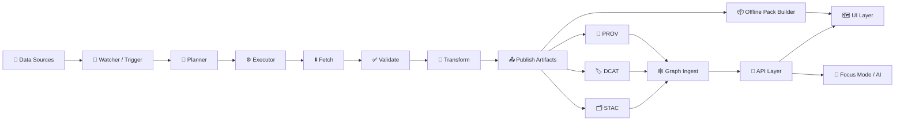

# 🧪 KFM Pipelines (`src/pipelines/`)


-orange)


> Pipelines are KFM’s **ingestion + ETL + enrichment + packaging** engine.  
> They turn messy sources into **versioned, queryable, map-ready evidence** — and keep every claim traceable back to its origin 🔎

---

## 🚦 Quick navigation

- [✨ What belongs here](#-what-belongs-here)
- [🗺️ End-to-end flow](#️-end-to-end-flow)
- [🧱 Core contracts](#-core-contracts)
- [📁 Repo touchpoints](#-repo-touchpoints)
- [▶️ Running pipelines](#️-running-pipelines)
- [🧰 Creating a new pipeline](#-creating-a-new-pipeline)
- [✅ Validation & policy gates](#-validation--policy-gates)
- [🧩 Pipeline types](#-pipeline-types)
- [📈 Ops: observability, backfills, drift](#-ops-observability-backfills-drift)
- [🔐 Security, privacy, ethics](#-security-privacy-ethics)
- [✅ Definition of Done](#-definition-of-done)
- [📚 References](#-references)

---

## ✨ What belongs here

`src/pipelines/` is the home for:

- **Ingestion pipelines** 📥  
  Fetch + validate + transform + publish datasets (batch or streaming), producing auditable artifacts and catalogs.

- **Enrichment pipelines** 🧠  
  OCR/NLP parsing, georeferencing, entity extraction, linking, and knowledge-graph enrichment.

- **Packaging pipelines** 📦  
  Build **map-ready** and **offline-ready** bundles (e.g., PMTiles/MBTiles, simplified GeoJSON, 3D-ready assets) for web + field use.

- **Graph pipelines** 🕸️  
  Deterministic graph ingestion + health checks (orphans, hub detection, schema constraints, consistency scans).

- **Narrative pipelines** 🧵  
  “Story Nodes”, **Pulse Threads**, and evidence manifests: short, timely updates that remain evidence-first.

- **AI pipelines** 🤖  
  Focus Mode support: retrieval, citations, governance logging, drift checks, and model lifecycle hooks.

> [!IMPORTANT]
> **Pipelines are contract-first.** If it can’t be validated, cataloged, and cited — it doesn’t ship.

---

## 🗺️ End-to-end flow



**Mental model:** pipelines create *evidence artifacts* ➜ catalogs + provenance ➜ graph ➜ API ➜ UI/AI.

---

## 🧱 Core contracts

### 1) Evidence-first publishing (STAC + DCAT + PROV) 🧾

Every “published” pipeline output should come with:

- **STAC**: spatial/temporal assets + items/collections (map layers, rasters, vectors, time series)
- **DCAT**: dataset discovery metadata (publisher, license, access, description)
- **PROV**: lineage (what inputs, what code/config, what transforms, what outputs)

> [!TIP]
> Treat STAC/DCAT/PROV as the **API boundary artifacts** between data engineering and the rest of KFM (UI, Focus Mode, governance, audits).

---

### 2) RunContext + Run Manifest 🔁

**RunContext** is the in-memory “passport” that flows through steps (config + run metadata).  
**Run Manifest** is the persisted, audit-ready summary of the run:

- pipeline name + version (often tied to git SHA or release tag)
- inputs (URIs, checksums, fetch receipts like ETag/Last-Modified)
- transforms (parameters, CRS/projection decisions, normalization)
- outputs (paths + checksums)
- catalogs + provenance pointers (STAC/DCAT/PROV locations)
- policy results (pass/fail + waiver references)

<details>
<summary><strong>📄 Example Run Manifest (illustrative)</strong></summary>

```yaml
pipeline: hydro_usgs_waterwatch
pipeline_version: "git:abcd1234"
run:
  run_id: "2026-01-23T18:01:22Z__hydro_usgs_waterwatch__sha256:9f3c..."
  started_at: "2026-01-23T18:01:22Z"
  mode: "incremental"   # or: full | backfill | streaming
inputs:
  - uri: "https://example.gov/usgs/waterwatch.csv"
    receipt:
      fetched_at: "2026-01-23T18:01:30Z"
      etag: "\"a1b2c3\""
      last_modified: "Tue, 21 Jan 2026 11:00:00 GMT"
    sha256: "..."
params:
  reprojection: "EPSG:4326"
  spatial_join: true
outputs:
  processed:
    - path: "data/processed/hydro/usgs_waterwatch/2026-01-23/waterwatch.parquet"
      sha256: "..."
  artifacts:
    - path: "data/processed/hydro/usgs_waterwatch/2026-01-23/checksums.sha256"
    - path: "data/audits/hydro_usgs_waterwatch/2026-01-23/run_manifest.yaml"
catalogs:
  stac: "data/stac/hydro/usgs_waterwatch/collection.json"
  dcat: "data/catalog/dcat/hydro/usgs_waterwatch.dataset.jsonld"
  prov: "data/prov/hydro/usgs_waterwatch/run_2026-01-23.prov.json"
policy:
  status: "pass"
  waivers: []
telemetry:
  ndjson: "data/audits/hydro_usgs_waterwatch/2026-01-23/telemetry.ndjson"
```

</details>

---

### 3) Receipts + checksums ✅

Fetch steps should be **receipt-based**:
- record URL, timestamp, status, headers (ETag/Last-Modified), and content hash  
- allow conditional fetch (If-None-Match / If-Modified-Since) when supported

Publish steps should be **checksum-based**:
- write `checksums.sha256` (or equivalent) alongside outputs
- ensure downstream steps can verify integrity quickly

---

### 4) Determinism + idempotency 🎯

Pipelines should be safe to re-run:

- **Deterministic outputs**: same inputs + same config + same code ➜ same artifact digests
- **Idempotent ingest**: avoid duplicates; treat the manifest digest as an idempotency key
- **Canonicalization**: normalize JSON (and other structured outputs) before hashing when applicable

> [!NOTE]
> If you’re doing geospatial analysis (buffers/distances), prefer a **projected CRS in meters** for those computations, then standardize outputs to the platform’s canonical CRS for publication.

---

## 📁 Repo touchpoints

This folder (`src/pipelines/`) doesn’t live in isolation. Pipelines interact with these “neighbors”:

```text
📦 repo/
├─ 🧠 src/
│  ├─ 🧪 pipelines/              # ← YOU ARE HERE
│  │  ├─ ingestion/              # base framework: watchers/fetchers/receipts/telemetry
│  │  ├─ <domain_pipelines>/     # e.g., hydro/, climate/, history/, ecology/ ...
│  │  └─ common/                 # shared helpers (formats, hashing, io, policy hooks)
│  └─ 🤖 reasoning/              # LLM + KG integration (Focus Mode, agents)
│
├─ 🗂️ data/
│  ├─ raw/                       # raw fetches + receipts
│  ├─ work/                      # scratch / intermediate artifacts
│  ├─ processed/                 # published datasets + tiles + bundles
│  ├─ stac/                      # STAC catalogs (collections/items)
│  ├─ catalog/                   # catalog index root
│  │  └─ dcat/                   # DCAT JSON-LD datasets/distributions
│  ├─ prov/                      # provenance bundles (PROV)
│  └─ audits/                    # run manifests, telemetry, policy results
│
├─ 📜 schemas/                   # schema contracts (STAC/DCAT/PROV + domain schemas)
├─ 🔐 policies/                  # OPA/Rego + conftest rules (and waivers)
├─ 🔌 api/                       # API layer (serves data, tiles, graph-backed queries)
├─ 🗺️ ui/                        # UI layer (map/timeline/narratives; provenance surfacing)
└─ 🧰 tools/                     # validators, migration tools, converters, scripts
```

---

## ▶️ Running pipelines

### Local dev 🧑‍💻

Most pipelines should expose a CLI (commonly via **Typer**) so you can:

- run a pipeline
- validate only
- backfill a date range
- run in dry-run mode
- emit catalogs / provenance without publishing artifacts (when useful)

Typical patterns:

```bash
# 1) discover commands
python src/pipelines/<pipeline>/cli.py --help

# 2) run with a manifest/config
python src/pipelines/<pipeline>/cli.py run --manifest data/raw/<pipeline>/manifest.yaml

# 3) validate only
python src/pipelines/<pipeline>/cli.py validate --manifest data/raw/<pipeline>/manifest.yaml

# 4) backfill
python src/pipelines/<pipeline>/cli.py backfill --start 1900-01-01 --end 1950-12-31
```

> [!TIP]
> Keep CLI commands “thin”: CLI ➜ RunContext ➜ pure steps.  
> This makes it easy for CI and WPE automation to call the same pipeline logic.

---

### Orchestrated runs (WPE: Watcher → Planner → Executor) 🤖

In production, pipelines are often triggered by the **Watcher–Planner–Executor** loop:

- **Watcher** detects: new upstream files, new API timestamps, anomalies, or schedule ticks
- **Planner** decides: what to run (incremental, backfill, rebuild tiles, refresh graph)
- **Executor** runs: pipeline steps (locally, in containers, or via worker queues)

Pipelines should therefore:
- support incremental runs
- be restartable
- emit structured telemetry
- fail fast on contract violations

---

## 🧰 Creating a new pipeline

### Recommended path (cookiecutter) 🍪

A cookiecutter template exists for scaffolding new pipelines (especially AI-assisted ones).  
Start here:

- `../../docs/guides/pipelines/kfm-ai-pipeline-cookiecutter.md`
- `../../docs/guides/pipelines/ingestion-guide.md`

---

### Suggested folder skeleton 📦

```text
src/pipelines/<pipeline_name>/
├─ cli.py                 # Typer CLI entrypoint
├─ pipeline.py             # orchestrates step order + RunContext
├─ config.py               # typed config model(s)
├─ steps/
│  ├─ fetch.py
│  ├─ validate.py
│  ├─ transform.py
│  ├─ publish.py
│  ├─ catalog.py           # STAC/DCAT
│  └─ prov.py              # PROV bundle
└─ tests/
   ├─ test_smoke.py
   └─ test_contracts.py
```

> [!IMPORTANT]
> **Ordering matters:** Fetch → Validate → Transform → Publish → Catalog → Graph  
> (…and “Publish” means “publish artifacts + checksums”, not “push to UI directly”.)

---

### Pipeline author checklist ✅

- [ ] Define a **contract**: input expectations + output schemas + sensitivity classification  
- [ ] Implement step order (fetch/validate/transform/publish/catalog/graph)
- [ ] Emit **receipts** and **checksums**
- [ ] Generate **STAC/DCAT/PROV** artifacts
- [ ] Add policy checks (OPA/Conftest) + waivers if absolutely required
- [ ] Add unit tests + an integration smoke test
- [ ] Document failure modes and backfill strategy
- [ ] Ensure UI/API consumption is possible *without bespoke glue code*

---

## ✅ Validation & policy gates

Pipelines are expected to enforce quality **before** artifacts become “official”.

### Contract validation 📜
- schema validation (domain schemas + STAC/DCAT/PROV profiles)
- required metadata fields (license, provenance pointers, sensitivity tags)
- CRS + bounding box sanity checks
- deterministic naming/versioning rules

### Policy validation 🔐
Common gate categories:

- **license & attribution**
- **sensitivity** (e.g., sensitive locations, cultural data, PII)
- **security** (secrets scanning, dependency policy, supply-chain attestations)
- **governance** (FAIR+CARE alignment checks; review requirements)

### CI / automation 🤝
Pipelines should be CI-friendly:
- lint/type-check/test
- validate catalogs and provenance bundles
- run “policy pack” checks on artifacts produced in PRs

> [!NOTE]
> If a pipeline is run by automation (WPE), the automation should still produce a **human-reviewable** PR or change record whenever policy requires it.

---

## 🧩 Pipeline types

### 1) Batch ingestion pipelines 📥
Best for: periodic government datasets, annual reports, static archives.

Outputs:
- processed dataset (GeoParquet/CSV/COG/GeoJSON…)
- STAC/DCAT/PROV
- graph ingest payload (optional)

---

### 2) Streaming ingestion pipelines 📡
Best for: sensors, time-series APIs, alerts.

Key patterns:
- incremental receipts + idempotency keys
- rollups/aggregations
- anomaly detection hooks for **Pulse Threads**

---

### 3) Historic map + document pipelines 🗺️📜
Best for: scanned maps, archival PDFs, journals, newspapers.

Typical steps:
- georeference scans ➜ Cloud-Optimized GeoTIFF (COG)
- OCR + NLP parsing ➜ extracted entities (places/dates/events)
- link extracts to map features via gazetteers or curated IDs
- catalog everything (STAC/DCAT/PROV) + graph edges

---

### 4) Geospatial asset build pipelines 🧱🌍
Best for: web map performance and offline distribution.

Examples of artifacts:
- PMTiles/MBTiles for vector tiles
- simplified geometries at multiple zoom levels
- 3D-ready assets for Cesium-style viewers (where applicable)

---

### 5) Graph maintenance pipelines 🕸️🩺
Best for: keeping the knowledge graph healthy.

Checks:
- orphan nodes / dangling references
- “hub” sanity checks (unexpected supernodes)
- constraint validation + schema drift detection

---

### 6) Narrative & Pulse pipelines 🧵⚡
**Pulse Threads** are short, geotagged, timely narrative updates backed by evidence.

A narrative pipeline should:
- generate or update a Story Node / Pulse Thread body (markdown or structured JSON)
- attach an **evidence manifest** (dataset IDs, query parameters, timestamps)
- ensure every fact can be traced through the graph and catalogs

> [!TIP]
> “Narratives are code.” Treat narrative outputs as versioned artifacts with provenance and policy gates.

---

### 7) AI / Focus Mode support pipelines 🤖🧭
These pipelines help the AI system remain:
- citeable
- auditable
- safe under governance rules

Common tasks:
- build retrieval indexes from catalogs/graph
- generate “model cards” or run records
- run bias/drift checks and store results in governance logs

---

### 8) Simulation / digital twin pipelines 🕰️🧪
Best for: “4D Kansas” scenarios (time-evolving models).

Rules:
- treat simulation outputs like datasets (catalog + PROV)
- publish uncertainty + assumptions explicitly (especially for Bayesian/ML outputs)
- support replay via manifest-driven determinism

---

## 📈 Ops: observability, backfills, drift

### Telemetry 📊
Each run should emit machine-readable telemetry (often NDJSON):
- step timing
- row/feature counts
- anomaly counts
- resource usage (optional but encouraged)

### Backfills 🔄
Backfills should be:
- manifest-driven (range + parameters)
- chunked for restartability
- idempotent across repeated runs

### Drift monitoring 📉
For AI and streaming pipelines:
- track data distribution shifts
- track model performance metrics
- open issues or generate review-ready PRs when thresholds are crossed

---

## 🔐 Security, privacy, ethics

### Sensitive locations & cultural data 🛡️
If data includes sensitive locations (archaeological sites, endangered species habitat, sacred sites, etc.):
- generalize or fuzz coordinates where required
- apply access control (public vs restricted)
- add clear sensitivity tags in metadata
- follow CARE principles (Authority to Control, Responsibility, Ethics)

### Privacy-preserving outputs 🕵️‍♀️
When pipelines produce outputs that could leak private information:
- consider **k-anonymity / l-diversity / t-closeness**
- apply **query auditing** for inference control
- use **differential privacy** when releasing aggregates is necessary

### Supply-chain integrity 🧾🔏
For “official” outputs:
- generate SBOMs (where applicable)
- sign artifacts (e.g., Sigstore/Cosign)
- attach attestations to releases and/or PRs

---

## ✅ Definition of Done

A pipeline is “done” when:

- [ ] It has a clear purpose and contract (inputs/outputs + schema)
- [ ] It is deterministic and idempotent (manifest + hashes)
- [ ] It emits receipts, checksums, and telemetry
- [ ] It produces STAC + DCAT + PROV (or documents why not)
- [ ] It passes policy gates (or includes an approved waiver)
- [ ] It has tests (unit + smoke/integration)
- [ ] It documents backfill and failure modes
- [ ] It is usable by WPE automation and by humans locally

---

## 📚 References

Core KFM docs (start here):
- `../../docs/guides/pipelines/ingestion-guide.md`
- `../../docs/guides/pipelines/kfm-ai-pipeline-cookiecutter.md`
- `../../docs/` (architecture, UI overview, AI overview, governance)

Project reference library (design + implementation inspiration):
- **Kansas Frontier Matrix – Comprehensive Architecture, Features, and Design**
- **Kansas Frontier Matrix – Comprehensive Technical Documentation**
- **Kansas Frontier Matrix – Comprehensive UI System Overview**
- **Kansas Frontier Matrix – AI System Overview**
- **Kansas Frontier Matrix – Data Intake – Technical & Design Guide**
- **Innovative Concepts to Evolve KFM**
- **Latest Ideas & Future Proposals**
- **Additional Project Ideas** (Pulse Threads, evidence manifests, determinism)
- **Geospatial + WebGL resource portfolio** (maps, projections, WebGL, virtual worlds)
- **Data management + architectures portfolio** (lakehouse patterns, CI/CD, clean architecture)
- **Programming languages + engineering resources portfolio** (Docker/Spark/etc.)
- **AI concepts portfolio** (agents, AI law & digital humanism, constraints and governance)