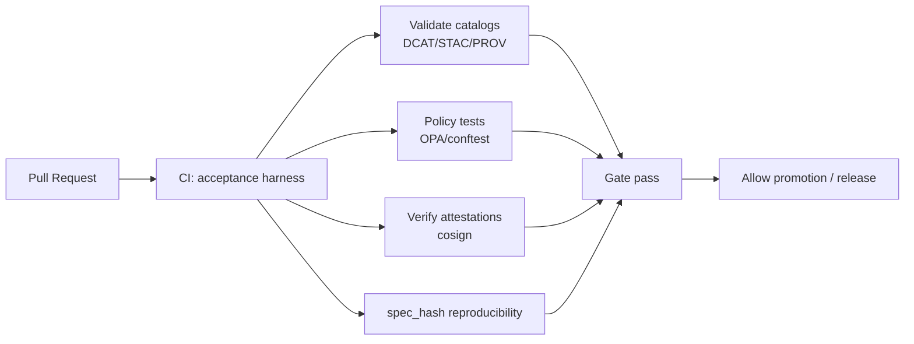

# KFM Pipelines (`src/pipelines/`) 🧩🛠️


> [!IMPORTANT]
> **This directory is the canonical home for all Kansas Frontier Matrix (KFM) ETL code.**
> Connectors, transformations, catalog writers (STAC/DCAT/PROV), validation, promotion gates, and pipeline-run receipts live here.
>
> **Do not scatter ETL logic across the repo.** If a step ingests/transforms/catalogs data, it belongs in `src/pipelines/`.

---

## Table of contents

- [Purpose](#purpose)
- [Truth path and invariants](#truth-path-and-invariants)
- [Data zones and required artifacts](#data-zones-and-required-artifacts)
- [Connector-driven ingestion framework](#connector-driven-ingestion-framework)
- [Run records, provenance, and audit](#run-records-provenance-and-audit)
- [Promotion gates (CI-enforced, fail-closed)](#promotion-gates-ci-enforced-fail-closed)
- [Policy, sensitivity, and redaction](#policy-sensitivity-and-redaction)
- [Identifiers, versioning, and determinism](#identifiers-versioning-and-determinism)
- [Directory layout](#directory-layout)
- [Adding a new pipeline (thin-slice checklist)](#adding-a-new-pipeline-thin-slice-checklist)
- [Testing strategy](#testing-strategy)
- [CI/CD and the acceptance harness](#cicd-and-the-acceptance-harness)
- [Operations, SLOs, and observability](#operations-slos-and-observability)
- [Security and secrets](#security-and-secrets)
- [Troubleshooting](#troubleshooting)
- [Glossary (pipeline-local)](#glossary-pipeline-local)
- [References](#references)

---

## Purpose

`src/pipelines/` is where we implement the **governed data ingestion and processing system** for KFM.

Pipelines in this folder must:
- ingest source data into **Raw**
- transform and QA in **Work**
- publish **query-ready** datasets to **Processed**
- emit **machine-validated catalogs**: **DCAT** (datasets), **STAC** (spatial assets), **PROV** (lineage)
- produce **run records / receipts** and **validation reports**
- attach **policy labels** and enforce **sensitivity** requirements
- pass **promotion gates** (CI-enforced) before anything is “released” as usable by the runtime services

> [!NOTE]
> Pipelines produce artifacts. **Runtime services consume artifacts.**
> No UI/client ever reads Raw/Work directly; all downstream consumption happens via the **governed API boundary**.

---

## Truth path and invariants

### The KFM truth path (conceptual)

```mermaid
flowchart LR
  S[Source APIs / Files] --> R[Raw zone<br/>immutable]
  R --> W[Work zone<br/>normalize + QA]
  W --> P[Processed zone<br/>query-ready + versioned]
  P --> C[Catalogs<br/>DCAT + STAC + PROV]
  C --> ST[Stores<br/>object store + PostGIS + graph/search]
  ST --> A[Governed API<br/>(policy + redaction + audit)]
  A --> UI[Web UI / Map / Timeline]
  UI --> N[Stories / Focus Mode<br/>(cite or abstain)]
```

### Non-negotiable invariants

- **Processed is the only publishable source of truth.**  
  Raw/Work are never served to users and are only referenced by lineage.
- **Promotion is fail-closed.**  
  If required evidence, catalogs, validation, license, or policy labels are missing/invalid → the dataset is **not promotable**.
- **Everything user-visible must be evidence-resolvable.**  
  If evidence cannot be resolved, the system must abstain (Focus Mode/Stories and governed responses).

---

## Data zones and required artifacts

Every dataset flows through three zones. The zone rules are part of the governance model and are enforced by promotion gates.

| Zone | Purpose | Allowed operations | Required artifacts (minimum) |
|---|---|---|---|
| **Raw** | Immutable capture of source-of-truth inputs | Append-only writes; **no transforms** | Checksums + raw manifest; source license captured |
| **Work** | Repeatable transformations and QA staging | Normalize/enrich/derive; regenerate allowed | PROV activity; intermediate QA/validation reports |
| **Processed** | Query-ready, versioned outputs that can be exposed via API | Read-optimized storage/indexing; **never overwrite** prior versions | DCAT dataset entry; STAC collection/items (if spatial); PROV chain; signed policy labels |

### Artifact checklist per successful run

A successful pipeline run produces, at minimum:

- ✅ **Raw manifest** (what was fetched/copied) + **content hashes**
- ✅ **Work artifacts** (normalized/intermediate outputs)
- ✅ **Validation report** (schema + geospatial + QA checks)
- ✅ **Processed artifacts** (tables, tiles, parquet, etc.) + **content hashes**
- ✅ **Catalogs**:
  - DCAT dataset entry (dataset-level metadata)
  - STAC collection/items (if spatial assets exist)
  - PROV bundle (lineage: inputs → activities → outputs)
- ✅ **Run record / receipt** that ties the above together and is stable/referencable
- ✅ **Policy labels** (public/restricted/sensitive-location/aggregate-only) at the correct granularity

---

## Connector-driven ingestion framework

KFM ingestion is **connector-driven**: each data source is implemented as an adapter that conforms to a common contract:

### Contract: `DataSourceConnector`

> **Why:** A shared contract enables consistent governance, testing, orchestration, and reduces one-off pipelines.

```ts
/**
 * Pseudocode / interface shape (language-agnostic).
 * Implementations must be deterministic, idempotent, and emit governed artifacts.
 */
interface DataSourceConnector {
  discover(ctx): Capabilities
  acquire(ctx, plan): RawManifest
  transform(ctx, manifest): WorkArtifacts
  validate(ctx, work): ValidationReport
  publish(ctx, work, report): DatasetVersionRef
}
```

### Method responsibilities

| Method | Responsibility | Output |
|---|---|---|
| `discover()` | Determine what’s available (new versions, ranges, partitions), what capabilities exist, and build an acquisition plan | `Capabilities` (+ candidate plan) |
| `acquire()` | Fetch/copy inputs into **Raw**; record exactly what was pulled (URIs, checksums, timestamps) | `RawManifest` |
| `transform()` | Convert raw → canonical/work shapes; normalize geography/time; enrich with crosswalks | `WorkArtifacts` |
| `validate()` | Schema checks, geometry checks, QA metrics, policy label requirements | `ValidationReport` |
| `publish()` | Write to **Processed**, write catalogs (DCAT/STAC/PROV), produce version reference | `DatasetVersionRef` |

### Orchestration + backfills

Connectors must support:
- scheduled runs by cadence (real-time, daily, weekly, annual, static)
- **idempotency**: reruns must not mutate an already-published DatasetVersion
- **explicit backfills**: historic range runs are treated as explicit runs with their own audit trail
- operational metadata: start/end, rows/bytes processed, error counts, latency, freshness

---

## Run records, provenance, and audit

### Run record / receipt (required)

Each run emits a **run record** (aka “receipt”) that:
- ties *inputs* to *outputs*
- binds outputs to *exact code* (git SHA and/or image digest)
- points to the validation report
- points to PROV bundle location
- includes stable identifiers so the API/UI can resolve evidence later

#### Example: `run_record.json` (illustrative)

```json
{
  "run_id": "run_2026-02-14T183000Z__noaa_ncei__v1",
  "dataset_id": "noaa.ncei.climate_data_online.us",
  "dataset_version_id": "dv_2c7f... (content-addressed)",
  "inputs": [
    {"uri": "data/<domain>/raw/<dataset>/source_drop_001.zip", "sha256": "...."}
  ],
  "code": {
    "git_sha": "abc1234",
    "container_image": "kfm/pipeline@sha256:...."
  },
  "outputs": [
    {"uri": "data/<domain>/processed/<dataset>/table.parquet", "sha256": "...."}
  ],
  "validation_report_uri": "data/<domain>/work/<dataset>/validation_report.json",
  "prov_bundle_uri": "data/prov/<dataset_id>/run_2026-02-14T183000Z.json",
  "policy": {
    "labels": ["public"],
    "sensitivity": "Public"
  },
  "metrics": {
    "rows_read": 123456,
    "rows_written": 123450,
    "bytes_in": 987654321,
    "bytes_out": 123456789,
    "duration_ms": 120345
  }
}
```

> [!IMPORTANT]
> A run record without **content hashes**, **license/policy posture**, and **catalog references** is not sufficient for promotion.

### PROV (minimum fields)

Pipelines must emit PROV bundles that represent:
- **Entity**: raw_asset, normalized_table, derived_tile, ocr_text, etc.
- **Activity**: ingest_run, transform_job, redaction_job
- **Agent**: connector/service, data steward approval (when required)
- relations: `used`, `wasGeneratedBy`, `wasDerivedFrom`, `wasAssociatedWith`

### Audit + Evidence UX expectations (pipeline implications)

Pipelines are responsible for generating the artifacts the runtime uses to:
- show dataset dialogs and “review evidence” panels
- power Focus Mode’s audit/citation panel
- ensure every provenance/citation reference is resolvable via API endpoints (e.g., `prov://`, `stac://`, `dcat://`)

---

## Promotion gates (CI-enforced, fail-closed)

Promotion gates are an explicit checklist and enforced in CI. Promotion is blocked unless the full set of gates passes.

### Minimum promotion checklist (merged view)

**To promote a dataset version to Processed / Public exposure:**

- [ ] **License present** (dataset-level) and captured in DCAT
- [ ] **Sensitivity classification present** and policy labels attached
- [ ] **All raw assets checksummed** and addressable by content hash
- [ ] **Schema validation passes** and validation/QA report stored with stable ID
- [ ] **Geospatial checks pass** (as applicable: geometry validity, CRS expectations, bbox sanity, etc.)
- [ ] **Catalog artifacts exist and validate**:
  - [ ] DCAT dataset entry is well-formed
  - [ ] STAC collection/items (if spatial) are well-formed
  - [ ] PROV bundle exists and links inputs→activities→outputs
  - [ ] Link-check clean across catalogs (no broken refs)
- [ ] **Audit event recorded** for the promotion action (append-only ledger)
- [ ] **Contract tests pass** for API queries that depend on the dataset
- [ ] **Human approval required** if sensitivity demands it (restricted/sensitive-location/aggregate-only)

> [!WARNING]
> If any gate is missing, CI must fail. Do not “temporarily bypass” gates. That is a governance violation.

---

## Policy, sensitivity, and redaction

### Sensitivity classes (recommended)

Pipelines must classify datasets/records/fields using (at least) the following classes:

- **Public**: safe to publish without redaction
- **Restricted**: role-based access required (e.g., parcel ownership)
- **Sensitive-location**: coordinates must be generalized/suppressed (e.g., archaeology, sensitive species)
- **Aggregate-only**: publish only above thresholds (e.g., health/crime small counts)

### Redaction is a first-class transformation

Redaction is **not** a UI-only behavior. It is a transformation that must:
- produce a distinct DatasetVersion (and sometimes a distinct dataset_id)
- be recorded in PROV (inputs, redaction activity, outputs)
- apply fail-closed policy checks

### CI policy regression suite (pipeline obligations)

The pipeline ecosystem must include tests that:
- permanently prevent regressions (golden queries that used to leak must fail forever)
- enforce negative tests (sensitive-location layers cannot be returned at high precision to unauthorized roles)
- verify field-level redaction (ownership names, health small counts, exact archaeology coordinates)
- require audit integrity (every API response includes audit reference + evidence bundle hash)

---

## Identifiers, versioning, and determinism

### Dataset IDs and version IDs

- `dataset_id` is **stable** (publisher + product + scope)
- `dataset_version_id` is **content-addressed** (hash of raw manifest + metadata)
- every transformation produces **new identifiers**; never overwrite prior versions

### Time model (pipeline expectations)

- use ISO-8601 timestamps with explicit time zone (or UTC)
- uncertain time ranges must be `[start, end]` intervals
- for historical sources, store both:
  - publication date
  - event date claim (if extracted)
  each with its own provenance

### Geography model (pipeline expectations)

- normalize to **GeoIDs**
- maintain boundary vintages + crosswalks
- do not silently merge entities/places; record confidence and provenance

### `spec_hash` (recommended for deterministic governance)

Pipelines/specs should be deterministically hashable to:
- detect meaningful changes
- gate merges/promotions
- support reproducibility checks in CI

Recommended:
- canonicalize JSON (RFC 8785 / JCS-style canonicalization)
- compute `spec_hash = sha256(canonical_json(spec))`
- store `spec_hash` in the run receipt and in catalog metadata where relevant

---

## Directory layout

### Repo-wide related paths (context)

These paths are referenced by pipelines:

- `data/` — raw/work/processed dataset artifacts + catalogs (STAC/DCAT/PROV)
- `schemas/` — JSON Schemas (STAC/DCAT/PROV, story nodes, telemetry)
- `tools/` — validators, CI harness utilities, devops helpers
- `src/server/` — governed API boundary (trust membrane)
- `src/graph/` — graph build + ontology bindings

### Recommended internal layout of `src/pipelines/`

> This layout is normative for new work. If the repo currently differs, align to this structure or update this README with a governed PR.

```
src/pipelines/
├── README.md                         # (this file)
├── contracts/                        # connector + receipt contract types/schemas
│   ├── DataSourceConnector.*         # interface/type definition
│   ├── run_record.schema.json        # JSON Schema for run receipts
│   └── promotion_contract.md         # normative gate definition (human-readable)
├── _shared/                          # shared helpers (hashing, io, geo/time normalization)
├── catalog/                          # DCAT/STAC/PROV writers + validators
├── policies/                         # policy labelers + conftest/OPA test fixtures
├── runners/                          # orchestration (local runner, batch runner, backfill runner)
└── connectors/
    ├── <domain>/
    │   └── <dataset_slug>/
    │       ├── connector.*           # implements DataSourceConnector
    │       ├── spec.json             # connector/dataset spec (cadence, endpoints, auth, etc.)
    │       ├── mapping.md            # canonical mapping notes / crosswalks (optional but preferred)
    │       ├── tests/                # unit + golden artifacts for catalogs & validation
    │       └── README.md             # dataset-specific runbook (inputs, quirks, backfills)
    └── ...
```

> [!NOTE]
> File extensions are intentionally unspecified (`.*`). Use the repo’s chosen implementation language(s) consistently.

---

## Adding a new pipeline (thin-slice checklist)

This is the fastest path to a buildable, governed new dataset integration.

### 1) Create the connector scaffold

- [ ] Create `src/pipelines/connectors/<domain>/<dataset_slug>/`
- [ ] Add a `spec.json` (or equivalent) describing:
  - [ ] dataset_id
  - [ ] cadence
  - [ ] access/auth requirements (no secrets in repo)
  - [ ] expected coverage (time range, spatial extent)
  - [ ] license
  - [ ] sensitivity posture

### 2) Implement `DataSourceConnector`

- [ ] `discover()` returns capabilities + acquisition plan
- [ ] `acquire()` produces raw manifest + hashes
- [ ] `transform()` produces normalized Work artifacts
- [ ] `validate()` produces validation report (schema + geo + QA)
- [ ] `publish()` creates Processed outputs + catalogs + returns DatasetVersionRef

### 3) Emit required artifacts (promotion contract)

- [ ] raw manifest + checksums
- [ ] validation report
- [ ] DCAT + (STAC if spatial) + PROV
- [ ] run record / receipt with stable IDs and pointers
- [ ] policy labels

### 4) Write tests (CI-ready)

- [ ] unit tests for connector logic (including edge cases)
- [ ] golden-file tests for catalog outputs (DCAT/STAC/PROV)
- [ ] policy regression tests (no leaks)
- [ ] contract tests for API queries that depend on this dataset (if applicable)

### 5) Definition of Done (DoD)

A pipeline is “done” when:

- [ ] It runs idempotently (reruns do not mutate published versions)
- [ ] It can backfill with explicit run receipts and PROV lineage
- [ ] It passes promotion gates in CI (no manual bypass)
- [ ] It ships with a dataset-specific runbook (`connectors/<domain>/<dataset>/README.md`)
- [ ] It includes license + sensitivity posture + redaction plan (if needed)
- [ ] It has observability signals (duration, rows/bytes, freshness) in its run record/telemetry

---

## Testing strategy

### Required test types

- **Unit tests**: connector logic, parsing, normalization, deterministic hashing
- **Golden artifact tests**: catalogs and receipts match expected outputs
- **Schema validation tests**: Work + Processed outputs conform to schemas
- **Geospatial validation**: geometry validity checks; bbox consistency; CRS expectations
- **Policy regression tests**: ensure sensitive fields/locations never leak
- **API contract tests**: queries that depend on this dataset remain stable

### Fail-closed principle

Tests should be written so that:
- missing required metadata is a hard failure
- broken catalog links are a hard failure
- missing provenance is a hard failure
- policy violations are a hard failure

---

## CI/CD and the acceptance harness

Promotion is governed by CI gates. Recommended “acceptance harness” for pipelines includes:

- DCAT/STAC/PROV validation
- policy tests (OPA / conftest)
- signature/attestation verification (e.g., cosign)
- spec_hash reproducibility check
- merge-blocking PR gate requiring receipts + attestations + signatures (with an emergency kill-switch pattern)

> [!TIP]
> Treat “promotion contract” checks as a reusable CI action and a local `make verify` equivalent so devs can validate before PR.

<details>
<summary>Illustrative CI verification flow</summary>



</details>

---

## Operations, SLOs, and observability

Pipelines must emit enough telemetry to detect staleness and quality drift.

### Observability signals (minimum)

- ingest runs: success/fail, duration, rows/bytes processed, retry counts
- freshness: last successful run timestamp per dataset + expected cadence
- quality drift: distribution checks, missingness, geometry errors
- API: request latency, cache hit rate, policy denials, evidence resolution failures
- storage: object store growth, PostGIS index health, search index lag

### Backfill strategy

Backfills are explicit:
- registry/spec defines historical coverage, batching strategy, expected runtimes
- backfills create new DatasetVersions with their own provenance
- backfills never overwrite existing releases

---

## Security and secrets

- Never commit credentials or tokens.
- Use least-privilege access for data acquisition.
- Prefer short-lived credentials injected at runtime (CI secrets, cluster secret store, etc.).
- Treat policy packs and promotion contracts as security-critical artifacts.

---

## Troubleshooting

### Common promotion failures (and what they mean)

- **Missing license** → DCAT is incomplete; promotion must fail.
- **No sensitivity classification** → cannot determine access posture; promotion must fail.
- **Catalog validation errors** → STAC/DCAT/PROV writer bug or mismatched schema.
- **Broken catalog links** → references between DCAT↔STAC↔PROV not resolvable.
- **spec_hash mismatch** → nondeterministic spec serialization/canonicalization; fix canonical JSON.
- **Policy regression failures** → redaction or access control would leak restricted data; must be fixed before publish.

### Debug checklist

- [ ] Inspect run record: are inputs/outputs hashed? is code version recorded?
- [ ] Inspect validation report: schema + geo checks included?
- [ ] Validate DCAT/STAC/PROV locally with the same validators CI uses
- [ ] Re-run in “validate-only” mode (if supported by runner)
- [ ] Confirm policy labels match sensitivity posture and intended exposure

---

## Glossary (pipeline-local)

- **Raw / Work / Processed**: governed data zones; only Processed is publishable
- **Run record / receipt**: stable JSON describing the run inputs/outputs/code/validation/prov
- **DCAT**: dataset-level metadata vocabulary (discovery)
- **STAC**: spatial asset catalog (map/timeline rendering)
- **PROV**: provenance model (lineage)
- **Promotion gate**: CI-enforced checks required to publish a dataset version
- **spec_hash**: deterministic hash of a connector/spec used for reproducibility and merge gating

---

## References

- Repo structure and canonical subsystem homes: `docs/MASTER_GUIDE_v13.md` (and repo standards under `docs/standards/`)
- Data zones, connector contract, promotion gates, sensitivity handling: see architecture blueprints under `docs/architecture/`
- JSON Schemas for catalogs and receipts: `schemas/`
- Validation utilities and CI harness: `tools/`
- Governed API boundary (trust membrane): `src/server/`

---

