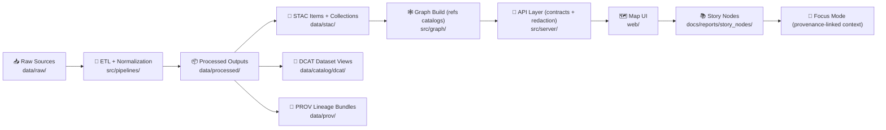

<div align="center">

# 🔁 `src/pipelines/` — KFM Data Pipelines

**From raw sources ➜ to trustworthy, explorable knowledge** 🧭🧪

<!-- Badges (feel free to swap repo-specific ones later) -->


</div>

---

## 🧠 What lives here

This folder is the **canonical home for pipeline code** (ETL + publishing) that turns **immutable raw artifacts** into:

- ✅ curated **processed datasets**
- ✅ **catalog metadata** (STAC + DCAT)
- ✅ **provenance bundles** (PROV lineage)
- ✅ downstream-ready inputs for **database sync** and the **API/UI**

> 🧩 In the broader architecture, this is the “data refinery” step that makes everything else trustworthy.

---

## 🗺️ Where pipelines fit in the system

### Canonical flow (no shortcuts 🚫)



---

## 🧱 Non‑negotiable pipeline rules

### ✅ Determinism & reproducibility
- Pipelines **must be deterministic**: same inputs + same config → **byte-identical** outputs.
- If randomness is needed (simulations), it **must be seed-controlled** 🎲🔒.
- Pipelines must run **start-to-finish automatically** (no interactive prompts).

### ✅ Idempotence (“run twice, nothing weird happens”)
- Re-running a pipeline without changes should **not** create duplicate outputs.
- Prefer checksums / version checks / “no-op if unchanged” behavior.

### ✅ “Raw is sacred” 🗿
- **Never modify** anything under `data/raw/`.
- Treat raw artifacts as evidence: write-once + read-only.

### ✅ No ad-hoc edits to processed outputs
- **Never manually edit** `data/processed/…`.
- Fix the pipeline (or raw source), then re-run. This preserves trust and auditability.

### ✅ Publish boundary artifacts (required)
A dataset is not “published” until **all** of these exist and validate:

- `data/processed/...` (data product)
- `data/stac/...` (STAC items/collections)
- `data/catalog/dcat/...` (DCAT record)
- `data/prov/...` (PROV lineage bundle)

---

## 📦 Data lifecycle expectations

> Paths below are **repo-root relative**.

### Staging layout (recommended)
```text
📂 data/
├─ 📥 raw/<domain>/          # immutable inputs (evidence)
├─ 🧪 work/<domain>/         # intermediate scratch (ok to wipe)
└─ ✅ processed/<domain>/    # final outputs (ready for API/DB)
```

### Catalog + provenance outputs (required)
```text
📂 data/
├─ 🧾 stac/
│  ├─ collections/           # STAC collections
│  └─ items/                 # STAC items
├─ 🧷 catalog/
│  └─ dcat/                  # DCAT JSON-LD (dataset discovery)
└─ 🧬 prov/                  # PROV bundles (lineage)
```

> ⚠️ If you see legacy naming in older docs (e.g., `data/catalog/` and `data/provenance/`), treat those as the same intent: **catalog + lineage**. The goal is unchanged: *boundary artifacts before downstream sync*.

---

## ▶️ Running pipelines

Because pipeline entrypoints can evolve, follow this priority order:

### 1) Run a pipeline module directly (simple + explicit)
```bash
# from repo root
python -m src.pipelines.<pipeline_module> --help
python -m src.pipelines.<pipeline_module> --config configs/pipelines/<name>.yml
```

### 2) Use a registry/runner (if present)
Some setups use:
- a `pipelines/manifest.yaml` (or similar registry), and/or
- a `run_all_pipelines.py` style runner that discovers and runs pipelines.

```bash
python -m src.pipelines.runner --list
python -m src.pipelines.runner --run import_census --config configs/pipelines/import_census.yml
```

### 3) Docker-first dev workflow (recommended for consistency 🐳)
Keep the compose stack running while developing, and run pipelines in a second terminal:

```bash
docker compose up
# then (another terminal)
python -m src.pipelines.<pipeline_module> --config ...
```

---

## 🧩 Writing a new pipeline

### 🧭 Naming & ownership
- One pipeline should correspond to **one dataset** or **one source family**.
- Use clear names, e.g.:
  - `import_<source>.py` (ingest + normalize)
  - `build_<product>.py` (derive an evidence artifact)
  - `publish_<domain>.py` (catalog/prov publishing step if separated)

### ✅ Definition of Done (DoD) checklist
- [ ] Inputs live in `data/raw/<domain>/...` and are never mutated
- [ ] Any intermediates live in `data/work/<domain>/...`
- [ ] Final outputs written to `data/processed/<domain>/...`
- [ ] STAC item/collection generated in `data/stac/...`
- [ ] DCAT dataset record generated in `data/catalog/dcat/...`
- [ ] PROV bundle generated in `data/prov/...`
- [ ] Pipeline is deterministic + idempotent
- [ ] Validation passes locally + in CI (fail closed)
- [ ] Runbook added: `docs/data/<domain>/README.md` 📓

---

## 🧬 Provenance contract (PROV)

A PROV file should make it easy to answer:

> “How was this dataset produced?” 🔍

At minimum, capture:
- **Entities**: input raw files + output product (ideally with checksums / source pointers)
- **Activity**: the pipeline run (script name, timestamp, parameters, environment)
- **Agents**: the software agent (pipeline + version) and optionally the human trigger

### Minimal PROV shape (example)
```json
{
  "entities": [
    {"id": "raw:census_1900.csv", "checksum": "sha256:..."},
    {"id": "processed:1900_population.geojson", "checksum": "sha256:..."}
  ],
  "activity": {
    "id": "pipeline:import_census",
    "startedAt": "2026-01-30T00:00:00Z",
    "params": {"projection": "EPSG:4326", "seed": 12345},
    "code": {"path": "src/pipelines/import_census.py", "git_commit": "abc123"}
  },
  "agents": [
    {"id": "software:src/pipelines/import_census.py"},
    {"id": "person:contributor_handle"}
  ]
}
```

---

## 🧾 Catalog contract (STAC + DCAT)

### STAC (spatiotemporal + assets)
STAC should describe:
- extent (spatial + temporal)
- license + attribution
- lineage pointers (tie into PROV)
- assets (files, previews, derived layers)

### DCAT (discovery + dataset identity)
DCAT should describe:
- dataset-level identity and versioning
- access URLs / distributions
- keywords/themes for search + interoperability

> 🧠 Rule of thumb: **STAC = “map-friendly metadata”**, **DCAT = “catalog/discovery metadata”**.

---

## 🌎 Geospatial conventions (common pitfalls avoided)

- Standardize CRS early. Many KFM pipelines will target **EPSG:4326** (or a documented Kansas-specific CRS).
- Keep geometry valid (fix invalid polygons, ensure consistent winding where needed).
- Normalize time fields (`YYYY-MM-DD` or ISO-8601), and document assumptions.
- Prefer stable, reviewable formats:
  - vectors: GeoJSON / GeoParquet
  - rasters: GeoTIFF / COG
  - tables: CSV / Parquet

---

## 🧪 Validation & CI (fail-closed by default)

Pipelines should fail loudly and early when:
- license/attribution is missing
- schema is invalid (STAC/DCAT/PROV)
- outputs drift (non-determinism)
- a required artifact is missing

> 🛑 “Fail closed” means: if a check can’t prove correctness/compliance, it blocks the change.

---

## 🧰 Troubleshooting (quick hits)

<details>
<summary><strong>🐳 Docker / local dev issues</strong></summary>

- **Port conflicts**: check common ports (e.g., Postgres 5432, graph DB ports, API 8000, UI 3000).
- **Permissions**: if containers can’t write `data/…`, fix volume permissions or container user mapping.
- **Resource limits**: large datasets may require more Docker memory.
- **Hot reload not updating**: verify volume mounts are correct; rebuild after dependency changes.

</details>

---

## 📚 Related “where to put things” map

```text
🧩 Canonical homes (keep it clean 🧼)
├─ 🧪 src/pipelines/    # ETL + catalog/prov publishing (THIS FOLDER)
├─ 🕸️ src/graph/        # graph initialization + sync (imports/migrations)
├─ 🧰 src/server/       # API contracts + business rules + redaction
├─ 🗺️ web/              # UI (React/TS mapping app)
└─ 📓 docs/             # runbooks, standards, story nodes, narratives
```

---

## 🤝 Contribution tips

- Keep **executable code** in `src/…`
- Keep **documentation** in `docs/…` (runbooks, standards, domain READMEs)
- Treat data like code:
  - version changes are reviewable
  - provenance is mandatory
  - outputs should be explainable

---

## ✅ TL;DR checklist

- **Raw → Processed → Catalog/PROV → Database → API → UI** (no bypasses)
- No prompts, no manual edits, deterministic outputs
- Always publish STAC + DCAT + PROV alongside the data product
- If it’s not provable, it’s not shippable 🚦

---