<div align="center">

# 🧩 Kansas Frontier Matrix — **Data Pipelines**  
`src/pipelines/README.md`

**Time · Terrain · History · Knowledge Graphs**

[](../../.github/workflows/site.yml)  
[](../../.github/workflows/stac-validate.yml)  
[](../../.github/workflows/codeql.yml)  
[](../../.github/workflows/trivy.yml)  
[](../../docs/)  
[](../../LICENSE)

</div>

---

```yaml
---
title: "KFM • Data Pipelines (src/pipelines)"
version: "v1.7.0"
last_updated: "2025-10-17"
created: "2024-12-02"
owners: ["@kfm-data", "@kfm-engineering", "@kfm-architecture"]
status: "Stable"
maturity: "Production"
tags: ["etl","stac","gis","ai","nlp","neo4j","mcp","reproducibility"]
license: "MIT"
semantic_alignment:
  - STAC 1.0.0
  - GeoJSON RFC 7946
  - CIDOC CRM
  - OWL-Time
  - DCAT 2.0
  - FAIR Principles
  - MCP-DL v6.3
---
```

## 📚 Table of Contents

1. [🎯 Purpose](#-purpose)  
2. [🏗 Pipeline Architecture](#-pipeline-architecture)  
3. [📂 Directory Layout](#-directory-layout)  
4. [🧱 ETL Stage Matrix](#-etl-stage-matrix)  
5. [🔬 AI / ML Workflow Summary](#-ai--ml-workflow-summary)  
6. [🧾 Outputs & Standards](#-outputs--standards)  
7. [🧰 Configuration & Logging](#-configuration--logging)  
8. [🔁 Reproducibility & CI/CD](#-reproducibility--cicd)  
9. [🧪 Test Touchpoints](#-test-touchpoints)  
10. [🧭 Environment Variables (common)](#-environment-variables-common)  
11. [📈 Example End-to-End Workflow](#-example-end-to-end-workflow)  
12. [🧠 Developer Notes](#-developer-notes)  
13. [🧠 MCP Compliance Checklist](#-mcp-compliance-checklist)  
14. [🧾 Changelog](#-changelog)  
15. [📎 References & Further Reading](#-references--further-reading)

---

## 🎯 Purpose

`src/pipelines/` contains **ETL (Extract–Transform–Load)** and **AI/ML enrichment** workflows that turn heterogeneous Kansas datasets—maps, climate series, land records, and historical texts—into standardized, **provenance-tracked** layers ready for:

* 🗺 **Spatiotemporal mapping** — GeoJSON & **COG GeoTIFF**  
* 🧠 **Knowledge-graph ingestion** — Neo4j (CIDOC CRM · OWL-Time · PeriodO)  
* 🔍 **Interactive exploration** — API & Web UI (Map + Timeline + AI)

All pipelines follow **MCP-DL v6.3**: *document-first, deterministic, logged, and schema-validated.*

---

## 🏗 Pipeline Architecture

```mermaid
flowchart TD
    A["Raw Sources<br/>scans · rasters · vectors · texts"]
      --> B["Extract<br/>download · REST · OCR"]
      --> C["Transform<br/>clean · normalize · geocode · reproject"]
      --> D["Load<br/>GeoJSON · COG · Parquet · STAC · Graph"]

    C --> I["AI/ML Enrichment<br/>NER · summarization · entity linking"]
    I --> H["Knowledge Graph<br/>Neo4j · CIDOC CRM · OWL-Time"]
    D --> H
    H --> J["API Layer<br/>FastAPI · GraphQL"]
    J --> F["Frontend<br/>React + MapLibre · Timeline · AI Assistant"]
```


<!-- END OF MERMAID -->

> Each stage is **modular** (importable), **CLI-accessible**, and **CI-validated**.

---

## 📂 Directory Layout

```text
src/pipelines/
├── __init__.py
├── pipeline_runner.py       # Orchestrator (targets, dry-run support)
├── fetch/                   # Source connectors (USGS, NOAA, FEMA, KHS, etc.)
│   ├── noaa_ingest.py
│   ├── usgs_ingest.py
│   ├── fema_ingest.py
│   └── kansas_memory_ingest.py
├── transform/               # Normalization & conversion
│   ├── geocode_utils.py
│   ├── raster_to_cog.py
│   ├── vector_to_geojson.py
│   └── text_cleaner.py
├── enrich/                  # AI / ML processing
│   ├── nlp_entities.py
│   ├── summarizer.py
│   ├── entity_linker.py
│   └── correlate_sources.py
└── load/                    # STAC & Graph loaders
    ├── stac_writer.py
    ├── graph_loader.py
    └── checksum_utils.py
```

Run standalone for development, or orchestrate via **Makefile**:

```bash
# Rebuild all pipelines (end-to-end)
make pipelines

# Run a single connector
python src/pipelines/fetch/noaa_ingest.py --year 1936 --station KS001

# Invoke orchestrator with a target
python src/pipelines/pipeline_runner.py --target usgs_topo_1894
```

---

## 🧱 ETL Stage Matrix

| Stage | Description | Key Tools |
| :-- | :-- | :-- |
| **Extract** | Fetch raw data from USGS/NOAA/FEMA/KHS APIs and archives; OCR for scanned PDFs/maps | `requests`, `aiohttp`, `pdfplumber`, `pytesseract` |
| **Transform** | Standardize into **GeoJSON/COG/CSV/Parquet**; clean fields; geocode places; normalize dates | `pandas`, `geopandas`, `rasterio`, `rio-cogeo`, `shapely`, `geopy` |
| **Load** | Write to `data/processed/**`; generate **STAC Items**; upsert to **Neo4j**; write checksums | `pystac`, `jsonschema`, `neo4j-driver`, `hashlib` |
| **AI/ML Enrichment** | NER, summarization, fuzzy linking; cross-source correlation | `spaCy`, `transformers`, `sentence-transformers` |

---

## 🔬 AI / ML Workflow Summary

1. **NER** — Fine-tuned `spaCy` model extracts `PERSON`, `PLACE`, `DATE`, `EVENT`.  
2. **Geocoding** — Resolve placenames via **USGS GNIS**; attach lat/long & county context.  
3. **Summarization** — `BART/T5` generate concise document and site summaries.  
4. **Entity Linking** — Fuzzy + context windows match mentions to canonical graph nodes with **confidence**.  
5. **Correlation** — Cross-modal checks (text ↔ map ↔ sensor) flag validated changes (e.g., 1930s floodplain shift).

---

## 🧾 Outputs & Standards

| Output | Format | Destination | Standard |
| :-- | :-- | :-- | :-- |
| Rasters | **COG GeoTIFF** | `data/processed/rasters/` | STAC 1.0 · OGC COG |
| Vectors | **GeoJSON/TopoJSON** | `data/processed/vectors/` | GeoJSON 1.0 |
| Tables | **CSV/Parquet** | `data/processed/tables/` | CSVW · DCAT |
| Graph | **Neo4j** | database | CIDOC CRM · OWL-Time |
| Metadata | **JSON** | `data/stac/` | STAC 1.0 + JSON Schema |

All artifacts include **SHA-256** sidecars and provenance metadata (source URL, license, ETL timestamp).

---

## 🧰 Configuration & Logging

- **Config**: `config/` YAML + `.env` envvars (loaded by `src/utils/config.py`)  
- **Logging**: `src/utils/logger.py` — structured logs with `run_id`; files in `logs/pipelines/*.log`  
- **Error Isolation**: each task wrapped in try/except; failed sources are skipped with error report

**Example**

```
[2025-10-05 14:22:01] INFO  | usgs_ingest | Fetched 12 DEM tiles (2.3 GB) in 214 s ✔ [run_id=4bf7...]
```

---

## 🔁 Reproducibility & CI/CD

- **Makefile → GitHub Actions**: `make validate` + `make stac-check` on every PR  
- **STAC Validation**: schema compliance is a gate before merge  
- **Containers**: Docker/Compose recipes pin versions for consistent ETL  
- **Data Versioning**: optional **DVC** for large binaries (planned)

---

## 🧪 Test Touchpoints

- **Unit**: parsing, CLI flags, schema builders  
- **Integration**: tmp dirs for ETL paths; mocked HTTP/ArcGIS; tiny rasters (≤10×10)  
- **Schema**: `jsonschema` + `pystac` verify STAC & config files  
- **Graph**: mock Neo4j driver; assert Cypher & params only

```bash
pytest tests/pipelines -v --cov=src/pipelines
```

---

## 🧭 Environment Variables (common)

```bash
# API endpoints
export KFM_API_BASE=https://api.frontiermatrix.org

# Data locations
export KFM_DATA_DIR=$(pwd)/data
export KFM_STAC_DIR=$(pwd)/data/stac

# External services
export KFM_GNIS_URL=https://geonames.usgs.gov
export KFM_NEO4J_URI=bolt://localhost:7687
export KFM_NEO4J_USER=neo4j
export KFM_NEO4J_PASSWORD=pass
```

> All envs may also be provided via `.env` and loaded by `src/utils/config.py`.

---

## 📈 Example End-to-End Workflow

```bash
# 1 · Fetch raw data from registered sources
make fetch

# 2 · Process rasters + vectors → standard formats
make convert

# 3 · Run enrichment (NER + summary)
make enrich

# 4 · Update STAC & load graph
make stac graph
```

Every step emits provenance logs → `logs/pipelines/` and reproducible outputs in `data/processed/`.

---

## 🧠 Developer Notes

- Follow **PEP-8** and Google-style docstrings; include `@MCP-LOG` header (purpose, inputs, outputs, runtime).  
- When adding a new source:  

  1) create `data/sources/{id}.json` (license + URL)  
  2) implement `fetch/{id}_ingest.py`  
  3) write STAC via `load/stac_writer.py`  
  4) add graph upserts in `load/graph_loader.py`  
  5) extend tests under `tests/pipelines/` and update `docs/sop.md`

---

## 🧠 MCP Compliance Checklist

| MCP Principle | Implementation |
| :-- | :-- |
| Documentation-first | Readmes, docstrings, SOPs for every pipeline |
| Reproducibility | Checksums, schema validation, pinned containers |
| Provenance | STAC lineage, Cypher relations, run IDs in logs |
| Open Standards | STAC · GeoJSON · COG · CSVW · CIDOC CRM · OWL-Time |
| Accessibility | Clear CLI UX, helpful errors, human-readable logs |
| Auditability | CI artifacts publish validation and checksum reports |

---

## 🧾 Changelog

| Version | Date | Author | Summary |
| :-- | :-- | :-- | :-- |
| **v1.7.0** | 2025-10-17 | @kfm-data | Align with MCP-DL v6.3; add DCAT, expand AI/ML summary; ToC + changelog |
| **v1.6.0** | 2025-10-14 | @kfm-engineering | Added orchestrator; clarified ETL stage matrix; improved env docs |
| **v1.5.0** | 2025-10-01 | @kfm-architecture | Refined directory structure; added fixtures/testing guidance |

---

## 📎 References & Further Reading

- **AI System Developer Docs** — `../../docs/`  
- **File & Data Architecture** — `../../docs/file-data-architecture.md`  
- **Integrating Historical, Cartographic, and Geological Research (MCP Reference)**  
- **Scientific Modeling & Simulation — NASA-Grade Guide**

---

<div align="center">

**Kansas Frontier Matrix © 2025 · MIT (code) · CC-BY 4.0 (data)**  
*“Document the past so the future can reproduce it.”*

</div>