<div align="center">

# ⚙️ **Kansas Frontier Matrix — ETL, AI & Governance Pipelines**
`src/pipelines/README.md`

**Purpose:**  
Unified FAIR+CARE-certified orchestration framework for **ETL automation**, **AI reasoning**, **validation**, **telemetry**, and **governance synchronization** in the Kansas Frontier Matrix (KFM).  
Each pipeline guarantees **traceable reproducibility**, **ethical governance**, and **blockchain-secured provenance** compliant with **MCP-DL v6.3**, **ISO 19115**, and **ISO 50001**.

[](../../../docs/standards/)
[](../../../docs/standards/faircare-validation.md)
[](../../../LICENSE)
[]()
[]()

</div>

---

## 📘 Overview

The `src/pipelines/` directory orchestrates the **end-to-end automation core** of the Kansas Frontier Matrix — connecting ETL workflows, AI reasoning, validation audits, and governance ledgers under FAIR+CARE compliance.

Each pipeline contributes to an integrated **Focus Mode** experience, ensuring that every dataset, model, and audit cycle maintains **provenance, sustainability, and ethical transparency**.

### Core Responsibilities
- Automate **ETL (Extract, Transform, Load)** across multi-domain datasets.  
- Execute **AI reasoning, bias, and drift detection** with Focus Transformer v2.  
- Validate data, models, and ledgers for FAIR+CARE + ISO 42001 compliance.  
- Synchronize immutable **blockchain-backed provenance records**.  
- Export **sustainability telemetry** for ISO 50001-certified reporting.  

---

## 🗂️ Directory Layout

```plaintext
src/pipelines/
├── README.md
│
├── etl/                  # Data ingestion, transformation, and harmonization
│   ├── climate_etl.py
│   ├── hazards_etl.py
│   ├── hydrology_etl.py
│   ├── terrain_etl.py
│   ├── tabular_etl.py
│   └── text_etl.py
│
├── ai/                   # AI reasoning, explainability, and bias analysis
│   ├── ai_focus_reasoning.py
│   ├── ai_bias_detection.py
│   ├── ai_drift_monitor.py
│   ├── ai_explainability_reporter.py
│   └── training/
│       ├── trainer.py
│       ├── datasets.py
│       └── configs/
│           ├── focus_v2_config.yaml
│           ├── hazard_ai_config.yaml
│           └── climate_forecast.yaml
│
├── validation/           # FAIR+CARE schema, checksum, and explainability validation
│   ├── schema_validation.py
│   ├── checksum_audit.py
│   ├── faircare_audit_runner.py
│   └── ai_explainability_validator.py
│
├── governance/           # Blockchain ledgering, IPFS provenance, checksum registry
│   ├── governance_sync.py
│   ├── ledger_update.py
│   └── checksum_registry.py
│
├── telemetry/            # Sustainability, energy, carbon, and Focus Mode telemetry
│   ├── focus_metrics_collector.py
│   └── telemetry_reporter.py
│
└── utils/                # Shared functions (STAC, JSON, FAIR+CARE metadata)
    ├── io_utils.py
    ├── json_tools.py
    ├── stac_helpers.py
    └── metadata_utils.py
```

---

## ⚙️ End-to-End Pipeline Flow

```mermaid
flowchart LR
    A["Raw Data (NOAA · USGS · FEMA · Archives)"] --> B["ETL Pipelines"]
    B --> C["AI Reasoning + FAIR+CARE Validation"]
    C --> D["Governance Provenance + Blockchain Registration"]
    D --> E["Telemetry Metrics + Sustainability Exports"]
    E --> F["Focus Mode Dashboard + Ledger Audit"]
```



**Workflow Summary**
1. **ETL Layer:** Harmonizes datasets into reproducible, schema-aligned formats.  
2. **AI Layer:** Applies Focus Mode reasoning, bias checks, and explainability.  
3. **Validation Layer:** Executes FAIR+CARE and checksum validation pipelines.  
4. **Governance Layer:** Logs immutable records to blockchain and IPFS.  
5. **Telemetry Layer:** Tracks energy, carbon, and sustainability compliance.

---

## 🧾 Example Pipeline Registry Entry

```json
{
  "id": "pipeline_registry_v10.1.0",
  "pipelines_executed": [
    "climate_etl.py",
    "ai_focus_reasoning.py",
    "faircare_audit_runner.py",
    "governance_sync.py"
  ],
  "fairstatus": "certified",
  "ai_explainability_score": 0.996,
  "checksum_verified": true,
  "energy_consumption_wh": 0.74,
  "carbon_output_gco2e": 0.09,
  "telemetry_logged": true,
  "governance_registered": true,
  "created": "2025-11-10T12:50:00Z",
  "validator": "@kfm-pipelines"
}
```

---

## 🧠 FAIR+CARE Governance Matrix

| Principle | Implementation | Oversight |
|-----------|----------------|-----------|
| **Findable** | All pipelines indexed in checksum-led manifests and metadata.json. | @kfm-data |
| **Accessible** | Open-source under MIT License, FAIR+CARE certified. | @kfm-accessibility |
| **Interoperable** | DCAT 3.0 / STAC 1.0 / ISO 19115 metadata mapping. | @kfm-architecture |
| **Reusable** | Modular components + reusable configuration standards. | @kfm-design |
| **Collective Benefit** | Promotes transparent and ethical data science. | @faircare-council |
| **Authority to Control** | Governance Council manages release certification. | @kfm-governance |
| **Responsibility** | Maintainers uphold checksum lineage & sustainability targets. | @kfm-sustainability |
| **Ethics** | Bias & inclusivity audits embedded in every AI stage. | @kfm-ethics |

Audit references:  
`../../../reports/audit/ai_src_ledger.json` · `../../../reports/fair/src_summary.json`

---

## ⚙️ Subsystem Overview

| Subsystem | Description | FAIR+CARE Function | Tools |
|-----------|-------------|--------------------|-------|
| **etl/** | Ingest and transform raw datasets into FAIR+CARE-ready formats. | Provenance & Transparency | Python · Pandas · GDAL |
| **ai/** | Perform reasoning, bias detection, and explainability. | Ethical Intelligence | PyTorch · Transformers · SHAP |
| **validation/** | Enforce schema, checksum, and ethics validation. | FAIR+CARE Compliance | JSONSchema · FAIR Validator |
| **governance/** | Ledger synchronization and blockchain recording. | Immutable Provenance | Neo4j · IPFS · Ethereum |
| **telemetry/** | Log runtime, carbon, and renewable metrics. | Sustainability & Audit | OpenTelemetry · Grafana |
| **utils/** | Core JSON/STAC metadata utilities. | Reproducibility Backbone | Python Utilities |

---

## ⚖️ Retention & Provenance Policy

| Artifact | Retention | Policy |
|----------|-----------|--------|
| Source Code | Permanent | Version-controlled under governance. |
| Validation Reports | 365 Days | Retained for audit verification. |
| Provenance Ledgers | Permanent | Immutable blockchain records. |
| AI Drift Reports | 180 Days | Reviewed for retraining cycles. |

Managed via `src_pipeline_cleanup.yml`.

---

## 🌱 Sustainability Metrics (Q4 2025)

| Metric | Value | Verified By |
|--------|-------|-------------|
| Energy Use / Run | 0.74 Wh | ISO 50001 | @kfm-ops |
| Carbon Output | 0.09 g CO₂e | ISO 14064 | @kfm-sustainability |
| Renewable Power | 100% (RE100) | — | @kfm-infrastructure |
| FAIR+CARE Compliance | 100% | MCP-DL v6.3 | @faircare-council |

Telemetry recorded in:  
`../../../releases/v10.1.0/focus-telemetry.json`

---

## 🧾 Internal Citation

```text
Kansas Frontier Matrix (2025). ETL, AI & Governance Pipelines (v10.1.0).
Comprehensive FAIR+CARE-certified orchestration framework managing data ingestion, transformation, AI reasoning, validation, and blockchain-led governance.
Fully compliant with MCP-DL v6.3, ISO 19115, ISO 50001, and FAIR+CARE governance standards.
```

---

## 🕰️ Version History

| Version | Date | Notes |
|---------|------|------|
| **v10.1.0** | 2025-11-10 | Enhanced pipeline modularity; integrated Focus Transformer v2; updated energy metrics & governance hooks. |
| **v10.0.0** | 2025-11-08 | Unified orchestration layer with sustainability telemetry. |
| **v9.7.0** | 2025-11-05 | Added checksum lineage tracking and extended Focus Mode telemetry. |

---

<div align="center">

**© 2025 Kansas Frontier Matrix — MIT License**  
*Autonomous Pipelines × FAIR+CARE Governance × Sustainable Data Integrity*  
[Back to Source Architecture](../ARCHITECTURE.md) · [Docs Portal](../../../docs/) · [Governance Ledger](../../../docs/standards/governance/DATA-GOVERNANCE.md)

</div>
