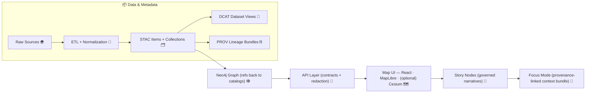

# 🧩 Pipelines Shared Toolkit (`src/pipelines/_shared`)


> **One shared standard library for every KFM pipeline**: deterministic ETL, policy gates, metadata generation, telemetry, and publish adapters — so every dataset is reproducible, auditable, and UI/AI-ready. 🧭

---

## 📌 What this folder is

`src/pipelines/_shared/` is the **cross-pipeline foundation layer**. Anything that must be consistent across domains (land, climate, treaties, transit, documents, simulations…) belongs here:

- ✅ **Run context & manifests** (who/what/when/with-which-inputs)
- ✅ **Integrity & tamper-evidence** (checksums, canonical JSON hashing)
- ✅ **Policy-as-code gates** (license/sensitivity/schema/compliance → fail closed)
- ✅ **Telemetry & governance ledger** (append-only NDJSON, optional signing)
- ✅ **Metadata backbone** (STAC + DCAT + PROV)
- ✅ **Publish adapters** (Neo4j CSV exports, PostGIS loaders, artifact packaging)
- ✅ **Privacy + redaction hooks** (safe aggregation, generalization, query auditing)

> [!IMPORTANT]
> Domain-specific logic (special transforms, custom parsers, one-off dataset quirks) **does not** live here. Put that in `src/pipelines/<domain>/…` and call into `_shared`.

---

## 🧠 Design principles (the non-negotiables)

- **Evidence-first** 🔍  
  If it can’t be traced to source + processing lineage, it doesn’t ship.
- **Deterministic & reproducible** ♻️  
  Same inputs + same config ⇒ same outputs + same digests.
- **Idempotent** 🔁  
  Safe to re-run. No duplicates. Upserts must be stable.
- **Fail closed** 🛑  
  Missing license / incomplete provenance / schema breaks ⇒ stop the line.
- **Separation of concerns** 🧱  
  Download ≠ transform ≠ validate ≠ publish. Each step emits artifacts.
- **UI + AI are downstream contracts** 🗺️🤖  
  The UI expects provenance panels & dataset details; Focus Mode expects citations and refuses when sources are missing.

---

## 🗺️ KFM end-to-end flow (why `_shared` exists)



---

## 📦 Required staging layout (data lifecycle)

All pipelines must respect the same lifecycle to keep the repo navigable, auditable, and automation-friendly:

```text
data/
├─ 📥 raw/                         # Immutable, as-downloaded snapshots (never “clean” raw; evidence boundary)
│  └─ 🗂️ <domain>/                 # Domain buckets (e.g., usgs, census, rail, archaeology)
├─ 🧪 work/                        # Intermediate artifacts (OK to wipe/rebuild; controlled transforms)
│  └─ 🗂️ <domain>/                 # Staging outputs, scratch transforms, temporary exports
├─ ✅ processed/                    # Final products (what the UI/API/graph should serve; versioned)
│  └─ 🗂️ <domain>/                 # Publishable artifacts (GeoParquet/COG/PMTiles/JSON, etc.)
├─ 🛰️ stac/                        # STAC boundary artifacts (Collections + Items describing assets)
│  ├─ 🗂️ collections/              # STAC Collections (dataset-level metadata)
│  └─ 🧷 items/                    # STAC Items (time/run snapshots referencing assets)
├─ 🗂️ catalog/                     # Discovery/catalog layer (DCAT records for dataset/distributions)
│  └─ 🗂️ dcat/                     # DCAT dataset + distribution metadata (license/access/links)
├─ 🧬 prov/                        # Provenance boundary artifacts (PROV-O JSON-LD bundles linking raw→work→processed)
├─ 🧾 audits/                      # Run-level evidence bundles (receipts, logs, policy decisions)
│  └─ 🏷️ <run_id>/                 # One audit bundle per run (immutable once finalized; telemetry append-only)
│     ├─ 🧾 run_manifest.json        # Run receipt: who/what/when + inputs/outputs + tool versions + digests
│     ├─ 📈🧾 telemetry.ndjson       # Telemetry/event stream (append-only; redacted-safe)
│     ├─ 🔐📄 checksums.sha256       # sha256 sums for audit files/artifacts (tamper detection)
│     └─ ⚖️🧾 policy_decisions.json  # Policy/gate decisions (pass/fail + findings + waivers + rationale)
```

> [!TIP]
> Treat `data/stac/`, `data/catalog/dcat/`, and `data/prov/` as **boundary artifacts**: nothing is “published” until these exist.

---

## ✅ Definition of “DONE” for any pipeline

Before a dataset is promoted/served, it must pass this checklist:

- [ ] Raw inputs stored under `data/raw/<domain>/…` (immutable)
- [ ] Deterministic transforms written under `data/processed/<domain>/…`
- [ ] `checksums.sha256` exists for **all** produced artifacts
- [ ] `run_manifest.json` exists + references inputs/outputs
- [ ] Telemetry emitted (`telemetry.ndjson`)
- [ ] STAC Collection + STAC Items written
- [ ] DCAT dataset record written
- [ ] PROV bundle written (inputs → activity → outputs)
- [ ] Policy pack passed (license, sensitivity, schema, required fields)
- [ ] Graph export ready (Neo4j CSV references STAC/DCAT IDs, not ad-hoc)

---

## 🧩 What `_shared` should provide (module map)

> This is a **contract** for what belongs here. If a module doesn’t exist yet, it’s a strong candidate to implement here (not per-domain).

| Area | What it standardizes | Typical API surface (examples) |
|---|---|---|
| 🧾 Run context | IDs, config, actor, clock, paths | `RunContext`, `Paths`, `Settings` |
| 🔐 Integrity | hashing, canonical JSON, checksum files | `sha256_file()`, `write_checksums()` |
| 🧪 Telemetry | NDJSON events, timings, counters | `Telemetry.emit()`, `StageTimer` |
| ⚖ Policy gates | OPA/Conftest wrappers, fail-closed checks | `PolicyGate.check_dataset()` |
| 🗂️ STAC | items/collections, assets, links | `build_collection()`, `build_item()` |
| 🧾 DCAT | dataset catalog JSON-LD | `build_dcat_dataset()` |
| ⛓️ PROV | lineage bundles, agents/activities/entities | `build_prov_bundle()` |
| 🌍 IO + caching | retry/rate-limit, ETag/Last-Modified, mirrors | `download()`, `HttpCache` |
| 🗺️ Geo helpers | CRS normalization, geometry checks, tiling hooks | `to_epsg4326()`, `validate_geom()` |
| 🕸️ Graph exports | CSV emitters tied to catalog IDs | `emit_graph_csv()` |
| 🗄️ DB loaders | PostGIS loaders + indexing helpers | `load_postgis()` |
| 🕵️ Privacy | generalization, safe aggregation, query auditing | `redact()`, `k_anon_check()` |

---

## ⚡ Quickstart: build a new pipeline using `_shared`

### 1) Minimal pipeline skeleton (pseudo-structure)

```text
src/pipelines/
├─ ♻️ _shared/                 # ← you are here 📌 Shared pipeline building blocks (IO, manifests, hashing, policy hooks)
└─ 🌿 landcover/
   ├─ 🐍 pipeline.py            # Domain pipeline entrypoint (orchestrates transforms; emits receipts/catalog/prov)
   ├─ 🧾 dataset.yaml            # Per-dataset config (inputs, schedule, policy tags, output products)
   └─ 🧪 transforms/             # Domain-specific transform modules (pure-ish steps; deterministic when possible)
```

### 2) Minimal run flow (pseudo-code)

```python
# NOTE: names are illustrative — prefer this folder for implementations.
from pipelines._shared.context import RunContext
from pipelines._shared.telemetry import Telemetry
from pipelines._shared.integrity import write_checksums
from pipelines._shared.policy import PolicyGate
from pipelines._shared.metadata.stac import build_collection, build_items
from pipelines._shared.metadata.dcat import build_dcat_dataset
from pipelines._shared.metadata.prov import build_prov_bundle

def run(domain: str, dataset_id: str, cfg: dict) -> None:
    ctx = RunContext.from_config(domain=domain, dataset_id=dataset_id, cfg=cfg)
    t = Telemetry(ctx)

    t.stage("acquire").start()
    # download -> data/raw/<domain>/...
    t.stage("acquire").end()

    t.stage("transform").start()
    # normalize -> data/work/<domain>/...
    # finalize  -> data/processed/<domain>/...
    t.stage("transform").end()

    t.stage("metadata").start()
    stac = build_collection(ctx)            # data/stac/collections/...
    items = build_items(ctx)                # data/stac/items/...
    dcat = build_dcat_dataset(ctx, stac)    # data/catalog/dcat/...
    prov = build_prov_bundle(ctx)           # data/prov/...
    t.stage("metadata").end()

    t.stage("integrity").start()
    write_checksums(ctx.paths.run_dir)      # data/audits/<run_id>/checksums.sha256
    t.stage("integrity").end()

    t.stage("policy").start()
    PolicyGate(ctx).assert_publishable()    # FAIL CLOSED
    t.stage("policy").end()

    t.flush()                                # telemetry.ndjson
    ctx.write_run_manifest()                 # run_manifest.json
```

---

## 🧪 Telemetry & governance ledger

Pipelines should emit **append-only NDJSON** telemetry so we can replay, audit, and compare runs.

<details>
<summary><strong>📄 Recommended NDJSON event schema (v0)</strong></summary>

Each line is a JSON object:

```json
{"ts":"2026-01-23T12:34:56Z","run_id":"kfm.landcover.20260123T1234Z.abcd123","dataset_id":"landcover_nlcd","domain":"landcover","stage":"transform","event":"stage_end","severity":"info","metrics":{"rows_out":123456,"seconds":42.7},"artifacts":["data/processed/landcover/nlcd_1992.parquet"],"git_sha":"<optional>","actor":{"type":"human|agent|ci","id":"@handle-or-bot"}}
```

**Guidelines**
- Use stable `run_id` format (timestamp + short hash).
- Include artifact paths when possible.
- Keep telemetry **append-only**; never rewrite historical runs.
- Optional: sign batches or store in a governance ledger.

</details>

---

## 🧾 Run manifests & checksums (tamper-evidence)

Every run should create a run folder under `data/audits/<run_id>/`.

<details>
<summary><strong>🧾 run_manifest.json (suggested minimum)</strong></summary>

```json
{
  "run_id": "kfm.transit.gtfsrt.20260123T1234Z.abcd123",
  "domain": "transit",
  "dataset_id": "gtfsrt_vehicle_positions",
  "started_at": "2026-01-23T12:34:00Z",
  "ended_at": "2026-01-23T12:35:12Z",
  "inputs": [
    {"uri": "https://example.gov/gtfsrt.pb", "retrieved_at": "2026-01-23T12:34:05Z", "etag": "\"xyz\"", "sha256": "<digest>"}
  ],
  "outputs": [
    {"path": "data/processed/transit/gtfsrt/vehicle_positions_20260123T123405Z.parquet", "sha256": "<digest>"},
    {"path": "data/stac/items/transit/gtfsrt/vehicle_positions_20260123T123405Z.json", "sha256": "<digest>"}
  ],
  "policy": {"pack_version": "v0", "result": "pass"},
  "tooling": {"python": "3.11", "pipeline_version": "0.1.0"}
}
```

</details>

<details>
<summary><strong>🔐 checksums.sha256 format</strong></summary>

```text
<sha256>  data/processed/<domain>/...
<sha256>  data/stac/items/...
<sha256>  data/catalog/dcat/...
<sha256>  data/prov/...
```

**Rule:** checksum files should cover **everything that matters**, including metadata.

</details>

---

## ⚖ Policy gates & validation (fail closed)

Policy gates should be centralized here so domain pipelines don’t drift.

**Typical checks**
- 📜 **License present** (raw + processed + catalog metadata)
- 🧭 **Spatial/temporal fields present** (STAC + DCAT)
- ⛓️ **PROV exists** and references correct inputs/outputs
- 🧪 **Schema validation** (STAC/DCAT/PROV + dataset-specific schemas)
- 🕵️ **Sensitivity classification** and redaction requirements met
- 🚫 **No “mystery layers”** (every map layer must map to catalog IDs)

> [!NOTE]
> Policy-as-code can be implemented via OPA/Conftest-style checks, plus Python schema validators. The shared folder should provide a single high-level call: `assert_publishable()`.

---

## 🕵️ Privacy, redaction, and safe aggregation (hooks)

Even when raw data is controlled, **outputs** can leak sensitive information.

Shared helpers should support:
- **Generalization/suppression** (reduce precision, bucket values)
- **k-anonymity / l-diversity / t-closeness style checks** for tabular releases
- **Query auditing** patterns for derived datasets (deny risky queries)
- Optional **differential privacy** hooks for aggregate statistics

> [!IMPORTANT]
> Privacy is not a domain concern — it’s a platform guarantee. Put the tools here so every pipeline can use the same patterns.

---

## 🗺️ Geospatial conventions (so layers always align)

- **Canonical CRS for publication:** `EPSG:4326` (WGS84)  
  Keep original CRS in `data/raw/…`, normalize in `data/processed/…`.
- **Geometry validity checks:** fix or fail with explicit telemetry.
- **Formats:** prefer analysis-friendly + web-friendly pairs  
  - analysis: GeoParquet / Parquet  
  - web: GeoJSON (small), tiles (vector/raster) for big layers
- **Tiling hooks:** this folder should host shared logic for generating/packaging tiles (MVT/PMTiles/MBTiles/COG), even if actual generation is delegated to specialized tools.

---

## 🔄 Streaming watchers & incremental ingest

Some pipelines are continuous (e.g., transit feeds, sensor dashboards). Shared tools should support:

- Polling with **ETag/Last-Modified** to avoid hammering sources
- Micro-batch ingestion with **idempotency keys**
- Stable STAC Items per observation/time-slice
- Backpressure/rate limiting & jitter
- “Exactly-once-ish” semantics via dedupe store (DB lock / Redis key / manifest registry)

**Suggested interface shape**
- `Watcher` → detects changes & writes raw snapshots
- `Planner` → decides which items are new/changed
- `Executor` → transforms/publishes and emits artifacts

---

## 🗄️ Publishing adapters (downstream contracts)

This folder should provide shared adapters so domain pipelines don’t reinvent them:

- 🕸️ **Neo4j export**  
  Emit CSV (nodes/edges) that references STAC/DCAT/PROV IDs and paths.
- 🗄️ **PostGIS load**  
  Standardized load steps, indexing, and optional tile/materialized view helpers.
- 🧩 **UI-ready packaging**  
  Ensure “Layer details” panels can always show: source, license, processing summary, and provenance links.
- 🤖 **AI-ready packaging**  
  Ensure Focus Mode can always cite: STAC/DCAT/PROV + document links + graph IDs.

---

## 🧪 Testing & QA (shared harness)

Recommended shared testing patterns:
- ✅ Schema tests for STAC/DCAT/PROV
- ✅ Golden-file tests for metadata generation
- ✅ Determinism tests (same inputs → same digests)
- ✅ Policy tests (known-bad cases fail closed)
- ✅ “No broken links” tests (catalog ↔ assets ↔ prov consistency)

---

## 🤝 Contributing rules (keep `_shared` clean)

- Prefer **small, composable** utilities over giant frameworks
- Keep dependencies **minimal** (heavy geo/ML libs behind optional modules)
- Write tests with clear fixtures and golden artifacts
- Update this README when you add a new “shared contract”
- Don’t add domain-specific “one dataset” exceptions here

---

## 📚 Design & spec references (project docs)

These docs define the shared expectations `_shared` should implement and enforce:

- **KFM Data Intake – Technical & Design Guide** (staging layout, STAC/DCAT/PROV backbone, telemetry, streaming patterns)
- **KFM Comprehensive Architecture, Features, and Design** (system layering, pipeline responsibilities, federation trajectory)
- **KFM AI System Overview** (provenance-first AI, governance ledger, bias/drift monitoring)
- **KFM UI System Overview** (provenance surfaced in UI, story nodes, scenario/simulation display needs)
- **KFM Comprehensive Technical Documentation** (API/UI integration and content conventions)
- **Innovative Concepts / Future Proposals / Additional Ideas** (run manifests, OCI-style artifacts, offline packs, live watchers, governance upgrades)
- **Data management + AI/ML reference collections** (privacy-preserving patterns, data quality, data lake/warehouse thinking)
- **Mapping & WebGL reference collection** (tile/3D/virtual-world design influences)

---

### 🧭 Glossary (mini)

- **Boundary artifacts**: STAC/DCAT/PROV outputs that mark a dataset as “publishable”
- **Run artifacts**: telemetry + manifests + checksums stored under `data/audits/<run_id>/`
- **Idempotency key**: stable key that prevents duplicate ingests when re-running streaming/batch pipelines
- **Evidence artifact**: AI/analysis output treated as first-class dataset (with full provenance)

---
