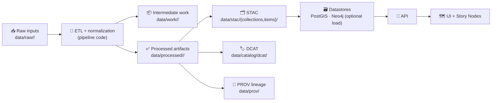

# 🧰 Pipeline Shared Utilities (`src/pipelines/_shared/`)


> [!TIP]
> Browsing this folder is the fastest way to learn “how KFM does pipelines” ✅

---

## 🔎 What is this folder?

`_shared/` is the **common toolbox** used by all pipeline modules under `src/pipelines/`.

It exists to prevent:
- 🚫 re-implementing the same IO/validation/provenance logic in every dataset pipeline
- 🚫 “special snowflake” pipelines that bypass governance, metadata, or reproducibility standards
- 🚫 drift in folder conventions (`data/raw` vs `data/processed` vs metadata/prov placement)

**Mental model:** pipeline code should focus on *domain transformations*; `_shared/` handles *the system contract*.

---

## 🧭 The pipeline contract (aka the “truth path”)

KFM pipelines are expected to follow a canonical lifecycle from raw evidence to publishable artifacts:



> [!IMPORTANT]
> **“Published” ≠ “processed”.** A dataset is considered *published* only when it has its **boundary artifacts**:
> **STAC + DCAT + PROV** (and passes validation/CI gates).

---

## ✅ Golden rules (non-negotiables)

> [!WARNING]
> These rules are enforced socially *and* (eventually) via CI checks. Don’t fight them—use `_shared/` to comply.

1. **No manual steps**  
   Pipelines should run start-to-finish without interactive prompts. Automation wins. 🤖

2. **Deterministic outputs**  
   Same raw inputs + same pipeline version ⇒ same processed artifacts (ideally byte-identical).

3. **No ad-hoc edits**  
   Never “hand-fix” a file in `data/processed/`. Fix the pipeline (or raw input) and re-run.

4. **Raw is immutable**  
   `data/raw/**` is read-only evidence. Pipelines can *copy from raw*, never mutate it.

5. **Every dataset ships metadata + lineage**  
   Pipelines must emit **STAC + DCAT + PROV** so downstream systems can trust and trace outputs.

---

## 📁 Expected repo-facing paths

Even though this folder lives under `src/`, pipelines are expected to write into the canonical data locations:

```text
📦 Kansas-Frontier-Matrix/
├─ 🧠 src/
│  └─ 🧪 pipelines/
│     ├─ _shared/                # ← you are here
│     └─ <pipeline_modules>/
├─ 🗃️ data/
│  ├─ raw/<domain>/              # immutable evidence
│  ├─ work/<domain>/             # intermediate scratch products
│  ├─ processed/<domain>/         # publishable data outputs
│  ├─ stac/
│  │  ├─ collections/
│  │  └─ items/
│  ├─ catalog/
│  │  └─ dcat/
│  └─ prov/
└─ 📚 docs/                      # runbooks, stories, domain READMEs
```

> [!NOTE]
> If your pipeline needs extra structure (e.g., `processed/<domain>/<dataset>/<year>/...`), that’s fine—
> **keep it consistent** and document it in the domain runbook.

---

## 🧩 What belongs in `_shared/`?

Put **cross-cutting, reusable** utilities here:

### 🧱 Core pipeline primitives
- 🧠 **PipelineContext / RunContext** (run id, git hash, timestamps, standard paths)
- ⚙️ **Config loading** (typed configs, defaults, environment overrides)
- 🧾 **Structured logging** (JSON logs, consistent fields: pipeline_id, run_id, step)
- 🔐 **Checksum + version helpers** (idempotency, “nothing changed” detection)

### 📥📤 IO & formats
- CSV/Parquet/JSON readers & writers (with schema checks)
- Geo formats: GeoJSON, GPKG, Shapefile, COGs/tiles (as needed)
- Archive helpers: zip/tar, compression, streaming download adapters

### 🧭 Geo helpers (KFM-flavored)
- CRS normalization and validation
- Geometry validity + repair workflows
- Bounds/extent computation (for STAC + UI defaults)

### 🗂️ Catalog & provenance emitters
- STAC collection/item writers
- DCAT dataset writer
- PROV bundle writer (inputs → activities → outputs; agents; runtime info)

### ✅ Validation & “fail-closed” checks
- schema validation (STAC/DCAT/PROV)
- data sanity checks (row counts, null thresholds, bounds)
- license + attribution checks (required fields)

---

## 🚫 What does *not* belong here?

Keep `_shared/` **dependency-light** and **generic**.

Avoid placing:
- ❌ dataset-specific cleaning logic (“only for 1900 census”)
- ❌ UI or API business logic
- ❌ long notebooks / exploratory scratch code
- ❌ “quick fixes” that bypass the pipeline contract

> [!TIP]
> If only one pipeline uses it, it probably doesn’t belong in `_shared/` (yet).

---

## 🏗️ Recommended pipeline shape

A good pipeline module is typically:
- a thin entrypoint (`run()` / `main()`)
- a few pure transformation steps
- shared helpers doing the boring-but-critical stuff (paths, metadata, provenance, validation)

<details>
  <summary><strong>📄 Example skeleton (template)</strong></summary>

```python
"""
Example pipeline skeleton (pseudo-code).

Goal:
  data/raw/<domain>/...  ->  data/processed/<domain>/...  (+ STAC + DCAT + PROV)
"""

from src.pipelines._shared import (
    context,
    io,
    validate,
    stac,
    dcat,
    prov,
)

PIPELINE_ID = "example_domain__example_dataset"

def run(config_path: str | None = None) -> None:
    ctx = context.start(pipeline_id=PIPELINE_ID, config_path=config_path)

    # 1) Read raw (immutable)
    raw_path = ctx.raw_path("example_domain/source.csv")
    df = io.read_table(raw_path)

    # 2) Transform
    df2 = transform(df)  # keep domain-specific logic here

    # 3) Write processed (serveable)
    out_path = ctx.processed_path("example_domain/example_dataset.parquet")
    io.write_table(df2, out_path)

    # 4) Validate processed outputs
    validate.table(df2, ruleset="baseline_tabular")

    # 5) Emit boundary artifacts
    stac.write_item_for_file(ctx, out_path, title="Example Dataset")
    dcat.write_dataset(ctx, dataset_id="example_dataset", distributions=[out_path])
    prov.write_bundle(ctx, inputs=[raw_path], outputs=[out_path])

    # 6) (Optional) publish/load step
    # ctx.publish_to_postgis(out_path)

    ctx.finish(success=True)

def transform(df):
    # dataset-specific logic only
    return df
```
</details>

---

## 🧾 “Definition of Done” checklist (for every pipeline)

> [!TIP]
> If you’re adding a new pipeline, use this as your PR checklist ✅

- [ ] Reads from `data/raw/<domain>/...` without mutating raw inputs
- [ ] Writes intermediates to `data/work/<domain>/...` (if needed)
- [ ] Writes final artifacts to `data/processed/<domain>/...`
- [ ] Emits **STAC** item/collection
- [ ] Emits **DCAT** dataset entry
- [ ] Emits **PROV** lineage bundle linking inputs → processing → outputs
- [ ] Validates outputs (schema + sanity checks)
- [ ] Produces deterministic outputs (seeded randomness, stable ordering, pinned versions)
- [ ] No interactive prompts / manual steps
- [ ] Documented runbook updated (`docs/data/<domain>/README.md` or equivalent)

---

## 🧪 Testing & CI expectations

Recommended testing approach:
- ✅ unit test shared helpers (pure functions)
- ✅ “golden file” snapshots for small fixtures
- ✅ schema validation tests for STAC/DCAT/PROV emitters
- ✅ idempotency test: run pipeline twice, ensure outputs are unchanged

> [!NOTE]
> CI should be able to validate metadata/prov without needing a full PostGIS/Neo4j load for every PR.

---

## 🧯 Troubleshooting (common foot-guns)

- **CRS drift / map looks “shifted”**  
  Ensure CRS is explicitly set and normalized before writing; never assume defaults.

- **STAC extent is wrong**  
  Compute bounds from the *final* output, not an intermediate layer.

- **Pipeline re-runs duplicate outputs**  
  Use checksums/version checks and write-on-change semantics.

- **“Works on my machine”**  
  Capture runtime metadata in PROV (versions, git commit, config hash). Make your run reproducible.

---

## 🔗 See also

- 📚 `../../../docs/architecture/system_overview.md` (system “truth path”, governance model)
- 🧪 `../` (pipeline modules)
- 🗃️ `../../../data/` (canonical artifact locations)
- 🧭 `../../../docs/data/` (domain runbooks & ETL notes)

---

> [!IMPORTANT]
> If you’re ever tempted to bypass `_shared/`, that’s usually a signal that `_shared/` is missing a helper.
> Add the helper here so the whole ecosystem stays consistent. 🧠✨
