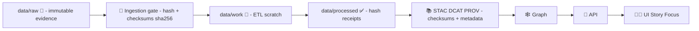

# 🔐 Hashing Utilities (Shared Pipelines)


> Hashes are the “receipt printer” of KFM 🧾 — we use them to prove **what bytes we ingested**, **what we produced**, and **what the UI/AI is allowed to trust**.

---

## 🎯 Purpose

This folder contains **shared hashing primitives** used by KFM pipelines to:

- ✅ compute cryptographic digests (default: **SHA-256**) for bytes/files
- 🧾 generate & verify `checksums.sha256` receipts alongside raw inputs (tamper-evident)
- 🧠 create *canonical* digests for structured JSON (**RFC 8785 / JCS**) used for run manifests / idempotency keys
- 📦 produce content-addressable identifiers for packaged artifacts (e.g., OCI digests for PMTiles/COG/GeoParquet)
- ♻️ keep pipelines **deterministic**, **cache-friendly**, and **auditable**

### 🚫 Non-goals

Hashing here is **not**:

- encryption 🔒
- password hashing (bcrypt/argon2) 🔑
- signing / attestations (Cosign/SLSA handle that) ✍️

---

## 🗂️ Folder layout

```text
src/pipelines/_shared/hashing/
├── 📄 README.md                   # 👈 you are here 📌 Hashing rules: canonicalization, file coverage, and digest formats
├── 🧩 …                           # Implementation files (sha256 helpers, checksum IO, canonical JSON/YAML helpers)
└── 🧪 …                           # Tests (golden vectors + determinism checks; guards against hash drift)
```

---

## 🗺️ Where hashing fits in the KFM pipeline



---

## 🧩 Contracts & conventions

### 1) Digest string format 🔎

**Canonical output** (preferred everywhere in KFM):

- `sha256:<lowercase-hex>`

Acceptable inputs (parsing convenience only):

- `<lowercase-hex>`
- `SHA256:<hex>` (normalize to lowercase output)

> ✅ Why this format? It’s explicit about the algorithm **and** matches OCI-style digests.

---

### 2) `checksums.sha256` file format 🧾

`checksums.sha256` MUST be `sha256sum`-compatible:

```text
<hex><two spaces><posix-relative-path>
```

Rules:

- Paths are **relative** to the dataset root
- Use **POSIX** separators (`/`) (even on Windows)
- File listing is **deterministic** (sorted)
- Exclude the checksum file itself + obvious non-evidence noise (`.DS_Store`, `Thumbs.db`, etc.)
- Always hash **bytes** (`rb`). Never newline-normalize.

---

### 3) Canonical JSON hashing (RFC 8785 / JCS) 🧠

When hashing JSON for idempotency keys / manifests:

- Canonicalize JSON using **RFC 8785 (JCS)** before hashing
- Ensure stable ordering + normalized values
- Never include volatile fields (timestamps, hostnames, random IDs) in the hashed payload unless explicitly intended

**Common KFM pattern:** *self-fingerprinting* manifests  
(digest field blank during hashing, then populated).

<details>
  <summary><strong>Why RFC 8785 matters (practical)</strong> 🧩</summary>

If you hash raw `json.dumps()` output, you’ll get different digests depending on:
- key order
- whitespace
- floating formats
- encoder differences

RFC 8785 makes the “JSON → bytes” step deterministic, so everyone gets the same digest for the same logical manifest.
</details>

---

## 🍳 Usage recipes

> Examples below are written in **Python** because most KFM pipelines are Pythonic, but the **rules are language-agnostic**.

### 1) Hash bytes (SHA-256)

```python
import hashlib

def sha256_bytes(data: bytes) -> str:
    return hashlib.sha256(data).hexdigest()
```

---

### 2) Hash a file (streaming / big-file friendly) 📦

```python
from __future__ import annotations

import hashlib
from pathlib import Path

def sha256_file(path: Path, *, chunk_size: int = 8 * 1024 * 1024) -> str:
    h = hashlib.sha256()
    with path.open("rb") as f:
        for chunk in iter(lambda: f.read(chunk_size), b""):
            h.update(chunk)
    return h.hexdigest()
```

---

### 3) Generate `checksums.sha256` for a dataset folder 🧾

```python
from pathlib import Path

IGNORE_NAMES = {"checksums.sha256", ".DS_Store", "Thumbs.db"}

def write_checksums_sha256(root: Path, out_file: Path | None = None) -> Path:
    root = root.resolve()
    out_file = out_file or (root / "checksums.sha256")

    files = sorted(
        p for p in root.rglob("*")
        if p.is_file() and p.name not in IGNORE_NAMES
    )

    lines: list[str] = []
    for p in files:
        rel = p.relative_to(root).as_posix()
        digest = sha256_file(p)
        lines.append(f"{digest}  {rel}")

    out_file.write_text("\n".join(lines) + "\n", encoding="utf-8")
    return out_file
```

---

### 4) Verify `checksums.sha256` (fail closed ✅)

```python
from pathlib import Path

class ChecksumMismatch(RuntimeError):
    pass

def verify_checksums_sha256(root: Path, checksums_file: Path | None = None) -> None:
    root = root.resolve()
    checksums_file = checksums_file or (root / "checksums.sha256")

    for i, line in enumerate(checksums_file.read_text(encoding="utf-8").splitlines(), start=1):
        if not line.strip():
            continue

        expected, rel = line.split(None, 1)  # tolerant of extra whitespace
        rel = rel.strip()
        expected = expected.lower()

        p = root / rel
        if not p.exists():
            raise ChecksumMismatch(f"[line {i}] Missing file: {rel}")

        actual = sha256_file(p)
        if actual != expected:
            raise ChecksumMismatch(
                f"[line {i}] Digest mismatch for {rel}: expected {expected}, got {actual}"
            )
```

---

### 5) Canonical digest for a run manifest (RFC 8785) 🧠

⚙️ **Contract:** Everyone (CI, local runs, replays) must compute the *same digest* for the *same logical manifest*.

```python
import hashlib
import json

def canonicalize_json_rfc8785(obj) -> bytes:
    """
    Placeholder: use an RFC 8785 (JCS) canonicalizer:
    - keys sorted
    - UTF-8
    - normalized numbers
    - no insignificant whitespace

    NOTE: The fallback below is NOT full RFC 8785. Use a real JCS implementation for production.
    """
    return json.dumps(obj, sort_keys=True, separators=(",", ":"), ensure_ascii=False).encode("utf-8")

def self_hash_manifest(manifest: dict, *, digest_field: str = "canonical_digest") -> dict:
    m = dict(manifest)      # shallow copy
    m[digest_field] = ""    # blank during hashing

    canonical = canonicalize_json_rfc8785(m)
    digest = hashlib.sha256(canonical).hexdigest()

    m[digest_field] = f"sha256:{digest}"
    return m
```

✅ Use this for:

- `run_id`
- `idempotency_key`
- `canonical_digest`
- evidence IDs
- any “what exactly did we run?” audit artifacts

---

### 6) Digest a *set of files* (dataset snapshot ID 📦)

If you need a single ID for “this exact directory tree”:

1. Generate `checksums.sha256` (sorted, deterministic)
2. Hash the `checksums.sha256` **file content** (bytes)

This yields a cheap “Merkle-ish” content ID without implementing a full Merkle tree.

---

## 🔗 Integration points in KFM

| KFM area | How hashing is used | Typical artifact |
|---|---|---|
| 📥 Ingestion Gate | Integrity checks + tamper-evidence receipts | `checksums.sha256` |
| 🧾 Audits | Run manifests + idempotency keys | `data/audits/<run_id>/run_manifest.json` |
| 📚 Catalogs | STAC/DCAT entries carry checksums for assets | `*.stac.json`, `*.dcat.jsonld` |
| 🗃️ Artifact Storage | Content-addressable digests for PMTiles/COG/GeoParquet (OCI/ORAS) | `sha256:<digest>` |
| 🧠 Story Evidence | Evidence manifests reference stable IDs / checksums | `EM-*.yaml` / `EM-*.json` |
| 🛡️ CI / Policy Gates | Reject changes lacking required receipts / integrity fields | OPA/Conftest checks |

---

## 🛡️ Security notes

- Prefer **SHA-256** (or stronger) for integrity.
- A digest proves **integrity**, not **authenticity**.
  - Authenticity requires **signing** (Cosign) + **policy gates**.
- Fail closed: checksum mismatches should **stop the pipeline**, not warn-and-continue.

---

## ⚠️ Common pitfalls (and how to avoid them)

<details>
  <summary><strong>Gotchas</strong> 🧨</summary>

- **Text mode reads** (`"r"`) change bytes (newline normalization). Always `"rb"`.
- **Unsorted directory walks** produce nondeterministic `checksums.sha256`. Always sort.
- **Hashing JSON without canonicalization** is unstable. Use RFC 8785 for manifest IDs.
- **Including timestamps** in the hashed payload breaks idempotency. Keep “identity” separate from “when it ran”.
- **Absolute paths** leak machine details into digests. Always hash **relative POSIX paths**.
</details>

---

## 🧪 Testing checklist

✅ Add/keep tests that assert:

- empty bytes/file hash matches a known vector
- hashing is stable across OS + runtime versions (binary reads)
- directory hashing is stable (sorted order, path normalization)
- canonical JSON hashing is stable (RFC 8785 canonicalization)

---

## 🧰 Contributing

When adding new helpers:

1. Keep functions **pure** (no global state, no hidden randomness)
2. Choose safe defaults (`sha256`)
3. Document the output format (examples!)
4. Add tests + at least one “golden” fixture
5. Prefer streaming IO for large geospatial artifacts (PMTiles/COGs)

---

## 📚 Related docs (KFM)

- 📥 Data intake philosophy & trust boundaries: **📚 KFM Data Intake – Technical & Design Guide**
- 📦 OCI artifact storage + signatures: **Additional Project Ideas** (OCI + ORAS + Cosign)
- 🧾 Evidence manifests for Story Nodes: **Additional Project Ideas** (Evidence-First Narratives)
- 🛡️ Supply chain security & attestations: **🌟 Latest Ideas & Future Proposals**
