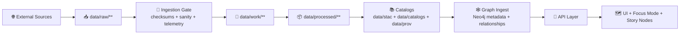

# 🧰 `_shared/io` — Shared Pipeline I/O (Contracts + Utilities)


> **One place for pipeline I/O**: fetch ➜ stage ➜ hash ➜ manifest ➜ publish ➜ prove.  
> If a pipeline touches bytes, it should do it through this layer (or follow its contracts).

---

## 🎯 Purpose

This directory defines the **canonical** I/O patterns used across KFM pipelines so every artifact is:

- **Auditable** (checksums + run manifests + telemetry)
- **Reproducible** (deterministic outputs from inputs + config)
- **Governable** (policy gates can evaluate predictable artifacts)
- **Linkable** (STAC/DCAT/PROV cross-references power graph, UI, and Focus Mode)

In short: `_shared/io` is how KFM prevents “mystery layers” and preserves chain-of-custody end‑to‑end.

---

## 🧭 Scope

✅ This folder **should** contain:
- Fetchers (HTTP/S3/etc) + cache helpers
- Path builders for KFM’s canonical `data/*` layout
- Atomic writes, hashing, checksums, canonical JSON helpers
- Manifest writers (source + run + distribution)
- Catalog writers/validators hooks (STAC/DCAT/PROV)
- Telemetry / ledger appenders (NDJSON)
- Artifact publishing (filesystem + optional OCI registry)

🚫 This folder **should NOT** contain:
- Domain-specific transforms (that lives in each pipeline)
- Business logic for graph ingestion or API services
- UI logic

---

## ✅ Non‑Negotiable Invariants (aka “Don’t Break Trust”)

- **Raw is immutable**: `data/raw/**` is **read‑only evidence**. Never modify bytes in place.
- **Transform in staging**: any conversion/cleanup/reprojection happens in `data/work/**`.
- **Publish only from processed**: user‑facing assets live in `data/processed/**`.
- **Evidence triplet is required**: STAC + DCAT + PROV must exist for anything “published”.
- **Fail‑closed governance**: missing license/provenance/required fields must block publishing.
- **UI & Focus Mode only show proven outputs**: if it’s not cataloged + traceable, it’s not real (in KFM terms).

---

## 🗺️ Where `_shared/io` Sits in the Canonical Pipeline



> 💡 **Key idea:** `_shared/io` is responsible for **B → F** (and producing the artifacts that make **G → I** trustworthy).

---

## 🗂️ Canonical Data Layout (I/O Responsibilities)

Typical outputs this module must support:

```text
repo/
├─ 🗂️ data/                           # 🗂️ Data plane: governed artifacts + catalogs + run evidence
│  ├─ 📥 raw/                          # 📥 Immutable evidence boundary (as-received source drops; never “clean raw”)
│  ├─ 🧪 work/                         # 🧪 Staging + intermediate transforms (OK to wipe/rebuild; reproducible steps)
│  ├─ ✅ processed/                     # ✅ Publishable standardized assets (what UI/API/graph should serve; versioned)
│  ├─ 🛰️ stac/                          # 🛰️ STAC collections/items (asset index; time/run snapshots)
│  ├─ 🗂️ catalogs/                      # 🗂️ DCAT datasets (discovery layer; license/access/distributions)
│  ├─ 🧬 prov/                          # 🧬 PROV bundles (lineage + agents + params; links raw→work→processed→catalog)
│  ├─ 🧾 audits/                        # 🧾 Run evidence bundles (run_manifest, digests, policy decisions, receipts)
│  └─ 📈 telemetry/                     # 📈 Append-only NDJSON logs (audit-safe; redacted; correlation-friendly)
└─ 🧰 src/pipelines/_shared/io/         # 🧰 Shared pipeline IO utilities (canonical paths, safe reads/writes, manifests)
```

---

## 📦 Core Artifacts `_shared/io` Must Produce

| Artifact | Lives near | Why it exists |
|---|---:|---|
| `source.json` | `data/raw/**` | Who/where/when/license/sensitivity of the bytes you fetched |
| `checksums.sha256` | `data/raw/**` | Tamper evidence + integrity verification |
| `run_manifest.json` | `data/audits/<run_id>/` | Full audit of a run (inputs/outputs/tools/params) + idempotency |
| `telemetry.ndjson` | `data/telemetry/` | Append-only event stream for dashboards/audits/watchers |
| `STAC` JSON | `data/stac/**` | Spatial/temporal index of assets (including “where’s the file?”) |
| `DCAT` JSON | `data/catalogs/**` | Discovery metadata (license, keywords, distributions, etc.) |
| `PROV` JSON | `data/prov/**` | Lineage graph (raw ➜ work ➜ processed) + agents + config |
| `distribution.oci` (optional) | with artifacts | OCI/ORAS publishing metadata (digests, signatures, provenance refs) |
| `evidence.yaml` (optional) | story/artifacts | Structured evidence list for Story Nodes / AI outputs |

---

## 🧩 Suggested Module Layout (Implementation Guidance)

> Names are flexible, but responsibilities aren’t. Keep `_shared/io` boring and predictable. ✅

```text
src/pipelines/_shared/io/
├─ 🧭 paths.py                # Canonical path builders for raw/work/processed/stac/dcat/prov/audits (single source of truth)
├─ 🧱 atomic.py               # Atomic file writes: temp files, fsync/rename patterns, partial-write avoidance
├─ 🔐 hashing.py              # sha256/multihash utilities + canonical JSON helpers (stable ordering/encoding)
├─ 🌐 fetch/                  # Fetch adapters (acquisition layer) with retries + caching semantics
│  ├─ 🌐 http.py              # fetch_http(...): retries, backoff, ETag/If-None-Match, cache headers, safe logging
│  ├─ ☁️ s3.py                # fetch_s3(...): optional S3 fetcher (signed URLs/creds handled outside logs)
│  └─ 🧩 __init__.py          # Package exports for fetch helpers
├─ 🧾 manifests/              # Receipt/manifest writers (run/source/OCI) with digest helpers
│  ├─ 🧾 source.py            # write_source_json(...): source record (origin, license, retrieval metadata, checksums)
│  ├─ 🧾🔁 run.py              # write_run_manifest(...), canonical_digest(...): run ledger + deterministic hashing
│  ├─ 📦 oci.py               # write_distribution_oci(...): optional OCI/ORAS distribution manifest writer
│  └─ 🧩 __init__.py          # Package exports for manifest writers
├─ 🗂️ catalogs/               # Catalog writers (STAC/DCAT/PROV) for the evidence triplet
│  ├─ 🛰️ stac.py              # write_stac_collection/items(...): collections + items + asset roles/hrefs
│  ├─ 🗂️ dcat.py              # write_dcat_dataset(...): dataset + distributions + license/access metadata
│  ├─ 🧬 prov.py              # write_prov_bundle(...): PROV entities/activities/agents linking inputs→outputs
│  └─ 🧩 __init__.py          # Package exports for catalog writers
├─ 📈 telemetry.py            # append_ndjson_event(...): append-only NDJSON telemetry (audit-safe; redaction-aware)
├─ 🔒 classification.py       # Sensitivity tags + redaction helpers (label propagation, safe logging guards)
└─ 🧩 __init__.py             # Public exports for shared IO (keep stable; avoid circular deps)
```

---

## 🧪 Minimal Pipeline Pattern (How to Use This)

A pipeline should follow this shape (pseudo-code):

```python
from pipelines._shared.io import paths, fetch, hashing, manifests, catalogs, telemetry

def run(cfg):
    run_id = cfg.run_id()

    # 1) Resolve canonical directories
    raw_dir = paths.raw(cfg.domain, cfg.dataset_id)
    work_dir = paths.work(cfg.domain, cfg.dataset_id, run_id=run_id)
    out_dir = paths.processed(cfg.domain, cfg.dataset_id)

    # 2) Fetch to raw (immutable evidence)
    telemetry.event(run_id, "fetch.start", url=cfg.source_url)
    raw_file = fetch.http(cfg.source_url, dest_dir=raw_dir)
    hashing.write_checksums_sha256(raw_dir)

    manifests.write_source_json(
        raw_dir,
        source_url=cfg.source_url,
        license=cfg.license,
        provider=cfg.provider,
        sensitivity=cfg.sensitivity,
    )

    # 3) Gate (light validation)
    # - schema sanity, required metadata, forbid secrets/sensitive leakage, etc.
    # - fail closed

    # 4) Transform in work → publish to processed
    processed_assets = transform(raw_file, work_dir=work_dir, out_dir=out_dir)

    # 5) Write evidence triplet (STAC/DCAT/PROV) linking everything
    catalogs.write_stac(cfg, processed_assets)
    catalogs.write_dcat(cfg, processed_assets)
    catalogs.write_prov(cfg, run_id=run_id, raw_inputs=[raw_file], outputs=processed_assets)

    # 6) Run manifest (audit trail + idempotency)
    manifests.write_run_manifest(cfg, run_id=run_id, inputs=[raw_file], outputs=processed_assets)

    telemetry.event(run_id, "run.complete", outputs=len(processed_assets))
```

---

## 🌍 Geospatial IO Requirements (So the Map Works)

Pipelines that output geospatial layers should ensure:

- **CRS is explicit** and conversions are **logged** (no silent reprojection).
- Standardize outputs into web-friendly formats:
  - Vector: GeoParquet / GeoJSON (as appropriate) + optional PMTiles for fast web rendering
  - Raster: Cloud‑Optimized GeoTIFF (COG)
  - 3D: Cesium-friendly assets where applicable
- Assets are **discoverable by time** (time slider support needs temporal fields reflected in catalogs)

---

## ⛓️ Audit + Provenance: Run Manifests & Determinism

**Run manifests** are your “flight recorder.” They should include:
- `run_id`, timestamps, pipeline version
- input URIs + checksums
- output paths + checksums
- tool versions
- config snapshot / parameters
- summary stats + error counts
- canonical digest / idempotency key

**Determinism expectations**
- Stable ordering
- Canonical JSON serialization (for stable hashing)
- Atomic writes (avoid half-written artifacts)

---

## 🧾 Telemetry (Append‑Only NDJSON)

Telemetry is not “debug logs.” It’s a **ledger**:
- append-only
- machine-readable
- policy-checked when needed
- useful for watcher agents / dashboards

Recommended event fields:
- `ts`, `run_id`, `dataset_id`, `pipeline`, `event`, `level`, `details`, `outcome`

---

## 🔐 Governance Hooks (Policy Gates)

This folder exists to make policy easy to enforce. Pipelines should be able to prove:

- ✅ license present
- ✅ provenance complete
- ✅ STAC/DCAT/PROV complete
- ✅ sensitivity classification present & respected
- ✅ no secrets committed
- ✅ reproducible run context captured

> 🧱 Rule of thumb: **if CI can’t validate it, it’s not a real artifact**.

---

## 🧨 Common Pitfalls (Avoid These)

- ❌ Writing outputs straight to `data/processed/**` without a run manifest
- ❌ Modifying `data/raw/**` “just to fix a field”
- ❌ Missing license/provider metadata (“we’ll add later” → governance failure)
- ❌ Silent CRS transforms (distorts reality + breaks trust)
- ❌ “One-off scripts” that bypass the pipeline contract

---

## 🔗 Related KFM Docs (Design Inputs)

These documents define the rules `_shared/io` is enforcing:

- 📘 **KFM Master Guide v13** (pipeline ordering, directory layout, evidence triplet)
- 📥 **Data Intake Guide** (ingestion gate, checksums, telemetry, deterministic ETL)
- 🧠 **AI System Overview** (immutable governance ledger, citations, provenance UX)
- 🗺️ **UI System Overview** (API boundary, provenance panels, layer trust model)
- 🧱 **Comprehensive Architecture & Design** (policy gates, fail-closed, W-P-E agents)
- 🧪 **Additional Project Ideas / Future Proposals** (OCI artifacts, offline packs, evidence manifests)
- 🌐 **Geospatial / WebGL references** (MapLibre/Cesium patterns, virtual worlds research portfolios)

---

## 🧠 Contributing to `_shared/io`

When adding a new I/O helper, ask:

1. **Does it preserve immutability boundaries?**
2. **Does it produce audit artifacts (hashes/manifests/telemetry)?**
3. **Can policy validate it deterministically?**
4. **Does it strengthen cross-layer linkage (catalogs ↔ graph ↔ UI)?**

If “no” to any: refactor until “yes.” ✅
