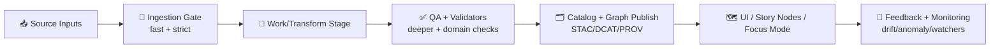

# 🧪 Shared Validators (KFM Pipelines)

| ✅ Contract-first | 🔒 Policy-as-Code | 🗺️ Geo-aware | 🧾 Evidence-first | 🧠 AI Guardrails |
|---|---|---|---|---|
| deterministic + versioned inputs | OPA/Rego + Conftest gates | CRS/geometry/time sanity | claims must link to evidence | citations + governance checks |

This folder hosts the **shared validation layer** used across Kansas Frontier Matrix (KFM) pipelines to ensure that data, metadata, models, and narrative outputs are **safe to ingest, safe to publish, and safe to trust**.

Validators are designed to be:
- **Fail-closed** (unsafe/unknown ≠ allowed) ✅
- **Provenance-forward** (every output must be explainable + attributable) 🧾
- **Geospatially strict** (CRS + geometry + time consistency are first-class) 🗺️
- **Pipeline-native** (run at *ingestion*, *processing QA*, and *publish/promotion* gates) 🚦

---

## 🧭 Where Validators Fit in the Pipeline


```mermaid
flowchart LR
  A[📥 Source Inputs] --> B[🚪 Ingestion Gate<br/>fast + strict]
  B --> C[🧰 Work/Transform Stage]
  C --> D[✅ QA + Validators<br/>deeper + domain checks]
  D --> E[🗂️ Catalog + Graph Publish<br/>STAC/DCAT/PROV]
  E --> F[🗺️ UI / Story Nodes / Focus Mode]
  F --> G[🔁 Feedback + Monitoring<br/>drift/anomaly/watchers]
```

### Key idea
KFM follows a **staged pipeline** pattern (raw → work → processed) and promotes outputs only after validation + QA gates pass. This aligns with contract-first / deterministic pipeline principles and “promote only after validation” behavior.  [oai_citation:0‡📚 Kansas Frontier Matrix (KFM) Data Intake – Technical & Design Guide.pdf](file-service://file-EbUCdsJMbu5KwpoKMrLrgj) [oai_citation:1‡📚 Kansas Frontier Matrix (KFM) Data Intake – Technical & Design Guide.pdf](file-service://file-EbUCdsJMbu5KwpoKMrLrgj)

---

## 📦 What This Folder Should Contain

> [!NOTE]
> The exact filenames may vary by implementation, but the *capabilities* below are the intended shared surface area.

```text
📁 src/pipelines/_shared/validators/
├── 🧾 README.md                      # you are here
├── 🧱 base.py                        # Validator protocol + context (run_id, stage, dataset_id)
├── 🧰 registry.py                    # register + run validators by profile
├── 📄 report.py                      # ValidationIssue + ValidationReport models
├── 🎛️ profiles.py                    # ingest / qa / publish profiles
└── 🧪 builtin/
    ├── 🔐 policy_pack.py             # bridges to OPA/Rego + conftest inputs
    ├── 📦 integrity.py               # checksums, file existence, MIME
    ├── 🧷 schema.py                  # JSON Schema / table schema checks
    ├── 🗂️ stac_dcat_prov.py          # metadata backbone checks
    ├── 🗺️ geospatial.py              # CRS/geometry/bounds/time checks
    ├── 🕸️ graph_health.py            # orphaned nodes, conflicting edges, stale refs
    ├── 🧾 evidence.py                # evidence_manifest validation
    └── 🧠 ai_outputs.py              # citations + governance gate on AI results
```

---

## 🚦 Validation Profiles (When & How Strict)

KFM treats validation as **layered gates**, not a single “lint” step.

| Profile | When | Goal | Typical failure mode |
|---|---|---|---|
| `ingest` 🚪 | before accepting raw inputs | quick integrity + “can we safely proceed?” | missing checksum / unparseable / missing classification |
| `qa` ✅ | after transform, before publish | correctness + domain checks | CRS mismatch, invalid geometry, metadata gaps |
| `publish` 🗂️ | before promotion to processed/catalog | “safe-to-discover” bar | policy violations, missing provenance/evidence |

This mirrors the project’s “Ingestion Gate” concept (checksums, schema sanity, telemetry) and the later QA/publish checks.  [oai_citation:2‡KFM- python-geospatial-analysis-cookbook-over-60-recipes-to-work-with-topology-overlays-indoor-routing-and-web-application-analysis-with-python.pdf](file-service://file-2gpiGDZS8iw6EdxGswEdHp) [oai_citation:3‡📚 Kansas Frontier Matrix (KFM) Data Intake – Technical & Design Guide.pdf](file-service://file-EbUCdsJMbu5KwpoKMrLrgj)

---

## 🧷 Validator Categories

### 1) 📦 Integrity & Artifact Safety
Typical checks:
- presence of `checksums.sha256`
- file count / size budgets (especially for offline packs)
- “known” MIME types / extensions
- zip/tar safety (no path traversal, no symlinks, no executables unless explicitly allowed)

**Why:** KFM’s intake flow explicitly expects a checksum file at ingestion time.  [oai_citation:4‡KFM- python-geospatial-analysis-cookbook-over-60-recipes-to-work-with-topology-overlays-indoor-routing-and-web-application-analysis-with-python.pdf](file-service://file-2gpiGDZS8iw6EdxGswEdHp)

---

### 2) 🗂️ Contract & Schema Validation
Typical checks:
- schema sanity for JSON/CSV/Parquet/GeoParquet/GeoJSON
- “data contract” version alignment
- required columns/fields (IDs, timestamps, classification labels, etc.)

KFM uses **data contracts** enforced via CI + schema checks.  [oai_citation:5‡Kansas Frontier Matrix (KFM) – Comprehensive Technical Documentation.pdf](file-service://file-AkqwUuYPp5zePf7pv5SMxi)

---

### 3) 🧾 STAC / DCAT / PROV “Metadata Backbone”
Typical checks:
- STAC collections/items valid + complete
- DCAT dataset record present + discoverable fields
- PROV record present and linked
- cross-references exist (STAC ↔ DCAT ↔ PROV)

KFM explicitly treats **STAC/DCAT/PROV** as its metadata backbone and cross-references between them.  [oai_citation:6‡📚 Kansas Frontier Matrix (KFM) Data Intake – Technical & Design Guide.pdf](file-service://file-EbUCdsJMbu5KwpoKMrLrgj) [oai_citation:7‡📚 Kansas Frontier Matrix (KFM) Data Intake – Technical & Design Guide.pdf](file-service://file-EbUCdsJMbu5KwpoKMrLrgj)

---

### 4) 🗺️ Geospatial + Temporal Consistency
Typical checks:
- canonical CRS enforcement (often **EPSG:4326** for exchange/geometry conventions)
- bounds sanity (lon/lat within valid ranges)
- geometry validity (self-intersections, invalid rings)
- time ranges consistent (no impossible spans; monotonic sequences where required)
- tile compatibility for viewers (vector tiles, 3D Tiles, COGs)

KFM’s mapping stack references MapLibre/Cesium and expects consistent geospatial formats.  [oai_citation:8‡Kansas-Frontier-Matrix_ Open-Source Geospatial Historical Mapping Hub Design.pdf](file-service://file-ShqHKgjxCS9UT9vbcxDNzA)

The GeoJSON default CRS and bounds expectations are well-defined (WGS84 / EPSG:4326).  [oai_citation:9‡KFM- python-geospatial-analysis-cookbook-over-60-recipes-to-work-with-topology-overlays-indoor-routing-and-web-application-analysis-with-python.pdf](file-service://file-2gpiGDZS8iw6EdxGswEdHp)

---

### 5) 🔒 Governance, Sensitivity & Privacy
Typical checks:
- classification/sensitivity labels exist + respected
- redaction / fuzzing rules applied where required
- privacy safeguards for aggregated outputs (k-anonymity / t-closeness / differential privacy patterns)
- deny publishing if governance rules unmet

KFM emphasizes ethical governance, and privacy-preserving techniques are explicitly relevant to preventing leakage and inference.  [oai_citation:10‡Kansas Frontier Matrix (KFM) – Comprehensive Architecture, Features, and Design.pdf](file-service://file-4Umt1yHoGKicdmLWzFJ9sC) [oai_citation:11‡Data Mining Concepts & applictions.pdf](file-service://file-2uwEbQAFVKpXaTtWgUirAH)

---

### 6) 🧾 Evidence & Narrative Claims
Typical checks:
- `evidence_manifest.yaml` exists for Story Nodes / narrative claims
- every claim has a stable ID + evidence references
- CI enforces “no orphan claims” and “citations required”

Example evidence manifest structure (claim → evidence refs).  [oai_citation:12‡Additional Project Ideas.pdf](file-service://file-Pc2GNivcrHBeKjBQksLC3T)

KFM’s governance explicitly calls for **evidence for narratives** (and may block merging if missing).  [oai_citation:13‡📚 Kansas Frontier Matrix (KFM) Data Intake – Technical & Design Guide.pdf](file-service://file-EbUCdsJMbu5KwpoKMrLrgj)

---

### 7) 🕸️ Graph Health & Observability
Typical checks:
- orphan nodes (no edges)
- conflicting edges (duplicates / contradictory relationships)
- “lag” between ingestion and graph visibility
- missing provenance links for graph nodes

KFM explicitly proposes **graph health checks** for orphans, conflicting edges, and freshness/lag issues.  [oai_citation:14‡Kansas Frontier Matrix (KFM) – Comprehensive Architecture, Features, and Design.pdf](file-service://file-4Umt1yHoGKicdmLWzFJ9sC)

---

### 8) 🧠 AI Output Validators (Citations + Governance)
Typical checks:
- enforce `AnswerWithCitations` / “always cite sources”
- run a governance check and fail if policy-violating
- attach model card / evaluation metadata for ML outputs

KFM’s AI system emphasizes “always cite sources” and a governance check that can hard-fail outputs.  [oai_citation:15‡Kansas Frontier Matrix – Comprehensive UI System Overview.pdf](file-service://file-KcBQruYcoFVDEixzzRHTwt)

---

### 9) 📦 Offline Packs & Distribution
Typical checks:
- offline packs contain pre-rendered tiles + local store format expectations
- pack manifest integrity and size budgets
- signature/attestation verification for distributed artifacts (OCI artifacts, cosign)

KFM explicitly discusses offline packs and pre-rendered data delivery.  [oai_citation:16‡Kansas Frontier Matrix (KFM) – AI System Overview 🧭🤖.pdf](file-service://file-Pv8eev6RWvCKrGCXyzY7zg)

KFM also proposes OCI artifacts + signing/attestation patterns for distribution.  [oai_citation:17‡Kansas Frontier Matrix (KFM) – Comprehensive Architecture, Features, and Design.pdf](file-service://file-4Umt1yHoGKicdmLWzFJ9sC)

---

## 🧾 Standard Output: ValidationReport

> [!TIP]
> Validators should return **machine-readable** results that can be attached to CI artifacts, a run manifest, and/or PROV records.

Suggested shape:

```json
{
  "run_id": "run_2026-01-23T12:00:00Z__abc123",
  "profile": "qa",
  "stage": "work",
  "target": "data/work/datasets/kfm-ks-aerial-1950s/",
  "summary": { "ok": false, "errors": 1, "warnings": 2 },
  "issues": [
    {
      "code": "KFM-PROV-001",
      "severity": "error",
      "message": "Missing provenance record for dataset item",
      "path": "catalog/stac/items/1954_tile_003.json",
      "hint": "Add PROV JSON and link it from STAC/DCAT."
    }
  ],
  "metrics": { "files_checked": 128, "duration_ms": 742 }
}
```

KFM already uses the `KFM-PROV-001` style of actionable error codes in CI scenarios.  [oai_citation:18‡📚 Kansas Frontier Matrix (KFM) Data Intake – Technical & Design Guide.pdf](file-service://file-EbUCdsJMbu5KwpoKMrLrgj)

---

## 🧱 Implementing a Validator (Guidelines)

### ✅ Rules of the road
- **Deterministic & idempotent:** same input → same output; safe to re-run (supports run-manifest hashing/idempotency strategies).  [oai_citation:19‡Additional Project Ideas.pdf](file-service://file-Pc2GNivcrHBeKjBQksLC3T)
- **Fail-closed:** if you can’t prove it’s safe/valid, treat as invalid (policy-as-code should block).  [oai_citation:20‡Kansas Frontier Matrix (KFM) – Comprehensive Architecture, Features, and Design.pdf](file-service://file-4Umt1yHoGKicdmLWzFJ9sC)
- **No “mystery layers”:** validation should ensure every layer/claim is explainable and linked to sources (UI “map behind the map” expectation).  [oai_citation:21‡Kansas Frontier Matrix – Comprehensive UI System Overview.pdf](file-service://file-KcBQruYcoFVDEixzzRHTwt) [oai_citation:22‡Kansas Frontier Matrix (KFM) – Comprehensive Technical Documentation.pdf](file-service://file-AkqwUuYPp5zePf7pv5SMxi)
- **Security hygiene:** avoid unsafe shell execution patterns when invoking GIS tooling. The Python docs explicitly warn against `shell=True` with unsanitized input.  [oai_citation:23‡KFM- python-geospatial-analysis-cookbook-over-60-recipes-to-work-with-topology-overlays-indoor-routing-and-web-application-analysis-with-python.pdf](file-service://file-2gpiGDZS8iw6EdxGswEdHp)

### 🧩 Minimal skeleton (pseudocode)
```python
class Validator(Protocol):
    code: str
    description: str

    def validate(self, ctx: ValidatorContext) -> list[ValidationIssue]:
        ...

def register(registry: Registry) -> None:
    registry.add(ChecksumValidator())
    registry.add(StacDcatProvValidator())
    registry.add(PolicyPackValidator())
```

> [!NOTE]
> Keep validators **pure** where possible. Anything that mutates data should live in transform stages, not validation.

---

## 🧪 Testing & Definition of Done

Validators should be treated like product code:
- unit tests for happy path + failure path
- fixture datasets (tiny, deterministic)
- clear error codes + remediation hints
- performance budget (especially for `ingest` profile)

KFM documentation best practices include **care labels**, documentation metadata, and explicit “definition of done” patterns for docs and checklists. Validators can enforce these on docs/metadata.  [oai_citation:24‡Comprehensive Markdown Guide_ Syntax, Extensions, and Best Practices.docx](file-service://file-J6rFRcp4ExCCeCdTevQjxz)

---

## 🧠 Simulation / Modeling Validation (When Applicable)

For simulation workflows, validators should verify:
- assumptions + scenarios are recorded
- parameterization + uncertainty are documented
- outputs are compared with observed data where possible
- calibration/validation steps are traceable

The intake guide’s simulation workflow emphasizes recording assumptions, method, and comparing with observations for credibility.  [oai_citation:25‡📚 Kansas Frontier Matrix (KFM) Data Intake – Technical & Design Guide.pdf](file-service://file-EbUCdsJMbu5KwpoKMrLrgj)

---

## 🔌 Integration Touchpoints

### CI gates (Policy Pack)
Validators feed structured facts to CI checks (e.g., conftest/OPA) so merges can be blocked on policy violations:
- provenance-first publishing requirement
- license/provider info required
- secrets scanning
- sovereignty/classification rules

These policy-pack patterns are explicitly called out in KFM architecture + project ideas.  [oai_citation:26‡Kansas Frontier Matrix (KFM) – Comprehensive Architecture, Features, and Design.pdf](file-service://file-4Umt1yHoGKicdmLWzFJ9sC) [oai_citation:27‡Additional Project Ideas.pdf](file-service://file-Pc2GNivcrHBeKjBQksLC3T)

### Orchestration
Validation is expected to run inside the orchestrator’s step graph (including concurrency pools for geo/ML workloads), and produce artifacts suitable for auditing.  [oai_citation:28‡Additional Project Ideas.pdf](file-service://file-Pc2GNivcrHBeKjBQksLC3T)

### UI expectations
UI features emphasize provenance/citations and “map behind the map”; validators should prevent publishing layers/claims without traceability.  [oai_citation:29‡Kansas Frontier Matrix – Comprehensive UI System Overview.pdf](file-service://file-KcBQruYcoFVDEixzzRHTwt)

---

## 🛣️ Roadmap Ideas (Optional / Future Validators)

- 👥 **Crowdsourced verification validators:** reconcile multiple independent validations, track credit + reputation, and require provenance for community submissions.  [oai_citation:30‡Innovative Concepts to Evolve the Kansas Frontier Matrix (KFM).pdf](file-service://file-G71zNoWKxsoSW44iwZaaCC)
- 🕰️ **4D digital twin consistency validators:** temporal continuity checks across time slices / scenarios.  [oai_citation:31‡Kansas Frontier Matrix (KFM) – Comprehensive Technical Documentation.pdf](file-service://file-AkqwUuYPp5zePf7pv5SMxi)
- 📈 **Drift/anomaly validators:** detect metric drift for streams, models, or narrative trend signals (EWMA/CUSUM-style monitoring concepts are part of the broader validation vision).  [oai_citation:32‡Additional Project Ideas.pdf](file-service://file-Pc2GNivcrHBeKjBQksLC3T)

---

## 📚 Project References Used to Shape This README

- **Data Intake / Ingestion Gate** (checksums, schema sanity, STAC/DCAT/PROV, EPSG conventions)  [oai_citation:33‡KFM- python-geospatial-analysis-cookbook-over-60-recipes-to-work-with-topology-overlays-indoor-routing-and-web-application-analysis-with-python.pdf](file-service://file-2gpiGDZS8iw6EdxGswEdHp) [oai_citation:34‡📚 Kansas Frontier Matrix (KFM) Data Intake – Technical & Design Guide.pdf](file-service://file-EbUCdsJMbu5KwpoKMrLrgj)
- **Architecture, Features & Design** (policy pack, automated gates, fail-closed behavior, promotion after validation)  [oai_citation:35‡Kansas Frontier Matrix (KFM) – Comprehensive Architecture, Features, and Design.pdf](file-service://file-4Umt1yHoGKicdmLWzFJ9sC) [oai_citation:36‡📚 Kansas Frontier Matrix (KFM) Data Intake – Technical & Design Guide.pdf](file-service://file-EbUCdsJMbu5KwpoKMrLrgj)
- **Technical Documentation** (data contracts + CI enforcement, “no mystery layers”)  [oai_citation:37‡Kansas Frontier Matrix (KFM) – Comprehensive Technical Documentation.pdf](file-service://file-AkqwUuYPp5zePf7pv5SMxi) [oai_citation:38‡Kansas Frontier Matrix (KFM) – Comprehensive Technical Documentation.pdf](file-service://file-AkqwUuYPp5zePf7pv5SMxi)
- **AI System Overview** (citations-first outputs, governance checks, offline packs)  [oai_citation:39‡Kansas Frontier Matrix – Comprehensive UI System Overview.pdf](file-service://file-KcBQruYcoFVDEixzzRHTwt) [oai_citation:40‡Kansas Frontier Matrix (KFM) – AI System Overview 🧭🤖.pdf](file-service://file-Pv8eev6RWvCKrGCXyzY7zg)
- **UI System Overview** (map behind the map, provenance/citations as UI primitives)  [oai_citation:41‡Kansas Frontier Matrix – Comprehensive UI System Overview.pdf](file-service://file-KcBQruYcoFVDEixzzRHTwt)
- **Additional Project Ideas** (evidence manifests, run-manifest hashing/idempotency, graph health checks, policy-as-code)  [oai_citation:42‡Additional Project Ideas.pdf](file-service://file-Pc2GNivcrHBeKjBQksLC3T) [oai_citation:43‡Additional Project Ideas.pdf](file-service://file-Pc2GNivcrHBeKjBQksLC3T) [oai_citation:44‡Kansas Frontier Matrix (KFM) – Comprehensive Architecture, Features, and Design.pdf](file-service://file-4Umt1yHoGKicdmLWzFJ9sC)
- **Latest Ideas & Future Proposals** (PR → PROV integration; CI provenance enforcement)  [oai_citation:45‡🌟 Kansas Frontier Matrix – Latest Ideas & Future Proposals.docx.pdf](file-service://file-SQ3f7ve8SGiusT6ThZEuCe)
- **Geospatial Cookbook** (EPSG:4326 transformations; shell injection warning; geometry validity)  [oai_citation:46‡KFM- python-geospatial-analysis-cookbook-over-60-recipes-to-work-with-topology-overlays-indoor-routing-and-web-application-analysis-with-python.pdf](file-service://file-2gpiGDZS8iw6EdxGswEdHp) [oai_citation:47‡KFM- python-geospatial-analysis-cookbook-over-60-recipes-to-work-with-topology-overlays-indoor-routing-and-web-application-analysis-with-python.pdf](file-service://file-2gpiGDZS8iw6EdxGswEdHp)
- **Data Mining Concepts** (privacy-preserving considerations for sensitive outputs)  [oai_citation:48‡Data Mining Concepts & applictions.pdf](file-service://file-2uwEbQAFVKpXaTtWgUirAH)
- **Markdown / Documentation Guides** (care labels + doc metadata that validators can enforce)  [oai_citation:49‡Comprehensive Markdown Guide_ Syntax, Extensions, and Best Practices.docx](file-service://file-J6rFRcp4ExCCeCdTevQjxz)
- **Master Coder Protocol** (model cards + experiment tracking expectations for ML artifacts)  [oai_citation:50‡Scientific Method _ Research _ Master Coder Protocol Documentation.pdf](file-service://file-HTpax4QbDgguDwxwwyiS32)