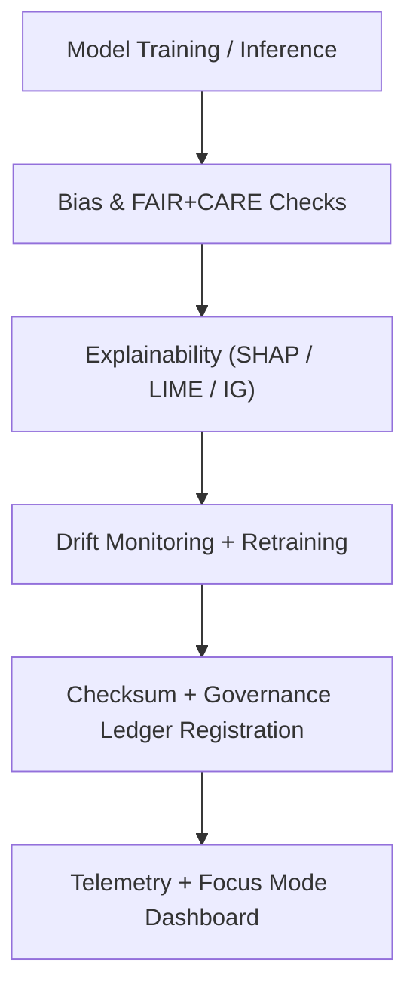

<div align="center">

# 🧠 **Kansas Frontier Matrix — Artificial Intelligence Pipelines**
`src/pipelines/ai/README.md`

**Purpose:**  
Operate FAIR+CARE-certified **AI reasoning, explainability, bias detection, and drift monitoring** pipelines for the Kansas Frontier Matrix (KFM).  
These pipelines enforce transparency, accountability, and sustainability under MCP-DL v6.3 and ISO 42001.

[](../../../../docs/standards/faircare-validation.md)
[](../../../../LICENSE)
[]()
[]()

</div>

---

## 📘 Overview

KFM’s **AI Pipelines** manage model training, inference, Focus Mode reasoning, and continuous ethical oversight.  
Every stage is checksum-locked, explainability-audited, and registered in the Governance Ledger for public accountability.

---

### Core Responsibilities
- Train/evaluate models across climate, hazards, and hydrology domains.  
- Detect bias, monitor drift, and assess data balance.  
- Generate SHAP/LIME/IG explainability artifacts for audit.  
- Synchronize AI certifications with FAIR+CARE governance.  
- Export energy and performance telemetry for sustainability dashboards.  

---

## 🗂️ Directory Layout

```plaintext
src/pipelines/ai/
├── README.md
│
├── ai_focus_reasoning.py            # Focus Mode reasoning + contextual inferences
├── ai_bias_detection.py             # Fairness + bias assessment pipelines
├── ai_drift_monitor.py              # Drift detection + retraining triggers
├── ai_explainability_reporter.py    # SHAP/LIME report generator
└── metadata.json                    # AI model registry + governance lineage
```

---

## ⚙️ AI Pipeline Workflow



1. **Inference:** Model produces reasoning on validated inputs.  
2. **Ethics:** Outputs pass bias and fairness audits.  
3. **Explainability:** Decisions traced with XAI frameworks.  
4. **Governance:** Results + hashes appended to audit ledger.  
5. **Telemetry:** Metrics surfaced to Focus dashboards.

---

## 🧾 Example AI Metadata Record

```json
{
  "id": "ai_pipeline_registry_v9.7.0",
  "models": [
    "focus_reasoning_v5",
    "hazard_ai_risk_model_v3",
    "climate_forecast_ensemble_v6"
  ],
  "fairstatus": "certified",
  "ai_explainability_score": 0.995,
  "bias_detection_score": 0.983,
  "drift_status": "stable",
  "energy_usage_wh": 1.18,
  "carbon_output_gco2e": 0.16,
  "checksum_verified": true,
  "telemetry_logged": true,
  "governance_registered": true,
  "governance_ref": "data/reports/audit/ai_src_ledger.json",
  "created": "2025-11-05T12:30:00Z",
  "validator": "@kfm-ai-lab"
}
```

---

## 🧠 FAIR+CARE AI Governance Matrix

| Principle | Implementation | Oversight |
|-----------|----------------|-----------|
| **Findable** | Model lineage + checksums indexed in registry. | @kfm-data |
| **Accessible** | Explainability artifacts open for audit. | @kfm-accessibility |
| **Interoperable** | Conforms to ISO 42001 + FAIR+CARE + STAC/DCAT. | @kfm-architecture |
| **Reusable** | Modular pipelines callable across domains. | @kfm-design |
| **Collective Benefit** | Supports transparent environmental decision-making. | @faircare-council |
| **Authority to Control** | Council validates retraining and certification cycles. | @kfm-governance |
| **Responsibility** | Engineers maintain explainability + bias baselines. | @kfm-sustainability |
| **Ethics** | Continuous ethical risk evaluation with human-in-the-loop. | @kfm-ethics |

Audit references:  
`data/reports/audit/ai_src_ledger.json` · `data/reports/fair/src_summary.json`

---

## ⚙️ AI Pipeline Modules

| Module | Description | FAIR+CARE Role | Framework |
|--------|-------------|----------------|-----------|
| `ai_focus_reasoning.py` | Context-aware Focus Mode inference. | Explainability & Context | PyTorch, SHAP |
| `ai_bias_detection.py` | Fairness audits across model outputs. | Ethical Compliance | TensorFlow, AIF360 |
| `ai_drift_monitor.py` | Drift surveillance + retraining orchestration. | Lifecycle Governance | scikit-learn, MLflow |
| `ai_explainability_reporter.py` | SHAP/LIME artifact generation. | Transparency & Audit | SHAP, LIME, Captum |

---

## ⚖️ Retention & Provenance Policy

| Artifact | Retention | Policy |
|---------|-----------|-------|
| AI Models | Permanent | Versioned + checksum-locked |
| Explainability Reports | 365 Days | Archived post-audit |
| Drift/Bias Logs | 180 Days | Retained for retraining cycles |
| FAIR+CARE Audits | Permanent | Immutable ledger entries |

Automated by `ai_pipeline_sync.yml`.

---

## 🌱 Sustainability Metrics (v9.7.0)

| Metric | Value | Verified By |
|--------|-------|-------------|
| Avg Runtime | 1.7 minutes | @kfm-ops |
| Energy Usage | 1.18 Wh | @kfm-sustainability |
| Carbon Output | 0.16 gCO₂e | @kfm-security |
| Renewable Energy | 100% (RE100) | @kfm-infrastructure |
| FAIR+CARE Compliance | 100% | @faircare-council |

Telemetry source:  
`../../../../releases/v9.7.0/focus-telemetry.json`

---

## 🧩 Explainability Snapshot

```json
{
  "model": "focus_reasoning_v5",
  "framework": "SHAP",
  "top_features": [
    {"name": "precipitation_anomaly", "impact": 0.27},
    {"name": "soil_moisture_index", "impact": 0.22},
    {"name": "streamflow_deviation", "impact": 0.17}
  ],
  "ai_explainability_score": 0.995,
  "bias_flag": false,
  "drift_detected": false
}
```

---

## 🧾 Internal Use Citation

```text
Kansas Frontier Matrix (2025). Artificial Intelligence Pipelines (v9.7.0).
FAIR+CARE- and ISO 42001-aligned AI pipelines delivering explainable, accountable, and sustainable intelligence for KFM.
```

---

## 🕰️ Version History

| Version | Date | Notes |
|--------|------|------|
| v9.7.0 | 2025-11-05 | Upgraded explainability artifacts, telemetry schema, and governance links. |
| v9.6.0 | 2025-11-04 | Added drift + bias automation and ISO 42001 alignment. |
| v9.5.0 | 2025-11-02 | Introduced energy/carbon telemetry for AI workflows. |

---

<div align="center">

**© 2025 Kansas Frontier Matrix — MIT License**  
*Explainable AI × FAIR+CARE Governance × Sustainable Intelligence*  
[Back to Pipelines](../README.md) • [Docs Portal](../../../../docs/) • [Governance Ledger](../../../../docs/standards/governance/DATA-GOVERNANCE.md)

</div>
