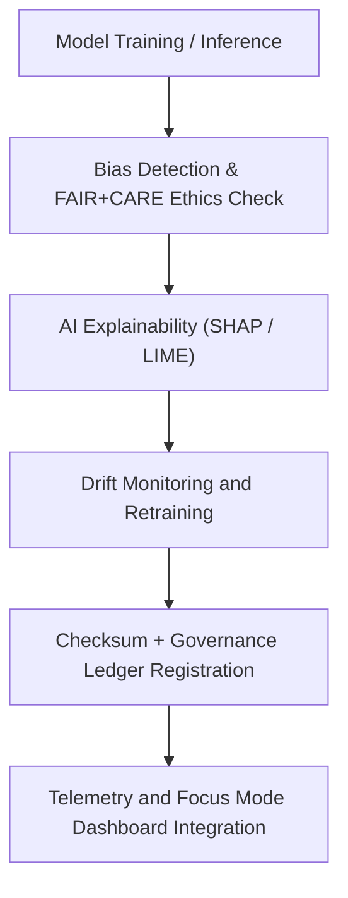

<div align="center">

# 🧠 Kansas Frontier Matrix — **Artificial Intelligence Pipelines**
`src/pipelines/ai/README.md`

**Purpose:**  
Central automation layer for all **AI reasoning, model validation, bias detection, and drift monitoring pipelines** within the Kansas Frontier Matrix (KFM).  
These pipelines integrate FAIR+CARE-aligned explainable AI (XAI) systems to ensure every model is transparent, reproducible, and ethically governed.

[](../../../../docs/standards/faircare-validation.md)
[](../../../../LICENSE)
[]()
[]()

</div>

---

## 📚 Overview

The **Artificial Intelligence Pipelines** are responsible for managing all **machine learning**, **AI inference**, and **Focus Mode reasoning** processes in KFM.  
Each AI pipeline is designed with **FAIR+CARE**, **ISO 42001**, and **MCP-DL v6.3** compliance to support transparent and ethical decision-making across environmental and historical datasets.

### Core Responsibilities:
- Train and evaluate AI/ML models across multiple KFM data domains.  
- Detect bias, drift, and data imbalance through explainable AI metrics.  
- Perform continuous model governance and ethical risk assessments.  
- Log telemetry for sustainability, performance, and reproducibility tracking.  

---

## 🗂️ Directory Layout

```plaintext
src/pipelines/ai/
├── README.md                               # This file — documentation for AI pipelines
│
├── ai_focus_reasoning.py                   # Focus Mode AI logic and environmental reasoning
├── ai_bias_detection.py                    # Model bias detection and fairness audit pipeline
├── ai_drift_monitor.py                     # Drift monitoring and retraining scheduler
├── ai_explainability_reporter.py           # Generates SHAP/LIME-based interpretability reports
└── metadata.json                           # AI model metadata and governance record
```

---

## ⚙️ AI Pipeline Workflow



### Workflow Summary:
1. **Inference:** Model executes reasoning on incoming validated datasets.  
2. **Ethics Review:** AI outputs undergo bias and fairness checks.  
3. **Explainability:** Each decision trace logged using explainable AI frameworks.  
4. **Governance:** Hashes, results, and performance metrics registered in provenance ledger.  
5. **Telemetry:** Metrics synchronized for visualization and audit under Focus Mode.  

---

## 🧩 Example AI Metadata Record

```json
{
  "id": "ai_pipeline_registry_v9.6.0",
  "models": [
    "focus_reasoning_v4",
    "hazard_ai_risk_model_v2",
    "climate_forecast_ensemble_v5"
  ],
  "fairstatus": "certified",
  "ai_explainability_score": 0.992,
  "bias_detection_score": 0.981,
  "drift_status": "stable",
  "energy_usage_wh": 1.24,
  "carbon_output_gco2e": 0.18,
  "checksum_verified": true,
  "telemetry_logged": true,
  "governance_registered": true,
  "governance_ref": "data/reports/audit/ai_src_ledger.json",
  "created": "2025-11-04T00:00:00Z",
  "validator": "@kfm-ai-lab"
}
```

---

## 🧠 FAIR+CARE AI Governance Matrix

| Principle | Implementation | Oversight |
|------------|----------------|------------|
| **Findable** | AI model lineage tracked via checksum manifest and metadata registry. | @kfm-data |
| **Accessible** | AI artifacts and results stored with explainable outputs and provenance. | @kfm-accessibility |
| **Interoperable** | Models comply with ISO 42001, FAIR+CARE, and STAC/DCAT metadata standards. | @kfm-architecture |
| **Reusable** | AI logic documented for reuse in other open FAIR+CARE projects. | @kfm-design |
| **Collective Benefit** | Focused on societal value, sustainability, and transparency. | @faircare-council |
| **Authority to Control** | FAIR+CARE Council approves AI governance and retraining cycles. | @kfm-governance |
| **Responsibility** | Engineers ensure model transparency, traceability, and bias accountability. | @kfm-sustainability |
| **Ethics** | All AI outputs undergo ethical audit and interpretability verification. | @kfm-ethics |

Audit results recorded in:  
`data/reports/audit/ai_src_ledger.json`  
and  
`data/reports/fair/src_summary.json`

---

## ⚙️ AI Pipeline Modules

| Module | Description | FAIR+CARE Role | Framework |
|---------|--------------|----------------|------------|
| `ai_focus_reasoning.py` | Focus Mode environmental and historical inference system. | Explainability & Contextual AI | PyTorch, SHAP |
| `ai_bias_detection.py` | Bias and fairness detection pipeline. | Ethical AI Compliance | TensorFlow, AI Fairness 360 |
| `ai_drift_monitor.py` | Monitors model stability and retraining triggers. | Lifecycle Governance | MLFlow, scikit-learn |
| `ai_explainability_reporter.py` | Generates interpretable SHAP/LIME explainability reports. | Transparency and Auditability | SHAP, LIME, Captum |

---

## ⚖️ Retention & Provenance Policy

| Record Type | Retention Duration | Policy |
|--------------|--------------------|--------|
| AI Models | Permanent | Version-controlled and traceable under governance manifest. |
| Explainability Reports | 365 Days | Archived after audit verification. |
| Drift and Bias Logs | 180 Days | Retained until next training cycle. |
| FAIR+CARE Audits | Permanent | Registered in provenance ledger and checksum registry. |

All synchronization and retention automated through `ai_pipeline_sync.yml`.

---

## 🌱 Sustainability Metrics

| Metric | Value | Verified By |
|---------|--------|--------------|
| Avg. Model Runtime | 1.8 minutes | @kfm-ops |
| Energy Usage | 1.24 Wh | @kfm-sustainability |
| Carbon Output | 0.18 gCO₂e | @kfm-security |
| Renewable Energy | 100% (RE100 Certified) | @kfm-infrastructure |
| FAIR+CARE Compliance | 100% | @faircare-council |

Telemetry tracked in:  
`releases/v9.6.0/focus-telemetry.json`

---

## 🧩 Explainability Snapshot

```json
{
  "model": "focus_reasoning_v4",
  "explainability_framework": "SHAP",
  "important_features": [
    {"variable": "precipitation_anomaly", "impact": 0.26},
    {"variable": "soil_moisture_index", "impact": 0.21},
    {"variable": "streamflow_deviation", "impact": 0.18}
  ],
  "ai_explainability_score": 0.992,
  "bias_flag": false,
  "drift_detected": false
}
```

> Generated by `ai_explainability_reporter.py` and registered in `data/reports/audit/ai_src_ledger.json`.

---

## 🧾 Internal Use Citation

```text
Kansas Frontier Matrix (2025). Artificial Intelligence Pipelines (v9.6.0).
Comprehensive FAIR+CARE and ISO 42001-compliant AI reasoning and explainability pipelines ensuring ethical, transparent, and accountable automation across the Kansas Frontier Matrix ecosystem.
```

---

## 🧾 Version Notes

| Version | Date | Notes |
|----------|------|--------|
| v9.6.0 | 2025-11-04 | Added full explainability audit automation and ISO 42001 integration. |
| v9.5.0 | 2025-11-02 | Introduced energy and carbon tracking telemetry for AI workflows. |
| v9.3.2 | 2025-10-28 | Established AI governance pipelines with bias detection and FAIR+CARE validation. |

---

<div align="center">

**Kansas Frontier Matrix** · *Explainable AI × FAIR+CARE Governance × Sustainable Intelligence*  
[🔗 Repository](https://github.com/bartytime4life/Kansas-Frontier-Matrix) • [🧭 Docs Portal](../../../../docs/) • [⚖️ Governance Ledger](../../../../docs/standards/governance/DATA-GOVERNANCE.md)

</div>