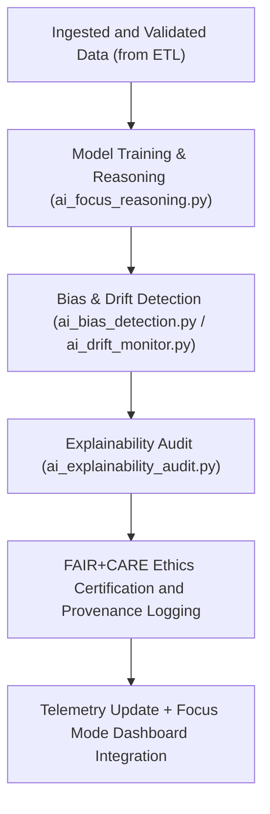

<div align="center">

# 🤖 Kansas Frontier Matrix — **AI Pipelines (Focus Mode & Explainability Framework)**
`src/pipelines/ai/README.md`

**Purpose:**  
The FAIR+CARE-certified **AI reasoning and explainability pipeline suite** for the Kansas Frontier Matrix (KFM).  
This workspace governs all machine learning and Focus Mode AI components used for environmental prediction, hazard reasoning, and historical data synthesis under MCP-DL v6.3 and AI ethics frameworks.

[](../../../../docs/standards/faircare-validation.md)
[](../../../../LICENSE)
[](../../../../docs/architecture/repo-focus.md)

</div>

---

## 📚 Overview

The `src/pipelines/ai/` directory contains KFM’s **Focus Mode artificial intelligence pipelines**, enabling explainable, ethical, and FAIR+CARE-compliant automation.  
These pipelines integrate with the ETL, validation, and governance systems to ensure all AI-driven outputs are transparent, interpretable, and ethically governed.

### Core Responsibilities
- Train and evaluate explainable AI (XAI) models across climate, hazards, and archival data.  
- Monitor drift, bias, and ethical compliance across model lifecycles.  
- Generate FAIR+CARE and ISO 42001 audit reports for every inference cycle.  
- Synchronize AI telemetry and provenance data into governance ledgers.  

---

## 🗂️ Directory Layout

```plaintext
src/pipelines/ai/
├── README.md                              # This file — documentation for AI pipelines
│
├── ai_focus_reasoning.py                  # Focus Mode AI reasoning and decision engine
├── ai_bias_detection.py                   # Identifies representational bias in training data
├── ai_drift_monitor.py                    # Monitors model drift and retraining thresholds
├── ai_explainability_audit.py             # Generates explainability reports using SHAP/LIME
└── metadata.json                          # Provenance, audit, and ethics certification metadata
```

---

## ⚙️ AI Workflow



### Workflow Description
1. **Data Ingestion:** AI models use schema-aligned, validated datasets from ETL pipelines.  
2. **Reasoning:** Focus Mode AI generates predictions and insights for hazards, climate, and spatial trends.  
3. **Bias and Drift:** Automated checks monitor equity, fairness, and model stability over time.  
4. **Explainability:** SHAP and LIME frameworks quantify interpretability scores.  
5. **Governance:** FAIR+CARE audits register results in blockchain-backed provenance ledgers.  

---

## 🧩 Example AI Metadata Record

```json
{
  "id": "src_ai_pipeline_registry_v9.5.0_2025Q4",
  "models_executed": [
    "focus-climate-v4",
    "hazards-intel-v3"
  ],
  "ai_explainability_score": 0.993,
  "bias_detected": false,
  "drift_score": 0.018,
  "checksum_verified": true,
  "fairstatus": "certified",
  "ethics_audited": true,
  "governance_registered": true,
  "telemetry_ref": "releases/v9.5.0/focus-telemetry.json",
  "governance_ref": "reports/audit/ai_src_ai_ledger.json",
  "created": "2025-11-02T23:59:00Z",
  "validator": "@kfm-ai"
}
```

---

## 🧠 FAIR+CARE Governance Matrix

| Principle | Implementation |
|------------|----------------|
| **Findable** | AI models and inferences indexed by telemetry, checksum, and governance IDs. |
| **Accessible** | Models and explainability data stored under open, auditable formats. |
| **Interoperable** | Aligned with FAIR+CARE, ISO/IEC 42001, and EU AI Act draft ethics guidelines. |
| **Reusable** | AI pipelines reusable for multi-domain explainability applications. |
| **Collective Benefit** | Supports transparent, equitable AI-driven research and decision systems. |
| **Authority to Control** | FAIR+CARE Council validates AI compliance and retraining workflows. |
| **Responsibility** | AI developers and validators log ethics and governance outcomes. |
| **Ethics** | Ensures fairness, inclusivity, and bias mitigation in all model lifecycles. |

Audit and validation results logged in:  
`reports/audit/ai_src_ai_ledger.json` • `reports/fair/src_ai_summary.json`

---

## ⚙️ AI Pipelines Summary

| Pipeline | Function | FAIR+CARE Purpose |
|-----------|-----------|------------------|
| `ai_focus_reasoning.py` | Generates Focus Mode reasoning and contextual insights. | Ethical explainable AI core. |
| `ai_bias_detection.py` | Detects model bias and data imbalance. | FAIR+CARE ethics safeguard. |
| `ai_drift_monitor.py` | Tracks drift and triggers retraining. | Transparency and model integrity. |
| `ai_explainability_audit.py` | Conducts interpretability and explainability scoring. | Reproducible transparency certification. |

Automation governed by `ai_pipelines_sync.yml`.

---

## 🧩 Explainability Snapshot

```json
{
  "model": "hazards-intel-v3",
  "framework": "SHAP",
  "key_features": [
    {"feature": "precipitation_anomaly", "impact": 0.21},
    {"feature": "soil_moisture_deficit", "impact": 0.17},
    {"feature": "temperature_anomaly", "impact": 0.13}
  ],
  "global_explanation_score": 0.993,
  "drift_detected": false,
  "bias_flagged": false
}
```

> Results verified via `reports/audit/ai_src_ai_ledger.json`.

---

## 🧾 Retention Policy

| File Type | Retention Duration | Policy |
|------------|--------------------|--------|
| AI Models | Permanent | Version-controlled and archived for reproducibility. |
| Explainability Reports | 365 days | Retained for ethics audits and validation. |
| FAIR+CARE Certification Logs | Permanent | Stored under immutable governance ledger. |
| Metadata | Permanent | Maintained for lineage, reproducibility, and accountability. |

Cleanup automated via `ai_pipelines_cleanup.yml`.

---

## 🧾 Internal Use Citation

```text
Kansas Frontier Matrix (2025). AI Pipelines (v9.5.0).
FAIR+CARE-certified suite of explainable and ethical AI pipelines supporting climate, hazard, and historical analysis.
Ensures transparency, interpretability, and ethical compliance under MCP-DL v6.3.
```

---

## 🧾 Version Notes

| Version | Date | Notes |
|----------|------|--------|
| v9.5.0 | 2025-11-02 | Integrated AI bias detection and sustainability telemetry metrics. |
| v9.3.2 | 2025-10-28 | Enhanced explainability audit with FAIR+CARE alignment. |
| v9.3.0 | 2025-10-26 | Established AI pipelines for Focus Mode reasoning and governance certification. |

---

<div align="center">

**Kansas Frontier Matrix** · *Explainable AI × FAIR+CARE Ethics × Provenance Transparency*  
[🔗 Repository](https://github.com/bartytime4life/Kansas-Frontier-Matrix) • [🧭 Docs Portal](../../../../docs/) • [⚖️ Governance Ledger](../../../../docs/standards/governance/)

</div>

