<div align="center">

# 🧠 **Kansas Frontier Matrix — Artificial Intelligence Pipelines**
`src/pipelines/ai/README.md`

**Purpose:**  
Operate FAIR+CARE-certified **AI reasoning, explainability, bias detection, and drift monitoring** pipelines for KFM — with immutable provenance, sustainability metrics, and public accountability.  
Compliant with **MCP-DL v6.3**, **FAIR+CARE**, **ISO 42001 (AI Governance)**, and **ISO 19115** metadata alignment.

[](../../../../docs/standards/)
[](../../../../docs/standards/faircare-validation.md)
[](../../../../LICENSE)
[]()
[]()

</div>

---

## 📘 Overview

KFM’s **AI Pipelines** manage training, inference, **Focus Mode reasoning (Focus Transformer v2)**, and continuous ethical oversight.  
Every stage is **checksum-locked**, **explainability-audited**, **energy-metered**, and **ledger-registered** for public verifiability.

### Core Responsibilities
- Train/evaluate models across climate, hazards, hydrology, and narrative contexts.  
- Detect bias, monitor drift, and assess data balance & representativeness.  
- Generate SHAP/LIME/Integrated Gradients explainability artifacts for audits.  
- Synchronize AI certifications with FAIR+CARE governance and STAC/DCAT datasets.  
- Export energy/performance telemetry to sustainability dashboards.

---

## 🗂️ Directory Layout

```plaintext
src/pipelines/ai/
├── README.md
│
├── ai_focus_reasoning.py            # Focus Transformer v2 inference + context narratives
├── ai_bias_detection.py             # Fairness audits (metrics + thresholds + reports)
├── ai_drift_monitor.py              # Data/model drift detection + retraining triggers
├── ai_explainability_reporter.py    # SHAP/LIME/IG explainability artifact generator
├── training/
│   ├── trainer.py                   # Standardized training loop (reproducible seeds)
│   ├── datasets.py                  # Dataloaders + splits + balance analytics
│   └── configs/                     # YAML configs (hyperparams, data, ethics gates)
└── metadata.json                    # AI model registry + governance lineage (checksums, CIDs)
```

---

## ⚙️ AI Pipeline Workflow

```mermaid
flowchart LR
    A["Model Training / Inference"] --> B["Bias & FAIR+CARE Checks"]
    B --> C["Explainability (SHAP · LIME · IG)"]
    C --> D["Drift Monitoring · Retraining"]
    D --> E["Checksum + Governance Ledger"]
    E --> F["Telemetry (Runtime · Energy · Carbon) · Focus Dashboard"]
```



**Workflow Summary**
1. **Inference:** Models produce context-aware outputs on validated inputs.  
2. **Ethics:** Outputs undergo bias and fairness audits with enforced thresholds.  
3. **Explainability:** Decisions are traced via SHAP/LIME/IG; artifacts are stored and published.  
4. **Drift:** Data/model drift triggers alerts and gated retraining.  
5. **Governance & Telemetry:** Results + hashes go to ledger; energy/perf metrics stream to dashboards.

---

## 🧩 Focus Mode Reasoning (v2)

- **Model:** `Focus Transformer v2` — dual-encoder with temporal/geospatial cross-attention.  
- **Inputs:** Subgraphs (Neo4j), timeline windows, spatial features, dataset references (STAC/DCAT).  
- **Outputs:** Narrative summaries, evidence snippets, confidence & ethics tags.  
- **XAI:** Per-summary SHAP maps + input attributions; stored for audit review.  
- **Ethics Gates:** Redaction, authority-to-control checks, sensitive term filters.

---

## 🧪 Example AI Metadata Record

```json
{
  "id": "ai_pipeline_registry_v10.1.0",
  "models": [
    "focus_transformer_v2",
    "hazard_risk_model_v3",
    "climate_forecast_ensemble_v7"
  ],
  "fairstatus": "certified",
  "ai_explainability_score": 0.996,
  "bias_detection_score": 0.985,
  "drift_status": "stable",
  "energy_usage_wh": 1.12,
  "carbon_output_gco2e": 0.15,
  "checksum_verified": true,
  "telemetry_logged": true,
  "governance_registered": true,
  "governance_ref": "data/reports/audit/ai_src_ledger.json",
  "created": "2025-11-10T12:35:00Z",
  "validator": "@kfm-ai-lab"
}
```

---

## 🧠 FAIR+CARE AI Governance Matrix

| Principle | Implementation | Oversight |
|-----------|----------------|-----------|
| **Findable** | Model lineage + checksums indexed in `metadata.json`. | @kfm-data |
| **Accessible** | Explainability artifacts (JSON/HTML) open for audit. | @kfm-accessibility |
| **Interoperable** | ISO 42001 + STAC/DCAT + ISO 19115 alignment. | @kfm-architecture |
| **Reusable** | Modular trainers/configs; deterministic seeds; containerized runs. | @kfm-design |
| **Collective Benefit** | Transparent environmental intelligence; public reports. | @faircare-council |
| **Authority to Control** | Council-approved retraining & certification cycles. | @kfm-governance |
| **Responsibility** | Baselines for bias & drift maintained; energy tracked. | @kfm-sustainability |
| **Ethics** | Human-in-the-loop reviews; sensitive content safeguards. | @kfm-ethics |

**Audit references:**  
`data/reports/audit/ai_src_ledger.json` · `data/reports/fair/src_summary.json`

---

## 🧮 AI Modules Summary

| Module | Description | FAIR+CARE Role | Framework |
|--------|-------------|----------------|-----------|
| `ai_focus_reasoning.py` | Context-aware Focus Mode narratives & evidence. | Explainability & Context | PyTorch · Transformers · SHAP |
| `ai_bias_detection.py` | Group-fairness metrics, thresholds, & reports. | Ethical Compliance | scikit-learn · AIF360 |
| `ai_drift_monitor.py` | Drift surveillance + retraining orchestration. | Lifecycle Governance | scikit-learn · MLflow |
| `ai_explainability_reporter.py` | SHAP/LIME/IG artifact generation. | Transparency & Audit | SHAP · LIME · Captum |
| `training/trainer.py` | Reproducible training loop & logging. | Reusability | PyTorch Lightning (opt) |

---

## ⚖️ Retention & Provenance Policy

| Artifact | Retention | Policy |
|---------|-----------|--------|
| AI Models | Permanent | Versioned + checksum-locked (registry). |
| Explainability Reports | 365 Days | Archived with ledger pointer (CID). |
| Drift/Bias Logs | 180 Days | Retained per retraining cycles. |
| FAIR+CARE Audits | Permanent | Immutable ledger entries (on-chain). |

Automated via `ai_pipeline_sync.yml`.

---

## 🌱 Sustainability Metrics (v10.1.0)

| Metric | Value | Verified By |
|--------|-------|-------------|
| Avg Runtime | 1.6 minutes | @kfm-ops |
| Energy Usage | 1.12 Wh | @kfm-sustainability |
| Carbon Output | 0.15 g CO₂e | @kfm-security |
| Renewable Energy | 100% (RE100) | @kfm-infrastructure |
| FAIR+CARE Compliance | 100% | @faircare-council |

**Telemetry source:** `../../../../releases/v10.1.0/focus-telemetry.json`

---

## 🧾 Internal Use Citation

```text
Kansas Frontier Matrix (2025). Artificial Intelligence Pipelines (v10.1.0).
FAIR+CARE- and ISO 42001-aligned AI pipelines delivering explainable, accountable, and sustainable intelligence for KFM.
```

---

## 🕰️ Version History

| Version | Date | Notes |
|--------|------|------|
| **v10.1.0** | 2025-11-10 | Upgraded to Focus Transformer v2; improved bias/drift telemetry; DCAT/STAC evidence linking. |
| **v10.0.0** | 2025-11-08 | Added stronger XAI gates and governance proofs; energy metrics export. |
| **v9.7.0** | 2025-11-05 | Explainability artifacts, telemetry v2, and ledger integration. |

---

<div align="center">

**© 2025 Kansas Frontier Matrix — MIT License**  
*Explainable AI × FAIR+CARE Governance × Sustainable Intelligence*  
[Back to Pipelines](../README.md) · [Docs Portal](../../../../docs/) · [Governance Ledger](../../../../docs/standards/governance/DATA-GOVERNANCE.md)

</div>
