<div align="center">

# 🏋️ **Kansas Frontier Matrix — AI Training Pipelines**
`src/pipelines/ai/training/README.md`

**Purpose:**  
Implement FAIR+CARE-aligned, reproducible training workflows for all KFM AI models — including **Focus Transformer v2**, bias monitoring networks, and environmental prediction ensembles.  
All training sessions are **checksum-locked**, **telemetry-audited**, and **ethically certified** under **MCP-DL v6.3** and **ISO 42001**.

[](../../../../../docs/standards/)
[](../../../../../docs/standards/faircare-validation.md)
[](../../../../../LICENSE)
[]()
[]()

</div>

---

## 📘 Overview

The **AI Training Pipelines** ensure that every model trained in the Kansas Frontier Matrix is **governed, explainable, and energy-accountable**.  
They handle dataset ingestion, model versioning, training orchestration, and FAIR+CARE certification — enabling reproducibility and transparent AI ethics.

### Core Responsibilities
- 🎯 Train and version models (Focus Transformer v2, hazard classifiers, climate ensembles).  
- 🧠 Capture and validate training metadata (bias metrics, hyperparameters, data lineage).  
- 🧩 Synchronize provenance with governance ledgers (Neo4j + IPFS).  
- 🌱 Record sustainability and carbon telemetry.  
- 📈 Export explainability checkpoints (SHAP/LIME overlays).  

---

## 🗂️ Directory Layout

```plaintext
src/pipelines/ai/training/
├── README.md                 # This file
├── trainer.py                # Unified training loop with deterministic seeds
├── datasets.py               # Dataset loaders, preprocessors, and balance checks
├── configs/                  # Model & experiment configuration files
│   ├── focus_v2_config.yaml
│   ├── hazard_ai_config.yaml
│   └── climate_forecast.yaml
└── logs/                     # Training logs and metadata outputs
    ├── run_2025-11-10.log
    └── training_manifest.json
```

---

## ⚙️ Training Workflow

```mermaid
flowchart LR
    A["Dataset Ingestion + Preprocessing (datasets.py)"] --> B["Configuration Load (configs/*.yaml)"]
    B --> C["Model Initialization (Focus Transformer v2 / Ensemble)"]
    C --> D["Training Loop (trainer.py)"]
    D --> E["Explainability Checkpoints + Metrics Logging"]
    E --> F["Provenance & Governance Ledger Sync"]
    F --> G["Telemetry Export (Runtime · Energy · FAIR+CARE Metrics)"]
```



### Workflow Summary
1. **Ingest:** Load curated FAIR+CARE-compliant datasets (climate, hydrology, hazards).  
2. **Configure:** Apply YAML-defined hyperparameters and ethics constraints.  
3. **Train:** Execute deterministic training with seed control and data shuffling logs.  
4. **Validate:** Record SHAP/LIME metrics and bias statistics.  
5. **Sync:** Update governance registry with training provenance and telemetry data.

---

## 🧩 Example Training Metadata Record

```json
{
  "id": "focus_transformer_v2_training_2025Q4",
  "model": "focus_transformer_v2",
  "epochs": 12,
  "learning_rate": 0.0002,
  "optimizer": "AdamW",
  "loss_function": "CrossEntropy",
  "dataset": "climate_2025_preprocessed_v1",
  "records_used": 54023,
  "train_accuracy": 0.984,
  "validation_accuracy": 0.972,
  "ai_explainability_score": 0.996,
  "bias_detection_score": 0.987,
  "energy_usage_wh": 2.31,
  "carbon_output_gco2e": 0.24,
  "telemetry_logged": true,
  "governance_registered": true,
  "created": "2025-11-10T12:45:00Z",
  "validator": "@kfm-ai-lab"
}
```

---

## 🧠 FAIR+CARE AI Training Governance Matrix

| Principle | Implementation | Oversight |
|-----------|----------------|-----------|
| **Findable** | Training runs indexed with UUID, hash, and ledger entry. | @kfm-data |
| **Accessible** | Logs and metadata published to governance registries. | @kfm-accessibility |
| **Interoperable** | JSON-LD aligned with ISO 42001 / DCAT 3.0 standards. | @kfm-architecture |
| **Reusable** | Configs and seeds allow full reproducibility. | @kfm-design |
| **Collective Benefit** | Energy-efficient AI advancing open environmental research. | @faircare-council |
| **Authority to Control** | FAIR+CARE Council reviews retraining protocols. | @kfm-governance |
| **Responsibility** | Developers monitor energy, ethics, and model health. | @kfm-sustainability |
| **Ethics** | Bias and representation validated per dataset split. | @kfm-ethics |

Audit references:  
`data/reports/audit/ai_src_ledger.json` · `data/reports/fair/src_summary.json`

---

## ⚙️ Key Modules

| File | Function | FAIR+CARE Role | Framework |
|------|-----------|----------------|------------|
| `trainer.py` | Reproducible training loop, seed locking, model saving. | Ethics + Reproducibility | PyTorch, Lightning |
| `datasets.py` | Data preprocessing, class balance analytics. | Accessibility + Equity | Pandas, scikit-learn |
| `configs/*.yaml` | Versioned training parameters + governance tags. | Documentation Integrity | YAML, JSON Schema |
| `logs/` | Stores training metrics, losses, and governance outputs. | Transparency | MLflow, Weights & Biases |

---

## ⚖️ Retention & Provenance Policy

| Record Type | Retention | Policy |
|-------------|-----------|--------|
| Model Artifacts | Permanent | Checksum-locked and versioned. |
| Explainability Outputs | 365 Days | Archived in `governance_sync.py`. |
| Training Logs | 180 Days | Rotated quarterly with energy audit. |
| FAIR+CARE Certifications | Permanent | Immutable blockchain registry. |

Retention automated in `ai_training_cleanup.yml`.

---

## 🌱 Sustainability Metrics (Q4 2025)

| Metric | Value | Verified By |
|--------|-------|-------------|
| Avg Runtime | 4.2 minutes | @kfm-ops |
| Energy Usage | 2.31 Wh | @kfm-sustainability |
| Carbon Output | 0.24 g CO₂e | @kfm-security |
| Renewable Energy | 100% (RE100) | @kfm-infrastructure |
| FAIR+CARE Compliance | 100% | @faircare-council |

Telemetry source:  
`../../../../../releases/v10.1.0/focus-telemetry.json`

---

## 🧾 Internal Citation

```text
Kansas Frontier Matrix (2025). AI Training Pipelines (v10.1.0).
FAIR+CARE- and ISO 42001-aligned AI training workflows enabling reproducible, explainable, and sustainable model development under Diamond⁹ Ω / Crown∞Ω Certification.
```

---

## 🕰️ Version History

| Version | Date | Notes |
|---------|------|------|
| **v10.1.0** | 2025-11-10 | Added Focus Transformer v2 configs; integrated energy telemetry and bias dashboards. |
| **v10.0.0** | 2025-11-08 | Improved YAML config governance; added explainability checkpoints. |
| **v9.7.0** | 2025-11-05 | Established training metadata registry; linked telemetry to governance ledger. |

---

<div align="center">

**© 2025 Kansas Frontier Matrix — MIT License**  
*Reproducible AI × FAIR+CARE Governance × Sustainable Intelligence*  
[Back to AI Pipelines](../README.md) · [Docs Portal](../../../../../docs/) · [Governance Ledger](../../../../../docs/standards/governance/DATA-GOVERNANCE.md)

</div>

