<div align="center">

# 📐 **Kansas Frontier Matrix — AI Configuration Schemas**
`src/pipelines/ai/training/configs/schema/README.md`

**Purpose:**  
Define and validate the **AI Training Configuration Schemas** for all model configurations within KFM.  
Ensures that every YAML/JSON config is **FAIR+CARE-compliant, ISO 42001-aligned**, and **checksum-locked** under the Master Coder Protocol.

[](../../../../../../../docs/standards/)
[](../../../../../../../docs/standards/faircare-validation.md)
[](../../../../../../../LICENSE)
[]()
[]()

</div>

---

## 📘 Overview

This directory contains the **JSON Schema definitions** used to validate every AI training configuration file in KFM.  
These schemas guarantee **semantic consistency**, **ethical traceability**, and **sustainability alignment** across models such as *Focus Transformer v2*, hazard classifiers, and climate forecast ensembles.

Each schema defines:
- Hyperparameter structure (epochs, optimizers, loss functions).  
- Ethical and sustainability fields (A2C, inclusion policy, energy limits).  
- Governance hooks (checksum verification, provenance linkage).  
- Compliance with **FAIR+CARE**, **ISO 42001**, and **MCP-DL v6.3**.  

---

## 🗂️ Directory Layout

```plaintext
src/pipelines/ai/training/configs/schema/
├── README.md                     # This document
├── ai_config_schema.json          # Core AI configuration JSON Schema
└── ethics_config_schema.json      # FAIR+CARE ethics and sustainability schema
```

---

## ⚙️ Schema Validation Workflow

```mermaid
flowchart LR
    A["YAML Config (focus_v2_config.yaml)"] --> B["Convert → JSON"]
    B --> C["Validate with ai_config_schema.json"]
    C --> D["Run FAIR+CARE Ethics Check (ethics_config_schema.json)"]
    D --> E["Governance Ledger Update + Telemetry Export"]
```



1. **Convert:** YAML configurations are transformed to JSON.  
2. **Validate:** Structural and type validation via `ai_config_schema.json`.  
3. **Audit:** Ethical/sustainability fields verified using `ethics_config_schema.json`.  
4. **Register:** Validated configuration hashes logged in Governance Ledger.  
5. **Telemetry:** Schema compliance metrics exported to Focus Mode dashboards.  

---

## 🧩 Example — `ai_config_schema.json`

```json
{
  "$schema": "https://json-schema.org/draft/2020-12/schema",
  "title": "AI Training Configuration Schema",
  "type": "object",
  "required": ["model", "training", "data", "explainability", "governance"],
  "properties": {
    "model": {
      "type": "object",
      "required": ["name", "architecture", "layers"],
      "properties": {
        "name": {"type": "string"},
        "architecture": {"type": "string", "enum": ["transformer", "cnn", "rnn", "ensemble"]},
        "layers": {"type": "integer", "minimum": 1}
      }
    },
    "training": {
      "type": "object",
      "required": ["epochs", "batch_size", "learning_rate", "optimizer"],
      "properties": {
        "epochs": {"type": "integer"},
        "batch_size": {"type": "integer"},
        "learning_rate": {"type": "number"},
        "optimizer": {"type": "string"},
        "loss_function": {"type": "string"}
      }
    },
    "data": {
      "type": "object",
      "required": ["dataset", "validation_split"],
      "properties": {
        "dataset": {"type": "string"},
        "validation_split": {"type": "number", "minimum": 0, "maximum": 1},
        "balance_check": {"type": "boolean"}
      }
    },
    "explainability": {
      "type": "object",
      "properties": {
        "method": {"type": "string"},
        "shap_threshold": {"type": "number"},
        "drift_monitor": {"type": "boolean"},
        "bias_detection": {"type": "boolean"}
      }
    },
    "governance": {
      "type": "object",
      "properties": {
        "ledger_sync": {"type": "boolean"},
        "checksum_verify": {"type": "boolean"},
        "provenance_log": {"type": "string"}
      }
    }
  }
}
```

---

## 🧠 FAIR+CARE Governance Matrix

| Principle | Implementation | Oversight |
|-----------|----------------|-----------|
| **Findable** | Config schemas documented and versioned in Git. | @kfm-data |
| **Accessible** | Published under MIT License for open validation. | @kfm-accessibility |
| **Interoperable** | Compatible with YAML, JSON, ISO 42001 formats. | @kfm-architecture |
| **Reusable** | Extensible schema modules for any AI model. | @kfm-design |
| **Collective Benefit** | Promotes transparent and ethical AI governance. | @faircare-council |
| **Authority to Control** | Ethics schema governs sensitive configurations. | @kfm-governance |
| **Responsibility** | Maintainers ensure consistent schema validation. | @kfm-sustainability |
| **Ethics** | Schemas enforce inclusion, accessibility, and A2C. | @kfm-ethics |

Audit references:  
`data/reports/audit/ai_src_ledger.json` · `data/reports/fair/src_summary.json`

---

## ⚖️ Validation & Provenance Policy

| Record Type | Retention | Policy |
|--------------|-----------|--------|
| Schema Files | Permanent | Version-controlled + checksum-locked |
| Validation Logs | 365 Days | Retained for FAIR+CARE audits |
| Ethics Reports | 180 Days | Reviewed by FAIR+CARE Council |
| Provenance Records | Permanent | Immutable blockchain registration |

Governance validation automated via `.github/workflows/ai_schema_validate.yml`.

---

## 🌱 Sustainability Metrics (Q4 2025)

| Metric | Value | Verified By |
|--------|-------|-------------|
| Avg Validation Time | 0.7 s | @kfm-ops |
| Energy Usage | 0.02 Wh | @kfm-sustainability |
| FAIR+CARE Compliance | 100% | @faircare-council |
| Renewable Energy | 100% (RE100) | @kfm-infrastructure |

Telemetry reference:  
`../../../../../../../releases/v10.1.0/focus-telemetry.json`

---

## 🧾 Internal Citation

```text
Kansas Frontier Matrix (2025). AI Configuration Schemas (v10.1.0).
Standardized FAIR+CARE and ISO 42001-compliant JSON Schemas governing all AI configuration files and ethics validations under Diamond⁹ Ω / Crown∞Ω Certification.
```

---

## 🕰️ Version History

| Version | Date | Notes |
|----------|------|-------|
| **v10.1.0** | 2025-11-10 | Introduced JSON Schema v2020-12; aligned ethics config schema with ISO 42001; added energy metrics reporting. |
| **v10.0.0** | 2025-11-08 | Integrated provenance linkage to blockchain; updated drift & bias schema fields. |
| **v9.7.0** | 2025-11-05 | Established FAIR+CARE schema validation baseline. |

---

<div align="center">

**© 2025 Kansas Frontier Matrix — MIT License**  
*Schema Validation × FAIR+CARE Ethics × Sustainable AI Governance*  
[Back to AI Training Configs](../README.md) · [Docs Portal](../../../../../../docs/) · [Governance Ledger](../../../../../../docs/standards/governance/DATA-GOVERNANCE.md)

</div>

