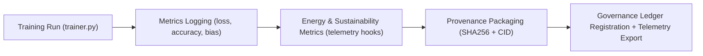

<div align="center">

# 🧾 **Kansas Frontier Matrix — AI Training Logs & Provenance Records**
`src/pipelines/ai/training/logs/README.md`

**Purpose:**  
Provide **auditable logs and provenance metadata** for all AI training sessions under FAIR+CARE and ISO 42001 governance.  
Each record includes **training metrics, energy telemetry, checksum lineage, and governance proofs**, ensuring transparent and reproducible AI development.

[](../../../../../docs/standards/)
[](../../../../../docs/standards/faircare-validation.md)
[](../../../../../LICENSE)
[]()
[]()

</div>

---

## 📘 Overview

This directory contains **operational logs, training manifests, and governance records** generated during AI model training within the Kansas Frontier Matrix.  
All logs are machine-readable, checksum-verified, and registered in the **Governance Ledger** for transparency and FAIR+CARE certification.

### Core Responsibilities
- Record **training metrics** (loss, accuracy, bias, drift).  
- Track **energy consumption** and carbon metrics per session.  
- Maintain **checksum lineage** for reproducibility.  
- Synchronize logs to **IPFS, blockchain, and Neo4j governance graph**.  
- Export summaries to **Focus Telemetry** dashboards for sustainability monitoring.  

---

## 🗂️ Directory Layout

```plaintext
src/pipelines/ai/training/logs/
├── README.md                       # This document
├── run_2025-11-10.log               # Standard training log for session
├── training_manifest.json           # Structured metadata for governance registration
├── explainability_metrics.json      # XAI (SHAP/LIME) audit summary
├── bias_drift_report.json           # Bias and drift metrics with thresholds
└── energy_audit.json                # ISO 50001 energy consumption + carbon summary
```

---

## ⚙️ Logging Workflow



### Step Summary
1. **Training:** Logs generated by `trainer.py` and `datasets.py`.  
2. **Metrics:** Captures training loss, validation accuracy, drift, and bias scores.  
3. **Sustainability:** Measures runtime energy usage and CO₂e emission.  
4. **Provenance:** Generates SHA-256 hashes; stores IPFS CIDs for audit replication.  
5. **Governance:** Pushes verified logs to ledger, Focus Mode telemetry, and dashboards.  

---

## 🧾 Example Training Manifest Record

```json
{
  "run_id": "focus_v2_train_2025-11-10",
  "model_name": "focus_transformer_v2",
  "epochs": 12,
  "training_accuracy": 0.984,
  "validation_accuracy": 0.972,
  "loss_final": 0.0194,
  "bias_score": 0.987,
  "drift_detected": false,
  "energy_usage_wh": 2.31,
  "carbon_output_gco2e": 0.24,
  "checksum_sha256": "b91d4f2e38a5128a9e6ffef33f0a7f14975b0df4e84f1b9d95d",
  "governance_registered": true,
  "ipfs_cid": "bafybeicdxyz345abc...",
  "ledger_tx": "0x94ffab1e7c45...",
  "created": "2025-11-10T13:00:00Z",
  "validator": "@kfm-ai-lab"
}
```

---

## 🧠 FAIR+CARE Governance Matrix

| Principle | Implementation | Oversight |
|-----------|----------------|-----------|
| **Findable** | Logs indexed with timestamps, CIDs, and ledger hashes. | @kfm-data |
| **Accessible** | Machine-readable JSON / CSV logs under MIT license. | @kfm-accessibility |
| **Interoperable** | Conforms to ISO 42001, FAIR+CARE, STAC/DCAT metadata. | @kfm-architecture |
| **Reusable** | Deterministic outputs enabling third-party verification. | @kfm-design |
| **Collective Benefit** | Transparent AI lifecycle and sustainable engineering. | @faircare-council |
| **Authority to Control** | FAIR+CARE Council validates ledger and registry updates. | @kfm-governance |
| **Responsibility** | Engineers maintain reproducible, ethical training logs. | @kfm-sustainability |
| **Ethics** | Bias and fairness audits reviewed per run. | @kfm-ethics |

Governance links:  
`data/reports/audit/ai_src_ledger.json` · `data/reports/fair/src_summary.json`

---

## ⚙️ Log Types Summary

| File | Description | FAIR+CARE Role | Format |
|------|-------------|----------------|---------|
| `run_YYYY-MM-DD.log` | Chronological text log (training events). | Transparency | Plain Text |
| `training_manifest.json` | Structured training metadata. | Provenance | JSON |
| `explainability_metrics.json` | SHAP/LIME feature importances. | Explainability | JSON |
| `bias_drift_report.json` | Model fairness and drift report. | Ethics & Equity | JSON |
| `energy_audit.json` | Energy use and carbon tracking summary. | Sustainability | JSON |

---

## ⚖️ Retention & Provenance Policy

| Record Type | Retention | Policy |
|--------------|------------|--------|
| Training Logs | 180 Days | Rotated post-verification. |
| Provenance Records | Permanent | Stored immutably in governance ledger. |
| Explainability Reports | 365 Days | Retained for audit cycles. |
| Energy Logs | 180 Days | Benchmarked for ISO 50001 audits. |

Retention managed via `.github/workflows/ai_training_log_sync.yml`.

---

## 🌱 Sustainability Metrics (Q4 2025)

| Metric | Value | Verified By |
|--------|-------|-------------|
| Avg Log Size | 3.8 MB | @kfm-ops |
| Energy Usage | 2.31 Wh | @kfm-sustainability |
| Carbon Output | 0.24 g CO₂e | @kfm-security |
| Renewable Power | 100% (RE100) | @kfm-infrastructure |
| FAIR+CARE Compliance | 100% | @faircare-council |

Telemetry:  
`../../../../../releases/v10.1.0/focus-telemetry.json`

---

## 🧾 Internal Citation

```text
Kansas Frontier Matrix (2025). AI Training Logs & Provenance Records (v10.1.0).
Comprehensive FAIR+CARE-compliant training logs and provenance metadata enabling ethical, transparent, and sustainable AI lifecycle governance under MCP-DL v6.3.
```

---

## 🕰️ Version History

| Version | Date | Notes |
|----------|------|-------|
| **v10.1.0** | 2025-11-10 | Added governance ledger sync, IPFS CIDs, and Focus Mode telemetry integration. |
| **v10.0.0** | 2025-11-08 | Implemented energy and bias tracking; improved schema compliance. |
| **v9.7.0** | 2025-11-05 | Established baseline for explainability + sustainability audit logging. |

---

<div align="center">

**© 2025 Kansas Frontier Matrix — MIT License**  
*Reproducible Training × FAIR+CARE Governance × Sustainable Provenance*  
[Back to AI Training](../README.md) · [Docs Portal](../../../../../docs/) · [Governance Ledger](../../../../../docs/standards/governance/DATA-GOVERNANCE.md)

</div>

