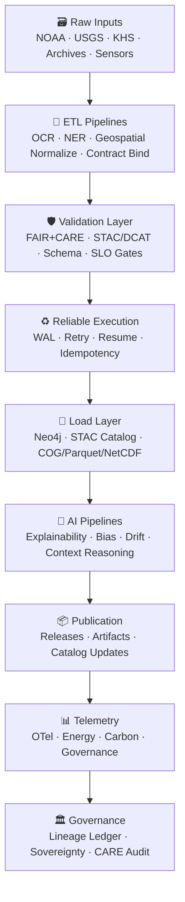

<div align="center">

# 🏗️ **KFM v11 — Pipeline Architecture Specification**  
`src/pipelines/architecture/README.md`

**Purpose**  
Define the **canonical KFM v11 pipeline architecture** spanning data ingestion, ETL, geospatial processing, AI, validation, lineage, FAIR+CARE governance, reliability guarantees (WAL · Retry · Rollback · Idempotency), and publication workflows.

Powered by **LangGraph v11**, **Reliable Nodes**, **KFM-PDC v11**,  
**CIDOC-CRM · GeoSPARQL · PROV-O · OWL-Time**,  
and governed by **FAIR+CARE + Sovereignty policies**.

</div>

---

## 📘 1. Overview

The **Pipeline Architecture Layer** governs how KFM v11 converts raw, heterogeneous, multi-domain datasets into:

- **FAIR+CARE-certified outputs**  
- **STAC/DCAT collections & items**  
- **Neo4j graph entities & relationships**  
- **COG / GeoParquet / NetCDF geospatial assets**  
- **AI-ready normalized features**  
- **Story Node v3 & Focus Mode v3 context data**  
- **Full lineage bundles + OTel telemetry**  

This specification describes:

- Pipeline classes  
- Execution models (LangGraph v11)  
- Reliability core (WAL · Retry · Resume · Compensation)  
- H3 generalization (heritage-safe)  
- Sovereignty constraints  
- Data Contracts v11  
- Metadata + lineage  
- Telemetry + dashboards  
- CI/CD enforcement & promotion gates  
- Templates for consistent pipeline design  

---

## 🗂 2. Directory Layout (v11)

```text
src/pipelines/architecture/
│
├── README.md                        # Root architecture spec (this file)
│
├── pipeline_patterns.md             # DAG patterns, stages, event lifecycles
├── validation_standards.md          # Schema, FAIR+CARE, GE checkpoints, governance rules
├── metadata_lineage.md              # STAC/DCAT/PROV-O/OpenLineage integration
├── governance_contracts.md          # Contracts governing pipeline behavior
├── telemetry_spec.md                # OTel metrics, SLO/SLA, sustainability
├── reliable-pipelines.md            # WAL + Retry + Idempotency rules
│
├── event-models/
│   └── README.md
├── idempotency/
│   └── README.md
├── observability/
│   └── README.md
├── retries/
│   └── README.md
├── versioning/
│   └── README.md
└── architecture_diagrams/
    ├── README.md
    ├── ai_pipeline.mmd
    ├── etl_architecture.mmd
    ├── geospatial_processing.mmd
    ├── governance_flow.mmd
    ├── idempotency_flow.mmd
    ├── lineage_flow.mmd
    ├── retries_flow.mmd
    └── telemetry_flow.mmd
```

---

## 🧩 3. High-Level Architecture (v11)



---

## 🧠 4. Pipeline Architecture Principles (v11)

### 4.1 Determinism  
Every pipeline MUST satisfy:

- Deterministic LangGraph execution  
- Deterministic WAL-based replay  
- Deterministic idempotency (operation identity hashing)  

### 4.2 Documentation-First (MCP-DL v6.3)  
No pipeline merges unless all required artifacts exist:

- README (this doc)  
- Validation specification  
- Telemetry contract  
- Data Contract v11  
- Governance contract  
- Lineage specification  

### 4.3 FAIR+CARE & Sovereignty by Default  

Pipelines MUST:

- Assign `care_label`  
- Apply sovereignty masking (H3-R7→R9)  
- Honor tribal governance constraints  
- Respect cultural sensitivity gates  
- Ensure ethical narrative extraction (Story Node/Focus Mode)  

### 4.4 Provenance (PROV-O + OpenLineage v2.5)  

All pipelines MUST emit:

- `prov:Entity` inputs  
- `prov:Activity` transforms  
- `prov:wasGeneratedBy` records  
- OpenLineage events (start/success/failure)  
- STAC/DCAT lineage references  

### 4.5 Telemetry Integration  
Pipelines MUST produce:

- latency (ms)  
- energy (Wh)  
- carbon (gCO₂e)  
- SLO status  
- error counts  
- retry counts  
- validation pass/fail  

Telemetry stored in:

```
releases/<version>/pipeline-telemetry.json
```

---

## ⚙️ 5. Pipeline Classes (v11)

| Type | Description | Examples |
|------|-------------|----------|
| **ETL Pipelines** | extract/clean/normalize | OCR, NER, climate, hydrology, geography |
| **Geospatial Pipelines** | raster/vector ops | DEM, bathymetry, COG, GeoParquet |
| **AI Pipelines** | inference/explainability | Focus Mode v3, Story Node v3 |
| **Metadata Pipelines** | STAC/DCAT generation | dataset registration |
| **Graph Pipelines** | Neo4j ingestion | CIDOC-CRM, GeoSPARQL |
| **Governance Pipelines** | sovereignty/CARE screening | sensitive heritage |
| **Autonomous Pipelines** | AUL v11 | nightly refresh, anomaly rebuild |
| **Release Pipelines** | artifact bundling | manifest + sbom + telemetry |

---

## 🧬 6. Required Metadata Fields (v11)

| Field | Req | Description |
|-------|-----|-------------|
| `id` | ✔ | pipeline run ID |
| `sources` | ✔ | STAC/DCAT IDs |
| `checksum` | ✔ | sha256 of outputs |
| `runtime_sec` | ✔ | runtime |
| `energy_wh` | ✔ | energy |
| `co2_g` | ✔ | carbon |
| `care_label` | ✔ | CARE classification |
| `lineage` | ✔ | PROV-O trace |
| `stac_item` | opt | linked STAC item |
| `sovereignty_notes` | opt | tribal policies triggered |

---

## 🔒 7. Validation & CI/CD Rules (v11)

Pipelines must pass:

- **Schema validation**  
- **STAC/DCAT checks**  
- **GE Checkpoint validation** (if defined)  
- **Governance validation** (CARE + sovereignty)  
- **Telemetry schema validation**  
- **Lineage completeness check**  

CI workflows that enforce this:

- `stac-validate.yml`  
- `faircare-validate.yml`  
- `reliability-checks.yml`  
- `docs-lint.yml`  
- `telemetry-export.yml`  
- `neo4j-schema-guard.yml`  

---

## 🔗 8. Lineage Example (v11-compliant)

```json
{
  "pipeline_id": "etl_hydrology_v11_2025_11_24",
  "sources": ["stac:climate/prism", "stac:hydrology/usgs_daily"],
  "steps": ["extract", "clean", "normalize", "validate", "publish"],
  "checksum": "sha256:abcd1234...",
  "lineage": ["prov:Entity", "prov:Activity", "prov:wasGeneratedBy"],
  "care_label": "public",
  "energy_wh": 12.8,
  "co2_g": 0.004,
  "sovereignty_notes": "no tribal datasets used",
  "governance_ref": "docs/reports/audit/pipeline_ledger.json"
}
```

---

## 🧯 9. Failure Modes & Recovery

- Idempotency stale key → reset + replay  
- Governance violation → freeze pipeline; manual review  
- Drift/bias anomaly → retraining or corrected splits  
- COG/GeoParquet spatial corruption → reproject + retry  
- Neo4j write-block → run through WAL replay  
- STAC/DCAT mismatch → regenerate metadata  

Recovery always involves:

- WAL + lineage audit  
- Rebuild from `last_good`  
- Governance sign-off (when necessary)  

---

## 🕰️ 10. Version History

| Version | Date | Summary |
|--------:|------|---------|
| v11.0.0 | 2025-11-24 | Fully upgraded to KFM-MDP v11 with deterministic pipelines, reliability, FAIR+CARE, sovereignty, lineage, and telemetry integration. |
| v10.3.2 | 2025-11-13 | Legacy v10 architecture specification. |

---

<div align="center">

© 2025 Kansas Frontier Matrix  
Diamond⁹ Ω / Crown∞Ω · FAIR+CARE · MCP-DL v6.3  
Deterministic Pipelines × Sovereignty-Aware Governance × Provenance-First Architecture

</div>