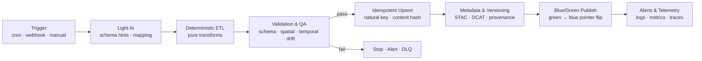
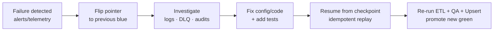

<div align="center">

# 🛠️ **Kansas Frontier Matrix — Unified Reliable Pipeline Architecture**  
`src/pipelines/architecture/reliable-pipelines.md`

**Purpose**  
Define a unified, KFM-standard architecture for **reliable, idempotent, observable, and recoverable** data pipelines and updaters:  

> **Triggers → light AI (schema only) → deterministic ETL → validation gates → idempotent upsert → versioning & blue/green publish → alerts & telemetry**,  
> with **safe retries, rollback, and resume** baked in for **every** KFM pipeline.

[](../../docs/README.md)
[](../../docs/standards/markdown_rules.md)
[](../../LICENSE)
[](../../docs/standards/governance/ROOT-GOVERNANCE.md)

</div>

---

## 📌 Scope & Design Principles

This guide applies to **all** KFM pipelines:

- Ingestion (historical archives, GIS, climate, biodiversity, deeds)
- Transformation / analytics (NLP, geocoding, modeling)
- Knowledge graph updaters (Neo4j, Story Nodes, STAC/DCAT catalogs)
- Publishing pathways (MapLibre layers, STAC items, exports)

Core principles:

- **Determinism over magic** — AI is used **only** where it’s additive (schema detection, mapping hints), then frozen into **deterministic configs**.
- **Exactly-once semantics at the boundary** — we assume **at-least-once delivery** in messaging, but enforce **idempotent effects** via natural keys + content hashes.
- **Immutable artifacts, mutable pointers** — we **never** rewrite history; we move pointers (blue/green) and keep rollback cheap.
- **Observability by default** — logs, metrics, traces, and structured telemetry are **required**, not optional.
- **Fail-closed, resume-safe** — validation gates fail before publish; checkpoints + idempotency make retries and resume safe anywhere.

---

## 📁 Repository & Directory Layout

All reliability patterns assume the standard KFM monorepo layout (simplified here to the pipeline slice):

```text
src/
  pipelines/
    architecture/
      reliable-pipelines.md    # This document
    etl/
      batch/                   # Batch ETL jobs (files, APIs, backfills)
      streaming/               # Streaming ETL (Kafka, websockets, etc.)
    common/
      models/                  # Shared Pydantic schemas / contracts
      io/                      # I/O helpers (S3/GCS, HTTP, DB)
      idempotency/             # Idempotency keys, content hashes, locks
      validation/              # GX / JSONSchema / STAC validators
      observability/           # Logging, metrics, trace helpers
      versioning/              # Artifact version + pointer helpers
      governance/              # FAIR+CARE & provenance hooks
data/
  sources/                     # Source descriptors (contracts)
  raw/                         # Raw pulls (DVC/LFS pointers)
  processed/                   # Normalized tables / feature sets
  stac/                        # STAC items/collections/cats
.github/
  workflows/
    pipelines-updater.yml      # CI/CD for pipelines + updaters
````

This guide defines how **every module in `src/pipelines`** plugs into a **common reliability contract**.

---

## 🧩 End-to-End Pattern Overview

A **reliable updater** in KFM follows this pattern:

1. **Trigger**

   * Cron (scheduled refresh/backfill)
   * Event (webhook, message, file-drop, STAC update)
   * Manual (governance-approved hotfix / backfill)
2. **Light AI (optional)**

   * Schema sniffing, units, encoding, mapping hints
   * Rendered into **explicit JSON/YAML configs**
3. **Deterministic ETL**

   * Pure, stateless transforms with pinned versions
4. **Validation & QA gates**

   * Schema, domain, spatial, temporal, drift checks
   * **Fail-closed** into `data/work/`
5. **Idempotent upsert**

   * Natural key + content hash
   * Transactional upsert with append-only audit
6. **Metadata & version bump**

   * STAC/DCAT updates, checksums, lineage, semantic version
7. **Blue/green publish**

   * Write to `processed-green/`, run health checks, flip pointer
8. **Alerts & telemetry**

   * Structured events, metrics, energy estimates, FAIR+CARE flags
9. **Rollback & resume**

   * Pointer-based rollback
   * Checkpoints + idempotent transforms for safe replays

---

## 🕒 Triggers & Pipeline Initiation

### 🧷 Trigger Mesh (Time × Event)

Pipelines **must** be triggerable by multiple mechanisms:

* **Time-based (cron)**

  * Nightly ingest from known, slow-changing sources (e.g., census, historic maps)
  * Periodic backfills (e.g., replay 1900–1950 climate records)

* **Event-based**

  * Webhooks from upstream platforms (e.g., new STAC item published)
  * Storage notifications (S3/GCS object created)
  * Message bus events (e.g., `hazard-event.created`)

* **Manual**

  * Governance-approved replays / corrective runs (documented in governance ledger)

🧾 **Trigger envelope** (minimum fields):

```json
{
  "trigger_id": "cron-2025-11-15T00:00Z-reliable-kgs-wells",
  "trigger_kind": "cron|webhook|manual|event",
  "dataset_id": "kgs_wells",
  "source_uri": "https://example.org/kgs/wells",
  "requested_range": {
    "start": "1900-01-01",
    "end": "2025-11-01"
  },
  "idempotency_key": "sha256(dataset_id|requested_range|source_uri)"
}
```

This envelope is the **root of traceability** for the run (`run_id` is usually derived from `trigger_id` plus a nonce).

---

## 🎯 Idempotency, Natural Keys & De-Duplication

All KFM pipelines **must** be safe to run **1× or 10,000×** with identical end-state.

### 🔑 Idempotency Key

At the **event/trigger level**:

```text
idempotency_key = sha256(dataset_id + "|" + version_or_range + "|" + source_uri)
```

Store this in a durable KV (e.g. Redis, Dynamo, Firestore, Postgres) so we can no-op if the pipeline run for this exact envelope already succeeded.

### 🧬 Record-Level Natural Key

Each upsertable entity (row, feature, node) must have:

* **Natural key** = minimal, stable identity (e.g. `(station_id, date)` or `(parcel_id, vintage)`), not ephemeral fields.
* **Content hash** = hash of **normalized, runtime-free** record (no timestamps, no ephemeral IDs):

```text
content_hash = sha256(normalized_record_without_runtime_fields)
```

### 🧰 Transactional Outbox (Side-Effects)

If a pipeline writes to **both** the graph and external systems (e.g. STAC catalogs, message bus):

* Use a **transactional outbox**:

  * `table outbox (id, event_type, payload_json, status, created_at, retry_count)`
  * Write DB mutations + outbox row in **one transaction**
  * A separate worker reliably forwards outbox events to buses / webhooks

This ensures we never publish an “update_complete” event for a record that wasn’t actually written.

---

## 🧪 Deterministic ETL

Transformations **must** be:

* **Pure**: Given the same input + config, produce the same output.
* **Stateless**: No hidden mutable globals; state goes via explicit inputs (files, DB, messages).
* **Pinned**: Library versions, model versions, and config snapshots are tracked for each run.

Key rules:

* Input slicing via **stable cursors** (page tokens, date ranges, incremental IDs).
* Explicit **unit conversions** (metric vs imperial), CRS reprojection, and code-list normalization (e.g., controlled vocab for hazard types).
* **No unpinned AI** in core transforms; all AI suggestions are turned into static configs.

---

## ✅ Validation & QA Gates

Pipelines **fail closed**: nothing enters `data/processed/` or the graph until validation passes.

### 🔐 Gate Types

* **Schema contracts**

  * JSON Schema / Pydantic models for tabular data
  * STAC Item/Collection validation for geospatial assets
  * Required metadata (license, provenance, temporal range)

* **Domain quality**

  * Ranges (e.g., temperatures in plausible bounds)
  * Enumerations (e.g., allowed hazard codes)
  * Referential integrity (foreign keys, graph references)

* **Spatial validation**

  * Valid geometries (no self-intersections)
  * Correct CRS (EPSG:4326 unless documented otherwise)
  * Topology sanity (no impossible overlaps if prohibited)

* **Temporal validation**

  * Timestamps in expected ranges
  * Monotonic sequences where required (e.g., time-series indexes)

* **Statistical drift**

  * Compare key metrics vs previous “golden” version (means, distributions, counts)
  * Alert or block if deltas exceed thresholds

### 📋 Validation Matrix

| Gate     | Check                            | Tooling                            | Action on Fail          |
| -------- | -------------------------------- | ---------------------------------- | ----------------------- |
| Schema   | JSON Schema / Pydantic / STAC    | `jsonschema`, `gx`, STAC validator | Fail run (hard)         |
| Spatial  | CRS, geometry validity           | GDAL/OGR, Shapely                  | Fail run                |
| Temporal | Date ranges, monotonic sequences | Custom checks                      | Warn or Fail per policy |
| Domain   | Ranges, enums, code lists        | GX, lookup tables                  | Fail run                |
| Drift    | Summary deltas vs prior          | Stats lib, grafana                 | Warn + human review     |

All failures must be logged with **gate name**, **sample errors**, and **next steps**.

---

## 📦 Artifact Versioning, Pointers & Blue/Green

### 🧱 Immutable Artifacts

Every successful run emits artifacts under a **content-addressed, versioned path**, e.g.:

```text
s3://kfm/artifacts/{dataset}/{semver}/...
s3://kfm/artifacts/kgs_wells/v10.4.2/wells.parquet
s3://kfm/artifacts/kgs_wells/v10.4.2/wells.geojson
```

We never change these in-place.

### 🔁 Blue/Green Datasets

* **Blue** = currently serving (previous good version)
* **Green** = candidate version after a successful pipeline run

Artifact layout:

```text
data/
  processed-blue/{dataset}/...
  processed-green/{dataset}/...
```

Publish process:

1. Write candidate to `processed-green/{dataset}/...`
2. Run **post-publish health checks** (e.g., can UI queries be served from green? any major metric regressions?)
3. Atomically **flip pointer** (e.g., a small JSON file or DB row):

```json
{
  "dataset": "kgs_wells",
  "current_version": "v10.4.2",
  "blue": "v10.4.1",
  "green": "v10.4.2"
}
```

4. Move `green → blue` designations; keep older versions for time-travel debugging.

---

## 📡 Observability, Telemetry & Logging

### 🧾 Structured Logs

Every pipeline stage must log:

* `dataset_id`
* `run_id`
* `trigger_id`
* `idempotency_key`
* `stage` (`extract` | `transform` | `validate` | `load` | `publish`)
* `attempt`
* `duration_ms`
* `status` (`started` | `succeeded` | `failed` | `skipped`)
* `error_type` / `error_message` (if failed)

### 📊 Metrics

Minimal required metrics:

* `pipeline_start_count`
* `pipeline_success_count`
* `pipeline_failure_count`
* `retry_count`
* `dlq_count` (dead-letter events)
* `rows_processed`
* `rows_inserted`, `rows_updated`, `rows_skipped`
* Latency histograms per stage
* Energy/CO₂ estimates if available (Fair+CARE telemetry)

### 🛰 Telemetry Events (Examples)

```json
{"event":"stage_started","stage":"etl","run_id":"2025-11-15-00Z-abc","dataset":"kfm_hydro_flows"}
{"event":"qa_gate_failed","gate":"schema","errors":3,"run_id":"2025-11-15-00Z-abc","dataset":"kfm_hydro_flows"}
{"event":"upsert_summary","inserted":1240,"updated":311,"skipped":9123,"run_id":"2025-11-15-00Z-abc","dataset":"kfm_hydro_flows"}
{"event":"publish_promoted","from":"green","to":"blue","version":"v10.4.2","run_id":"2025-11-15-00Z-abc","dataset":"kfm_hydro_flows"}
```

These events are shipped to the telemetry pipeline and validated against `telemetry_schema`.

---

## 🔁 Retries, Backoff & Failure Posture

KFM adopts **at-least-once delivery** and **idempotent consumers**:

* All consumers must be safe under duplicate messages.
* No logic may rely purely on “exactly once” semantics at the message layer.

### ⏳ Retry Policy

* Max attempts: **5**
* Base delay: **0.5s**
* Max delay: **30s**
* Strategy: **Exponential backoff with full jitter**
* Scope: **I/O operations only** (network calls, storage, DB connections), not CPU-bound calcs.

All SDK calls must:

* Set timeouts and deadlines
* Respect cancellation signals
* Use circuit breakers for flapping dependencies

### 🧺 Dead Letter Queue (DLQ)

Any event or unit of work that fails after the maximum retries **must** be sent to a DLQ with:

* `payload`
* `error_type`
* `error_message`
* `stack_trace` (if available)
* `first_seen_at`, `last_seen_at`
* `retry_count`

DLQ entries trigger alerts and require governance follow-up (issue tickets, incident reports if severe).

---

## 🧯 Rollback & Resume

### 🔙 Rollback

Rollback is **pointer-based**, not destructive:

* Flip dataset pointer back to previous **blue** version.
* Graph rollbacks are treated similarly: promote prior snapshot or re-materialize from known-good artifacts.
* Keep append-only audit trails for every upsert.

Key rules:

* **No destructive edits** to artifacts; we only:

  * Promote/demote versions
  * Write new corrective records (with provenance)
* Maintain **reversible migrations**:

  * For schema changes, maintain **up** and **down** migration scripts
  * Document compatibility notes per version

### ▶️ Resume

Resume is based on **checkpoints**:

* Store progress markers:

  * Last processed page/token, date, or offset
  * Possibly per-partition (e.g., per county, per STAC item)

On failure:

1. **Do not** reset everything; inspect checkpoint.
2. Fix config/code.
3. Resume from the last committed checkpoint, relying on:

   * Idempotent reads
   * Idempotent upserts (natural key + content hash)
   * Idempotent side-effects (via outbox)

This guarantees that re-running cannot introduce duplicates.

---

## 📂 Required Directories & Files (Data-Level)

Within the `data/` tree, every dataset participating in reliable pipelines must adhere to:

```text
data/
  sources/
    <dataset>.json       # Source descriptor (contract)
  raw/
    <dataset>/...        # Raw pulls (DVC/LFS pointers)
  work/
    <dataset>/...        # Staging area for validation/drift checks
  processed/
    blue/<dataset>/...   # Currently serving
    green/<dataset>/...  # Candidate versions
  stac/
    collections/...       # STAC collections
    items/...             # STAC items per version
```

`data/sources/<dataset>.json` defines:

* Source endpoint(s) and authentication mode
* Expected schema + types
* Temporal and spatial coverage
* License and CARE tags
* Output artifact expectations (tables, COGs, graph nodes)

---

## 📜 Minimal Contracts & Governance Hooks

### 🔑 Natural Keys & Hashing

* **Natural keys** must be documented in the dataset’s source descriptor and in the updater README.
* **Content hash** should be recorded with each record (or per-batch), along with:

  * `natural_key`
  * `run_id`
  * `prev_hash` (if updated)

### 🧾 Provenance & FAIR+CARE

Each pipeline run must record:

* Source URL / API / file
* Retrieval time
* Code version (commit SHA, container image digest)
* Config snapshot (e.g., JSON used by the transform)
* STAC/DCAT entries for outputs
* CARE flags (public, restricted, sensitive) for any data with cultural sensitivity

---

## 🧷 CI/CD Skeleton for Pipelines

### 💻 Pre-Merge Checks

* Lint (Python, TypeScript)
* Unit tests
* Schema validations (JSON Schema, Pydantic)
* STAC/DCAT validation
* Security scans (CodeQL, dependency checks)
* FAIR+CARE audits (required metadata present)

### 🚀 Pre-Publish Steps

* Dry-run ETL on a small slice (e.g., single county, short date range)
* Full validation matrix
* Write candidate artifacts to `processed-green/`
* Run health checks (e.g., load sample via API & map/timeline UI)

### 🔁 Promotion Workflow

* If all checks pass:

  * Flip pointers from green to blue.
  * Create a **tagged release** (e.g., `pipelines-kgs-wells-v10.4.2`).
  * Emit `publish_promoted` telemetry event.

---

## 🧩 Mermaid Views

### 🔄 End-to-End Reliable Updater



### 🔁 Rollback & Resume



---

## 🧮 Idempotent Upsert Pseudocode

### 🔄 Core Upsert Logic

```python
def upsert(records, store, run_id):
    for r in records:
        nk = natural_key(r)
        h = content_hash(normalize(r))
        prev = store.get_meta(nk)

        if prev and prev.hash == h:
            mark_skipped(nk, run_id)
            continue

        store.transactional_upsert(
            natural_key=nk,
            record=r,
            hash=h,
            prev_hash=prev.hash if prev else None,
            run_id=run_id,
        )
```

### 📤 Transactional Outbox Pattern (Simplified)

```python
def process_and_emit(event, db, outbox):
    with db.transaction() as tx:
        # 1) Apply state changes
        entity = transform(event)
        db.upsert_entity(tx, entity)

        # 2) Write to outbox inside same transaction
        outbox.enqueue(
            tx,
            event_type="entity_updated",
            payload={"entity_id": entity.id, "run_id": event.run_id},
        )

    # 3) Separate worker delivers outbox events with retries
```

---

## 🧑‍🏭 Operator Runbook

1. **Start a run**

   * Choose dataset and mode (cron/event/manual).
   * For manual: document justification in governance ledger.

2. **Monitor execution**

   * Watch logs for `stage_started`, `stage_failed`, `qa_gate_failed`.
   * Monitor metrics dashboard (latencies, row counts, retries).

3. **On validation failure**

   * Inspect validation report (which gate, sample rows).
   * Fix source descriptor, mapping, or transform logic.
   * Re-run in **dry-run** mode on a small slice.
   * When ready, re-run full pipeline (resume from checkpoint if appropriate).

4. **On publish issues**

   * If green is unhealthy:

     * Flip pointer back to previous blue.
     * Open an incident with `run_id`, metrics screenshots, and impact analysis.
   * Fix and re-run; only promote when health checks are green.

5. **Resume after failure**

   * Use checkpoints to restart at last known-good cursor.
   * Rely on idempotent transforms and upserts to avoid duplicates.

6. **Close out**

   * Ensure telemetry and governance logs are written.
   * Update release notes (version, key changes, risks).
   * File any follow-up tasks (performance improvements, tech debt) as issues.

---

## 🕰️ Version History

| Version | Date       | Author / Team              | Summary                                                                                                                             |
| ------: | ---------- | -------------------------- | ----------------------------------------------------------------------------------------------------------------------------------- |
| v10.4.0 | 2025-11-15 | Pipeline Architecture Team | Unified “reliable updaters + pipelines” spec; aligned with KFM v10.4 MDP; clarified blue/green, DLQ, checkpoints, and CI contracts. |
| v10.3.1 | 2025-11-13 | Pipeline Architecture Team | Prior “Reliable Pipeline Architecture Guide” (trigger mesh, idempotency, outbox, observability) merged into this unified guide.     |
|  v1.0.0 | 2025-11-15 | ETL/Updaters Working Group | Initial “Reliable Updaters” pattern (triggers → deterministic ETL → idempotent upsert → rollback & resume).                         |

```
