<div align="center">

# 🛠️ **Kansas Frontier Matrix — Unified Reliable Pipeline Architecture**  
`src/pipelines/architecture/reliable-pipelines.md`

**Purpose**  
Define the unified architectural standard for **reliable, idempotent, observable, and recoverable** KFM data pipelines and updaters:

> **Triggers → light AI (schema only) → deterministic ETL → validation gates → idempotent upsert → metadata/versioning → blue/green publish → alerts & telemetry**,  
> with **safe retries, rollback, and resume** built into every pathway.

[](../../docs/README.md)
[](../../docs/standards/markdown_rules.md)
[](../../LICENSE)
[](../../docs/standards/governance/ROOT-GOVERNANCE.md)

</div>

---

## 📌 Overview & Principles

All KFM pipelines must follow the same reliability contract:

- **Deterministic behavior** — AI is allowed only for schema inference or mapping hints; all outputs must resolve to explicit JSON configs.
- **Idempotent upserts** — natural keys + content hashes ensure exactly-once effects even under retry storms.
- **Fail-closed validation** — nothing is promoted until schema, spatial, temporal, and drift checks pass.
- **Immutable artifacts, mutable pointers** — blue/green datasets allow instant rollback without rewriting history.
- **Observability-first** — every stage emits structured logs, metrics, traces, and FAIR+CARE telemetry.
- **Resume-safe** — checkpoints allow recovery without duplication.

---

## 📁 Repository Structure (Pipeline Subset)

```text
src/
  pipelines/
    architecture/
      reliable-pipelines.md
    etl/
      batch/
      streaming/
    common/
      idempotency/
      validation/
      observability/
      versioning/
      governance/
data/
  sources/
  raw/
  work/
  processed/
    blue/
    green/
  stac/
.github/
  workflows/
    pipelines-updater.yml
````

---

## 🧩 End-to-End Architecture Pattern

### Reliable Updater Sequence

1. **Trigger**
2. **Light AI (schema/mapping hints)**
3. **Deterministic ETL**
4. **Validation & Quality Gates**
5. **Idempotent Upsert**
6. **Metadata & Version Bump**
7. **Blue/Green Publish**
8. **Alerts & Telemetry**
9. **Rollback & Resume**

---

## 🕒 Triggers & Initiation

### Time-Based

* Nightly / hourly refresh
* Seasonal backfills

### Event-Based

* Webhooks
* File drops
* Message bus notifications

### Manual

* Governance-approved hotfixes and replays

### Trigger Envelope (Required)

```json
{
  "trigger_id": "cron-2025-11-15T00:00Z-kgs-wells",
  "trigger_kind": "cron",
  "dataset_id": "kgs_wells",
  "source_uri": "https://example.org/kgs/wells",
  "requested_range": {
    "start": "1900-01-01",
    "end": "2025-11-01"
  },
  "idempotency_key": "sha256(dataset_id|requested_range|source_uri)"
}
```

---

## 🎯 Idempotency Requirements

### Idempotency Key (Trigger-Level)

```text
sha256(dataset_id + "|" + version_or_range + "|" + source_uri)
```

### Natural Key & Content Hash (Record-Level)

```text
content_hash = sha256(normalized_record_without_runtime_fields)
```

### Transactional Outbox

* Ensures that DB mutations and outgoing messages are atomically coordinated.
* Required anytime a pipeline interacts with both internal stores and external systems.

---

## 🧪 Validation & QA Gates

| Gate     | Check Type                             | Tooling                          | Action      |
| -------- | -------------------------------------- | -------------------------------- | ----------- |
| Schema   | JSON Schema / Pydantic / STAC          | GX, `jsonschema`, STAC validator | Fail        |
| Spatial  | CRS validity, geometry sanity          | GDAL/OGR, Shapely                | Fail        |
| Temporal | Range, monotonicity                    | Custom checks                    | Warn/Fail   |
| Domain   | Enums, ranges, controlled vocabularies | Lookup tables, GX                | Fail        |
| Drift    | Statistical differences vs last good   | Custom metrics                   | Warn/Review |

Nothing proceeds to publish unless all **hard gates** pass.

---

## 🧱 Versioning & Blue/Green Pipeline

### Immutable Artifacts

Example paths:

```text
s3://kfm/artifacts/{dataset}/{version}/...
data/processed-green/{dataset}/...
data/processed-blue/{dataset}/...
```

### Promotion Sequence

1. Write to **green**
2. Run full health checks
3. Flip pointer to **blue**
4. Emit telemetry + tag release

---

## 📡 Observability & Telemetry

### Required Logs

* `dataset_id`
* `run_id`
* `stage`
* `status`
* `error_type`, `error_message`
* Durations
* Cursor/checkpoint values

### Metrics

* Pipeline starts/success/fail counts
* Retry counts
* DLQ counts
* Stage latencies
* Row-level mutation counts
* CO₂/energy telemetry (if available)

### Telemetry Examples

```json
{"event":"stage_started","stage":"etl","run_id":"2025-11-15-abc","dataset":"kgs_wells"}
{"event":"qa_gate_failed","gate":"schema","errors":3,"run_id":"2025-11-15-abc"}
{"event":"upsert_summary","inserted":1240,"updated":311,"skipped":9123,"run_id":"2025-11-15-abc"}
{"event":"publish_promoted","from":"green","to":"blue","version":"v10.4.2","run_id":"2025-11-15-abc"}
```

---

## 🔁 Retries, Backoff & DLQ

### Retry Policy

* Max attempts: **5**
* Backoff: **exponential with jitter**
* Only wrap **I/O operations**
* enforce **timeouts** + **circuit breakers**

### DLQ Entries Must Include

* Payload
* Error context
* Stack trace
* Timestamps
* Retry counts

---

## 🧯 Rollback & Resume

### Rollback

* Use **pointer flip** to previous blue
* Never mutate or delete artifacts
* Maintain reversible migration scripts

### Resume

* Use **checkpoints** (cursor, page, timestamp, offset)
* Safe because all transforms & upserts are **idempotent**
* Resume from checkpoint without duplicates or data loss

---

## 📜 Data-Level File & Directory Requirements

```text
data/
  sources/<dataset>.json
  raw/<dataset>/...
  work/<dataset>/...
  processed/
    blue/<dataset>/...
    green/<dataset>/...
  stac/...
```

Each source descriptor must declare:

* Endpoints
* Schema
* Temporal/spatial ranges
* License + CARE tags
* Expected outputs

---

## 🧩 Mermaid Diagrams

### End-to-End Pipeline

```mermaid
flowchart LR
  A[Trigger<br/>cron · webhook · manual] --> B[Light AI<br/>schema hints]
  B --> C[Deterministic ETL]
  C --> D[Validation<br/>schema · spatial · temporal · drift]
  D -->|pass| E[Idempotent Upsert<br/>natural key · content hash]
  D -->|fail| X[Stop · Alert · DLQ]
  E --> F[Metadata & Versioning<br/>STAC · DCAT]
  F --> G[Blue/Green Publish<br/>pointer flip]
  G --> H[Alerts & Telemetry]
```



### Rollback & Resume

```mermaid
flowchart LR
  R1[Failure Detected] --> R2[Flip Pointer<br/>to Previous Blue]
  R2 --> R3[Investigate<br/>logs · DLQ · audits]
  R3 --> R4[Fix Config/Code]
  R4 --> R5[Resume via Checkpoint]
  R5 --> R6[Re-run ETL/QA/Upsert<br/>Promote New Green]
```



---

## 🧮 Idempotent Upsert Pseudocode

```python
def upsert(records, store, run_id):
    for r in records:
        nk = natural_key(r)
        h = content_hash(normalize(r))
        prev = store.get_meta(nk)

        if prev and prev.hash == h:
            mark_skipped(nk, run_id)
            continue

        store.transactional_upsert(
            natural_key=nk,
            record=r,
            hash=h,
            prev_hash=prev.hash if prev else None,
            run_id=run_id,
        )
```

---

## 🧑‍🏭 Operator Runbook

1. Trigger run (cron/event/manual)
2. Monitor logs and metrics
3. Fix + dry-run if validation fails
4. Promote **green → blue** only after all checks pass
5. Roll back via pointer if issues emerge
6. Resume via checkpoint
7. Close out with telemetry + governance logs

---

## 🕰️ Version History

| Version | Date       | Author / Team              | Summary                                                                                |
| ------: | ---------- | -------------------------- | -------------------------------------------------------------------------------------- |
| v10.4.0 | 2025-11-15 | Pipeline Architecture Team | Unified reliable pipeline spec; strict KFM-MDP v10.4 formatting; merged and corrected. |
| v10.3.1 | 2025-11-13 | Pipeline Architecture Team | Stable “Reliable Pipeline Architecture Guide”.                                         |
|  v1.0.0 | 2025-11-15 | ETL/Updaters Working Group | Initial reliable updater pattern.                                                      |
