<div align="center">

# 🛠️ **Kansas Frontier Matrix — Reliable Pipeline Architecture Guide**  
`src/pipelines/architecture/reliable-pipelines.md`

**Purpose:**  
Define the **core engineering patterns** that ensure KFM pipelines remain *idempotent*, *recoverable*, *observably correct*, *deterministically replayable*, and *FAIR+CARE guaranteed* across all ingestion, ETL, transformation, and publishing flows.

</div>

---

# 📁 **Directory Layout**
```
KansasFrontierMatrix/
├── src/
│   ├── pipelines/
│   │   ├── architecture/
│   │   │   ├── reliable-pipelines.md   # This document
│   │   │   ├── event-models/           # Event schemas & envelopes
│   │   │   ├── idempotency/            # Keys, outbox, replay guards
│   │   │   ├── observability/          # Logging, tracing, metrics
│   │   │   ├── retries/                # Backoff strategies & transient handling
│   │   │   └── versioning/             # Artifact versioning & rollbacks
│   │   └── ingest/                     # Ingestion pipelines (NAIP, NLCD, PRISM, etc.)
│   └── api/
│       └── ...                          # FastAPI/GraphQL surface
```

---

# 🛠️ **1. Triggers & Event Initiation**

Reliable pipelines begin with **redundant trigger paths** to avoid missed updates:

## 🕒 Baseline Time Triggers
- Nightly or hourly safety nets  
- Ensures work progresses even if cloud hooks fail  
- Used for **slow-moving datasets** (PRISM, Census, NLCD)

## ⚡ Event-Based Triggers
- S3 / GCS object creation notifications  
- GitHub `repository_dispatch` calls  
- Webhook-triggered fan-outs (e.g., Python AI-ETL runner)  
- Event payload includes:
  - dataset
  - version
  - idempotency_key
  - correlation_id
  - source_uri

## 🧩 Recommended Pattern: **Hybrid Trigger Mesh**
Use **time ⨯ event** to guarantee no missed updates *and* fast responsiveness.

---

# 🧬 **2. Idempotency & De-Duplication**

All KFM pipelines must be **safe to run 1× or 100×** with identical output.

## 🎯 Idempotency Key Specification
```
sha256(dataset + version + source_uri)
```

### Requirements
- Deterministic  
- Stored in durable KV (S3, DynamoDB, GCS Firestore)

## 🧰 Transactional Outbox Pattern
All pipelines MUST use this pattern:

### Outbox Transaction Atomicity
- DB state update  
- Event emission  
- Artifact publication  
→ Must succeed or fail **as one unit**.

### Allowed Outbox Destinations
- SQS / PubSub  
- GitHub Dispatch Events  
- Internal event bus

Outbox rows are retried separately with failure isolation.

---

# 🔁 **3. Retries, Backoff & Transient Errors**

KFM mandates **exponential backoff with jitter**:

### Retry Rules
- Max 5 attempts  
- Base delay: 0.5 sec  
- Cap: 30 sec  
- Full jitter to avoid thundering herds  
- Only wrap **I/O operations**, never CPU

### Timeouts
All SDK calls require:
- Hard timeout  
- Deadline propagation  
- Circuit breakers for large dataset backpressure

---

# 🧰 **4. Versioned Artifacts & Rollbacks**

KFM enforces **immutable artifact versioning**.

## 📦 Artifact Path Structure
```
s3://kfm/artifacts/{dataset}/{version}/<payload>
```

## 🔁 Rollbacks
Rollback = **change the pointer**, not reprocess the data.

```
s3://kfm/artifacts/{dataset}/latest.json
```

Latest pointer contains:
- version
- uri
- build metadata
- telemetry hash

## 📜 Benefits
- Zero recompute  
- Auditability  
- Deterministic replays  
- Time-travel debugging

---

# 🕵️‍♂️ **5. Observability: Logs, Metrics, Traces**

All KFM pipelines must emit:

### 📘 Structured Logs
Fields:
- dataset  
- version  
- idempotency_key  
- attempt  
- duration_ms  
- error_class  

### 📊 Metrics
- `pipeline_ingest_started`
- `pipeline_ingest_succeeded`
- `pipeline_ingest_failed`
- Retry counters
- Queue depth (if applicable)

### 🛰️ Distributed Tracing
- Trace ID passed:
  - Trigger → Worker → Publisher → Outbox
- Required for:
  - Debugging concurrency
  - Replay investigations
  - FAIR+CARE compliance

---

# ♻️ **6. Replayability & Deterministic Reprocessing**

Every KFM pipeline must be **100% replay-safe**.

## 📀 Replay Inputs
Replays require:
- Event envelope  
- Source URI  
- Dataset + version  
- Execution parameters  

## 🔁 Replay Guarantee
Re-running must produce identical:
- artifacts  
- metadata  
- logs  
- outbox events  

Except timestamps.

---

# 🛡️ **7. Failure Posture: “Assume At-Least-Once”**

KFM builds for **at-least-once delivery**, not exactly-once.

## Requirements
- All consumers must be idempotent  
- All triggers may fire multiple times  
- All events may be duplicated  
- No pipeline step may rely on “once-only” property

## DLQs
Each pipeline must define:
- Dead-letter queue  
- Auto-capture failure envelope  
- Retry count  
- Error classification  

---

# 🔐 **8. Safety, Governance & FAIR+CARE Enforcement**

All pipelines must reflect KFM governance:

## Mandatory Metadata
- Provenance chain  
- Data contract adherence  
- Artifact lineage ID  
- FAIR+CARE access rules  

## Automated Governance Checks
- SPDX SBOM  
- SLSA attestations  
- Pipeline telemetry  
- Schema validation (avro, pydantic, JSONSchema)

---

# 📊 **Mermaid Diagram — Pipeline Reliability Architecture**

```mermaid
flowchart TD
    A[Trigger Mesh<br/>Time + Event] --> B[Idempotency Gate]
    B --> C[Ingest Worker<br/>Retries + Jitter]
    C --> D[Transactional Outbox<br/>Atomic State + Events]
    D --> E[Artifact Publisher<br/>Versioned Outputs]
    E --> F[Update Latest Pointer]
    F --> G[Replay Engine<br/>Deterministic Reprocessing]
    C --> H[Observability Layer<br/>Logs • Metrics • Traces]
    H --> I[FAIR+CARE Governance<br/>SBOM • SLSA • Contracts]
```


---

# 📘 **Appendix A — Idempotent Python Pattern**
```
key = sha256(f"{dataset}|{version}|{source}".encode()).hexdigest()

if kv_store.seen(key):
    log.info("noop", key=key)
    return

with db.transaction():
    artifact_uri = publisher.write_versioned(...)
    outbox.enqueue("artifact_published", {"key": key, "uri": artifact_uri})
    kv_store.mark_seen(key)
```

---

# 📘 **Appendix B — GitHub Actions Fan-Out**
```
strategy:
  matrix:
    dataset: [naip, nlcd, prism]

steps:
  - run: |
      python pipelines/ingest.py \
        --dataset ${{ matrix.dataset }} \
        --event "$EVENT"
```

---

# 🏁 **Status**
This document is **fully compliant** with the Markdown Output Protocol,  
MCP-DL v6.3, Focus Mode visualization rules, and KFM v10.2.2 documentation standards.

